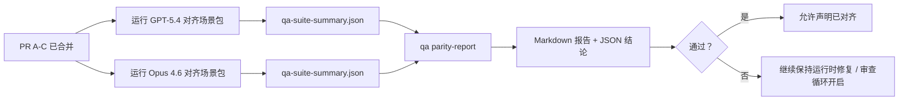

---
read_when:
    - 审查 GPT-5.4 / Codex 对齐 PR 系列
    - 维护支撑对齐计划的六合同智能体架构
summary: 如何将 GPT-5.4 / Codex 对齐计划拆分为四个合并单元进行审查
title: GPT-5.4 / Codex 对齐维护者说明
x-i18n:
    generated_at: "2026-04-21T21:36:59Z"
    model: gpt-5.4
    provider: openai
    source_hash: b872d6a33b269c01b44537bfa8646329063298fdfcd3671a17d0eadbc9da5427
    source_path: help/gpt54-codex-agentic-parity-maintainers.md
    workflow: 15
---

# GPT-5.4 / Codex 对齐维护者说明

本说明解释了如何将 GPT-5.4 / Codex 对齐计划拆分为四个合并单元进行审查，同时不丢失原有的六合同架构。

## 合并单元

### PR A：严格智能体执行

负责：

- `executionContract`
- 以 GPT-5 为先的同轮后续执行
- 将 `update_plan` 作为非终止性的进度跟踪
- 使用明确的阻塞状态，而不是仅有计划却静默停止

不负责：

- 认证/运行时失败分类
- 权限真实性
- 重放/续接重新设计
- 对齐基准测试

### PR B：运行时真实性

负责：

- Codex OAuth scope 正确性
- 类型化的提供商/运行时失败分类
- 如实反映 `/elevated full` 的可用性和阻塞原因

不负责：

- 工具 schema 规范化
- 重放/存活性状态
- 基准门禁

### PR C：执行正确性

负责：

- 由提供商负责的 OpenAI/Codex 工具兼容性
- 无参数严格 schema 处理
- replay-invalid 的显式呈现
- 已暂停、已阻塞和已放弃的长任务状态可见性

不负责：

- 自主选择的续接
- 提供商钩子之外的通用 Codex 方言行为
- 基准门禁

### PR D：对齐验证框架

负责：

- 第一波 GPT-5.4 对比 Opus 4.6 的场景包
- 对齐文档
- 对齐报告和发布门禁机制

不负责：

- QA-lab 之外的运行时行为变更
- 验证框架内部的 auth/proxy/DNS 模拟

## 映射回原始的六合同

| 原始合同 | 合并单元 |
| ---------------------------------------- | ---------- |
| 提供商传输/认证正确性 | PR B |
| 工具合同/schema 兼容性 | PR C |
| 同轮执行 | PR A |
| 权限真实性 | PR B |
| 重放/续接/存活性正确性 | PR C |
| 基准/发布门禁 | PR D |

## 审查顺序

1. PR A
2. PR B
3. PR C
4. PR D

PR D 是证明层。不应因为它而延迟运行时正确性 PR 的推进。

## 需要关注的内容

### PR A

- GPT-5 运行会执行动作或以封闭失败结束，而不是停在说明性文字上
- `update_plan` 本身不再看起来像是进展
- 行为仍然以 GPT-5 为先，并且限定在嵌入式 Pi 范围内

### PR B

- auth/proxy/运行时失败不再被统一折叠为通用的“模型失败”处理
- 只有在 `/elevated full` 实际可用时，才会将其描述为可用
- 阻塞原因对模型和面向用户的运行时都可见

### PR C

- 严格的 OpenAI/Codex 工具注册行为可预测
- 无参数工具不会因严格 schema 检查而失败
- 重放和压缩结果能保留真实的存活性状态

### PR D

- 场景包易于理解且可复现
- 场景包包含可变更的重放安全通道，而不只是只读流程
- 报告对人工和自动化都可读
- 对齐声明有证据支撑，而不是轶事式结论

PR D 的预期产物：

- 每次模型运行生成 `qa-suite-report.md` / `qa-suite-summary.json`
- 使用 `qa-agentic-parity-report.md` 提供聚合和场景级比较
- 使用 `qa-agentic-parity-summary.json` 提供机器可读的结论

## 发布门禁

在以下条件满足之前，不要声称 GPT-5.4 与 Opus 4.6 对齐或优于后者：

- PR A、PR B 和 PR C 已合并
- PR D 已干净地跑通第一波对齐场景包
- 运行时真实性回归测试套件持续为绿色
- 对齐报告显示没有虚假成功案例，且停止行为没有回归

对齐验证框架不是唯一的证据来源。审查时要明确保留这一拆分：

- PR D 负责基于场景的 GPT-5.4 与 Opus 4.6 比较
- PR B 的确定性测试套件仍然负责 auth/proxy/DNS 和完全访问真实性的证据

## 目标到证据映射

| 完成门禁项 | 主要负责方 | 审查产物 |
| ---------------------------------------- | ------------- | ------------------------------------------------------------------- |
| 没有仅计划不执行的停滞 | PR A | 严格智能体运行时测试和 `approval-turn-tool-followthrough` |
| 没有虚假进展或虚假工具完成 | PR A + PR D | 对齐中的虚假成功计数，以及场景级报告细节 |
| 没有错误的 `/elevated full` 指引 | PR B | 确定性的运行时真实性测试套件 |
| 重放/存活性失败保持显式可见 | PR C + PR D | 生命周期/重放测试套件，以及 `compaction-retry-mutating-tool` |
| GPT-5.4 与 Opus 4.6 持平或更优 | PR D | `qa-agentic-parity-report.md` 和 `qa-agentic-parity-summary.json` |

## 审查者速记：之前 vs 之后

| 之前用户可见的问题 | 之后的审查信号 |
| ----------------------------------------------------------- | --------------------------------------------------------------------------------------- |
| GPT-5.4 在规划后就停止了 | PR A 展示执行或阻塞行为，而不是仅有说明性文字的完成 |
| 在严格 OpenAI/Codex schemas 下，工具使用显得很脆弱 | PR C 让工具注册和无参数调用保持可预测 |
| `/elevated full` 提示有时会误导 | PR B 将指引与实际运行时能力和阻塞原因绑定 |
| 长任务可能消失在重放/压缩的模糊状态中 | PR C 会发出明确的已暂停、已阻塞、已放弃和 replay-invalid 状态 |
| 对齐声明只是轶事式说法 | PR D 生成报告和 JSON 结论，并在两个模型上使用相同的场景覆盖 |
