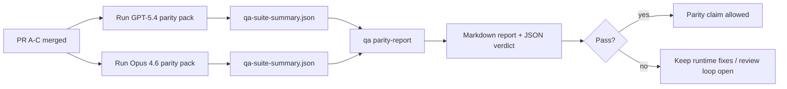

---
read_when:
    - 审查 GPT-5.4 / Codex 一致性 PR 系列
    - 维护一致性计划背后的六合同 agentic 架构
summary: 如何将 GPT-5.4 / Codex 一致性计划作为四个合并单元进行审查
title: GPT-5.4 / Codex 一致性维护者说明
x-i18n:
    generated_at: "2026-04-24T04:03:19Z"
    model: gpt-5.4
    provider: openai
    source_hash: 803b62bf5bb6b00125f424fa733e743ecdec7f8410dec0782096f9d1ddbed6c0
    source_path: help/gpt54-codex-agentic-parity-maintainers.md
    workflow: 15
---

这份说明解释了如何将 GPT-5.4 / Codex 一致性计划作为四个合并单元进行审查，同时不丢失原有的六合同架构。

## 合并单元

### PR A：严格 agentic 执行

负责：

- `executionContract`
- 以 GPT-5 为先的同轮后续执行
- 将 `update_plan` 作为非终态进度跟踪
- 使用显式 blocked 状态，而不是仅有计划的静默停止

不负责：

- auth/运行时失败分类
- 权限真实性
- replay/continuation 重设计
- 一致性基准测试

### PR B：运行时真实性

负责：

- Codex OAuth scope 正确性
- 类型化的 provider/运行时失败分类
- 真实反映 `/elevated full` 可用性和 blocked 原因

不负责：

- 工具 schema 规范化
- replay/liveness 状态
- 基准测试门控

### PR C：执行正确性

负责：

- 由 provider 拥有的 OpenAI/Codex 工具兼容性
- 无参数严格 schema 处理
- replay-invalid 暴露
- paused、blocked 和 abandoned 长任务状态可见性

不负责：

- 自主选择 continuation
- provider hook 之外的通用 Codex 方言行为
- 基准测试门控

### PR D：一致性 harness

负责：

- 第一波 GPT-5.4 对比 Opus 4.6 的场景包
- 一致性文档
- 一致性报告和发布门控机制

不负责：

- QA-lab 之外的运行时行为变更
- harness 内部的 auth/proxy/DNS 模拟

## 映射回原始的六合同

| 原始合同                                 | 合并单元   |
| ---------------------------------------- | ---------- |
| Provider 传输/auth 正确性                | PR B       |
| 工具 contract/schema 兼容性              | PR C       |
| 同轮执行                                 | PR A       |
| 权限真实性                               | PR B       |
| Replay/continuation/liveness 正确性      | PR C       |
| 基准测试/发布门控                        | PR D       |

## 审查顺序

1. PR A
2. PR B
3. PR C
4. PR D

PR D 是证明层。它不应成为运行时正确性 PR 被延迟的原因。

## 需要关注的点

### PR A

- GPT-5 运行会执行操作或以关闭方式失败，而不是停留在说明性文字
- `update_plan` 本身不再看起来像进展
- 行为保持为 GPT-5 优先，并限定在嵌入式 Pi 范围内

### PR B

- auth/proxy/运行时失败不再被折叠为通用的“model failed”处理
- 只有在实际可用时，`/elevated full` 才会被描述为可用
- blocked 原因对模型和面向用户的运行时都可见

### PR C

- 严格的 OpenAI/Codex 工具注册行为可预测
- 无参数工具不会因严格 schema 检查而失败
- replay 和 compaction 结果会保留真实的 liveness 状态

### PR D

- 场景包易于理解且可复现
- 场景包包含会变更状态的 replay-safety 通道，而不只是只读流程
- 报告对人工和自动化都可读
- 一致性声明有证据支撑，而不是轶事式结论

PR D 的预期产物：

- 每次 model 运行的 `qa-suite-report.md` / `qa-suite-summary.json`
- 带有聚合和场景级比较的 `qa-agentic-parity-report.md`
- 带有机器可读结论的 `qa-agentic-parity-summary.json`

## 发布门控

在以下条件满足之前，不要声称 GPT-5.4 与 Opus 4.6 达到一致或优于后者：

- PR A、PR B 和 PR C 已合并
- PR D 干净地运行完第一波一致性场景包
- 运行时真实性回归套件持续保持绿色
- 一致性报告显示不存在虚假成功案例，也不存在停止行为回归

一致性 harness 不是唯一的证据来源。在审查中要明确保持这种拆分：

- PR D 负责基于场景的 GPT-5.4 与 Opus 4.6 对比
- PR B 的确定性套件仍然负责 auth/proxy/DNS 和完全访问真实性证据

## 目标到证据映射

| 完成门控项                               | 主要负责方  | 审查产物                                                            |
| ---------------------------------------- | ----------- | ------------------------------------------------------------------- |
| 没有仅计划停滞                           | PR A        | strict-agentic 运行时测试和 `approval-turn-tool-followthrough`      |
| 没有虚假进展或虚假工具完成               | PR A + PR D | 一致性虚假成功计数加场景级报告细节                                  |
| 没有错误的 `/elevated full` 指引         | PR B        | 确定性的运行时真实性套件                                            |
| Replay/liveness 失败保持显式             | PR C + PR D | lifecycle/replay 套件加 `compaction-retry-mutating-tool`            |
| GPT-5.4 与 Opus 4.6 持平或更好           | PR D        | `qa-agentic-parity-report.md` 和 `qa-agentic-parity-summary.json`   |

## 审查者速记：前后对比

| 之前面向用户的问题                                          | 之后的审查信号                                                                        |
| ----------------------------------------------------------- | ------------------------------------------------------------------------------------- |
| GPT-5.4 在规划后停止                                        | PR A 展示执行或阻塞行为，而不是仅有说明性完成                                         |
| 在严格 OpenAI/Codex schema 下，工具使用显得脆弱            | PR C 让工具注册和无参数调用保持可预测                                                 |
| `/elevated full` 提示有时会误导                             | PR B 将指引绑定到真实运行时能力和 blocked 原因                                        |
| 长任务可能消失在 replay/compaction 的歧义中                 | PR C 发出显式的 paused、blocked、abandoned 和 replay-invalid 状态                     |
| 一致性声明只是轶事式结论                                    | PR D 产出报告和 JSON 结论，并在两个模型上使用相同的场景覆盖                           |

## 相关内容

- [GPT-5.4 / Codex agentic 一致性](/zh-CN/help/gpt54-codex-agentic-parity)
