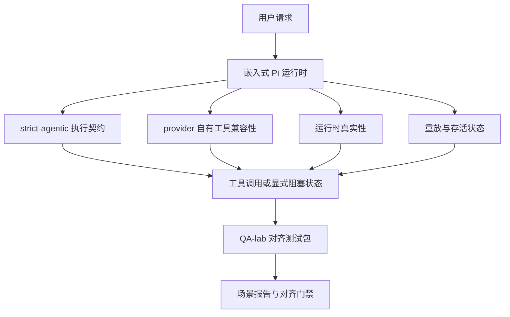

---
read_when:
    - 调试 GPT-5.4 或 Codex 智能体行为
    - 比较 OpenClaw 在不同前沿模型上的智能体行为
    - 审查 strict-agentic、tool-schema、提权和重放修复
summary: OpenClaw 如何为 GPT-5.4 和 Codex 风格模型弥合智能体执行能力缺口
title: GPT-5.4 / Codex 智能体能力对齐
x-i18n:
    generated_at: "2026-04-24T04:03:43Z"
    model: gpt-5.4
    provider: openai
    source_hash: 9f8c7dcf21583e6dbac80da9ddd75f2dc9af9b80801072ade8fa14b04258d4dc
    source_path: help/gpt54-codex-agentic-parity.md
    workflow: 15
---

# OpenClaw 中的 GPT-5.4 / Codex 智能体能力对齐

OpenClaw 原本就能很好地配合会使用工具的前沿模型，但 GPT-5.4 和 Codex 风格模型在一些实际场景中仍然表现不足：

- 它们可能在规划后就停止，而不是继续完成实际工作
- 它们可能错误使用严格的 OpenAI/Codex 工具 schema
- 它们可能请求 `/elevated full`，即使根本不可能获得完整访问权限
- 它们可能在重放或压缩期间丢失长任务状态
- 与 Claude Opus 4.6 的对齐结论过去依赖轶事，而不是可重复场景

这个对齐计划通过四个可审查的切片来修复这些缺口。

## 发生了哪些变化

### PR A：strict-agentic 执行

这个切片为嵌入式 Pi GPT-5 运行新增了一个可选启用的 `strict-agentic` 执行契约。

启用后，OpenClaw 不再将“只有计划没有行动”的轮次视为“足够好”的完成。如果模型只是说明它打算做什么，却没有真正调用工具或取得进展，OpenClaw 会使用一个“立即行动”的引导进行重试；如果仍无进展，则会以显式阻塞状态安全失败，而不是悄悄结束任务。

这对 GPT-5.4 体验改善最大的场景包括：

- 简短的“ok do it”后续消息
- 第一步很明显的代码任务
- `update_plan` 应该作为进度跟踪而不是填充文本的流程

### PR B：运行时真实性

这个切片让 OpenClaw 在两件事上说实话：

- provider/运行时调用为什么失败
- `/elevated full` 是否真的可用

这意味着 GPT-5.4 能获得更好的运行时信号，用于识别缺失 scope、auth 刷新失败、HTML 403 认证失败、代理问题、DNS 或超时失败，以及被阻止的完整访问模式。模型不太可能再臆造错误的修复方式，或继续请求运行时根本无法提供的权限模式。

### PR C：执行正确性

这个切片改进了两类正确性：

- provider 自有的 OpenAI/Codex 工具 schema 兼容性
- 重放和长任务存活状态的可见性

工具兼容性工作减少了严格 OpenAI/Codex 工具注册时的 schema 摩擦，尤其是在无参数工具和严格对象根预期方面。重放/存活状态工作让长时间运行的任务更可观察，因此暂停、阻塞和遗弃状态会明确可见，而不是消失在通用失败文本中。

### PR D：对齐验证框架

这个切片加入了第一波 QA-lab 对齐测试包，使 GPT-5.4 和 Opus 4.6 可以通过同一批场景运行，并使用共享证据进行比较。

这个对齐测试包是证据层。本身并不改变运行时行为。

在你拿到两个 `qa-suite-summary.json` 产物之后，使用以下命令生成发布门禁比较：

```bash
pnpm openclaw qa parity-report \
  --repo-root . \
  --candidate-summary .artifacts/qa-e2e/gpt54/qa-suite-summary.json \
  --baseline-summary .artifacts/qa-e2e/opus46/qa-suite-summary.json \
  --output-dir .artifacts/qa-e2e/parity
```

该命令会输出：

- 一份人类可读的 Markdown 报告
- 一份机器可读的 JSON 结论
- 一个明确的 `pass` / `fail` 门禁结果

## 为什么这能在实践中改进 GPT-5.4

在这项工作之前，GPT-5.4 在 OpenClaw 中的真实编码会话里，有时会比 Opus 更不像一个智能体，因为运行时容忍了几类对 GPT-5 风格模型尤其有害的行为：

- 只有评论没有动作的轮次
- 围绕工具的 schema 摩擦
- 含糊的权限反馈
- 静默的重放或压缩损坏

目标不是让 GPT-5.4 模仿 Opus。目标是为 GPT-5.4 提供一种运行时契约：奖励真实进展，提供更清晰的工具和权限语义，并将失败模式转换为机器和人都可读的显式状态。

这让用户体验从：

- “模型有一个不错的计划，但停住了”

变成：

- “模型要么采取了行动，要么 OpenClaw 明确指出了它无法行动的原因”

## 面向 GPT-5.4 用户的前后对比

| 该计划之前 | PR A-D 之后 |
| ---------------------------------------------------------------------------------------------- | ---------------------------------------------------------------------------------------- |
| GPT-5.4 可能在提出一个合理计划后就停止，而不采取下一步工具操作 | PR A 将“只有计划”变成“立即行动，否则呈现阻塞状态” |
| 严格工具 schema 可能会以令人困惑的方式拒绝无参数或 OpenAI/Codex 形状的工具 | PR C 让 provider 自有工具的注册和调用更可预测 |
| `/elevated full` 指引在受限运行时中可能模糊或错误 | PR B 为 GPT-5.4 和用户提供真实的运行时与权限提示 |
| 重放或压缩失败可能让任务看起来像是悄悄消失了 | PR C 会明确呈现暂停、阻塞、遗弃和重放无效结果 |
| “GPT-5.4 感觉比 Opus 差”大多只是轶事 | PR D 将其变成同一测试场景包、同一指标和明确的 pass/fail 门禁 |

## 架构



## 发布流程


## 场景测试包

第一波对齐测试包目前覆盖五个场景：

### `approval-turn-tool-followthrough`

检查模型在收到简短批准后，是否不会停留在“我会去做”这一层。它应该在同一轮中采取第一个具体动作。

### `model-switch-tool-continuity`

检查在模型/运行时切换边界上，工具使用型工作是否仍保持连贯，而不是重置为评论或丢失执行上下文。

### `source-docs-discovery-report`

检查模型是否能读取源码和文档、综合发现，并以智能体方式继续任务，而不是只生成一个薄弱摘要然后提前停止。

### `image-understanding-attachment`

检查涉及附件的混合模式任务是否仍然可执行，而不会退化为模糊叙述。

### `compaction-retry-mutating-tool`

检查包含真实变更写入的任务，在运行发生压缩、重试或在压力下丢失回复状态时，是否仍然明确保留重放不安全性，而不是悄悄看起来像可安全重放。

## 场景矩阵

| 场景 | 测试内容 | 良好的 GPT-5.4 行为 | 失败信号 |
| ---------------------------------- | --------------------------------------- | ------------------------------------------------------------------------------ | ------------------------------------------------------------------------------ |
| `approval-turn-tool-followthrough` | 计划之后的简短批准轮次 | 立即开始第一个具体工具动作，而不是重复表述意图 | 只有计划的后续、没有工具活动，或在没有真实阻塞原因时进入阻塞轮次 |
| `model-switch-tool-continuity` | 工具使用过程中的运行时/模型切换 | 保留任务上下文并继续连贯执行 | 重置为评论、丢失工具上下文，或切换后停止 |
| `source-docs-discovery-report` | 源码读取 + 综合 + 行动 | 找到源码，使用工具，并在不停滞的情况下生成有用报告 | 摘要过薄、缺少工具操作，或在轮次未完成时停止 |
| `image-understanding-attachment` | 由附件驱动的智能体工作 | 理解附件，将其与工具关联，并继续任务 | 模糊叙述、忽略附件，或没有具体下一步动作 |
| `compaction-retry-mutating-tool` | 压缩压力下的变更性工作 | 执行真实写入，并在副作用发生后仍明确保留重放不安全性 | 发生了变更写入，但重放安全性被暗示、缺失或相互矛盾 |

## 发布门禁

只有当合并后的运行时同时通过对齐测试包和运行时真实性回归测试时，GPT-5.4 才能被视为达到或超过对齐水平。

所需结果：

- 当下一步工具动作明确时，不再出现只有计划的停滞
- 不再出现没有真实执行的假完成
- 不再给出错误的 `/elevated full` 指引
- 不再静默遗弃重放或压缩中的任务
- 对齐测试包指标至少与约定的 Opus 4.6 基线一样强

对于第一波验证框架，门禁会比较：

- 完成率
- 非预期停止率
- 有效工具调用率
- 假成功次数

对齐证据有意拆分为两层：

- PR D 通过 QA-lab 证明在相同场景下 GPT-5.4 与 Opus 4.6 的行为
- PR B 的确定性测试集则在验证框架之外证明 auth、代理、DNS 和 `/elevated full` 的真实性

## 目标到证据矩阵

| 完成门禁项 | 负责 PR | 证据来源 | 通过信号 |
| -------------------------------------------------------- | ----------- | ------------------------------------------------------------------ | ---------------------------------------------------------------------------------------- |
| GPT-5.4 不再在规划后停滞 | PR A | `approval-turn-tool-followthrough` 加上 PR A 运行时测试集 | 批准轮次会触发真实工作或显式阻塞状态 |
| GPT-5.4 不再伪造进展或伪造工具完成 | PR A + PR D | 对齐报告中的场景结果和 fake-success 计数 | 没有可疑的通过结果，也没有只有评论的完成 |
| GPT-5.4 不再给出错误的 `/elevated full` 指引 | PR B | 确定性真实性测试集 | 阻塞原因和完整访问提示保持与运行时一致 |
| 重放/存活失败仍然保持显式 | PR C + PR D | PR C 生命周期/重放测试集，加上 `compaction-retry-mutating-tool` | 变更性工作会明确保留重放不安全性，而不是静默消失 |
| GPT-5.4 在约定指标上达到或超过 Opus 4.6 | PR D | `qa-agentic-parity-report.md` 和 `qa-agentic-parity-summary.json` | 相同场景覆盖，且在完成率、停止行为或有效工具使用上没有回归 |

## 如何解读对齐结论

将 `qa-agentic-parity-summary.json` 中的结论用作第一波对齐测试包的最终机器可读判定。

- `pass` 表示 GPT-5.4 覆盖了与 Opus 4.6 相同的场景，并且在约定的汇总指标上没有回归。
- `fail` 表示至少触发了一个硬性门禁：完成率更弱、非预期停止更差、有效工具使用更弱、出现任何 fake-success 情况，或场景覆盖不匹配。
- “shared/base CI issue” 本身并不是对齐结果。如果 PR D 之外的 CI 噪声阻塞了某次运行，那么结论应等待一次干净的已合并运行时执行，而不是从分支时期日志中推断。
- auth、代理、DNS 和 `/elevated full` 的真实性仍然来自 PR B 的确定性测试集，因此最终发布结论需要两者同时满足：PR D 对齐结论通过，以及 PR B 真实性覆盖为绿色。

## 谁应该启用 `strict-agentic`

在以下情况下使用 `strict-agentic`：

- 当下一步明显时，预期智能体立即采取行动
- GPT-5.4 或 Codex 系列模型是主要运行时
- 你更偏好显式阻塞状态，而不是“有帮助”的仅总结式回复

在以下情况下保持默认契约：

- 你希望保留现有较宽松的行为
- 你没有使用 GPT-5 系列模型
- 你正在测试 prompt，而不是运行时强制机制

## 相关内容

- [GPT-5.4 / Codex 对齐维护说明](/zh-CN/help/gpt54-codex-agentic-parity-maintainers)
