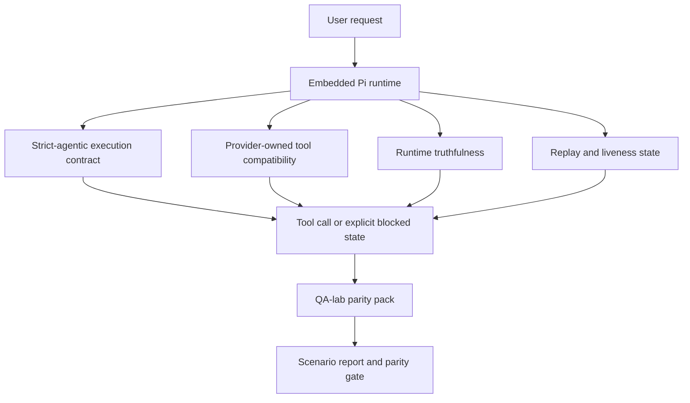
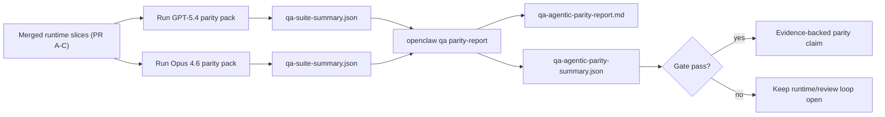

---
read_when:
    - 调试 GPT-5.4 或 Codex 智能体行为
    - 比较 OpenClaw 在前沿模型之间的智能体行为
    - 审查 strict-agentic、tool-schema、elevation 和 replay 修复
summary: OpenClaw 如何为 GPT-5.4 和 Codex 风格模型弥合智能体执行差距
title: GPT-5.4 / Codex 智能体一致性
x-i18n:
    generated_at: "2026-04-21T21:37:02Z"
    model: gpt-5.4
    provider: openai
    source_hash: 77bc9b8fab289bd35185fa246113503b3f5c94a22bd44739be07d39ae6779056
    source_path: help/gpt54-codex-agentic-parity.md
    workflow: 15
---

# OpenClaw 中的 GPT-5.4 / Codex 智能体一致性

OpenClaw 已经能够很好地配合使用工具的前沿模型，但 GPT-5.4 和 Codex 风格模型在一些实际场景中仍然表现不足：

- 它们可能在规划后停止，而不是实际执行工作
- 它们可能错误地使用严格的 OpenAI/Codex 工具 schema
- 它们可能在根本不可能获得完全访问权限时仍然请求 `/elevated full`
- 它们可能在 replay 或 compaction 期间丢失长时间运行任务的状态
- 与 Claude Opus 4.6 的一致性结论此前基于轶事，而非可重复的场景

这个一致性计划通过四个可审查的切片修复了这些差距。

## 有哪些变化

### PR A：strict-agentic 执行

这个切片为嵌入式 Pi GPT-5 运行引入了一个可选启用的 `strict-agentic` 执行契约。

启用后，OpenClaw 不再把“只有计划、没有行动”的回合作为“足够好”的完成状态接受。如果模型只说明它打算做什么，却没有真正使用工具或取得进展，OpenClaw 会通过“立即行动”的引导进行重试；如果仍然不行，则会以显式的阻塞状态失败关闭，而不是悄悄结束任务。

这项改进对 GPT-5.4 的体验提升主要体现在：

- 简短的“好，去做吧”后续回合
- 第一步显而易见的代码任务
- `update_plan` 应该用于进度跟踪而不是填充文字的流程

### PR B：运行时真实性

这个切片让 OpenClaw 在两件事上如实反馈：

- 提供商 / 运行时调用为什么失败
- `/elevated full` 是否真的可用

这意味着 GPT-5.4 能获得更好的运行时信号，用于识别缺失 scope、auth 刷新失败、HTML 403 auth 失败、代理问题、DNS 或超时失败，以及被阻止的完全访问模式。模型更不容易臆造错误的修复建议，也不太会持续请求运行时根本无法提供的权限模式。

### PR C：执行正确性

这个切片提升了两类正确性：

- 由提供商负责的 OpenAI/Codex 工具 schema 兼容性
- replay 和长任务存活状态的可见性

工具兼容性工作减少了严格的 OpenAI/Codex 工具注册中的 schema 摩擦，尤其是在无参数工具和严格对象根预期方面。replay / 存活状态相关工作让长时间运行的任务更可观察，因此暂停、阻塞和已放弃状态会被清楚展示，而不是消失在通用失败文本中。

### PR D：一致性验证框架

这个切片添加了首批 QA-lab 一致性测试包，使 GPT-5.4 和 Opus 4.6 可以在相同场景下运行，并基于共享证据进行比较。

这个一致性测试包是证明层。本身不会改变运行时行为。

当你已经有两个 `qa-suite-summary.json` 产物后，可用以下命令生成发布门禁比较：

```bash
pnpm openclaw qa parity-report \
  --repo-root . \
  --candidate-summary .artifacts/qa-e2e/gpt54/qa-suite-summary.json \
  --baseline-summary .artifacts/qa-e2e/opus46/qa-suite-summary.json \
  --output-dir .artifacts/qa-e2e/parity
```

该命令会写出：

- 一份人类可读的 Markdown 报告
- 一份机器可读的 JSON 结论
- 一个明确的 `pass` / `fail` 门禁结果

## 为什么这会在实践中改善 GPT-5.4

在这项工作之前，GPT-5.4 在 OpenClaw 上的真实编码会话中可能会显得不如 Opus 那么智能体化，因为运行时容忍了几类对 GPT-5 风格模型尤其有害的行为：

- 只有评论、没有执行的回合
- 工具相关的 schema 摩擦
- 含糊的权限反馈
- 悄无声息的 replay 或 compaction 损坏

目标不是让 GPT-5.4 模仿 Opus。目标是给 GPT-5.4 一个运行时契约，让真实进展得到正向激励，提供更清晰的工具与权限语义，并把失败模式转换为明确的、机器和人类都可读的状态。

这会把用户体验从：

- “模型有一个不错的计划，但停下来了”

变成：

- “模型要么执行了，要么 OpenClaw 明确展示了它为什么无法执行”

## GPT-5.4 用户的前后对比

| 该计划之前 | PR A-D 之后 |
| ---------------------------------------------------------------------------------------------- | ---------------------------------------------------------------------------------------- |
| GPT-5.4 可能在给出一个合理计划后停止，而不执行下一步工具操作 | PR A 将“只有计划”变成“立即行动，否则显示阻塞状态” |
| 严格工具 schema 可能以令人困惑的方式拒绝无参数工具或 OpenAI/Codex 形状的工具 | PR C 让由提供商负责的工具注册与调用更可预测 |
| 在被阻止的运行时中，`/elevated full` 指引可能含糊甚至错误 | PR B 为 GPT-5.4 和用户提供真实的运行时与权限提示 |
| replay 或 compaction 失败可能让人感觉任务像是悄悄消失了 | PR C 会明确展示 paused、blocked、abandoned 和 replay-invalid 结果 |
| “GPT-5.4 感觉比 Opus 差”过去大多只是轶事 | PR D 将其变成相同场景测试包、相同指标以及明确的通过 / 失败门禁 |

## 架构



## 发布流程



## 场景测试包

首批一致性测试包当前覆盖五个场景：

### `approval-turn-tool-followthrough`

检查模型是否会在简短批准后停留在“我会去做”这一层。它应该在同一回合中采取第一个具体行动。

### `model-switch-tool-continuity`

检查在模型 / 运行时切换边界上，使用工具的工作是否仍然保持连贯，而不是重置为评论性输出或丢失执行上下文。

### `source-docs-discovery-report`

检查模型是否能够读取源代码和文档、综合发现，并以智能体方式继续任务，而不是只产出一份浅层总结然后过早停止。

### `image-understanding-attachment`

检查涉及附件的混合模式任务是否仍然具有可执行性，而不会退化成含糊的叙述。

### `compaction-retry-mutating-tool`

检查一个包含真实变更写入的任务，在运行发生 compaction、重试或在压力下丢失回复状态时，是否仍然会明确保留 replay 不安全性，而不是悄悄表现得像 replay 安全。

## 场景矩阵

| 场景 | 它测试什么 | 良好的 GPT-5.4 行为 | 失败信号 |
| ---------------------------------- | --------------------------------------- | ------------------------------------------------------------------------------ | ------------------------------------------------------------------------------ |
| `approval-turn-tool-followthrough` | 计划之后的简短批准回合 | 立即开始第一个具体工具操作，而不是重复说明意图 | 只有计划的后续回合、没有工具活动，或在没有真实阻塞因素时进入阻塞回合 |
| `model-switch-tool-continuity`     | 工具使用过程中的运行时 / 模型切换 | 保持任务上下文并继续连贯执行 | 重置为评论性输出、丢失工具上下文，或在切换后停止 |
| `source-docs-discovery-report`     | 源码读取 + 综合分析 + 执行 | 找到源码、使用工具，并在不中途停滞的情况下产出有用报告 | 浅层总结、缺少工具操作，或在回合未完成时停止 |
| `image-understanding-attachment`   | 由附件驱动的智能体工作 | 理解附件，将其与工具连接，并继续任务 | 含糊叙述、忽略附件，或没有具体的下一步行动 |
| `compaction-retry-mutating-tool`   | compaction 压力下的变更性工作 | 执行真实写入，并在副作用发生后仍明确保留 replay 不安全性 | 发生了变更写入，但 replay 安全性被错误暗示、缺失或自相矛盾 |

## 发布门禁

只有在合并后的运行时同时通过一致性测试包和运行时真实性回归测试时，GPT-5.4 才能被视为达到或超过一致性水平。

必需结果：

- 当下一步工具操作明确时，不会出现只有计划却停滞的情况
- 不会在没有真实执行的情况下伪装完成
- 不会给出错误的 `/elevated full` 指引
- 不会发生悄无声息的 replay 或 compaction 弃置
- 一致性测试包指标至少与约定的 Opus 4.6 基线同样强

对于首批验证框架，门禁比较以下指标：

- 完成率
- 非预期停止率
- 有效工具调用率
- 虚假成功次数

一致性证据被有意拆分为两层：

- PR D 通过 QA-lab 证明 GPT-5.4 与 Opus 4.6 在相同场景下的行为
- PR B 的确定性测试套件在验证框架之外证明 auth、代理、DNS 和 `/elevated full` 的真实性

## 目标到证据矩阵

| 完成门禁项 | 所属 PR | 证据来源 | 通过信号 |
| -------------------------------------------------------- | ----------- | ------------------------------------------------------------------ | ---------------------------------------------------------------------------------------- |
| GPT-5.4 不再在规划后停滞 | PR A | `approval-turn-tool-followthrough` 加上 PR A 运行时测试套件 | 批准回合会触发真实工作，或显示明确的阻塞状态 |
| GPT-5.4 不再伪造进展或伪造工具完成 | PR A + PR D | 一致性报告中的场景结果和虚假成功计数 | 没有可疑的通过结果，也没有只有评论而无执行的完成 |
| GPT-5.4 不再给出错误的 `/elevated full` 指引 | PR B | 确定性的真实性测试套件 | 阻塞原因和完全访问提示始终与运行时真实情况一致 |
| replay / 存活性失败保持显式可见 | PR C + PR D | PR C 生命周期 / replay 测试套件加 `compaction-retry-mutating-tool` | 变更性工作会明确保留 replay 不安全性，而不是悄悄消失 |
| GPT-5.4 在约定指标上达到或超过 Opus 4.6 | PR D | `qa-agentic-parity-report.md` 和 `qa-agentic-parity-summary.json` | 覆盖相同场景，且在完成率、停止行为或有效工具使用上没有回退 |

## 如何阅读一致性结论

将 `qa-agentic-parity-summary.json` 中的 verdict 用作首批一致性测试包的最终机器可读决策。

- `pass` 表示 GPT-5.4 覆盖了与 Opus 4.6 相同的场景，并且在约定的聚合指标上没有回退。
- `fail` 表示至少有一个硬性门禁被触发：更弱的完成率、更差的非预期停止、更弱的有效工具使用、任意虚假成功案例，或场景覆盖不匹配。
- “shared/base CI issue” 本身并不是一致性结果。如果 PR D 之外的 CI 噪声阻塞了一次运行，则应等待一次干净的合并后运行时执行结果，而不是根据分支时期的日志进行推断。
- auth、代理、DNS 和 `/elevated full` 的真实性仍然来自 PR B 的确定性测试套件，因此最终发布声明需要同时满足两点：PR D 一致性结论通过，以及 PR B 真实性覆盖为绿色通过。

## 谁应该启用 `strict-agentic`

在以下情况下使用 `strict-agentic`：

- 当下一步操作显而易见时，你希望智能体立即执行
- GPT-5.4 或 Codex 家族模型是主要运行时
- 你更偏好明确的阻塞状态，而不是“有帮助”的仅总结式回复

在以下情况下保留默认契约：

- 你希望保留现有较宽松的行为
- 你没有使用 GPT-5 家族模型
- 你测试的是 prompt，而不是运行时强制机制
