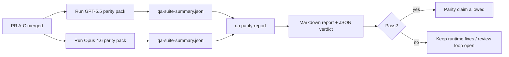

---
read_when:
    - 审查 GPT-5.5 / Codex 对齐 PR 系列
    - 维护一致性计划背后的六项契约智能体式架构
summary: 如何将 GPT-5.5 / Codex 一致性计划作为四个合并单元进行审查
title: GPT-5.5 / Codex 一致性维护者说明
x-i18n:
    generated_at: "2026-05-06T04:33:34Z"
    model: gpt-5.5
    provider: openai
    source_hash: 5752b4610f8b0d70b80d880ea10df75478b5f85ca431cdb73d3b61d745b23356
    source_path: help/gpt55-codex-agentic-parity-maintainers.md
    workflow: 16
---

这份说明解释如何将 GPT-5.5 / Codex 对等性计划作为四个合并单元来评审，同时不丢失原始的六项契约架构。

## 合并单元

### PR A：严格智能体式执行

负责：

- `executionContract`
- GPT-5 优先的同一轮跟进执行
- 将 `update_plan` 用作非终止性的进度跟踪
- 使用显式阻塞状态，而不是只有计划的静默停止

不负责：

- 凭证/运行时失败分类
- 权限真实性
- 重放/继续设计重构
- 对等性基准测试

### PR B：运行时真实性

负责：

- Codex OAuth scope 正确性
- 类型化的提供商/运行时失败分类
- 如实呈现 `/elevated full` 可用性和阻塞原因

不负责：

- 工具 schema 规范化
- 重放/活跃状态
- 基准测试门禁

### PR C：执行正确性

负责：

- 提供商负责的 OpenAI/Codex 工具兼容性
- 无参数严格 schema 处理
- 显示重放无效状态
- 暂停、阻塞和被放弃长任务的状态可见性

不负责：

- 自行选择继续
- 提供商钩子之外的通用 Codex 方言行为
- 基准测试门禁

### PR D：对等性测试框架

负责：

- 第一波 GPT-5.5 与 Opus 4.6 场景包
- 对等性文档
- 对等性报告和发布门禁机制

不负责：

- QA-lab 之外的运行时行为变更
- 测试框架内部的凭证/代理/DNS 模拟

## 映射回原始六项契约

| 原始契约                                 | 合并单元 |
| ---------------------------------------- | -------- |
| 提供商传输/凭证正确性                    | PR B     |
| 工具契约/schema 兼容性                   | PR C     |
| 同一轮执行                               | PR A     |
| 权限真实性                               | PR B     |
| 重放/继续/活跃状态正确性                 | PR C     |
| 基准测试/发布门禁                        | PR D     |

## 评审顺序

1. PR A
2. PR B
3. PR C
4. PR D

PR D 是证明层。它不应成为延迟运行时正确性 PR 的原因。

## 需要关注的内容

### PR A

- GPT-5 运行会执行或失败关闭，而不是停在评论中
- `update_plan` 不再看起来像是本身就代表进度
- 行为保持 GPT-5 优先，并限定在嵌入式 Pi 范围内

### PR B

- 凭证/代理/运行时失败不再折叠为通用的“模型失败”处理
- 只有在实际可用时，才将 `/elevated full` 描述为可用
- 阻塞原因对模型和面向用户的运行时都可见

### PR C

- 严格 OpenAI/Codex 工具注册行为可预测
- 无参数工具不会在严格 schema 检查中失败
- 重放和压缩结果会保留真实的活跃状态

### PR D

- 场景包可理解且可复现
- 场景包包含一个变更型重放安全通道，而不只是只读流程
- 报告可供人和自动化系统阅读
- 对等性声明有证据支持，而不是基于轶事

PR D 的预期产物：

- 每次模型运行对应的 `qa-suite-report.md` / `qa-suite-summary.json`
- 包含汇总和场景级比较的 `qa-agentic-parity-report.md`
- 包含机器可读裁决的 `qa-agentic-parity-summary.json`

## 发布门禁

在满足以下条件之前，不要声明 GPT-5.5 与 Opus 4.6 对等或优于 Opus 4.6：

- PR A、PR B 和 PR C 已合并
- PR D 干净地运行第一波对等性场景包
- 运行时真实性回归套件保持绿色
- 对等性报告显示没有虚假成功案例，并且停止行为没有回归

对等性测试框架不是唯一的证据来源。评审时保持这种划分明确：

- PR D 负责基于场景的 GPT-5.5 与 Opus 4.6 比较
- PR B 的确定性套件仍然负责凭证/代理/DNS 和完全访问真实性证据

## 快速维护者合并工作流

当你准备合并一个对等性 PR，并且希望使用可重复、低风险的流程时，使用此工作流。

1. 合并前确认已达到证据门槛：
   - 可复现症状或失败测试
   - 已在触及代码中验证根因
   - 修复位于相关路径
   - 回归测试或明确的手动验证说明
2. 合并前进行分诊/标记：
   - 当 PR 不应合并时，应用任何 `r:*` 自动关闭标签
   - 确保合并候选没有未解决的阻塞线程
3. 在触及表面本地验证：
   - `pnpm check:changed`
   - 当测试发生变更，或错误修复信心依赖测试覆盖率时，运行 `pnpm test:changed`
4. 使用标准维护者流程（`/landpr` 流程）合并，然后验证：
   - 关联 issue 的自动关闭行为
   - `main` 上的 CI 和合并后状态
5. 合并后，针对相关开放 PR/issue 运行重复项搜索，并且只在提供规范引用时关闭。

如果缺少任何一项证据门槛内容，请请求修改而不是合并。

## 目标到证据映射

| 完成门禁项                               | 主要负责人 | 评审产物                                                            |
| ---------------------------------------- | ---------- | ------------------------------------------------------------------- |
| 没有只有计划的停滞                       | PR A       | 严格智能体式运行时测试和 `approval-turn-tool-followthrough`         |
| 没有虚假进度或虚假工具完成               | PR A + PR D | 对等性虚假成功计数加场景级报告细节                                  |
| 没有错误的 `/elevated full` 指引         | PR B       | 确定性运行时真实性套件                                               |
| 重放/活跃状态失败保持显式                | PR C + PR D | 生命周期/重放套件加 `compaction-retry-mutating-tool`                 |
| GPT-5.5 匹配或超过 Opus 4.6              | PR D       | `qa-agentic-parity-report.md` 和 `qa-agentic-parity-summary.json`    |

## 评审者速记：之前与之后

| 之前的用户可见问题                                      | 之后的评审信号                                                                    |
| ------------------------------------------------------- | --------------------------------------------------------------------------------- |
| GPT-5.5 在计划后停止                                    | PR A 展示执行或阻塞行为，而不是仅评论式完成                                       |
| 严格 OpenAI/Codex schema 下工具使用感觉脆弱             | PR C 让工具注册和无参数调用保持可预测                                             |
| `/elevated full` 提示有时会误导                         | PR B 将指引绑定到实际运行时能力和阻塞原因                                         |
| 长任务可能消失在重放/压缩歧义中                         | PR C 发出显式的暂停、阻塞、被放弃和重放无效状态                                   |
| 对等性声明基于轶事                                      | PR D 在两个模型上以相同场景覆盖范围生成报告和 JSON 裁决                           |

## 相关

- [GPT-5.5 / Codex 智能体式对等性](/zh-CN/help/gpt55-codex-agentic-parity)
