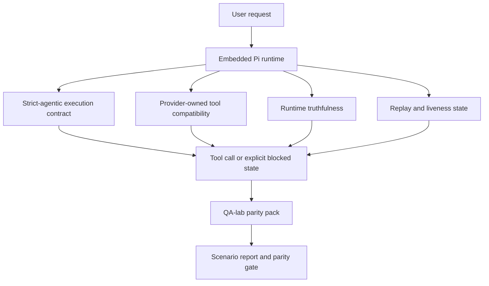
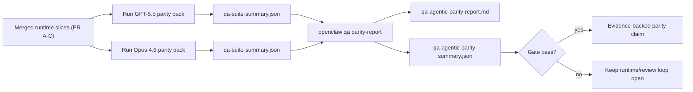

---
read_when:
    - 调试 GPT-5.5 或 Codex 智能体行为
    - 比较 OpenClaw 在不同前沿模型上的智能体行为
    - 审查 strict-agentic、tool-schema、elevation 和 replay 修复
summary: OpenClaw 如何弥合 GPT-5.5 和 Codex 风格模型的智能体式执行缺口
title: GPT-5.5 / Codex 智能体能力对等
x-i18n:
    generated_at: "2026-05-06T02:40:16Z"
    model: gpt-5.5
    provider: openai
    source_hash: bbc32f418dfffe2786093fa6b42b19f92a2d382c9408dfc55dd0154d67959390
    source_path: help/gpt55-codex-agentic-parity.md
    workflow: 16
---

OpenClaw 已经能很好地配合使用工具的前沿模型，但 GPT-5.5 和 Codex 风格模型在几个实际方面仍表现不足：

- 它们可能在规划后停止，而不是执行工作
- 它们可能错误地使用严格的 OpenAI/Codex 工具模式
- 即使无法获得完整访问权限，它们也可能请求 `/elevated full`
- 它们可能在重放或压缩期间丢失长时间运行任务的状态
- 与 Claude Opus 4.6 的对等性声明基于轶事，而不是可重复场景

这个对等性计划通过四个可审查的部分修复这些缺口。

## 有哪些变化

### PR A：严格智能体式执行

这一部分为嵌入式 Pi GPT-5 运行添加了可选的 `strict-agentic` 执行契约。

启用后，OpenClaw 不再接受仅有计划的轮次作为“足够好”的完成。如果模型只说明打算做什么，却没有实际使用工具或取得进展，OpenClaw 会用立即行动的 steer 重试，然后以显式阻塞状态失败关闭，而不是静默结束任务。

这主要改善 GPT-5.5 在以下场景中的体验：

- 简短的“好，去做吧”后续指令
- 第一步很明显的代码任务
- `update_plan` 应该用于进度跟踪而不是填充文本的流程

### PR B：运行时真实性

这一部分让 OpenClaw 如实说明两件事：

- 提供商/运行时调用失败的原因
- `/elevated full` 是否实际可用

这意味着 GPT-5.5 会获得更好的运行时信号，用于识别缺失范围、凭证刷新失败、HTML 403 凭证失败、代理问题、DNS 或超时失败，以及被阻止的完整访问模式。模型更不容易臆造错误的修复方式，也更不容易持续请求运行时无法提供的权限模式。

### PR C：执行正确性

这一部分改进两类正确性：

- 提供商拥有的 OpenAI/Codex 工具模式兼容性
- 重放和长任务存活状态呈现

工具兼容工作减少了严格 OpenAI/Codex 工具注册中的模式摩擦，尤其是围绕无参数工具和严格对象根级预期。重放/存活状态工作让长时间运行的任务更可观察，因此暂停、阻塞和被放弃的状态会显式可见，而不是消失在泛化失败文本中。

### PR D：对等性测试框架

这一部分添加了第一波 QA-lab 对等性包，让 GPT-5.5 和 Opus 4.6 可以通过相同场景运行，并用共享证据进行比较。

对等性包是证明层。它本身不会改变运行时行为。

获得两个 `qa-suite-summary.json` 产物后，使用以下命令生成发布门禁比较：

```bash
pnpm openclaw qa parity-report \
  --repo-root . \
  --candidate-summary .artifacts/qa-e2e/gpt55/qa-suite-summary.json \
  --baseline-summary .artifacts/qa-e2e/opus46/qa-suite-summary.json \
  --output-dir .artifacts/qa-e2e/parity
```

该命令会写入：

- 供人阅读的 Markdown 报告
- 机器可读的 JSON 判定
- 显式的 `pass` / `fail` 门禁结果

## 为什么这会在实践中改进 GPT-5.5

在这项工作之前，OpenClaw 上的 GPT-5.5 在真实编码会话中可能感觉不如 Opus 具备智能体能力，因为运行时容忍了一些对 GPT-5 风格模型尤其有害的行为：

- 仅评论的轮次
- 工具周围的模式摩擦
- 模糊的权限反馈
- 静默的重放或压缩损坏

目标不是让 GPT-5.5 模仿 Opus。目标是为 GPT-5.5 提供一种运行时契约，奖励真实进展，提供更清晰的工具和权限语义，并将失败模式转化为显式的机器和人类可读状态。

这会将用户体验从：

- “模型有一个好计划，但停住了”

变为：

- “模型要么采取了行动，要么 OpenClaw 呈现了它无法行动的确切原因”

## GPT-5.5 用户的前后对比

| 该计划之前                                                                                     | PR A-D 之后                                                                             |
| ---------------------------------------------------------------------------------------------- | ---------------------------------------------------------------------------------------- |
| GPT-5.5 可能在给出合理计划后停止，而不执行下一步工具操作                                      | PR A 将“仅计划”变成“立即行动或呈现阻塞状态”                                             |
| 严格工具模式可能以令人困惑的方式拒绝无参数工具或 OpenAI/Codex 形态的工具                     | PR C 让提供商拥有的工具注册和调用更可预测                                              |
| `/elevated full` 指引在被阻止的运行时中可能模糊或错误                                          | PR B 为 GPT-5.5 和用户提供真实的运行时和权限提示                                        |
| 重放或压缩失败可能让任务感觉像是静默消失了                                                     | PR C 显式呈现暂停、阻塞、被放弃和重放无效的结果                                        |
| “GPT-5.5 感觉比 Opus 差”大多只是轶事                                                           | PR D 将其转化为相同场景包、相同指标和硬性通过/失败门禁                                 |

## 架构



## 发布流程



## 场景包

第一波对等性包当前覆盖五个场景：

### `approval-turn-tool-followthrough`

检查模型在简短批准后不会停在“我会去做”。它应该在同一轮次中采取第一个具体行动。

### `model-switch-tool-continuity`

检查使用工具的工作在模型/运行时切换边界上保持连贯，而不是重置为评论或丢失执行上下文。

### `source-docs-discovery-report`

检查模型能否阅读源代码和文档、综合发现，并继续以智能体方式执行任务，而不是生成薄弱摘要后过早停止。

### `image-understanding-attachment`

检查涉及附件的混合模式任务保持可执行，而不会退化为模糊叙述。

### `compaction-retry-mutating-tool`

检查带有真实变更写入的任务在压缩、重试或压力下丢失回复状态时，是否保持重放不安全性显式可见，而不是静默地看起来可安全重放。

## 场景矩阵

| 场景                               | 测试内容                                | 良好的 GPT-5.5 行为                                                             | 失败信号                                                                       |
| ---------------------------------- | --------------------------------------- | ------------------------------------------------------------------------------ | ------------------------------------------------------------------------------ |
| `approval-turn-tool-followthrough` | 计划后的简短批准轮次                    | 立即开始第一个具体工具操作，而不是重述意图                                     | 仅计划的后续轮次、无工具活动，或没有真实阻塞因素的阻塞轮次                    |
| `model-switch-tool-continuity`     | 工具使用期间的运行时/模型切换           | 保留任务上下文并继续连贯行动                                                   | 重置为评论、丢失工具上下文，或切换后停止                                      |
| `source-docs-discovery-report`     | 源代码阅读 + 综合 + 行动                | 找到来源、使用工具，并产出有用报告且不陷入停顿                                 | 薄弱摘要、缺失工具工作，或未完成轮次停止                                      |
| `image-understanding-attachment`   | 附件驱动的智能体式工作                  | 解读附件、将其连接到工具，并继续任务                                           | 模糊叙述、忽略附件，或没有具体下一步行动                                      |
| `compaction-retry-mutating-tool`   | 压缩压力下的变更工作                    | 执行真实写入，并在副作用后保持重放不安全性显式可见                             | 发生变更写入，但重放安全性被暗示、缺失或自相矛盾                              |

## 发布门禁

只有当合并后的运行时同时通过对等性包和运行时真实性回归测试时，GPT-5.5 才能被视为达到或超过对等水平。

必需结果：

- 当下一步工具操作很明确时，不出现仅计划停滞
- 不在没有真实执行的情况下假完成
- 不给出错误的 `/elevated full` 指引
- 不静默放弃重放或压缩
- 对等性包指标至少与约定的 Opus 4.6 基线一样强

对于第一波测试框架，门禁比较：

- 完成率
- 非预期停止率
- 有效工具调用率
- 假成功计数

对等性证据有意拆分为两层：

- PR D 用 QA-lab 证明同场景 GPT-5.5 与 Opus 4.6 的行为
- PR B 确定性套件在测试框架之外证明凭证、代理、DNS 和 `/elevated full` 的真实性

## 目标到证据矩阵

| 完成门禁项                                               | 负责 PR     | 证据来源                                                           | 通过信号                                                                               |
| -------------------------------------------------------- | ----------- | ------------------------------------------------------------------ | ---------------------------------------------------------------------------------------- |
| GPT-5.5 不再在规划后停滞                                 | PR A        | `approval-turn-tool-followthrough` 加 PR A 运行时套件              | 批准轮次触发真实工作或显式阻塞状态                                                     |
| GPT-5.5 不再假装进展或假工具完成                         | PR A + PR D | 对等性报告场景结果和假成功计数                                     | 没有可疑的通过结果，也没有仅评论的完成                                                 |
| GPT-5.5 不再给出虚假的 `/elevated full` 指引             | PR B        | 确定性真实性套件                                                   | 阻塞原因和完整访问提示保持运行时准确                                                   |
| 重放/存活状态失败保持显式                                | PR C + PR D | PR C 生命周期/重放套件加 `compaction-retry-mutating-tool`          | 变更工作保持重放不安全性显式可见，而不是静默消失                                      |
| GPT-5.5 在约定指标上匹配或超过 Opus 4.6                  | PR D        | `qa-agentic-parity-report.md` 和 `qa-agentic-parity-summary.json`  | 相同场景覆盖，并且在完成、停止行为或有效工具使用上没有回归                             |

## 如何阅读对等性判定

使用 `qa-agentic-parity-summary.json` 中的判定作为第一波对等性包的最终机器可读决策。

- `pass` 表示 GPT-5.5 覆盖了与 Opus 4.6 相同的场景，并且在约定的聚合指标上没有退化。
- `fail` 表示至少触发了一个硬性门槛：完成能力较弱、意外停止更多、有效工具使用较弱、出现任何虚假成功案例，或场景覆盖不匹配。
- “共享/基础 CI 问题”本身不是一致性结果。如果 PR D 之外的 CI 噪声阻塞了一次运行，结论应等待一次干净的合并后运行时执行，而不是从分支阶段日志推断。
- 身份验证、代理、DNS 和 `/elevated full` 真实性仍来自 PR B 的确定性套件，因此最终发布声明需要同时满足两点：PR D 一致性结论通过，以及 PR B 真实性覆盖为绿色。

## 谁应该启用 `strict-agentic`

在以下情况使用 `strict-agentic`：

- 当下一步很明显时，预期智能体会立即行动
- GPT-5.5 或 Codex 系列模型是主要运行时
- 相比“有帮助的”仅回顾式回复，你更偏好明确的受阻状态

在以下情况保留默认契约：

- 你想要现有更宽松的行为
- 你未使用 GPT-5 系列模型
- 你正在测试提示词，而不是运行时强制执行

## 相关

- [GPT-5.5 / Codex 一致性维护者说明](/zh-CN/help/gpt55-codex-agentic-parity-maintainers)
