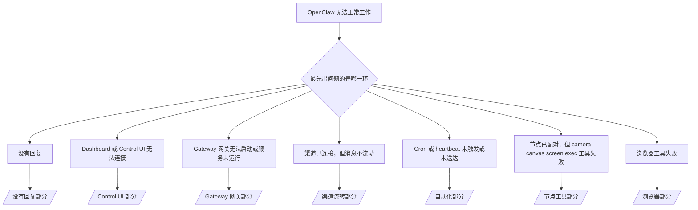

---
read_when:
    - OpenClaw 无法正常工作，而你需要最快的修复路径
    - 你想先进行分诊流程，再深入阅读详细运行手册
summary: OpenClaw 的按症状优先故障排除中心
title: 通用故障排除
x-i18n:
    generated_at: "2026-04-05T08:26:14Z"
    model: gpt-5.4
    provider: openai
    source_hash: 23ae9638af5edf5a5e0584ccb15ba404223ac3b16c2d62eb93b2c9dac171c252
    source_path: help/troubleshooting.md
    workflow: 15
---

# 故障排除

如果你只有 2 分钟，请把本页当作分诊入口。

## 最初的六十秒

按顺序运行以下精确命令阶梯：

```bash
openclaw status
openclaw status --all
openclaw gateway probe
openclaw gateway status
openclaw doctor
openclaw channels status --probe
openclaw logs --follow
```

一行说明什么才算正常输出：

- `openclaw status` → 显示已配置渠道，且没有明显的鉴权错误。
- `openclaw status --all` → 完整报告存在且可分享。
- `openclaw gateway probe` → 预期的 Gateway 网关目标可访问（`Reachable: yes`）。`RPC: limited - missing scope: operator.read` 表示诊断能力降级，不是连接失败。
- `openclaw gateway status` → `Runtime: running` 且 `RPC probe: ok`。
- `openclaw doctor` → 没有阻塞性的配置/服务错误。
- `openclaw channels status --probe` → 当 Gateway 网关可访问时，会返回按账户划分的实时
  传输状态，以及诸如 `works` 或 `audit ok` 之类的探测/审计结果；如果
  Gateway 网关不可访问，该命令会回退到仅基于配置的摘要。
- `openclaw logs --follow` → 持续有活动，没有重复出现的致命错误。

## Anthropic 长上下文 429

如果你看到：
`HTTP 429: rate_limit_error: Extra usage is required for long context requests`，
请前往 [/gateway/troubleshooting#anthropic-429-extra-usage-required-for-long-context](/gateway/troubleshooting#anthropic-429-extra-usage-required-for-long-context)。

## 插件安装失败，提示缺少 openclaw extensions

如果安装失败并提示 `package.json missing openclaw.extensions`，说明该插件包
使用了 OpenClaw 已不再接受的旧结构。

在插件包中修复：

1. 在 `package.json` 中添加 `openclaw.extensions`。
2. 将条目指向已构建的运行时文件（通常是 `./dist/index.js`）。
3. 重新发布插件，然后再次运行 `openclaw plugins install <package>`。

示例：

```json
{
  "name": "@openclaw/my-plugin",
  "version": "1.2.3",
  "openclaw": {
    "extensions": ["./dist/index.js"]
  }
}
```

参考：[插件架构](/plugins/architecture)

## 决策树



<AccordionGroup>
  <Accordion title="没有回复">
    ```bash
    openclaw status
    openclaw gateway status
    openclaw channels status --probe
    openclaw pairing list --channel <channel> [--account <id>]
    openclaw logs --follow
    ```

    正常输出应类似于：

    - `Runtime: running`
    - `RPC probe: ok`
    - 你的渠道显示传输已连接，并且在支持的情况下，`channels status --probe` 中会显示 `works` 或 `audit ok`
    - 发送者显示为已批准（或私信策略为 open/allowlist）

    常见日志特征：

    - `drop guild message (mention required` → 在 Discord 中，提及门控阻止了该消息。
    - `pairing request` → 发送者尚未获批，正在等待私信配对批准。
    - 渠道日志中的 `blocked` / `allowlist` → 发送者、房间或群组被过滤。

    深入页面：

    - [/gateway/troubleshooting#no-replies](/gateway/troubleshooting#no-replies)
    - [/channels/troubleshooting](/channels/troubleshooting)
    - [/channels/pairing](/channels/pairing)

  </Accordion>

  <Accordion title="Dashboard 或 Control UI 无法连接">
    ```bash
    openclaw status
    openclaw gateway status
    openclaw logs --follow
    openclaw doctor
    openclaw channels status --probe
    ```

    正常输出应类似于：

    - `openclaw gateway status` 中显示 `Dashboard: http://...`
    - `RPC probe: ok`
    - 日志中没有鉴权循环

    常见日志特征：

    - `device identity required` → HTTP/非安全上下文无法完成设备鉴权。
    - `origin not allowed` → 该浏览器 `Origin` 不被该 Control UI
      Gateway 网关目标允许。
    - `AUTH_TOKEN_MISMATCH` 并带有重试提示（`canRetryWithDeviceToken=true`）→ 可能会自动执行一次受信任的设备 token 重试。
    - 该缓存 token 重试会复用与已配对
      设备 token 一起存储的缓存 scope 集。显式 `deviceToken` / 显式 `scopes` 调用方则保持
      其请求的 scope 集不变。
    - 在异步 Tailscale Serve Control UI 路径上，同一个
      `{scope, ip}` 的失败尝试会在限流器记录失败前被串行化，因此第二个并发的错误重试可能已经显示 `retry later`。
    - 来自 localhost 浏览器来源的 `too many failed authentication attempts (retry later)` →
      来自同一 `Origin` 的重复失败会被暂时
      锁定；另一个 localhost 来源会使用独立的桶。
    - 在该次重试后仍反复出现 `unauthorized` → token/password 错误、鉴权模式不匹配，或已配对设备 token 过期。
    - `gateway connect failed:` → UI 指向了错误的 URL/端口，或 Gateway 网关不可访问。

    深入页面：

    - [/gateway/troubleshooting#dashboard-control-ui-connectivity](/gateway/troubleshooting#dashboard-control-ui-connectivity)
    - [/web/control-ui](/web/control-ui)
    - [/gateway/authentication](/gateway/authentication)

  </Accordion>

  <Accordion title="Gateway 网关无法启动，或服务已安装但未运行">
    ```bash
    openclaw status
    openclaw gateway status
    openclaw logs --follow
    openclaw doctor
    openclaw channels status --probe
    ```

    正常输出应类似于：

    - `Service: ... (loaded)`
    - `Runtime: running`
    - `RPC probe: ok`

    常见日志特征：

    - `Gateway start blocked: set gateway.mode=local` 或 `existing config is missing gateway.mode` → Gateway 网关模式为 remote，或配置文件缺少本地模式标记，需要修复。
    - `refusing to bind gateway ... without auth` → 非 loopback 绑定，但没有有效的 Gateway 网关鉴权路径（token/password，或已配置的 trusted-proxy）。
    - `another gateway instance is already listening` 或 `EADDRINUSE` → 端口已被占用。

    深入页面：

    - [/gateway/troubleshooting#gateway-service-not-running](/gateway/troubleshooting#gateway-service-not-running)
    - [/gateway/background-process](/gateway/background-process)
    - [/gateway/configuration](/gateway/configuration)

  </Accordion>

  <Accordion title="渠道已连接，但消息不流动">
    ```bash
    openclaw status
    openclaw gateway status
    openclaw logs --follow
    openclaw doctor
    openclaw channels status --probe
    ```

    正常输出应类似于：

    - 渠道传输已连接。
    - 配对/allowlist 检查通过。
    - 在要求提及时，提及已被检测到。

    常见日志特征：

    - `mention required` → 群组提及门控阻止了处理。
    - `pairing` / `pending` → 私信发送者尚未获批。
    - `not_in_channel`、`missing_scope`、`Forbidden`、`401/403` → 渠道权限 token 问题。

    深入页面：

    - [/gateway/troubleshooting#channel-connected-messages-not-flowing](/gateway/troubleshooting#channel-connected-messages-not-flowing)
    - [/channels/troubleshooting](/channels/troubleshooting)

  </Accordion>

  <Accordion title="Cron 或 heartbeat 未触发或未送达">
    ```bash
    openclaw status
    openclaw gateway status
    openclaw cron status
    openclaw cron list
    openclaw cron runs --id <jobId> --limit 20
    openclaw logs --follow
    ```

    正常输出应类似于：

    - `cron.status` 显示已启用，并有下一次唤醒时间。
    - `cron runs` 显示最近的 `ok` 条目。
    - Heartbeat 已启用，且不在活跃时段之外。

    常见日志特征：

- `cron: scheduler disabled; jobs will not run automatically` → cron 已禁用。
- `heartbeat skipped` 且带有 `reason=quiet-hours` → 位于配置的活跃时段之外。
- `heartbeat skipped` 且带有 `reason=empty-heartbeat-file` → `HEARTBEAT.md` 存在，但只包含空白内容/仅标题骨架。
- `heartbeat skipped` 且带有 `reason=no-tasks-due` → `HEARTBEAT.md` 任务模式已启用，但尚未有任何任务到达执行间隔。
- `heartbeat skipped` 且带有 `reason=alerts-disabled` → 所有 heartbeat 可见性均被禁用（`showOk`、`showAlerts` 和 `useIndicator` 全部关闭）。
- `requests-in-flight` → 主通道繁忙；heartbeat 唤醒被延后。 - `unknown accountId` → heartbeat 投递目标账户不存在。

      深入页面：

      - [/gateway/troubleshooting#cron-and-heartbeat-delivery](/gateway/troubleshooting#cron-and-heartbeat-delivery)
      - [/automation/cron-jobs#troubleshooting](/automation/cron-jobs#troubleshooting)
      - [/gateway/heartbeat](/gateway/heartbeat)

    </Accordion>

    <Accordion title="节点已配对，但 tool 的 camera canvas screen exec 失败">
      ```bash
      openclaw status
      openclaw gateway status
      openclaw nodes status
      openclaw nodes describe --node <idOrNameOrIp>
      openclaw logs --follow
      ```

      正常输出应类似于：

      - 节点被列为已连接且已配对，角色为 `node`。
      - 你调用的命令对应的能力存在。
      - 该工具的权限状态为已授予。

      常见日志特征：

      - `NODE_BACKGROUND_UNAVAILABLE` → 将节点应用切到前台。
      - `*_PERMISSION_REQUIRED` → 操作系统权限被拒绝或缺失。
      - `SYSTEM_RUN_DENIED: approval required` → exec 批准正在等待中。
      - `SYSTEM_RUN_DENIED: allowlist miss` → 命令不在 exec allowlist 中。

      深入页面：

      - [/gateway/troubleshooting#node-paired-tool-fails](/gateway/troubleshooting#node-paired-tool-fails)
      - [/nodes/troubleshooting](/nodes/troubleshooting)
      - [/tools/exec-approvals](/tools/exec-approvals)

    </Accordion>

    <Accordion title="Exec 突然要求批准">
      ```bash
      openclaw config get tools.exec.host
      openclaw config get tools.exec.security
      openclaw config get tools.exec.ask
      openclaw gateway restart
      ```

      发生了什么变化：

      - 如果未设置 `tools.exec.host`，默认值是 `auto`。
      - 当沙箱运行时处于活动状态时，`host=auto` 解析为 `sandbox`，否则为 `gateway`。
      - `host=auto` 只负责路由；无提示的 “YOLO” 行为来自 gateway/node 上的 `security=full` 加 `ask=off`。
      - 在 `gateway` 和 `node` 上，未设置的 `tools.exec.security` 默认是 `full`。
      - 未设置的 `tools.exec.ask` 默认是 `off`。
      - 结果：如果你现在看到了批准请求，说明某些主机本地或按会话的策略把 exec 收紧到了偏离当前默认值的状态。

      恢复当前默认的“无需批准”行为：

      ```bash
      openclaw config set tools.exec.host gateway
      openclaw config set tools.exec.security full
      openclaw config set tools.exec.ask off
      openclaw gateway restart
      ```

      更安全的替代方案：

      - 如果你只想要稳定的主机路由，仅设置 `tools.exec.host=gateway`。
      - 如果你想要主机 exec，但仍希望在 allowlist 未命中时进行审查，请使用 `security=allowlist` 和 `ask=on-miss`。
      - 如果你希望 `host=auto` 再次解析回 `sandbox`，请启用沙箱模式。

      常见日志特征：

      - `Approval required.` → 命令正在等待 `/approve ...`。
      - `SYSTEM_RUN_DENIED: approval required` → 节点宿主 exec 批准正在等待中。
      - `exec host=sandbox requires a sandbox runtime for this session` → 发生了隐式/显式的沙箱选择，但沙箱模式处于关闭状态。

      深入页面：

      - [/tools/exec](/tools/exec)
      - [/tools/exec-approvals](/tools/exec-approvals)
      - [/gateway/security#runtime-expectation-drift](/gateway/security#runtime-expectation-drift)

    </Accordion>

    <Accordion title="浏览器工具失败">
      ```bash
      openclaw status
      openclaw gateway status
      openclaw browser status
      openclaw logs --follow
      openclaw doctor
      ```

      正常输出应类似于：

      - 浏览器状态显示 `running: true`，并有已选定的浏览器/profile。
      - `openclaw` 能启动，或 `user` 能看到本地 Chrome 标签页。

      常见日志特征：

      - `unknown command "browser"` 或 `unknown command 'browser'` → 设置了 `plugins.allow`，但其中不包含 `browser`。
      - `Failed to start Chrome CDP on port` → 本地浏览器启动失败。
      - `browser.executablePath not found` → 配置的二进制路径错误。
      - `browser.cdpUrl must be http(s) or ws(s)` → 配置的 CDP URL 使用了不受支持的协议。
      - `browser.cdpUrl has invalid port` → 配置的 CDP URL 端口错误或超出范围。
      - `No Chrome tabs found for profile="user"` → Chrome MCP 附加 profile 没有打开的本地 Chrome 标签页。
      - `Remote CDP for profile "<name>" is not reachable` → 配置的远程 CDP 端点从此主机无法访问。
      - `Browser attachOnly is enabled ... not reachable` 或 `Browser attachOnly is enabled and CDP websocket ... is not reachable` → 仅附加 profile 没有可用的 CDP 目标。
      - attach-only 或远程 CDP profile 上存在陈旧的 viewport / dark-mode / locale / offline 覆盖状态 → 运行 `openclaw browser stop --browser-profile <name>` 以关闭活动控制会话并释放模拟状态，而无需重启 Gateway 网关。

      深入页面：

      - [/gateway/troubleshooting#browser-tool-fails](/gateway/troubleshooting#browser-tool-fails)
      - [/tools/browser#missing-browser-command-or-tool](/tools/browser#missing-browser-command-or-tool)
      - [/tools/browser-linux-troubleshooting](/tools/browser-linux-troubleshooting)
      - [/tools/browser-wsl2-windows-remote-cdp-troubleshooting](/tools/browser-wsl2-windows-remote-cdp-troubleshooting)

    </Accordion>
  </AccordionGroup>

## 相关内容

- [常见问题](/help/faq) — 常见问题
- [Gateway 故障排除](/gateway/troubleshooting) — Gateway 网关专属问题
- [Doctor](/gateway/doctor) — 自动健康检查与修复
- [渠道故障排除](/channels/troubleshooting) — 渠道连接问题
- [自动化故障排除](/automation/cron-jobs#troubleshooting) — cron 和 heartbeat 问题
