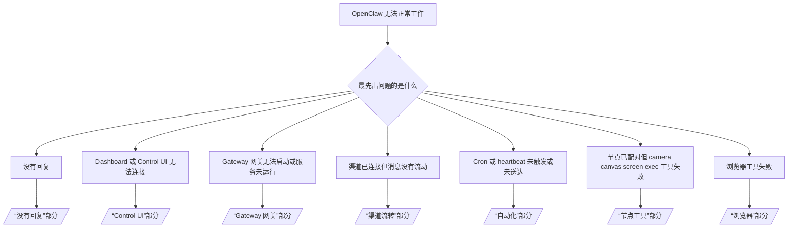

---
read_when:
    - OpenClaw 无法正常工作，而你需要最快速的解决方案。
    - 你想在深入查看详细操作手册之前，先进行分诊流程。
summary: OpenClaw 的按症状排查故障中心
title: 常见故障排除
x-i18n:
    generated_at: "2026-04-24T06:58:59Z"
    model: gpt-5.4
    provider: openai
    source_hash: c832c3f7609c56a5461515ed0f693d2255310bf2d3958f69f57c482bcbef97f0
    source_path: help/troubleshooting.md
    workflow: 15
---

如果你只有 2 分钟，请把这个页面当作分诊入口。

## 最初的六十秒

按顺序运行这组命令，不要跳步：

```bash
openclaw status
openclaw status --all
openclaw gateway probe
openclaw gateway status
openclaw doctor
openclaw channels status --probe
openclaw logs --follow
```

一行判断“正常输出”：

- `openclaw status` → 显示已配置的渠道，且没有明显的身份验证错误。
- `openclaw status --all` → 完整报告存在，并且可以分享。
- `openclaw gateway probe` → 预期的 Gateway 网关目标可达（`Reachable: yes`）。`Capability: ...` 会告诉你探测能够证明的认证级别，而 `Read probe: limited - missing scope: operator.read` 表示诊断能力受限，不是连接失败。
- `openclaw gateway status` → 显示 `Runtime: running`、`Connectivity probe: ok`，以及合理的 `Capability: ...` 行。如果你还需要具备读取作用域的 RPC 证明，可使用 `--require-rpc`。
- `openclaw doctor` → 没有阻塞性的配置或服务错误。
- `openclaw channels status --probe` → 如果 Gateway 网关可达，会返回每个账号的实时传输状态，以及 `works` 或 `audit ok` 之类的探测 / 审计结果；如果 Gateway 网关不可达，该命令会回退为仅基于配置的摘要。
- `openclaw logs --follow` → 活动稳定，没有重复出现的致命错误。

## Anthropic 长上下文 429

如果你看到：
`HTTP 429: rate_limit_error: Extra usage is required for long context requests`，
请前往 [/gateway/troubleshooting#anthropic-429-extra-usage-required-for-long-context](/zh-CN/gateway/troubleshooting#anthropic-429-extra-usage-required-for-long-context)。

## 本地 OpenAI 兼容后端直接可用，但在 OpenClaw 中失败

如果你的本地或自托管 `/v1` 后端能够响应小型直接
`/v1/chat/completions` 探测，但在 `openclaw infer model run` 或正常
智能体对话中失败：

1. 如果错误提到 `messages[].content` 需要是字符串，请设置
   `models.providers.<provider>.models[].compat.requiresStringContent: true`。
2. 如果后端仍然只在 OpenClaw 智能体对话中失败，请设置
   `models.providers.<provider>.models[].compat.supportsTools: false` 然后重试。
3. 如果很小的直接调用仍然可用，但较大的 OpenClaw 提示词会让后端崩溃，请将剩余问题视为上游模型 / 服务器限制，并继续查看详细操作手册：
   [/gateway/troubleshooting#local-openai-compatible-backend-passes-direct-probes-but-agent-runs-fail](/zh-CN/gateway/troubleshooting#local-openai-compatible-backend-passes-direct-probes-but-agent-runs-fail)

## 插件安装失败，并提示缺少 openclaw extensions

如果安装失败并提示 `package.json missing openclaw.extensions`，说明该插件包使用了 OpenClaw 已不再接受的旧结构。

在插件包中这样修复：

1. 在 `package.json` 中添加 `openclaw.extensions`。
2. 将条目指向构建后的运行时文件（通常是 `./dist/index.js`）。
3. 重新发布该插件，然后再次运行 `openclaw plugins install <package>`。

示例：

```json
{
  "name": "@openclaw/my-plugin",
  "version": "1.2.3",
  "openclaw": {
    "extensions": ["./dist/index.js"]
  }
}
```

参考：[Plugin architecture](/zh-CN/plugins/architecture)

## 决策树



<AccordionGroup>
  <Accordion title="没有回复">
    ```bash
    openclaw status
    openclaw gateway status
    openclaw channels status --probe
    openclaw pairing list --channel <channel> [--account <id>]
    openclaw logs --follow
    ```

    正常输出通常如下：

    - `Runtime: running`
    - `Connectivity probe: ok`
    - `Capability: read-only`、`write-capable` 或 `admin-capable`
    - 你的渠道显示传输已连接，并且在支持的情况下，`channels status --probe` 中会显示 `works` 或 `audit ok`
    - 发送者显示已获批准（或私信策略为 open / allowlist）

    常见日志特征：

    - `drop guild message (mention required` → 在 Discord 中，提及门控阻止了该消息。
    - `pairing request` → 发送者尚未获批，正在等待私信配对批准。
    - 渠道日志中的 `blocked` / `allowlist` → 发送者、房间或群组被过滤。

    详细页面：

    - [/gateway/troubleshooting#no-replies](/zh-CN/gateway/troubleshooting#no-replies)
    - [/channels/troubleshooting](/zh-CN/channels/troubleshooting)
    - [/channels/pairing](/zh-CN/channels/pairing)

  </Accordion>

  <Accordion title="Dashboard 或 Control UI 无法连接">
    ```bash
    openclaw status
    openclaw gateway status
    openclaw logs --follow
    openclaw doctor
    openclaw channels status --probe
    ```

    正常输出通常如下：

    - 在 `openclaw gateway status` 中显示 `Dashboard: http://...`
    - `Connectivity probe: ok`
    - `Capability: read-only`、`write-capable` 或 `admin-capable`
    - 日志中没有认证循环

    常见日志特征：

    - `device identity required` → HTTP / 非安全上下文无法完成设备认证。
    - `origin not allowed` → 浏览器 `Origin` 不在 Control UI 的
      Gateway 网关目标允许范围内。
    - 带有重试提示（`canRetryWithDeviceToken=true`）的 `AUTH_TOKEN_MISMATCH` → 可能会自动执行一次受信任的设备令牌重试。
    - 该缓存令牌重试会复用与已配对设备令牌一起存储的缓存作用域集合。显式传入 `deviceToken` / 显式传入 `scopes` 的调用方则会保留它们请求的作用域集合。
    - 在异步 Tailscale Serve Control UI 路径上，同一
      `{scope, ip}` 的失败尝试会在限流器记录失败之前被串行化，因此第二个并发的错误重试可能已经显示 `retry later`。
    - 来自 localhost 浏览器来源的 `too many failed authentication attempts (retry later)` → 同一 `Origin` 的重复失败会被暂时锁定；另一个 localhost 来源会使用单独的桶。
    - 该次重试之后仍反复出现 `unauthorized` → 令牌 / 密码错误、认证模式不匹配，或已配对的设备令牌已过期。
    - `gateway connect failed:` → UI 指向了错误的 URL / 端口，或 Gateway 网关不可达。

    详细页面：

    - [/gateway/troubleshooting#dashboard-control-ui-connectivity](/zh-CN/gateway/troubleshooting#dashboard-control-ui-connectivity)
    - [/web/control-ui](/zh-CN/web/control-ui)
    - [/gateway/authentication](/zh-CN/gateway/authentication)

  </Accordion>

  <Accordion title="Gateway 网关无法启动，或服务已安装但未运行">
    ```bash
    openclaw status
    openclaw gateway status
    openclaw logs --follow
    openclaw doctor
    openclaw channels status --probe
    ```

    正常输出通常如下：

    - `Service: ... (loaded)`
    - `Runtime: running`
    - `Connectivity probe: ok`
    - `Capability: read-only`、`write-capable` 或 `admin-capable`

    常见日志特征：

    - `Gateway start blocked: set gateway.mode=local` 或 `existing config is missing gateway.mode` → Gateway 网关模式为 remote，或配置文件缺少 local 模式标记，需要修复。
    - `refusing to bind gateway ... without auth` → 在没有有效 Gateway 网关认证路径的情况下尝试绑定到非 loopback 地址（令牌 / 密码，或在已配置时使用 trusted-proxy）。
    - `another gateway instance is already listening` 或 `EADDRINUSE` → 端口已被占用。

    详细页面：

    - [/gateway/troubleshooting#gateway-service-not-running](/zh-CN/gateway/troubleshooting#gateway-service-not-running)
    - [/gateway/background-process](/zh-CN/gateway/background-process)
    - [/gateway/configuration](/zh-CN/gateway/configuration)

  </Accordion>

  <Accordion title="渠道已连接但消息没有流动">
    ```bash
    openclaw status
    openclaw gateway status
    openclaw logs --follow
    openclaw doctor
    openclaw channels status --probe
    ```

    正常输出通常如下：

    - 渠道传输已连接。
    - 配对 / allowlist 检查通过。
    - 在需要时，能够检测到提及。

    常见日志特征：

    - `mention required` → 群组提及门控阻止了处理。
    - `pairing` / `pending` → 私信发送者尚未获批。
    - `not_in_channel`、`missing_scope`、`Forbidden`、`401/403` → 渠道权限令牌问题。

    详细页面：

    - [/gateway/troubleshooting#channel-connected-messages-not-flowing](/zh-CN/gateway/troubleshooting#channel-connected-messages-not-flowing)
    - [/channels/troubleshooting](/zh-CN/channels/troubleshooting)

  </Accordion>

  <Accordion title="Cron 或 heartbeat 未触发或未送达">
    ```bash
    openclaw status
    openclaw gateway status
    openclaw cron status
    openclaw cron list
    openclaw cron runs --id <jobId> --limit 20
    openclaw logs --follow
    ```

    正常输出通常如下：

    - `cron.status` 显示已启用，并带有下一次唤醒时间。
    - `cron runs` 显示最近的 `ok` 记录。
    - heartbeat 已启用，且不在活跃时间之外。

    常见日志特征：

    - `cron: scheduler disabled; jobs will not run automatically` → cron 已禁用。
    - `heartbeat skipped` 且 `reason=quiet-hours` → 当前处于配置的活跃时间之外。
    - `heartbeat skipped` 且 `reason=empty-heartbeat-file` → `HEARTBEAT.md` 存在，但只包含空白 / 仅标题的骨架内容。
    - `heartbeat skipped` 且 `reason=no-tasks-due` → `HEARTBEAT.md` 任务模式已启用，但目前还没有任何任务到达间隔时间。
    - `heartbeat skipped` 且 `reason=alerts-disabled` → 所有 heartbeat 可见性都已禁用（`showOk`、`showAlerts` 和 `useIndicator` 全部关闭）。
    - `requests-in-flight` → 主通道繁忙；heartbeat 唤醒被延后。
    - `unknown accountId` → heartbeat 投递目标账号不存在。

    详细页面：

    - [/gateway/troubleshooting#cron-and-heartbeat-delivery](/zh-CN/gateway/troubleshooting#cron-and-heartbeat-delivery)
    - [/automation/cron-jobs#troubleshooting](/zh-CN/automation/cron-jobs#troubleshooting)
    - [/gateway/heartbeat](/zh-CN/gateway/heartbeat)

  </Accordion>

  <Accordion title="节点已配对，但工具的 camera canvas screen exec 失败">
    ```bash
    openclaw status
    openclaw gateway status
    openclaw nodes status
    openclaw nodes describe --node <idOrNameOrIp>
    openclaw logs --follow
    ```

    正常输出通常如下：

    - 节点列为已连接，并已针对 `node` 角色完成配对。
    - 你调用的命令具备相应能力。
    - 该工具的权限状态为已授予。

    常见日志特征：

    - `NODE_BACKGROUND_UNAVAILABLE` → 将节点应用切换到前台。
    - `*_PERMISSION_REQUIRED` → 操作系统权限被拒绝或缺失。
    - `SYSTEM_RUN_DENIED: approval required` → exec 批准正在等待中。
    - `SYSTEM_RUN_DENIED: allowlist miss` → 该命令不在 exec allowlist 中。

    详细页面：

    - [/gateway/troubleshooting#node-paired-tool-fails](/zh-CN/gateway/troubleshooting#node-paired-tool-fails)
    - [/nodes/troubleshooting](/zh-CN/nodes/troubleshooting)
    - [/tools/exec-approvals](/zh-CN/tools/exec-approvals)

  </Accordion>

  <Accordion title="Exec 突然开始要求批准">
    ```bash
    openclaw config get tools.exec.host
    openclaw config get tools.exec.security
    openclaw config get tools.exec.ask
    openclaw gateway restart
    ```

    发生了什么变化：

    - 如果 `tools.exec.host` 未设置，默认值是 `auto`。
    - 当沙箱运行时处于激活状态时，`host=auto` 会解析为 `sandbox`；否则解析为 `gateway`。
    - `host=auto` 仅影响路由；无提示的 “YOLO” 行为来自 gateway/node 上的 `security=full` 加 `ask=off`。
    - 在 `gateway` 和 `node` 上，未设置的 `tools.exec.security` 默认是 `full`。
    - 未设置的 `tools.exec.ask` 默认是 `off`。
    - 结果：如果你现在看到了批准请求，说明某些主机本地或按会话生效的策略，相比当前默认值收紧了 exec 行为。

    恢复当前默认的无批准行为：

    ```bash
    openclaw config set tools.exec.host gateway
    openclaw config set tools.exec.security full
    openclaw config set tools.exec.ask off
    openclaw gateway restart
    ```

    更安全的替代方案：

    - 如果你只想要稳定的主机路由，仅设置 `tools.exec.host=gateway`。
    - 如果你希望使用主机 exec，但在 allowlist 未命中时仍进行审查，请使用 `security=allowlist` 搭配 `ask=on-miss`。
    - 如果你希望 `host=auto` 重新解析回 `sandbox`，请启用沙箱模式。

    常见日志特征：

    - `Approval required.` → 命令正在等待 `/approve ...`。
    - `SYSTEM_RUN_DENIED: approval required` → node 主机 exec 批准正在等待中。
    - `exec host=sandbox requires a sandbox runtime for this session` → 已隐式 / 显式选择沙箱，但沙箱模式处于关闭状态。

    详细页面：

    - [/tools/exec](/zh-CN/tools/exec)
    - [/tools/exec-approvals](/zh-CN/tools/exec-approvals)
    - [/gateway/security#what-the-audit-checks-high-level](/zh-CN/gateway/security#what-the-audit-checks-high-level)

  </Accordion>

  <Accordion title="浏览器工具失败">
    ```bash
    openclaw status
    openclaw gateway status
    openclaw browser status
    openclaw logs --follow
    openclaw doctor
    ```

    正常输出通常如下：

    - 浏览器状态显示 `running: true`，并且已选定浏览器 / 配置文件。
    - `openclaw` 已启动，或者 `user` 能看到本地 Chrome 标签页。

    常见日志特征：

    - `unknown command "browser"` 或 `unknown command 'browser'` → 设置了 `plugins.allow`，但其中不包含 `browser`。
    - `Failed to start Chrome CDP on port` → 本地浏览器启动失败。
    - `browser.executablePath not found` → 配置的二进制路径错误。
    - `browser.cdpUrl must be http(s) or ws(s)` → 配置的 CDP URL 使用了不受支持的协议。
    - `browser.cdpUrl has invalid port` → 配置的 CDP URL 端口错误或超出范围。
    - `No Chrome tabs found for profile="user"` → Chrome MCP 附加配置文件没有打开的本地 Chrome 标签页。
    - `Remote CDP for profile "<name>" is not reachable` → 配置的远程 CDP 端点从当前主机无法访问。
    - `Browser attachOnly is enabled ... not reachable` 或 `Browser attachOnly is enabled and CDP websocket ... is not reachable` → 仅附加配置文件没有可用的实时 CDP 目标。
    - 对 attach-only 或远程 CDP 配置文件，若存在陈旧的 viewport / dark-mode / locale / offline 覆盖状态 → 运行 `openclaw browser stop --browser-profile <name>`，关闭当前活动控制会话并释放模拟状态，而无需重启 Gateway 网关。

    详细页面：

    - [/gateway/troubleshooting#browser-tool-fails](/zh-CN/gateway/troubleshooting#browser-tool-fails)
    - [/tools/browser#missing-browser-command-or-tool](/zh-CN/tools/browser#missing-browser-command-or-tool)
    - [/tools/browser-linux-troubleshooting](/zh-CN/tools/browser-linux-troubleshooting)
    - [/tools/browser-wsl2-windows-remote-cdp-troubleshooting](/zh-CN/tools/browser-wsl2-windows-remote-cdp-troubleshooting)

  </Accordion>

</AccordionGroup>

## 相关内容

- [常见问题](/zh-CN/help/faq) — 常见问题解答
- [Gateway Troubleshooting](/zh-CN/gateway/troubleshooting) — Gateway 网关专属问题
- [Doctor](/zh-CN/gateway/doctor) — 自动化健康检查与修复
- [Channel Troubleshooting](/zh-CN/channels/troubleshooting) — 渠道连接问题
- [Automation Troubleshooting](/zh-CN/automation/cron-jobs#troubleshooting) — cron 和 heartbeat 问题
