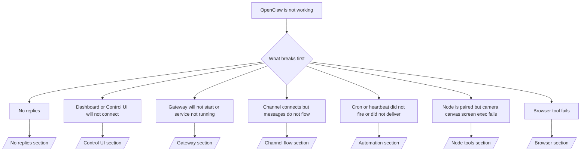

---
read_when:
    - OpenClaw 无法正常工作，而你需要最快的修复路径
    - 你想在深入查看详细运行手册之前先使用一个分诊流程
summary: OpenClaw 故障排除中心：从症状入手
title: 常规故障排除
x-i18n:
    generated_at: "2026-06-27T02:15:12Z"
    model: gpt-5.5
    postprocess_version: locale-links-v1
    provider: openai
    source_hash: ae1236c73e3a5c9237bd81d603e8dca18c595a8bcbb71f5931bfbf2389b342cd
    source_path: help/troubleshooting.md
    workflow: 16
---

如果你只有 2 分钟，请把本页当作分诊入口。

## 最初的六十秒

按顺序运行这套确切阶梯：

```bash
openclaw status
openclaw status --all
openclaw gateway probe
openclaw gateway status
openclaw doctor
openclaw channels status --probe
openclaw logs --follow
```

一行内的良好输出：

- `openclaw status` → 显示已配置的渠道，并且没有明显的凭证错误。
- `openclaw status --all` → 完整报告存在且可共享。
- `openclaw gateway probe` → 预期的 Gateway 网关目标可访问（`Reachable: yes`）。`Capability: ...` 会告诉你探测能证明的凭证级别，而 `Read probe: limited - missing scope: operator.read` 是降级的诊断，不是连接失败。
- `openclaw gateway status` → `Runtime: running`、`Connectivity probe: ok`，以及可信的 `Capability: ...` 行。如果你还需要读取范围的 RPC 证明，请使用 `--require-rpc`。
- `openclaw doctor` → 没有阻塞性的配置/服务错误。
- `openclaw channels status --probe` → 可访问的 Gateway 网关会返回实时的逐账号传输状态，以及 `works` 或 `audit ok` 等探测/审计结果；如果 Gateway 网关不可访问，该命令会回退到仅配置摘要。
- `openclaw logs --follow` → 活动稳定，没有重复的致命错误。

## 助手受限或缺少工具

如果助手无法检查文件、运行命令、使用浏览器自动化，或看不到预期工具，请先检查有效工具配置文件：

```bash
openclaw status
openclaw status --all
openclaw doctor
```

常见原因：

- `tools.profile: "messaging"` 对仅聊天智能体有意保持较窄范围。
- `tools.profile: "coding"` 是用于仓库、文件、shell 和运行时工作流的常用配置文件。
- `tools.profile: "full"` 暴露最广泛的工具集，应仅限受信任的操作员控制智能体使用。
- 按智能体的 `agents.list[].tools` 覆盖可以缩小或扩展某个智能体的根配置文件。

更改根级或按智能体的工具配置文件，然后重启或重新加载 Gateway 网关，并再次运行 `openclaw status --all`。有关配置文件模型和允许/拒绝覆盖，请参阅 [工具](/zh-CN/tools)。

## Anthropic 长上下文 429

如果你看到：
`HTTP 429: rate_limit_error: Extra usage is required for long context requests`，
请前往 [/gateway/troubleshooting#anthropic-429-extra-usage-required-for-long-context](/zh-CN/gateway/troubleshooting#anthropic-429-extra-usage-required-for-long-context)。

## 本地 OpenAI 兼容后端可直接工作，但在 OpenClaw 中失败

如果你的本地或自托管 `/v1` 后端可以响应小型直接 `/v1/chat/completions` 探测，但在 `openclaw infer model run` 或普通智能体轮次中失败：

1. 如果错误提到 `messages[].content` 预期为字符串，请设置 `models.providers.<provider>.models[].compat.requiresStringContent: true`。
2. 如果后端仍然只在 OpenClaw 智能体轮次中失败，请设置 `models.providers.<provider>.models[].compat.supportsTools: false` 并重试。
3. 如果微型直接调用仍可工作，但更大的 OpenClaw 提示词会让后端崩溃，请将剩余问题视为上游模型/服务器限制，并继续查看深入运行手册：
   [/gateway/troubleshooting#local-openai-compatible-backend-passes-direct-probes-but-agent-runs-fail](/zh-CN/gateway/troubleshooting#local-openai-compatible-backend-passes-direct-probes-but-agent-runs-fail)

## 插件安装因缺少 openclaw extensions 而失败

如果安装失败并显示 `package.json missing openclaw.extensions`，说明该插件包使用了 OpenClaw 不再接受的旧形状。

在插件包中修复：

1. 将 `openclaw.extensions` 添加到 `package.json`。
2. 将条目指向构建后的运行时文件（通常是 `./dist/index.js`）。
3. 重新发布插件，并再次运行 `openclaw plugins install <package>`。

示例：

```json
{
  "name": "@openclaw/my-plugin",
  "version": "1.2.3",
  "openclaw": {
    "extensions": ["./dist/index.js"]
  }
}
```

参考：[插件架构](/zh-CN/plugins/architecture)

## 安装策略阻止插件安装或更新

如果更新完成，但插件已过时、被禁用，或显示 `blocked by install policy`、`install policy failed closed`、`Disabled "<plugin>" after plugin update failure` 等消息，请检查 `security.installPolicy`。

安装策略会在插件安装和更新时运行。OpenClaw 所有的插件版本通常会随 OpenClaw 发布版本一起移动，因此 OpenClaw 更新也可能需要在更新后同步期间匹配 `@openclaw/*` 插件更新。

除非你也维护匹配的升级规则，否则请避免这些宽泛的策略形状：

- 将 OpenClaw 所有的插件冻结到某个确切旧版本，例如只允许 `@openclaw/*@2026.5.3`。
- 仅按来源类型阻止，例如每个 npm、网络或 `request.mode: "update"` 插件请求。
- 将策略命令视为可选项。当启用 `security.installPolicy` 时，缺失、缓慢、不可读或因权限受阻的策略可执行文件会失败关闭。
- 批准插件版本时未考虑策略请求的 `openclawVersion` 和候选插件元数据。

更安全的策略规则会在候选插件与当前 OpenClaw 主机兼容时，允许受信任的 OpenClaw 所有插件更新，而不是永久固定到单个发布版本。如果你默认阻止 npm，请为你使用的受信任 `@openclaw/*` 插件包或插件 ID 设置狭窄例外。如果你区分安装和更新请求，请将相同的信任规则应用到 `request.mode: "update"`。

恢复：

```bash
openclaw doctor --deep
openclaw plugins update --all
openclaw status --all
```

如果策略有意保持严格，请在受信任的 OpenClaw 升级窗口内放宽它，重新运行 `openclaw plugins update --all`，然后恢复更严格的规则。如果插件在更新失败后被禁用，请检查它，并且仅在更新成功后重新启用：

```bash
openclaw plugins inspect <plugin-id> --runtime --json
openclaw plugins enable <plugin-id>
```

参考：[操作员安装策略](/zh-CN/tools/skills-config#operator-install-policy-securityinstallpolicy)

## 插件存在但因可疑所有权被阻止

如果 `openclaw doctor`、设置或启动警告显示：

```text
blocked plugin candidate: suspicious ownership (... uid=1000, expected uid=0 or root)
plugin present but blocked
```

说明插件文件由与加载它们的进程不同的 Unix 用户拥有。不要移除插件配置。请修复文件所有权，或以拥有状态目录的同一用户运行 OpenClaw。

Docker 安装通常以 `node`（uid `1000`）运行。对于默认 Docker 设置，请修复主机绑定挂载：

```bash
sudo chown -R 1000:1000 /path/to/openclaw-config /path/to/openclaw-workspace
openclaw doctor --fix
```

如果你有意以 root 运行 OpenClaw，请改为将托管插件根目录修复为 root 所有权：

```bash
sudo chown -R root:root /path/to/openclaw-config/npm
openclaw doctor --fix
```

更深入的文档：

- [插件路径所有权](/zh-CN/tools/plugin#blocked-plugin-path-ownership)
- [Docker 权限](/zh-CN/install/docker#permissions-and-eacces)

## 决策树



<AccordionGroup>
  <Accordion title="No replies">
    ```bash
    openclaw status
    openclaw gateway status
    openclaw channels status --probe
    openclaw pairing list --channel <channel> [--account <id>]
    openclaw logs --follow
    ```

    良好输出类似：

    - `Runtime: running`
    - `Connectivity probe: ok`
    - `Capability: read-only`、`write-capable` 或 `admin-capable`
    - 你的渠道显示传输已连接，并且在支持的情况下，`channels status --probe` 中显示 `works` 或 `audit ok`
    - 发送者显示为已批准（或私信策略为开放/允许列表）

    常见日志特征：

    - `drop guild message (mention required` → 提及门控在 Discord 中阻止了该消息。
    - `pairing request` → 发送者未获批准，正在等待私信配对批准。
    - 渠道日志中的 `blocked` / `allowlist` → 发送者、房间或群组被过滤。

    深入页面：

    - [/gateway/troubleshooting#no-replies](/zh-CN/gateway/troubleshooting#no-replies)
    - [/channels/troubleshooting](/zh-CN/channels/troubleshooting)
    - [/channels/pairing](/zh-CN/channels/pairing)

  </Accordion>

  <Accordion title="Dashboard or Control UI will not connect">
    ```bash
    openclaw status
    openclaw gateway status
    openclaw logs --follow
    openclaw doctor
    openclaw channels status --probe
    ```

    良好输出类似：

    - `openclaw gateway status` 中显示 `Dashboard: http://...`
    - `Connectivity probe: ok`
    - `Capability: read-only`、`write-capable` 或 `admin-capable`
    - 日志中没有凭证循环

    常见日志特征：

    - `device identity required` → HTTP/非安全上下文无法完成设备凭证。
    - `origin not allowed` → 浏览器 `Origin` 不允许用于 Control UI Gateway 网关目标。
    - 带有重试提示（`canRetryWithDeviceToken=true`）的 `AUTH_TOKEN_MISMATCH` → 可能会自动发生一次受信任设备令牌重试。
    - 该缓存令牌重试会复用与已配对设备令牌一起存储的缓存范围集。显式 `deviceToken` / 显式 `scopes` 调用者会保留其请求的范围集。
    - 在异步 Tailscale Serve Control UI 路径上，同一 `{scope, ip}` 的失败尝试会在限流器记录失败前被串行化，因此第二个并发错误重试可能已经显示 `retry later`。
    - 来自 localhost 浏览器源的 `too many failed authentication attempts (retry later)` → 来自同一 `Origin` 的重复失败会被临时锁定；另一个 localhost 源会使用单独的桶。
    - 该重试后重复 `unauthorized` → 令牌/密码错误、凭证模式不匹配，或已配对设备令牌过期。
    - `gateway connect failed:` → UI 指向了错误的 URL/端口，或 Gateway 网关不可访问。

    深入页面：

    - [/gateway/troubleshooting#dashboard-control-ui-connectivity](/zh-CN/gateway/troubleshooting#dashboard-control-ui-connectivity)
    - [/web/control-ui](/zh-CN/web/control-ui)
    - [/gateway/authentication](/zh-CN/gateway/authentication)

  </Accordion>

  <Accordion title="Gateway will not start or service installed but not running">
    ```bash
    openclaw status
    openclaw gateway status
    openclaw logs --follow
    openclaw doctor
    openclaw channels status --probe
    ```

    良好输出类似：

    - `Service: ... (loaded)`
    - `Runtime: running`
    - `Connectivity probe: ok`
    - `Capability: read-only`、`write-capable` 或 `admin-capable`

    常见日志特征：

    - `Gateway start blocked: set gateway.mode=local` 或 `existing config is missing gateway.mode` → Gateway 网关模式为 remote，或配置文件缺少本地模式标记，应进行修复。
    - `refusing to bind gateway ... without auth` → 在没有有效 Gateway 网关凭证路径（令牌/密码，或已配置的受信任代理）的情况下绑定到非 loopback 地址。
    - `another gateway instance is already listening` 或 `EADDRINUSE` → 端口已被占用。

    深入页面：

    - [/gateway/troubleshooting#gateway-service-not-running](/zh-CN/gateway/troubleshooting#gateway-service-not-running)
    - [/gateway/background-process](/zh-CN/gateway/background-process)
    - [/gateway/configuration](/zh-CN/gateway/configuration)

  </Accordion>

  <Accordion title="渠道已连接但消息没有流动">
    ```bash
    openclaw status
    openclaw gateway status
    openclaw logs --follow
    openclaw doctor
    openclaw channels status --probe
    ```

    正常输出如下：

    - 渠道传输已连接。
    - 配对/允许列表检查通过。
    - 在需要的位置检测到提及。

    常见日志特征：

    - `mention required` → 群组提及门控阻止了处理。
    - `pairing` / `pending` → 私信发送者尚未获批。
    - `not_in_channel`, `missing_scope`, `Forbidden`, `401/403` → 渠道权限令牌问题。

    深入页面：

    - [/gateway/troubleshooting#channel-connected-messages-not-flowing](/zh-CN/gateway/troubleshooting#channel-connected-messages-not-flowing)
    - [/channels/troubleshooting](/zh-CN/channels/troubleshooting)

  </Accordion>

  <Accordion title="Cron 或 Heartbeat 未触发或未送达">
    ```bash
    openclaw status
    openclaw gateway status
    openclaw cron status
    openclaw cron list
    openclaw cron runs --id <jobId> --limit 20
    openclaw logs --follow
    ```

    正常输出如下：

    - `cron.status` 显示已启用并有下一次唤醒。
    - `cron runs` 显示近期的 `ok` 条目。
    - Heartbeat 已启用，且未超出活跃时段。

    常见日志特征：

    - `cron: scheduler disabled; jobs will not run automatically` → cron 已禁用。
    - `heartbeat skipped` 搭配 `reason=quiet-hours` → 超出配置的活跃时段。
    - `heartbeat skipped` 搭配 `reason=empty-heartbeat-file` → `HEARTBEAT.md` 存在，但只包含空白、注释、标题、围栏或空检查清单脚手架。
    - `heartbeat skipped` 搭配 `reason=no-tasks-due` → `HEARTBEAT.md` 任务模式处于活跃状态，但尚无任务间隔到期。
    - `heartbeat skipped` 搭配 `reason=alerts-disabled` → 所有 Heartbeat 可见性都已禁用（`showOk`、`showAlerts` 和 `useIndicator` 全部关闭）。
    - `requests-in-flight` → 主通道繁忙；Heartbeat 唤醒已延后。
    - `unknown accountId` → Heartbeat 送达目标账户不存在。

    深入页面：

    - [/gateway/troubleshooting#cron-and-heartbeat-delivery](/zh-CN/gateway/troubleshooting#cron-and-heartbeat-delivery)
    - [/automation/cron-jobs#troubleshooting](/zh-CN/automation/cron-jobs#troubleshooting)
    - [/gateway/heartbeat](/zh-CN/gateway/heartbeat)

  </Accordion>

  <Accordion title="节点已配对，但 camera、canvas、screen、exec 工具失败">
    ```bash
    openclaw status
    openclaw gateway status
    openclaw nodes status
    openclaw nodes describe --node <idOrNameOrIp>
    openclaw logs --follow
    ```

    正常输出如下：

    - 节点列为已连接，并以 `node` 角色完成配对。
    - 你正在调用的命令具有对应能力。
    - 该工具的权限状态为已授予。

    常见日志特征：

    - `NODE_BACKGROUND_UNAVAILABLE` → 将节点应用切到前台。
    - `*_PERMISSION_REQUIRED` → OS 权限被拒绝/缺失。
    - `SYSTEM_RUN_DENIED: approval required` → exec 审批待处理。
    - `SYSTEM_RUN_DENIED: allowlist miss` → 命令不在 exec 允许列表中。

    深入页面：

    - [/gateway/troubleshooting#node-paired-tool-fails](/zh-CN/gateway/troubleshooting#node-paired-tool-fails)
    - [/nodes/troubleshooting](/zh-CN/nodes/troubleshooting)
    - [/tools/exec-approvals](/zh-CN/tools/exec-approvals)

  </Accordion>

  <Accordion title="Exec 突然请求审批">
    ```bash
    openclaw config get tools.exec.host
    openclaw config get tools.exec.security
    openclaw config get tools.exec.ask
    openclaw gateway restart
    ```

    变化内容：

    - 如果未设置 `tools.exec.host`，默认值为 `auto`。
    - 当沙箱运行时处于活动状态时，`host=auto` 会解析为 `sandbox`，否则解析为 `gateway`。
    - `host=auto` 仅用于路由；无提示的 “YOLO” 行为来自 Gateway 网关/节点上的 `security=full` 加 `ask=off`。
    - 在 `gateway` 和 `node` 上，未设置的 `tools.exec.security` 默认值为 `full`。
    - 未设置的 `tools.exec.ask` 默认值为 `off`。
    - 结果：如果你看到审批，说明某些主机本地或按会话配置的策略将 exec 收紧，偏离了当前默认值。

    恢复当前默认的无审批行为：

    ```bash
    openclaw config set tools.exec.host gateway
    openclaw config set tools.exec.security full
    openclaw config set tools.exec.ask off
    openclaw gateway restart
    ```

    更安全的替代方案：

    - 如果你只是想要稳定的主机路由，只设置 `tools.exec.host=gateway`。
    - 如果你想使用主机 exec，但仍希望在未命中 allowlist 时进行审查，请使用 `security=allowlist` 搭配 `ask=on-miss`。
    - 如果你想让 `host=auto` 重新解析回 `sandbox`，请启用沙箱模式。

    常见日志特征：

    - `Approval required.` → 命令正在等待 `/approve ...`。
    - `SYSTEM_RUN_DENIED: approval required` → node 主机 exec 审批正在等待处理。
    - `exec host=sandbox requires a sandbox runtime for this session` → 隐式/显式选择了沙箱，但沙箱模式处于关闭状态。

    深入页面：

    - [/tools/exec](/zh-CN/tools/exec)
    - [/tools/exec-approvals](/zh-CN/tools/exec-approvals)
    - [/gateway/security#what-the-audit-checks-high-level](/zh-CN/gateway/security#what-the-audit-checks-high-level)

  </Accordion>

  <Accordion title="浏览器工具失败">
    ```bash
    openclaw status
    openclaw gateway status
    openclaw browser status
    openclaw logs --follow
    openclaw doctor
    ```

    良好输出如下：

    - 浏览器状态显示 `running: true` 以及选定的浏览器/配置文件。
    - `openclaw` 启动，或 `user` 可以看到本地 Chrome 标签页。

    常见日志特征：

    - `unknown command "browser"` 或 `unknown command 'browser'` → 设置了 `plugins.allow`，但其中不包含 `browser`。
    - `Failed to start Chrome CDP on port` → 本地浏览器启动失败。
    - `browser.executablePath not found` → 配置的二进制路径错误。
    - `browser.cdpUrl must be http(s) or ws(s)` → 配置的 CDP URL 使用了不受支持的 scheme。
    - `browser.cdpUrl has invalid port` → 配置的 CDP URL 端口错误或超出范围。
    - `No Chrome tabs found for profile="user"` → Chrome MCP 附加配置文件没有打开的本地 Chrome 标签页。
    - `Remote CDP for profile "<name>" is not reachable` → 从此主机无法访问配置的远程 CDP 端点。
    - `Browser attachOnly is enabled ... not reachable` 或 `Browser attachOnly is enabled and CDP websocket ... is not reachable` → 仅附加配置文件没有可用的实时 CDP 目标。
    - 仅附加或远程 CDP 配置文件上存在过期视口 / 深色模式 / 区域设置 / 离线覆盖 → 运行 `openclaw browser stop --browser-profile <name>` 关闭活动控制会话并释放模拟状态，无需重启 Gateway 网关。

    深入页面：

    - [/gateway/troubleshooting#browser-tool-fails](/zh-CN/gateway/troubleshooting#browser-tool-fails)
    - [/tools/browser#missing-browser-command-or-tool](/zh-CN/tools/browser#missing-browser-command-or-tool)
    - [/tools/browser-linux-troubleshooting](/zh-CN/tools/browser-linux-troubleshooting)
    - [/tools/browser-wsl2-windows-remote-cdp-troubleshooting](/zh-CN/tools/browser-wsl2-windows-remote-cdp-troubleshooting)

  </Accordion>

</AccordionGroup>

## 相关内容

- [常见问题](/zh-CN/help/faq) — 常见问题
- [Gateway 网关故障排除](/zh-CN/gateway/troubleshooting) — Gateway 网关特定问题
- [Doctor](/zh-CN/gateway/doctor) — 自动健康检查和修复
- [渠道故障排除](/zh-CN/channels/troubleshooting) — 渠道连接问题
- [自动化故障排除](/zh-CN/automation/cron-jobs#troubleshooting) — cron 和 Heartbeat 问题
