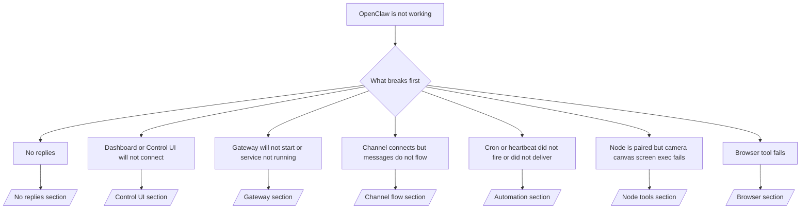

---
read_when:
    - OpenClaw 无法正常工作，而你需要最快的修复路径
    - 你想在深入阅读详细操作手册前，先了解一个初步排查流程
summary: 以症状为先的 OpenClaw 故障排除中心
title: 常规故障排除
x-i18n:
    generated_at: "2026-05-06T03:48:31Z"
    model: gpt-5.5
    provider: openai
    source_hash: 624fa34cda3b440fa9cc636beb3fe6e3608a77a332933fa593097ebc556ac745
    source_path: help/troubleshooting.md
    workflow: 16
---

如果你只有 2 分钟，请把本页当作分诊入口。

## 最初的六十秒

按顺序运行这一套精确步骤：

```bash
openclaw status
openclaw status --all
openclaw gateway probe
openclaw gateway status
openclaw doctor
openclaw channels status --probe
openclaw logs --follow
```

一行内的良好输出：

- `openclaw status` → 显示已配置的渠道，且没有明显的凭证错误。
- `openclaw status --all` → 完整报告存在且可分享。
- `openclaw gateway probe` → 预期的 Gateway 网关目标可达（`Reachable: yes`）。`Capability: ...` 会告诉你探测可证明的凭证级别，而 `Read probe: limited - missing scope: operator.read` 是诊断能力降级，不是连接失败。
- `openclaw gateway status` → `Runtime: running`、`Connectivity probe: ok`，以及合理的 `Capability: ...` 行。如果你还需要读作用域 RPC 证明，请使用 `--require-rpc`。
- `openclaw doctor` → 没有阻塞性的配置/服务错误。
- `openclaw channels status --probe` → 可达的 Gateway 网关会返回实时的逐账号传输状态，以及诸如 `works` 或 `audit ok` 的探测/审计结果；如果 Gateway 网关不可达，该命令会回退到仅配置摘要。
- `openclaw logs --follow` → 活动稳定，没有重复的致命错误。

## Anthropic 长上下文 429

如果你看到：
`HTTP 429: rate_limit_error: Extra usage is required for long context requests`，
请转到 [/gateway/troubleshooting#anthropic-429-extra-usage-required-for-long-context](/zh-CN/gateway/troubleshooting#anthropic-429-extra-usage-required-for-long-context)。

## 本地 OpenAI 兼容后端可直接工作，但在 OpenClaw 中失败

如果你的本地或自托管 `/v1` 后端能响应小型直接
`/v1/chat/completions` 探测，但在 `openclaw infer model run` 或常规
智能体轮次中失败：

1. 如果错误提到 `messages[].content` 预期是字符串，请设置 `models.providers.<provider>.models[].compat.requiresStringContent: true`。
2. 如果后端仍然只在 OpenClaw 智能体轮次中失败，请设置 `models.providers.<provider>.models[].compat.supportsTools: false` 并重试。
3. 如果很小的直接调用仍能工作，但更大的 OpenClaw 提示会让后端崩溃，请将剩余问题视为上游模型/服务器限制，并继续阅读深入运行手册：
   [/gateway/troubleshooting#local-openai-compatible-backend-passes-direct-probes-but-agent-runs-fail](/zh-CN/gateway/troubleshooting#local-openai-compatible-backend-passes-direct-probes-but-agent-runs-fail)

## 插件安装失败并提示缺少 openclaw extensions

如果安装失败并显示 `package.json missing openclaw.extensions`，说明该插件包使用的是 OpenClaw 不再接受的旧结构。

在插件包中修复：

1. 将 `openclaw.extensions` 添加到 `package.json`。
2. 将条目指向构建后的运行时文件（通常是 `./dist/index.js`）。
3. 重新发布插件，然后再次运行 `openclaw plugins install <package>`。

示例：

```json
{
  "name": "@openclaw/my-plugin",
  "version": "1.2.3",
  "openclaw": {
    "extensions": ["./dist/index.js"]
  }
}
```

参考：[插件架构](/zh-CN/plugins/architecture)

## 插件存在但被可疑所有权阻止

如果 `openclaw doctor`、设置或启动警告显示：

```text
blocked plugin candidate: suspicious ownership (... uid=1000, expected uid=0 or root)
plugin present but blocked
```

说明插件文件的 Unix 用户所有者与加载它们的进程不同。不要删除插件配置。请修复文件所有权，或以拥有状态目录的同一用户运行 OpenClaw。

Docker 安装通常以 `node`（uid `1000`）运行。对于默认 Docker 设置，请修复主机绑定挂载：

```bash
sudo chown -R 1000:1000 /path/to/openclaw-config /path/to/openclaw-workspace
openclaw doctor --fix
```

如果你有意以 root 运行 OpenClaw，请改为将托管插件根目录修复为 root 所有权：

```bash
sudo chown -R root:root /path/to/openclaw-config/npm
openclaw doctor --fix
```

更深入的文档：

- [插件路径所有权](/zh-CN/tools/plugin#blocked-plugin-path-ownership)
- [Docker 权限](/zh-CN/install/docker#permissions-and-eacces)

## 决策树



<AccordionGroup>
  <Accordion title="No replies">
    ```bash
    openclaw status
    openclaw gateway status
    openclaw channels status --probe
    openclaw pairing list --channel <channel> [--account <id>]
    openclaw logs --follow
    ```

    良好输出类似：

    - `Runtime: running`
    - `Connectivity probe: ok`
    - `Capability: read-only`、`write-capable` 或 `admin-capable`
    - 你的渠道显示传输已连接，并且在支持的位置，`channels status --probe` 中显示 `works` 或 `audit ok`
    - 发送者显示为已批准（或私信策略是开放/允许名单）

    常见日志特征：

    - `drop guild message (mention required` → 在 Discord 中，提及门控阻止了该消息。
    - `pairing request` → 发送者未获批准，正在等待私信配对批准。
    - 渠道日志中的 `blocked` / `allowlist` → 发送者、房间或群组被过滤。

    深入页面：

    - [/gateway/troubleshooting#no-replies](/zh-CN/gateway/troubleshooting#no-replies)
    - [/channels/troubleshooting](/zh-CN/channels/troubleshooting)
    - [/channels/pairing](/zh-CN/channels/pairing)

  </Accordion>

  <Accordion title="Dashboard or Control UI will not connect">
    ```bash
    openclaw status
    openclaw gateway status
    openclaw logs --follow
    openclaw doctor
    openclaw channels status --probe
    ```

    良好输出类似：

    - `Dashboard: http://...` 会显示在 `openclaw gateway status` 中
    - `Connectivity probe: ok`
    - `Capability: read-only`、`write-capable` 或 `admin-capable`
    - 日志中没有凭证循环

    常见日志特征：

    - `device identity required` → HTTP/非安全上下文无法完成设备凭证验证。
    - `origin not allowed` → 浏览器 `Origin` 未被允许访问 Control UI 的 Gateway 网关目标。
    - `AUTH_TOKEN_MISMATCH` 带重试提示（`canRetryWithDeviceToken=true`）→ 可能会自动进行一次受信设备令牌重试。
    - 该缓存令牌重试会复用与已配对设备令牌一起存储的缓存作用域集合。显式 `deviceToken` / 显式 `scopes` 调用者会保留它们请求的作用域集合。
    - 在异步 Tailscale Serve Control UI 路径上，同一个 `{scope, ip}` 的失败尝试会在限流器记录失败之前串行化，因此第二个并发的错误重试可能已经显示 `retry later`。
    - 来自 localhost 浏览器来源的 `too many failed authentication attempts (retry later)` → 来自同一 `Origin` 的重复失败会被临时锁定；另一个 localhost 来源使用单独的桶。
    - 该重试之后重复出现 `unauthorized` → 令牌/密码错误、凭证模式不匹配，或已配对设备令牌过期。
    - `gateway connect failed:` → UI 指向了错误的 URL/端口，或 Gateway 网关不可达。

    深入页面：

    - [/gateway/troubleshooting#dashboard-control-ui-connectivity](/zh-CN/gateway/troubleshooting#dashboard-control-ui-connectivity)
    - [/web/control-ui](/zh-CN/web/control-ui)
    - [/gateway/authentication](/zh-CN/gateway/authentication)

  </Accordion>

  <Accordion title="Gateway will not start or service installed but not running">
    ```bash
    openclaw status
    openclaw gateway status
    openclaw logs --follow
    openclaw doctor
    openclaw channels status --probe
    ```

    良好输出类似：

    - `Service: ... (loaded)`
    - `Runtime: running`
    - `Connectivity probe: ok`
    - `Capability: read-only`、`write-capable` 或 `admin-capable`

    常见日志特征：

    - `Gateway start blocked: set gateway.mode=local` 或 `existing config is missing gateway.mode` → Gateway 网关模式是远程，或配置文件缺少本地模式标记，应进行修复。
    - `refusing to bind gateway ... without auth` → 非 loopback 绑定缺少有效的 Gateway 网关凭证路径（令牌/密码，或已配置的 trusted-proxy）。
    - `another gateway instance is already listening` 或 `EADDRINUSE` → 端口已被占用。

    深入页面：

    - [/gateway/troubleshooting#gateway-service-not-running](/zh-CN/gateway/troubleshooting#gateway-service-not-running)
    - [/gateway/background-process](/zh-CN/gateway/background-process)
    - [/gateway/configuration](/zh-CN/gateway/configuration)

  </Accordion>

  <Accordion title="Channel connects but messages do not flow">
    ```bash
    openclaw status
    openclaw gateway status
    openclaw logs --follow
    openclaw doctor
    openclaw channels status --probe
    ```

    良好输出类似：

    - 渠道传输已连接。
    - 配对/允许名单检查通过。
    - 在需要的位置检测到了提及。

    常见日志特征：

    - `mention required` → 群组提及门控阻止了处理。
    - `pairing` / `pending` → 私信发送者尚未获批准。
    - `not_in_channel`、`missing_scope`、`Forbidden`、`401/403` → 渠道权限令牌问题。

    深入页面：

    - [/gateway/troubleshooting#channel-connected-messages-not-flowing](/zh-CN/gateway/troubleshooting#channel-connected-messages-not-flowing)
    - [/channels/troubleshooting](/zh-CN/channels/troubleshooting)

  </Accordion>

  <Accordion title="Cron or heartbeat did not fire or did not deliver">
    ```bash
    openclaw status
    openclaw gateway status
    openclaw cron status
    openclaw cron list
    openclaw cron runs --id <jobId> --limit 20
    openclaw logs --follow
    ```

    良好输出类似：

    - `cron.status` 显示已启用并有下一次唤醒。
    - `cron runs` 显示最近的 `ok` 条目。
    - Heartbeat 已启用，且未处于活跃时段之外。

    常见日志特征：

    - `cron: scheduler disabled; jobs will not run automatically` → cron 已禁用。
    - `heartbeat skipped` 带 `reason=quiet-hours` → 处于已配置活跃时段之外。
    - `heartbeat skipped` 带 `reason=empty-heartbeat-file` → `HEARTBEAT.md` 存在，但只包含空白/仅标题脚手架。
    - `heartbeat skipped` 带 `reason=no-tasks-due` → `HEARTBEAT.md` 任务模式已启用，但还没有任何任务间隔到期。
    - `heartbeat skipped` 带 `reason=alerts-disabled` → 所有 Heartbeat 可见性均已禁用（`showOk`、`showAlerts` 和 `useIndicator` 全部关闭）。
    - `requests-in-flight` → 主通道忙；Heartbeat 唤醒被延迟。
    - `unknown accountId` → Heartbeat 投递目标账号不存在。

    深入页面：

    - [/gateway/troubleshooting#cron-and-heartbeat-delivery](/zh-CN/gateway/troubleshooting#cron-and-heartbeat-delivery)
    - [/automation/cron-jobs#troubleshooting](/zh-CN/automation/cron-jobs#troubleshooting)
    - [/gateway/heartbeat](/zh-CN/gateway/heartbeat)

  </Accordion>

  <Accordion title="Node is paired but tool fails camera canvas screen exec">
    ```bash
    openclaw status
    openclaw gateway status
    openclaw nodes status
    openclaw nodes describe --node <idOrNameOrIp>
    openclaw logs --follow
    ```

    良好输出类似：

    - 节点已列为已连接，并以 `node` 角色完成配对。
    - 你正在调用的命令存在相应能力。
    - 该工具的权限状态为已授予。

    常见日志特征：

    - `NODE_BACKGROUND_UNAVAILABLE` → 将节点应用切到前台。
    - `*_PERMISSION_REQUIRED` → OS 权限被拒绝或缺失。
    - `SYSTEM_RUN_DENIED: approval required` → exec 审批正在等待处理。
    - `SYSTEM_RUN_DENIED: allowlist miss` → 命令不在 exec 允许列表中。

    深入页面：

    - [/gateway/troubleshooting#node-paired-tool-fails](/zh-CN/gateway/troubleshooting#node-paired-tool-fails)
    - [/nodes/troubleshooting](/zh-CN/nodes/troubleshooting)
    - [/tools/exec-approvals](/zh-CN/tools/exec-approvals)

  </Accordion>

  <Accordion title="Exec 突然要求审批">
    ```bash
    openclaw config get tools.exec.host
    openclaw config get tools.exec.security
    openclaw config get tools.exec.ask
    openclaw gateway restart
    ```

    发生了什么变化：

    - 如果未设置 `tools.exec.host`，默认值是 `auto`。
    - 当沙箱运行时处于活动状态时，`host=auto` 解析为 `sandbox`，否则解析为 `gateway`。
    - `host=auto` 只负责路由；无提示的 “YOLO” 行为来自 Gateway 网关/节点上的 `security=full` 加 `ask=off`。
    - 在 `gateway` 和 `node` 上，未设置的 `tools.exec.security` 默认值是 `full`。
    - 未设置的 `tools.exec.ask` 默认值是 `off`。
    - 结果：如果你看到了审批请求，说明某个主机本地策略或每会话策略把 exec 收紧到了当前默认值之外。

    恢复当前默认的免审批行为：

    ```bash
    openclaw config set tools.exec.host gateway
    openclaw config set tools.exec.security full
    openclaw config set tools.exec.ask off
    openclaw gateway restart
    ```

    更安全的替代方案：

    - 如果你只是想要稳定的主机路由，只设置 `tools.exec.host=gateway`。
    - 如果你想使用主机 exec，但仍想在允许列表未命中时进行审核，请使用 `security=allowlist` 和 `ask=on-miss`。
    - 如果你想让 `host=auto` 重新解析回 `sandbox`，请启用沙箱模式。

    常见日志特征：

    - `Approval required.` → 命令正在等待 `/approve ...`。
    - `SYSTEM_RUN_DENIED: approval required` → 节点主机 exec 审批正在等待处理。
    - `exec host=sandbox requires a sandbox runtime for this session` → 隐式/显式选择了沙箱，但沙箱模式已关闭。

    深入页面：

    - [/tools/exec](/zh-CN/tools/exec)
    - [/tools/exec-approvals](/zh-CN/tools/exec-approvals)
    - [/gateway/security#what-the-audit-checks-high-level](/zh-CN/gateway/security#what-the-audit-checks-high-level)

  </Accordion>

  <Accordion title="浏览器工具失败">
    ```bash
    openclaw status
    openclaw gateway status
    openclaw browser status
    openclaw logs --follow
    openclaw doctor
    ```

    正常输出类似于：

    - 浏览器状态显示 `running: true` 以及选定的浏览器/配置文件。
    - `openclaw` 启动，或者 `user` 可以看到本地 Chrome 标签页。

    常见日志特征：

    - `unknown command "browser"` 或 `unknown command 'browser'` → 设置了 `plugins.allow`，且其中不包含 `browser`。
    - `Failed to start Chrome CDP on port` → 本地浏览器启动失败。
    - `browser.executablePath not found` → 配置的二进制路径错误。
    - `browser.cdpUrl must be http(s) or ws(s)` → 配置的 CDP URL 使用了不受支持的协议。
    - `browser.cdpUrl has invalid port` → 配置的 CDP URL 包含无效或超出范围的端口。
    - `No Chrome tabs found for profile="user"` → Chrome MCP 附加配置文件没有打开的本地 Chrome 标签页。
    - `Remote CDP for profile "<name>" is not reachable` → 无法从此主机访问配置的远程 CDP 端点。
    - `Browser attachOnly is enabled ... not reachable` 或 `Browser attachOnly is enabled and CDP websocket ... is not reachable` → 仅附加配置文件没有可用的 CDP 目标。
    - 在仅附加或远程 CDP 配置文件上出现过期的视口/深色模式/语言区域/离线覆盖 → 运行 `openclaw browser stop --browser-profile <name>` 关闭活动控制会话并释放仿真状态，而无需重启 Gateway 网关。

    深入页面：

    - [/gateway/troubleshooting#browser-tool-fails](/zh-CN/gateway/troubleshooting#browser-tool-fails)
    - [/tools/browser#missing-browser-command-or-tool](/zh-CN/tools/browser#missing-browser-command-or-tool)
    - [/tools/browser-linux-troubleshooting](/zh-CN/tools/browser-linux-troubleshooting)
    - [/tools/browser-wsl2-windows-remote-cdp-troubleshooting](/zh-CN/tools/browser-wsl2-windows-remote-cdp-troubleshooting)

  </Accordion>

</AccordionGroup>

## 相关

- [常见问题](/zh-CN/help/faq) — 常见问题
- [Gateway 网关故障排除](/zh-CN/gateway/troubleshooting) — Gateway 网关特定问题
- [Doctor](/zh-CN/gateway/doctor) — 自动健康检查和修复
- [渠道故障排除](/zh-CN/channels/troubleshooting) — 渠道连接问题
- [自动化故障排除](/zh-CN/automation/cron-jobs#troubleshooting) — cron 和 Heartbeat 问题
