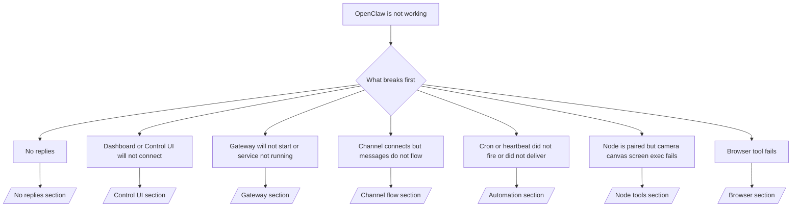

---
read_when:
    - OpenClaw 无法正常工作，而你需要最快的修复路径
    - 你希望先有一个分流排查流程，再深入详细运行手册
summary: OpenClaw 症状优先故障排除中心
title: 常规故障排查
x-i18n:
    generated_at: "2026-07-05T11:24:53Z"
    model: gpt-5.5
    postprocess_version: locale-links-v1
    provider: openai
    source_hash: db50e0cdf4d11f3aa6196be445358d904a2b9c40c89243f1b124c77167f6dd85
    source_path: help/troubleshooting.md
    workflow: 16
---

分诊入口。2 分钟完成诊断，然后跳转到深入页面。

## 最初的六十秒

按顺序运行此梯级检查：

```bash
openclaw status
openclaw status --all
openclaw gateway probe
openclaw gateway status
openclaw doctor
openclaw channels status --probe
openclaw logs --follow
```

良好输出，每项一行：

- `openclaw status` 显示已配置的渠道，没有凭证错误。
- `openclaw status --all` 生成一份完整、可共享的报告。
- `openclaw gateway probe` 显示 `Reachable: yes`。`Capability: ...` 是探测已证明的凭证级别；`Read probe: limited - missing scope:
operator.read` 表示诊断降级，不是连接失败。
- `openclaw gateway status` 显示 `Runtime: running`、`Connectivity probe:
ok`，以及合理的 `Capability: ...`。添加 `--require-rpc` 还会要求读权限范围的 RPC 证明。
- `openclaw doctor` 报告没有阻塞性的配置/服务错误。
- `openclaw channels status --probe` 在 Gateway 网关可达时返回实时的按账号传输状态（`works` / `audit ok`）；不可达时回退为仅配置摘要。
- `openclaw logs --follow` 显示稳定活动，没有重复的致命错误。

## 助手感觉受限或缺少工具

检查实际生效的工具配置文件：

```bash
openclaw status
openclaw status --all
openclaw doctor
```

常见原因：

- `tools.profile: "minimal"` 只允许 `session_status`。
- `tools.profile: "messaging"` 范围较窄，用于仅聊天的智能体。
- `tools.profile: "coding"` 是新本地配置的默认值（仓库、文件、shell 和运行时工作）。
- `tools.profile: "full"` 移除配置文件限制；仅限受信任的操作员控制智能体使用。
- 按智能体配置的 `agents.list[].tools` 会为某个智能体收窄或扩展根配置文件。

修改配置文件，重启或重新加载 Gateway 网关，然后用 `openclaw status --all` 重新检查。完整配置文件/组表：[工具配置文件](/zh-CN/gateway/config-tools#tool-profiles)。

## Anthropic 长上下文 429

`HTTP 429: rate_limit_error: Extra usage is required for long context requests`
→ [Anthropic 429 长上下文需要额外用量](/zh-CN/gateway/troubleshooting#anthropic-429-extra-usage-required-for-long-context)。

## 本地 OpenAI 兼容后端可直接工作，但在 OpenClaw 中失败

你的本地/自托管 `/v1` 后端会响应直接的 `/v1/chat/completions` 探测，但在 `openclaw infer model run` 或普通智能体轮次中失败：

1. 错误提到 `messages[].content` 需要字符串：设置 `models.providers.<provider>.models[].compat.requiresStringContent: true`。
2. 仍然只在 OpenClaw 智能体轮次中失败：设置 `models.providers.<provider>.models[].compat.supportsTools: false` 并重试。
3. 微型直接调用可工作，但较大的 OpenClaw prompt 会让后端崩溃：这是上游模型/服务器限制，不是 OpenClaw bug。继续阅读[本地 OpenAI 兼容后端通过直接探测，但智能体运行失败](/zh-CN/gateway/troubleshooting#local-openai-compatible-backend-passes-direct-probes-but-agent-runs-fail)。

## 插件安装失败并提示缺少 openclaw extensions

`package.json missing openclaw.extensions` 表示插件包使用了 OpenClaw 不再接受的形状。

在插件包中修复：

1. 将 `openclaw.extensions` 添加到 `package.json`，指向已构建的运行时文件（通常是 `./dist/index.js`）。
2. 重新发布，然后再次运行 `openclaw plugins install <package>`。

```json
{
  "name": "@openclaw/my-plugin",
  "version": "1.2.3",
  "openclaw": {
    "extensions": ["./dist/index.js"]
  }
}
```

参考：[插件架构](/zh-CN/plugins/architecture)

## 安装策略阻止插件安装或更新

更新完成，但插件过旧、被禁用，或显示 `blocked by install
policy`、`install policy failed closed`，或 `Disabled "<plugin>" after plugin
update failure`：检查 `security.installPolicy`。

安装策略会在插件安装和更新时运行。`@openclaw/*` 插件版本通常随 OpenClaw 发布版本推进，因此 OpenClaw 更新可能需要在更新后同步期间进行匹配的插件更新。

避免使用这些策略形状，除非你也维护匹配的升级规则：

- 将 OpenClaw 自有插件冻结到某个精确的旧版本（例如只允许 `@openclaw/*@2026.5.3`）。
- 仅按来源类型阻止（每个 npm、网络，或 `request.mode:
"update"` 请求）。
- 将策略命令视为可选：启用 `security.installPolicy` 后，缺失、缓慢、不可读或因权限被阻止的策略可执行文件都会失败关闭。
- 批准版本时不检查请求的 `openclawVersion` 与插件候选元数据是否匹配。

优先使用允许受信任的 `@openclaw/*` 更新并与当前宿主兼容的规则，而不是永久固定到一个发布版本。如果你默认阻止 npm，请为你使用的插件 ID 添加窄范围例外，并对 `request.mode: "update"` 应用与安装相同的信任规则。

恢复：

```bash
openclaw doctor --deep
openclaw plugins update --all
openclaw status --all
```

如果策略有意严格，请在受信任升级窗口内放宽它，重新运行 `openclaw plugins update --all`，然后恢复更严格的规则。如果更新失败禁用了插件，请先检查再重新启用：

```bash
openclaw plugins inspect <plugin-id> --runtime --json
openclaw plugins enable <plugin-id>
```

参考：[操作员安装策略](/zh-CN/tools/skills-config#operator-install-policy-securityinstallpolicy)

## 插件存在但被可疑所有权阻止

`openclaw doctor`、设置或启动警告显示：

```text
blocked plugin candidate: suspicious ownership (... uid=1000, expected uid=0 or root)
plugin present but blocked
```

插件文件归属于与加载它们的进程不同的 Unix 用户。不要移除插件配置；请修复文件所有权，或以拥有状态目录的用户运行 OpenClaw。

Docker 安装以 `node`（uid `1000`）运行。修复宿主机绑定挂载：

```bash
sudo chown -R 1000:1000 /path/to/openclaw-config /path/to/openclaw-workspace
openclaw doctor --fix
```

如果你有意以 root 运行 OpenClaw，请改为修复托管插件根目录：

```bash
sudo chown -R root:root /path/to/openclaw-config/npm
openclaw doctor --fix
```

更深入的文档：[被阻止的插件路径所有权](/zh-CN/tools/plugin#blocked-plugin-path-ownership)、[Docker：权限和 EACCES](/zh-CN/install/docker#shell-helpers-optional)

## 决策树



<AccordionGroup>
  <Accordion title="No replies">
    ```bash
    openclaw status
    openclaw gateway status
    openclaw channels status --probe
    openclaw pairing list --channel <channel> [--account <id>]
    openclaw logs --follow
    ```

    良好输出：

    - `Runtime: running`
    - `Connectivity probe: ok`
    - `Capability: read-only`、`write-capable` 或 `admin-capable`
    - 渠道显示传输已连接，并且在支持的地方，`channels status --probe` 中有 `works` 或 `audit ok`
    - 发送者已获批准（或私信策略为开放/允许列表）

    日志特征：

    - `drop guild message (mention required` → Discord 提及门控阻止了消息。
    - `pairing request` → 发送者未获批准，正在等待私信配对批准。
    - 渠道日志中的 `blocked` / `allowlist` → 发送者、房间或群组被过滤。

    深入页面：[无回复](/zh-CN/gateway/troubleshooting#no-replies)、[渠道故障排查](/zh-CN/channels/troubleshooting)、[配对](/zh-CN/channels/pairing)

  </Accordion>

  <Accordion title="Dashboard or Control UI will not connect">
    ```bash
    openclaw status
    openclaw gateway status
    openclaw logs --follow
    openclaw doctor
    openclaw channels status --probe
    ```

    良好输出：

    - `openclaw gateway status` 中显示 `Dashboard: http://...`
    - `Connectivity probe: ok`
    - `Capability: read-only`、`write-capable` 或 `admin-capable`
    - 日志中没有凭证循环

    日志特征：

    - `device identity required` → HTTP/非安全上下文无法完成设备凭证。
    - `origin not allowed` → 浏览器 `Origin` 不允许用于 Control UI Gateway 网关目标。
    - `AUTH_TOKEN_MISMATCH` 且带有 `canRetryWithDeviceToken=true` → 可能会自动发生一次受信任的设备令牌重试，复用已配对令牌缓存的权限范围。
    - 此后重复出现 `unauthorized` → 令牌/密码错误、凭证模式不匹配，或已配对设备令牌过期。
    - `too many failed authentication attempts (retry later)` → 来自该浏览器 `Origin` 的重复失败会被临时锁定；其他 localhost 来源使用独立桶。关于 Tailscale Serve 并发重试细节，请参阅 [Dashboard/Control UI 连接](/zh-CN/gateway/troubleshooting#dashboard-control-ui-connectivity)。
    - `gateway connect failed:` → UI 指向错误的 URL/端口，或 Gateway 网关不可达。

    深入页面：[Dashboard/Control UI 连接](/zh-CN/gateway/troubleshooting#dashboard-control-ui-connectivity)、[Control UI](/zh-CN/web/control-ui)、[身份验证](/zh-CN/gateway/authentication)

  </Accordion>

  <Accordion title="Gateway will not start or service installed but not running">
    ```bash
    openclaw status
    openclaw gateway status
    openclaw logs --follow
    openclaw doctor
    openclaw channels status --probe
    ```

    良好输出：

    - `Service: ... (loaded)`
    - `Runtime: running`
    - `Connectivity probe: ok`
    - `Capability: read-only`、`write-capable` 或 `admin-capable`

    日志特征：

    - `Gateway start blocked: set gateway.mode=local` 或 `existing config is missing gateway.mode` → Gateway 网关模式为远程，或配置缺少本地模式标记，需要修复。
    - `refusing to bind gateway ... without auth` → 在没有有效凭证路径（令牌/密码，或已配置的受信任代理）的情况下绑定到非 loopback。
    - `another gateway instance is already listening` 或 `EADDRINUSE` → 端口已被占用。

    深入页面：[Gateway 网关服务未运行](/zh-CN/gateway/troubleshooting#gateway-service-not-running)、[后台进程](/zh-CN/gateway/background-process)、[配置](/zh-CN/gateway/configuration)

  </Accordion>

  <Accordion title="Channel connects but messages do not flow">
    ```bash
    openclaw status
    openclaw gateway status
    openclaw logs --follow
    openclaw doctor
    openclaw channels status --probe
    ```

    良好输出：

    - 渠道传输已连接。
    - 配对/允许列表检查通过。
    - 在需要的地方检测到提及。

    日志特征：

    - `mention required` → 群组提及门控阻止了处理。
    - `pairing` / `pending` → 私信发送者尚未获批准。
    - `not_in_channel`、`missing_scope`、`Forbidden`、`401/403` → 渠道权限令牌问题。

    深入页面：[渠道已连接，但消息未流动](/zh-CN/gateway/troubleshooting#channel-connected-messages-not-flowing)、[渠道故障排查](/zh-CN/channels/troubleshooting)

  </Accordion>

  <Accordion title="Cron or heartbeat did not fire or did not deliver">
    ```bash
    openclaw status
    openclaw gateway status
    openclaw cron status
    openclaw cron list
    openclaw cron runs --id <jobId> --limit 20
    openclaw logs --follow
    ```

    良好输出：

    - `cron status` 显示调度器已启用，并有下一次唤醒。
    - `cron runs` 显示最近的 `ok` 条目。
    - Heartbeat 已启用，并且处于活跃时段内。

    日志特征：

    - `cron: scheduler disabled; jobs will not run automatically` → cron 已禁用。
    - `heartbeat skipped` reason `quiet-hours` → 不在配置的活跃时段内。
    - `heartbeat skipped` reason `empty-heartbeat-file` → `HEARTBEAT.md` 存在，但只包含空白、注释、标题、围栏或空检查清单脚手架。
    - `heartbeat skipped` reason `no-tasks-due` → 任务模式处于活跃状态，但尚未到任何任务间隔。
    - `heartbeat skipped` reason `alerts-disabled` → `showOk`、`showAlerts` 和 `useIndicator` 都已关闭。
    - `requests-in-flight` → 主通道繁忙；Heartbeat 唤醒已延后。
    - `unknown accountId` → Heartbeat 递送目标账号不存在。

    深入页面：[Cron 和 Heartbeat 递送](/zh-CN/gateway/troubleshooting#cron-and-heartbeat-delivery)、[定时任务：故障排查](/zh-CN/automation/cron-jobs#troubleshooting)、[Heartbeat](/zh-CN/gateway/heartbeat)

  </Accordion>

  <Accordion title="节点已配对但工具 camera canvas screen exec 失败">
    ```bash
    openclaw status
    openclaw gateway status
    openclaw nodes status
    openclaw nodes describe --node <idOrNameOrIp>
    openclaw logs --follow
    ```

    正常输出：

    - 节点列为已连接，并且已为角色 `node` 配对。
    - 你正在调用的命令具备对应能力。
    - 该工具的权限状态为已授予。

    日志特征：

    - `NODE_BACKGROUND_UNAVAILABLE` → 将节点应用置于前台。
    - `*_PERMISSION_REQUIRED` → OS 权限被拒绝或缺失。
    - `SYSTEM_RUN_DENIED: approval required` → Exec 审批待处理。
    - `SYSTEM_RUN_DENIED: allowlist miss` → 命令不在 Exec 允许列表中。

    深入页面：[节点已配对，工具失败](/zh-CN/gateway/troubleshooting#node-paired-tool-fails)、[节点故障排查](/zh-CN/nodes/troubleshooting)、[Exec 审批](/zh-CN/tools/exec-approvals)

  </Accordion>

  <Accordion title="Exec 突然要求审批">
    ```bash
    openclaw config get tools.exec.host
    openclaw config get tools.exec.security
    openclaw config get tools.exec.ask
    openclaw gateway restart
    ```

    发生了什么变化：

    - 未设置的 `tools.exec.host` 默认值为 `auto`；当沙箱运行时处于活跃状态时，它会解析为 `sandbox`，否则解析为 `gateway`。
    - `host=auto` 只负责路由；无提示行为来自 Gateway 网关/节点上的
      `security=full` 加 `ask=off`。
    - 未设置的 `tools.exec.security` 在 `gateway`/`node` 上默认值为 `full`。
    - 未设置的 `tools.exec.ask` 默认值为 `off`。
    - 如果你看到了审批，说明某些主机本地或按会话配置的策略
      将 Exec 收紧到了这些默认值之外。

    恢复当前的无审批默认值：

    ```bash
    openclaw config set tools.exec.host gateway
    openclaw config set tools.exec.security full
    openclaw config set tools.exec.ask off
    openclaw gateway restart
    ```

    更安全的替代方案：

    - 只设置 `tools.exec.host=gateway`，以获得稳定的主机路由。
    - 对主机 Exec 使用 `security=allowlist` 和 `ask=on-miss`，在
      允许列表未命中时进行审查。
    - 启用沙箱模式，让 `host=auto` 重新解析为 `sandbox`。

    日志特征：

    - `Approval required.` → 命令正在等待 `/approve ...`。
    - `SYSTEM_RUN_DENIED: approval required` → 节点主机 Exec 审批待处理。
    - `exec host=sandbox requires a sandbox runtime for this session` → 已隐式/显式选择沙箱，但沙箱模式已关闭。

    深入页面：[Exec](/zh-CN/tools/exec)、[Exec 审批](/zh-CN/tools/exec-approvals)、[安全性：审计检查内容](/zh-CN/gateway/security#what-the-audit-checks-high-level)

  </Accordion>

  <Accordion title="浏览器工具失败">
    ```bash
    openclaw status
    openclaw gateway status
    openclaw browser status
    openclaw logs --follow
    openclaw doctor
    ```

    正常输出：

    - 浏览器状态显示 `running: true` 以及已选择的浏览器/配置文件。
    - `openclaw` 配置文件会启动，或 `user` 配置文件可以看到本地 Chrome 标签页。

    日志特征：

    - `unknown command "browser"` → 已设置 `plugins.allow`，且其中排除了 `browser`。
    - `Failed to start Chrome CDP on port` → 本地浏览器启动失败。
    - `browser.executablePath not found` → 配置的二进制文件路径错误。
    - `browser.cdpUrl must be http(s) or ws(s)` → 配置的 CDP URL 使用了不受支持的 scheme。
    - `browser.cdpUrl has invalid port` → 配置的 CDP URL 端口错误或超出范围。
    - `No Chrome tabs found for profile="user"` → Chrome MCP 附加配置文件没有已打开的本地 Chrome 标签页。
    - `Remote CDP for profile "<name>" is not reachable` → 此主机无法访问配置的远程 CDP 端点。
    - `Browser attachOnly is enabled ... not reachable` → 仅附加配置文件没有可用的实时 CDP 目标。
    - 仅附加或远程 CDP 配置文件上存在陈旧的视口/深色模式/区域设置/离线覆盖 → 运行 `openclaw browser stop --browser-profile <name>` 关闭控制会话，并在不重启 Gateway 网关的情况下释放模拟状态。

    深入页面：[浏览器工具失败](/zh-CN/gateway/troubleshooting#browser-tool-fails)、[缺少浏览器命令或工具](/zh-CN/tools/browser#missing-browser-command-or-tool)、[浏览器：Linux 故障排查](/zh-CN/tools/browser-linux-troubleshooting)、[浏览器：WSL2/Windows 远程 CDP 故障排查](/zh-CN/tools/browser-wsl2-windows-remote-cdp-troubleshooting)

  </Accordion>

</AccordionGroup>

## 相关内容

- [常见问题](/zh-CN/help/faq) — 常见问题
- [Gateway 网关故障排查](/zh-CN/gateway/troubleshooting) — Gateway 网关特定问题
- [Doctor](/zh-CN/gateway/doctor) — 自动健康检查和修复
- [渠道故障排查](/zh-CN/channels/troubleshooting) — 渠道连接问题
- [定时任务：故障排查](/zh-CN/automation/cron-jobs#troubleshooting) — cron 和 Heartbeat 问题
