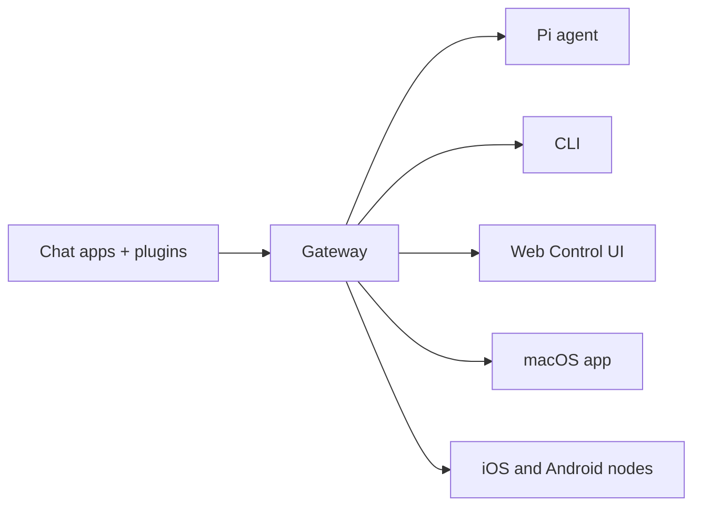

---
read_when:
    - 向新用户介绍 OpenClaw
summary: OpenClaw 是一个适用于任意操作系统的多渠道 AI 智能体 Gateway 网关。
title: OpenClaw
x-i18n:
    generated_at: "2026-04-05T08:26:00Z"
    model: gpt-5.4
    provider: openai
    source_hash: 9c29a8d9fc41a94b650c524bb990106f134345560e6d615dac30e8815afff481
    source_path: index.md
    workflow: 15
---

# OpenClaw 🦞

<p align="center">
    
    
</p>

> _“EXFOLIATE! EXFOLIATE!”_ — 可能是一只太空龙虾说的

<p align="center">
  <strong>适用于 Discord、Google Chat、iMessage、Matrix、Microsoft Teams、Signal、Slack、Telegram、WhatsApp、Zalo 等更多平台的任意操作系统 AI 智能体 Gateway 网关。</strong><br />
  发一条消息，就能从你的口袋里收到智能体回复。通过一个 Gateway 网关运行内置渠道、内置渠道插件、WebChat 和移动节点。
</p>

<Columns>
  <Card title="Get Started" href="/start/getting-started" icon="rocket">
    安装 OpenClaw，并在几分钟内启动 Gateway 网关。
  </Card>
  <Card title="Run Onboarding" href="/start/wizard" icon="sparkles">
    使用 `openclaw onboard` 和配对流程进行引导式设置。
  </Card>
  <Card title="Open the Control UI" href="/web/control-ui" icon="layout-dashboard">
    启动浏览器仪表板，用于聊天、配置和会话管理。
  </Card>
</Columns>

## OpenClaw 是什么？

OpenClaw 是一个**自托管 Gateway 网关**，可将你喜爱的聊天应用和渠道表面——包括内置渠道，以及内置或外部渠道插件（如 Discord、Google Chat、iMessage、Matrix、Microsoft Teams、Signal、Slack、Telegram、WhatsApp、Zalo 等）——连接到像 Pi 这样的 AI 编码智能体。你只需在自己的机器（或服务器）上运行一个 Gateway 网关进程，它就会成为你的消息应用与始终可用的 AI 助手之间的桥梁。

**它适合谁？** 适合开发者和高级用户，他们希望拥有一个可以随时随地发消息的个人 AI 助手——同时又不放弃对自己数据的控制，也不依赖托管服务。

**它有什么不同？**

- **自托管**：运行在你的硬件上，遵循你的规则
- **多渠道**：一个 Gateway 网关可同时服务内置渠道以及内置或外部渠道插件
- **智能体原生**：专为支持工具使用、会话、记忆和多智能体路由的编码智能体打造
- **开源**：采用 MIT 许可证，由社区驱动

**你需要什么？** Node 24（推荐），或为了兼容性使用 Node 22 LTS（`22.14+`），你所选提供商的一个 API key，以及 5 分钟时间。为了获得最佳质量与安全性，请使用最新一代中能力最强的模型。

## 工作原理



Gateway 网关是会话、路由和渠道连接的唯一事实来源。

## 关键能力

<Columns>
  <Card title="Multi-channel gateway" icon="network">
    通过单个 Gateway 网关进程连接 Discord、iMessage、Signal、Slack、Telegram、WhatsApp、WebChat 等更多渠道。
  </Card>
  <Card title="Plugin channels" icon="plug">
    内置插件可在当前常规版本中添加 Matrix、Nostr、Twitch、Zalo 等更多渠道。
  </Card>
  <Card title="Multi-agent routing" icon="route">
    按智能体、工作区或发送者实现隔离会话。
  </Card>
  <Card title="Media support" icon="image">
    发送和接收图片、音频和文档。
  </Card>
  <Card title="Web Control UI" icon="monitor">
    用于聊天、配置、会话和节点的浏览器仪表板。
  </Card>
  <Card title="Mobile nodes" icon="smartphone">
    配对 iOS 和 Android 节点，支持 Canvas、相机和语音工作流。
  </Card>
</Columns>

## 快速开始

<Steps>
  <Step title="Install OpenClaw">
    ```bash
    npm install -g openclaw@latest
    ```
  </Step>
  <Step title="Onboard and install the service">
    ```bash
    openclaw onboard --install-daemon
    ```
  </Step>
  <Step title="Chat">
    在浏览器中打开 Control UI 并发送一条消息：

    ```bash
    openclaw dashboard
    ```

    或连接一个渠道（[Telegram](/channels/telegram) 最快），然后通过手机聊天。

  </Step>
</Steps>

需要完整安装和开发环境设置？请参阅[入门指南](/start/getting-started)。

## 仪表板

在 Gateway 网关启动后打开浏览器中的 Control UI。

- 本地默认地址：[http://127.0.0.1:18789/](http://127.0.0.1:18789/)
- 远程访问：[Web 表面](/web) 和 [Tailscale](/gateway/tailscale)

<p align="center">
  
</p>

## 配置（可选）

配置位于 `~/.openclaw/openclaw.json`。

- 如果你**什么都不做**，OpenClaw 会使用内置的 Pi 二进制文件，以 RPC 模式运行，并为每个发送者创建独立会话。
- 如果你想更严格地收紧权限，请从 `channels.whatsapp.allowFrom` 和（针对群组）提及规则开始。

示例：

```json5
{
  channels: {
    whatsapp: {
      allowFrom: ["+15555550123"],
      groups: { "*": { requireMention: true } },
    },
  },
  messages: { groupChat: { mentionPatterns: ["@openclaw"] } },
}
```

## 从这里开始

<Columns>
  <Card title="Docs hubs" href="/start/hubs" icon="book-open">
    所有文档和指南，按使用场景组织。
  </Card>
  <Card title="Configuration" href="/gateway/configuration" icon="settings">
    核心 Gateway 网关设置、令牌和提供商配置。
  </Card>
  <Card title="Remote access" href="/gateway/remote" icon="globe">
    SSH 和 tailnet 访问模式。
  </Card>
  <Card title="Channels" href="/channels/telegram" icon="message-square">
    Feishu、Microsoft Teams、WhatsApp、Telegram、Discord 等渠道的专用设置。
  </Card>
  <Card title="Nodes" href="/nodes" icon="smartphone">
    支持配对、Canvas、相机和设备操作的 iOS 和 Android 节点。
  </Card>
  <Card title="Help" href="/help" icon="life-buoy">
    常见修复方法和故障排除入口。
  </Card>
</Columns>

## 了解更多

<Columns>
  <Card title="Full feature list" href="/concepts/features" icon="list">
    完整的渠道、路由和媒体能力。
  </Card>
  <Card title="Multi-agent routing" href="/concepts/multi-agent" icon="route">
    工作区隔离和按智能体划分的会话。
  </Card>
  <Card title="Security" href="/gateway/security" icon="shield">
    令牌、允许列表和安全控制。
  </Card>
  <Card title="Troubleshooting" href="/gateway/troubleshooting" icon="wrench">
    Gateway 网关诊断和常见错误。
  </Card>
  <Card title="About and credits" href="/reference/credits" icon="info">
    项目起源、贡献者和许可证。
  </Card>
</Columns>
