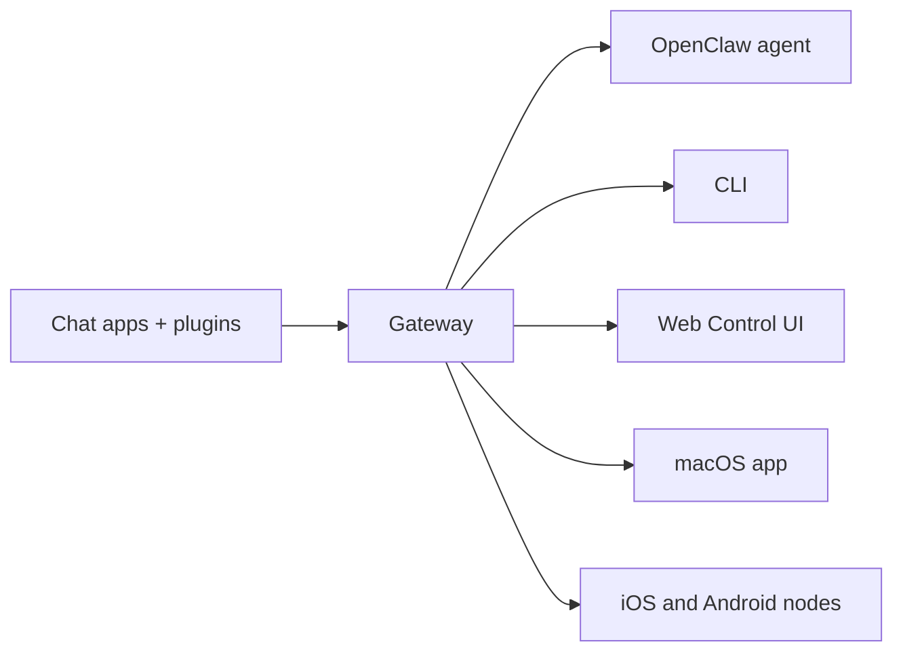

---
read_when:
    - 向新手介绍 OpenClaw
summary: OpenClaw 是一个可在任意操作系统上运行的 AI 智能体多渠道网关。
title: OpenClaw
x-i18n:
    generated_at: "2026-07-05T11:23:44Z"
    model: gpt-5.5
    postprocess_version: locale-links-v1
    provider: openai
    source_hash: 6840275ad22e3c260c27f019264e49637562d0c095dc26ed84c110a4b12613f1
    source_path: index.md
    workflow: 16
---

# OpenClaw 🦞

<p align="center">
    
    
</p>

> _“EXFOLIATE! EXFOLIATE!”_ — 大概是一只太空龙虾

<p align="center">
  <strong>适用于任意 OS 的 Gateway 网关，让 AI 智能体跨 Discord、Google Chat、iMessage、Matrix、Microsoft Teams、Signal、Slack、Telegram、WhatsApp、Zalo 等平台工作。</strong><br />
  发送一条消息，就能从口袋里收到智能体回复。用一个 Gateway 网关运行频道插件、WebChat 和移动节点。
</p>

<Columns>
  <Card title="开始使用" href="/zh-CN/start/getting-started" icon="rocket">
    安装 OpenClaw，并在几分钟内启动 Gateway 网关。
  </Card>
  <Card title="运行新手引导" href="/zh-CN/start/wizard" icon="list-checks">
    通过 `openclaw onboard` 和配对流程进行引导式设置。
  </Card>
  <Card title="打开 Control UI" href="/zh-CN/web/control-ui" icon="layout-dashboard">
    启动用于聊天、配置和会话的浏览器仪表板。
  </Card>
</Columns>

## OpenClaw 是什么？

OpenClaw 是一个**自托管 Gateway 网关**，可通过频道插件把你常用的聊天应用 — Discord、Google Chat、iMessage、Matrix、Microsoft Teams、Signal、Slack、Telegram、WhatsApp、Zalo 等 — 连接到 AI 编码智能体。你在自己的机器（或服务器）上运行一个 Gateway 网关进程，它就会成为你的消息应用和始终可用的 AI 助手之间的桥梁。

**它适合谁？** 适合希望拥有可从任何地方发消息访问的个人 AI 助手，同时不放弃数据控制权、也不依赖托管服务的开发者和高级用户。

**它有什么不同？**

- **自托管**：运行在你的硬件上，遵循你的规则
- **多渠道**：一个 Gateway 网关可同时服务每个已配置的频道插件
- **智能体原生**：为支持工具使用、会话、记忆和多智能体路由的编码智能体而构建
- **开源**：MIT 许可，社区驱动

**你需要什么？** Node 24（推荐），或用于兼容性的 Node 22 LTS (`22.19+`)、所选提供商的 API key，以及 5 分钟。为获得最佳质量和安全性，请使用可用的最强最新一代模型。

## 工作原理



Gateway 网关是会话、路由和频道连接的唯一可信来源。

## 核心能力

<Columns>
  <Card title="多渠道 Gateway 网关" icon="network" href="/zh-CN/channels">
    通过单个 Gateway 网关进程支持 Discord、iMessage、Signal、Slack、Telegram、WhatsApp、WebChat 等。
  </Card>
  <Card title="插件渠道" icon="plug" href="/zh-CN/tools/plugin">
    频道插件可添加 Matrix、Nostr、Twitch、Zalo 等；官方插件按需安装。
  </Card>
  <Card title="多智能体路由" icon="route" href="/zh-CN/concepts/multi-agent">
    按智能体、工作区或发送者隔离会话。
  </Card>
  <Card title="媒体支持" icon="image" href="/zh-CN/nodes/images">
    发送和接收图片、音频和文档。
  </Card>
  <Card title="Web Control UI" icon="monitor" href="/zh-CN/web/control-ui">
    用于聊天、配置、会话和节点的浏览器仪表板。
  </Card>
  <Card title="移动节点" icon="smartphone" href="/zh-CN/nodes">
    配对 iOS 和 Android 节点，用于 Canvas、相机和语音工作流。
  </Card>
</Columns>

## 快速开始

<Steps>
  <Step title="安装 OpenClaw">
    ```bash
    npm install -g openclaw@latest
    ```
  </Step>
  <Step title="新手引导并安装服务">
    ```bash
    openclaw onboard --install-daemon
    ```
  </Step>
  <Step title="聊天">
    在浏览器中打开 Control UI 并发送消息：

    ```bash
    openclaw dashboard
    ```

    或连接一个渠道（[Telegram](/zh-CN/channels/telegram) 最快），然后从手机聊天。

  </Step>
</Steps>

需要完整安装和开发设置？请参阅[入门指南](/zh-CN/start/getting-started)。

## 仪表板

Gateway 网关启动后，打开浏览器 Control UI。

- 本地默认地址：[http://127.0.0.1:18789/](http://127.0.0.1:18789/)
- 远程访问：[Web 界面](/zh-CN/web)和 [Tailscale](/zh-CN/gateway/tailscale)

<p align="center">
  
</p>

## 配置（可选）

配置位于 `~/.openclaw/openclaw.json`。

- 如果你**什么都不做**，OpenClaw 会使用内置的 OpenClaw agent runtime；私信共享智能体的主会话，每个群聊都有自己的会话。
- 如果你想收紧访问控制，请从 `channels.whatsapp.allowFrom` 和（针对群组的）提及规则开始。

示例：

```json5
{
  channels: {
    whatsapp: {
      allowFrom: ["+15555550123"],
      groups: { "*": { requireMention: true } },
    },
  },
  messages: { groupChat: { mentionPatterns: ["@openclaw"] } },
}
```

## 从这里开始

<Columns>
  <Card title="文档中心" href="/zh-CN/start/hubs" icon="book-open">
    按使用场景组织的所有文档和指南。
  </Card>
  <Card title="配置" href="/zh-CN/gateway/configuration" icon="settings">
    核心 Gateway 网关设置、令牌和提供商配置。
  </Card>
  <Card title="远程访问" href="/zh-CN/gateway/remote" icon="globe">
    SSH 和 tailnet 访问模式。
  </Card>
  <Card title="Channels" href="/zh-CN/channels/telegram" icon="message-square">
    Discord、Feishu、Microsoft Teams、Telegram、WhatsApp 等的渠道专属设置。
  </Card>
  <Card title="节点" href="/zh-CN/nodes" icon="smartphone">
    支持配对、Canvas、相机和设备操作的 iOS 与 Android 节点。
  </Card>
  <Card title="帮助" href="/zh-CN/help" icon="life-buoy">
    常见修复和故障排查入口。
  </Card>
</Columns>

## 了解更多

<Columns>
  <Card title="完整功能列表" href="/zh-CN/concepts/features" icon="list">
    完整的渠道、路由和媒体能力。
  </Card>
  <Card title="多智能体路由" href="/zh-CN/concepts/multi-agent" icon="route">
    工作区隔离和按智能体划分的会话。
  </Card>
  <Card title="安全" href="/zh-CN/gateway/security" icon="shield">
    令牌、允许列表和安全控制。
  </Card>
  <Card title="故障排查" href="/zh-CN/gateway/troubleshooting" icon="wrench">
    Gateway 网关诊断和常见错误。
  </Card>
  <Card title="关于与致谢" href="/zh-CN/reference/credits" icon="info">
    项目起源、贡献者和许可证。
  </Card>
</Columns>
