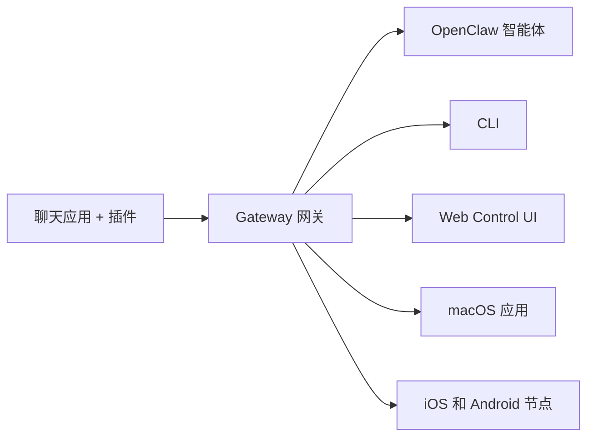

---
read_when:
    - 向新用户介绍 OpenClaw
summary: OpenClaw 是一款可在任何操作系统上运行的 AI 智能体多渠道 Gateway 网关。
title: OpenClaw
x-i18n:
    generated_at: "2026-07-16T11:38:59Z"
    model: gpt-5.6
    postprocess_version: locale-links-v1
    prompt_version: 32
    provider: openai
    source_hash: fe97e7299be4855fd9af21838e0626b5a5c8aafe46d982859e9033f0efec2443
    source_path: index.md
    workflow: 16
---

# OpenClaw 🦞

<p align="center">
    
    
</p>

> _“去角质！去角质！”_ —— 大概是一只太空龙虾

<p align="center">
  <strong>适用于任何操作系统的 AI 智能体 Gateway 网关，覆盖 Discord、Google Chat、iMessage、Matrix、Microsoft Teams、Signal、Slack、Telegram、WhatsApp、Zalo 等渠道。</strong><br />
  发送消息，即可在口袋里收到智能体的回复。使用一个 Gateway 网关运行各类渠道插件、WebChat 和移动节点。
</p>

<Columns>
  <Card title="开始使用" href="/zh-CN/start/getting-started" icon="rocket">
    安装 OpenClaw，并在几分钟内启动 Gateway 网关。
  </Card>
  <Card title="运行新手引导" href="/zh-CN/start/wizard" icon="list-checks">
    通过 `openclaw onboard` 和配对流程完成引导式设置。
  </Card>
  <Card title="连接渠道" href="/zh-CN/channels" icon="message-circle">
    关联 Discord、Signal、Telegram、WhatsApp 等服务，随时随地聊天。
  </Card>
  <Card title="打开 Control UI" href="/zh-CN/web/control-ui" icon="layout-dashboard">
    启动浏览器仪表板，用于聊天、配置和管理会话。
  </Card>
</Columns>

## 浏览文档

移动浏览器可能只显示章节菜单，而不显示完整的桌面端标签栏。可以使用
这些中心链接，从页面正文进入相同的顶级文档区域。

<Columns>
  <Card title="入门指南" href="/zh-CN" icon="rocket">
    概览、功能展示、初始步骤和设置指南。
  </Card>
  <Card title="安装" href="/zh-CN/install" icon="download">
    安装方式、更新、容器、托管和高级设置。
  </Card>
  <Card title="渠道" href="/zh-CN/channels" icon="messages-square">
    消息渠道、配对、路由、访问组和渠道 QA。
  </Card>
  <Card title="智能体" href="/zh-CN/concepts/architecture" icon="bot">
    架构、会话、上下文、记忆和多智能体路由。
  </Card>
  <Card title="能力" href="/zh-CN/tools" icon="wand-sparkles">
    工具、技能、定时任务、Webhooks 和自动化能力。
  </Card>
  <Card title="ClawHub" href="/clawhub" icon="store">
    插件市场、发布、精选和信任指南。
  </Card>
  <Card title="Models" href="/zh-CN/providers" icon="brain">
    提供商、模型配置、故障转移和本地模型服务。
  </Card>
  <Card title="平台" href="/zh-CN/platforms" icon="monitor-smartphone">
    macOS、Windows、iOS、Android、节点和 Web 界面。
  </Card>
  <Card title="Gateway 网关与运维" href="/zh-CN/gateway" icon="server">
    Gateway 配置、安全、诊断和运维。
  </Card>
  <Card title="参考" href="/zh-CN/cli" icon="terminal">
    CLI 参考、模式、RPC、发布说明和模板。
  </Card>
  <Card title="帮助" href="/zh-CN/help" icon="life-buoy">
    故障排除、常见问题、测试、诊断和环境检查。
  </Card>
</Columns>

## 什么是 OpenClaw？

OpenClaw 是一个**自托管 Gateway 网关**，通过渠道插件将你常用的聊天应用（Discord、Google Chat、iMessage、Matrix、Microsoft Teams、Signal、Slack、Telegram、WhatsApp、Zalo 等）连接到 AI 编码智能体。你可以在自己的计算机（或服务器）上运行单个 Gateway 网关进程，使其成为消息应用与随时可用的 AI 助手之间的桥梁。

**它适合谁？** 希望随时随地向个人 AI 助手发送消息，同时又不放弃数据控制权或依赖托管服务的开发者和高级用户。

**它有何不同？**

- **自托管**：在你的硬件上按你的规则运行
- **多渠道**：一个 Gateway 网关同时服务所有已配置的渠道插件
- **智能体原生**：专为编码智能体构建，支持工具使用、会话、记忆和多智能体路由
- **开源**：采用 MIT 许可证，由社区驱动

**需要什么？** Node 24.15+（推荐）、用于兼容性的 Node 22 LTS（`22.22.3+`）或 Node 25.9+、所选提供商的 API 密钥，以及 5 分钟时间。为获得最佳质量和安全性，请使用可用的最强新一代模型。

## 工作原理



Gateway 网关是会话、路由和渠道连接的唯一可信来源。

## 核心能力

<Columns>
  <Card title="多渠道 Gateway 网关" icon="network" href="/zh-CN/channels">
    通过单个 Gateway 网关进程支持 Discord、iMessage、Signal、Slack、Telegram、WhatsApp、WebChat 等服务。
  </Card>
  <Card title="插件渠道" icon="plug" href="/zh-CN/tools/plugin">
    渠道插件可添加 Matrix、Nostr、Twitch、Zalo 等服务；官方插件可按需安装。
  </Card>
  <Card title="多智能体路由" icon="route" href="/zh-CN/concepts/multi-agent">
    按智能体、工作区或发送者隔离会话。
  </Card>
  <Card title="媒体支持" icon="image" href="/zh-CN/nodes/images">
    发送和接收图像、音频及文档。
  </Card>
  <Card title="Web Control UI" icon="monitor" href="/zh-CN/web/control-ui">
    用于聊天、配置、会话和节点的浏览器仪表板。
  </Card>
  <Card title="移动节点" icon="smartphone" href="/zh-CN/nodes">
    配对 iOS 和 Android 节点，用于 Canvas、相机和支持语音的工作流。
  </Card>
</Columns>

## 快速开始

<Steps>
  <Step title="安装 OpenClaw">
    ```bash
    npm install -g openclaw@latest
    ```
  </Step>
  <Step title="完成新手引导并安装服务">
    ```bash
    openclaw onboard --install-daemon
    ```
  </Step>
  <Step title="聊天">
    在浏览器中打开 Control UI 并发送消息：

    ```bash
    openclaw dashboard
    ```

    或连接一个渠道（[Telegram](/zh-CN/channels/telegram) 最快），然后通过手机聊天。

  </Step>
</Steps>

需要完整的安装和开发环境设置说明？请参阅[入门指南](/zh-CN/start/getting-started)。

## 仪表板

Gateway 网关启动后，打开浏览器中的 Control UI。

- 本地默认地址：[http://127.0.0.1:18789/](http://127.0.0.1:18789/)
- 远程访问：[Web 界面](/zh-CN/web)和 [Tailscale](/zh-CN/gateway/tailscale)

<p align="center">
  
</p>

## 配置（可选）

配置位于 `~/.openclaw/openclaw.json`。

- 如果你**不进行任何操作**，OpenClaw 将使用内置的 OpenClaw agent runtime；私信共享智能体的主会话，每个群聊则拥有自己的会话。
- 如果你想限制访问，请从 `channels.whatsapp.allowFrom` 开始，并为群组配置提及规则。

示例：

```json5
{
  channels: {
    whatsapp: {
      allowFrom: ["+15555550123"],
      groups: { "*": { requireMention: true } },
    },
  },
  messages: { groupChat: { mentionPatterns: ["@openclaw"] } },
}
```

## 从这里开始

<Columns>
  <Card title="文档中心" href="/zh-CN/start/hubs" icon="book-open">
    按使用场景整理的所有文档和指南。
  </Card>
  <Card title="配置" href="/zh-CN/gateway/configuration" icon="settings">
    Gateway 网关核心设置、令牌和提供商配置。
  </Card>
  <Card title="远程访问" href="/zh-CN/gateway/remote" icon="globe">
    SSH 和 tailnet 访问模式。
  </Card>
  <Card title="渠道" href="/zh-CN/channels/telegram" icon="message-square">
    Discord、Feishu、Microsoft Teams、Telegram、WhatsApp 等服务的渠道专属设置。
  </Card>
  <Card title="节点" href="/zh-CN/nodes" icon="smartphone">
    支持配对、Canvas、相机和设备操作的 iOS 与 Android 节点。
  </Card>
  <Card title="帮助" href="/zh-CN/help" icon="life-buoy">
    常见修复方法和故障排除入口。
  </Card>
</Columns>

## 了解更多

<Columns>
  <Card title="完整功能列表" href="/zh-CN/concepts/features" icon="list">
    完整的渠道、路由和媒体能力。
  </Card>
  <Card title="多智能体路由" href="/zh-CN/concepts/multi-agent" icon="route">
    工作区隔离和按智能体划分的会话。
  </Card>
  <Card title="安全" href="/zh-CN/gateway/security" icon="shield">
    令牌、允许列表和安全控制。
  </Card>
  <Card title="故障排查" href="/zh-CN/gateway/troubleshooting" icon="wrench">
    Gateway 网关诊断和常见错误。
  </Card>
  <Card title="关于与致谢" href="/zh-CN/reference/credits" icon="info">
    项目起源、贡献者和许可证。
  </Card>
</Columns>
