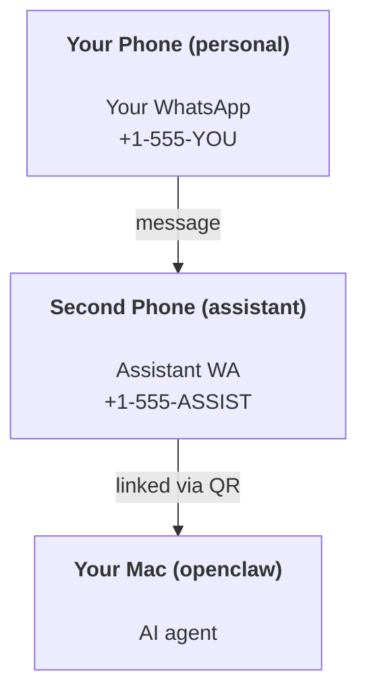

---
read_when:
    - 引导设置新的助手实例
    - 审查安全/权限影响
summary: 将 OpenClaw 作为个人助手运行的端到端指南及安全注意事项
title: 个人助理设置
x-i18n:
    generated_at: "2026-07-05T11:44:47Z"
    model: gpt-5.5
    postprocess_version: locale-links-v1
    provider: openai
    source_hash: 57c515fa414d579850e008aaa60ddb5243a1237b205be111187907dd905be9cb
    source_path: start/openclaw.md
    workflow: 16
---

OpenClaw 是一个自托管 Gateway 网关，可将 Discord、Google Chat、iMessage、Matrix、Microsoft Teams、Signal、Slack、Telegram、WhatsApp、Zalo 等连接到 AI 智能体。本指南介绍“个人助手”设置：一个专用 WhatsApp 号码，其行为类似你的常驻 AI 助手。

## 安全优先

给智能体接入一个渠道，意味着它可能会运行你机器上的命令（取决于你的工具策略）、读写工作区中的文件，并通过任何已连接渠道向外发送消息。请从保守配置开始：

- 始终设置 `channels.whatsapp.allowFrom`（切勿在你的个人 Mac 上以向全世界开放的方式运行）。
- 为助手使用专用 WhatsApp 号码。
- Heartbeat 默认每 30 分钟运行一次。在你信任该设置之前，请通过设置 `agents.defaults.heartbeat.every: "0m"` 将其禁用。

## 前提条件

- 已安装并完成新手引导的 OpenClaw - 如果你还没有完成，请参见[入门指南](/zh-CN/start/getting-started)
- 一个用于助手的第二电话号码（SIM/eSIM/预付费）

## 双手机设置（推荐）

你需要的是这样：



如果你把个人 WhatsApp 连接到 OpenClaw，发给你的每条消息都会变成“智能体输入”。这通常不是你想要的。

## 5 分钟快速开始

1. 配对 WhatsApp Web（显示二维码；用助手手机扫描）：

```bash
openclaw channels login
```

2. 启动 Gateway 网关（保持运行）：

```bash
openclaw gateway --port 18789
```

3. 在 `~/.openclaw/openclaw.json` 中放入最小配置：

```json5
{
  gateway: { mode: "local" },
  channels: { whatsapp: { allowFrom: ["+15555550123"] } },
}
```

现在从已加入允许列表的手机向助手号码发送消息。

新手引导完成后，OpenClaw 会自动打开仪表盘，并打印一个干净的（非令牌化）链接。如果仪表盘提示认证，请将已配置的共享密钥粘贴到 Control UI 设置中。新手引导默认使用令牌（`gateway.auth.token`），但如果你已将 `gateway.auth.mode` 切换为 `password`，密码认证也可用。稍后要重新打开：`openclaw dashboard`。

## 为智能体提供工作区（AGENTS）

OpenClaw 会从其工作区目录读取操作说明和“记忆”。

默认情况下，OpenClaw 使用 `~/.openclaw/workspace` 作为 Agent 工作区，并会在新手引导或首次智能体运行时自动创建它（以及入门用的 `AGENTS.md`、`SOUL.md`、`TOOLS.md`、`IDENTITY.md`、`USER.md`、`HEARTBEAT.md`）。`BOOTSTRAP.md` 只会为全新工作区创建，删除后不应再出现。`MEMORY.md` 是可选文件，且永远不会自动创建；存在时，它会为普通会话加载。子智能体会话只会注入 `AGENTS.md` 和 `TOOLS.md`。

<Tip>
把这个文件夹当作 OpenClaw 的记忆，并将它做成一个 git 仓库（最好是私有仓库），这样你的 `AGENTS.md` 和记忆文件就有备份。如果已安装 git，全新的工作区会自动使用 `git init` 初始化。
</Tip>

如果你想在不运行完整新手引导向导的情况下创建工作区和配置文件夹：

```bash
openclaw setup --baseline
```

（裸 `openclaw setup` 是 `openclaw onboard` 的别名，会运行完整交互式向导。）

完整工作区布局 + 备份指南：[Agent 工作区](/zh-CN/concepts/agent-workspace)
记忆工作流：[记忆](/zh-CN/concepts/memory)

可选：使用 `agents.defaults.workspace` 选择其他工作区（支持 `~`）。

```json5
{
  agents: {
    defaults: {
      workspace: "~/.openclaw/workspace",
    },
  },
}
```

如果你已经从仓库交付自己的工作区文件，可以完全禁用引导文件创建：

```json5
{
  agents: {
    defaults: {
      skipBootstrap: true,
    },
  },
}
```

## 将它变成“助手”的配置

OpenClaw 默认已经是不错的助手设置，但你通常会想要调整：

- [`SOUL.md`](/zh-CN/concepts/soul) 中的人设/说明
- 思考默认值（如有需要）
- Heartbeat（在你信任它之后）

示例：

```json5
{
  logging: { level: "info" },
  agents: {
    defaults: {
      model: { primary: "anthropic/claude-opus-4-8" },
      workspace: "~/.openclaw/workspace",
      thinkingDefault: "high",
      timeoutSeconds: 1800,
      // Start with 0; enable later.
      heartbeat: { every: "0m" },
    },
    list: [
      {
        id: "main",
        default: true,
        groupChat: {
          mentionPatterns: ["@openclaw", "openclaw"],
        },
      },
    ],
  },
  channels: {
    whatsapp: {
      allowFrom: ["+15555550123"],
      groups: {
        "*": { requireMention: true },
      },
    },
  },
  session: {
    scope: "per-sender",
    resetTriggers: ["/new", "/reset"],
    reset: {
      mode: "daily",
      atHour: 4,
      idleMinutes: 10080,
    },
  },
}
```

## 会话和记忆

- 会话文件：`~/.openclaw/agents/<agentId>/sessions/{{SessionId}}.jsonl`
- 会话元数据（令牌使用量、上次路由等）：`~/.openclaw/agents/<agentId>/sessions/sessions.json`
- `/new` 或 `/reset` 会为该聊天启动一个新会话（可通过 `session.resetTriggers` 配置）。如果单独发送，OpenClaw 会确认重置，而不会调用模型。
- `/compact [instructions]` 会压缩会话上下文，并报告剩余上下文预算。

## Heartbeat（主动模式）

默认情况下，OpenClaw 每 30 分钟运行一次 Heartbeat，提示词为：
`Read HEARTBEAT.md if it exists (workspace context). Follow it strictly. Do not infer or repeat old tasks from prior chats. If nothing needs attention, reply HEARTBEAT_OK.`
设置 `agents.defaults.heartbeat.every: "0m"` 可禁用。

- 如果 `HEARTBEAT.md` 存在但实际上为空（只有空行、Markdown/HTML 注释、像 `# Heading` 这样的 Markdown 标题、围栏标记，或空清单桩），OpenClaw 会跳过该 Heartbeat 运行以节省 API 调用。
- 如果文件缺失，Heartbeat 仍会运行，由模型决定要做什么。
- 如果智能体回复 `HEARTBEAT_OK`（可带有短填充；见 `agents.defaults.heartbeat.ackMaxChars`），OpenClaw 会抑制该 Heartbeat 的出站投递。
- 默认情况下，允许向私信风格的 `user:<id>` 目标投递 Heartbeat。设置 `agents.defaults.heartbeat.directPolicy: "block"` 可在保持 Heartbeat 运行活动的同时，抑制直接目标投递。
- Heartbeat 会运行完整的智能体轮次 - 更短的间隔会消耗更多令牌。

```json5
{
  agents: {
    defaults: {
      heartbeat: { every: "30m" },
    },
  },
}
```

## 媒体输入和输出

入站附件（图片/音频/文档）可以通过模板暴露给你的命令：

- `{{MediaPath}}`（本地临时文件路径）
- `{{MediaUrl}}`（伪 URL）
- `{{Transcript}}`（如果启用了音频转写）

智能体的出站附件使用消息工具或回复载荷上的结构化媒体字段，例如 `media`、`mediaUrl`、`mediaUrls`、`path` 或 `filePath`。消息工具参数示例：

```json
{
  "message": "Here's the screenshot.",
  "mediaUrl": "https://example.com/screenshot.png"
}
```

OpenClaw 会随文本一起发送结构化媒体。旧版最终助手回复仍可能出于兼容性而被规范化，但工具输出、浏览器输出、流式块和消息操作不会将文本解析为附件命令。

本地路径行为遵循与智能体相同的文件读取信任模型：

- 如果 `tools.fs.workspaceOnly` 为 `true`，出站本地媒体路径会限制在 OpenClaw 临时根目录、媒体缓存、Agent 工作区路径以及沙箱生成的文件中。
- 如果 `tools.fs.workspaceOnly` 为 `false`，出站本地媒体可以使用智能体已被允许读取的主机本地文件。
- 本地路径可以是绝对路径、工作区相对路径，或带 `~/` 的主目录相对路径。
- 主机本地发送仍然只允许媒体和安全文档类型（图片、音频、视频、PDF、Office 文档，以及经过验证的文本文档，例如 Markdown/MD、TXT、JSON、YAML 和 YML）。这是对现有主机读取信任边界的扩展，而不是密钥扫描器：如果智能体可以读取主机本地的 `secret.txt` 或 `config.json`，当扩展名和内容验证匹配时，它就可以附加该文件。

请将敏感文件放在智能体可读文件系统之外，或者保持 `tools.fs.workspaceOnly: true`，以获得更严格的本地路径发送限制。

## 运维检查清单

```bash
openclaw status          # local status (creds, sessions, queued events)
openclaw status --all    # full diagnosis (read-only, pasteable)
openclaw status --deep   # probe channels (WhatsApp Web + Telegram + Discord + Slack + Signal)
openclaw health --json   # gateway health snapshot over the WS connection
```

日志位于 `/tmp/openclaw/` 下（默认：`openclaw-YYYY-MM-DD.log`）。

## 后续步骤

- WebChat：[WebChat](/zh-CN/web/webchat)
- Gateway 网关运维：[Gateway 运行手册](/zh-CN/gateway)
- Cron + 唤醒：[Cron 作业](/zh-CN/automation/cron-jobs)
- macOS 菜单栏配套应用：[OpenClaw macOS app](/zh-CN/platforms/macos)
- iOS 节点应用：[iOS app](/zh-CN/platforms/ios)
- Android 节点应用：[Android app](/zh-CN/platforms/android)
- Windows Hub：[Windows](/zh-CN/platforms/windows)
- Linux 状态：[Linux app](/zh-CN/platforms/linux)
- 安全：[安全](/zh-CN/gateway/security)

## 相关

- [入门指南](/zh-CN/start/getting-started)
- [设置](/zh-CN/start/setup)
- [渠道概览](/zh-CN/channels)
