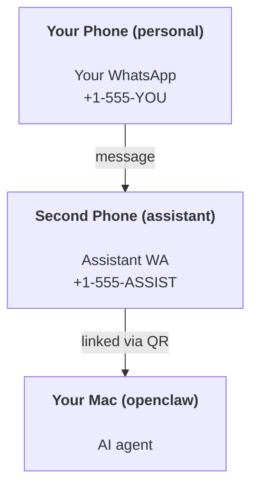

---
read_when:
    - 新助手实例的新手引导
    - 审查安全和权限影响
summary: 将 OpenClaw 作为个人助手运行的端到端指南，包含安全注意事项
title: 个人助理设置
x-i18n:
    generated_at: "2026-05-06T04:10:46Z"
    model: gpt-5.5
    provider: openai
    source_hash: 6fea1194e6b9e8d8816cc712296940487b38faaabea463bd45ba1f37ff52d44d
    source_path: start/openclaw.md
    workflow: 16
---

OpenClaw 是一个自托管 Gateway 网关，可将 Discord、Google Chat、iMessage、Matrix、Microsoft Teams、Signal、Slack、Telegram、WhatsApp、Zalo 等连接到 AI 智能体。本指南介绍“个人助手”设置：一个专用 WhatsApp 号码，像始终在线的 AI 助手一样工作。

## ⚠️ 安全第一

你正在把一个智能体放到能够执行以下操作的位置：

- 在你的机器上运行命令（取决于你的工具策略）
- 读写你的工作区文件
- 通过 WhatsApp/Telegram/Discord/Mattermost 和其他内置渠道向外发送消息

从保守配置开始：

- 始终设置 `channels.whatsapp.allowFrom`（不要在你的个人 Mac 上运行对全世界开放的配置）。
- 为助手使用专用 WhatsApp 号码。
- Heartbeat 现在默认每 30 分钟运行一次。在你信任该设置之前，请通过设置 `agents.defaults.heartbeat.every: "0m"` 将其禁用。

## 前置条件

- 已安装并完成 OpenClaw 新手引导 - 如果你还没有完成，请参阅[入门指南](/zh-CN/start/getting-started)
- 用于助手的第二个电话号码（SIM/eSIM/预付费）

## 双手机设置（推荐）

你需要这样的设置：



如果你把个人 WhatsApp 关联到 OpenClaw，那么发送给你的每条消息都会变成“智能体输入”。这通常不是你想要的。

## 5 分钟快速开始

1. 配对 WhatsApp Web（显示二维码；用助手手机扫描）：

```bash
openclaw channels login
```

2. 启动 Gateway 网关（保持运行）：

```bash
openclaw gateway --port 18789
```

3. 在 `~/.openclaw/openclaw.json` 中放入最小配置：

```json5
{
  gateway: { mode: "local" },
  channels: { whatsapp: { allowFrom: ["+15555550123"] } },
}
```

现在从你的允许列表手机向助手号码发送消息。

新手引导完成后，OpenClaw 会自动打开仪表盘，并打印一个干净的（非令牌化）链接。如果仪表盘提示认证，请将配置的共享密钥粘贴到 Control UI 设置中。新手引导默认使用令牌（`gateway.auth.token`），但如果你已将 `gateway.auth.mode` 切换为 `password`，密码认证也可使用。稍后重新打开：`openclaw dashboard`。

## 给智能体一个工作区（AGENTS）

OpenClaw 会从其工作区目录读取操作说明和“记忆”。

默认情况下，OpenClaw 使用 `~/.openclaw/workspace` 作为 Agent 工作区，并会在设置/首次智能体运行时自动创建它（以及起始 `AGENTS.md`、`SOUL.md`、`TOOLS.md`、`IDENTITY.md`、`USER.md`、`HEARTBEAT.md`）。`BOOTSTRAP.md` 只会在工作区全新时创建（你删除它之后，它不应再次出现）。`MEMORY.md` 是可选的（不会自动创建）；如果存在，它会在正常会话中加载。子智能体会话只会注入 `AGENTS.md` 和 `TOOLS.md`。

<Tip>
把此文件夹视为 OpenClaw 的记忆，并将它做成 git 仓库（最好是私有仓库），这样你的 `AGENTS.md` 和记忆文件就有备份。如果已安装 git，全新工作区会自动初始化。
</Tip>

```bash
openclaw setup
```

完整工作区布局 + 备份指南：[Agent 工作区](/zh-CN/concepts/agent-workspace)
记忆工作流：[Memory](/zh-CN/concepts/memory)

可选：使用 `agents.defaults.workspace` 选择不同的工作区（支持 `~`）。

```json5
{
  agents: {
    defaults: {
      workspace: "~/.openclaw/workspace",
    },
  },
}
```

如果你已经从某个仓库交付自己的工作区文件，可以完全禁用引导文件创建：

```json5
{
  agents: {
    defaults: {
      skipBootstrap: true,
    },
  },
}
```

## 将其变成“助手”的配置

OpenClaw 默认提供了良好的助手设置，但你通常会想调整：

- [`SOUL.md`](/zh-CN/concepts/soul) 中的人设/说明
- 思考默认值（如需要）
- Heartbeat（在你信任它之后）

示例：

```json5
{
  logging: { level: "info" },
  agent: {
    model: "anthropic/claude-opus-4-6",
    workspace: "~/.openclaw/workspace",
    thinkingDefault: "high",
    timeoutSeconds: 1800,
    // Start with 0; enable later.
    heartbeat: { every: "0m" },
  },
  channels: {
    whatsapp: {
      allowFrom: ["+15555550123"],
      groups: {
        "*": { requireMention: true },
      },
    },
  },
  routing: {
    groupChat: {
      mentionPatterns: ["@openclaw", "openclaw"],
    },
  },
  session: {
    scope: "per-sender",
    resetTriggers: ["/new", "/reset"],
    reset: {
      mode: "daily",
      atHour: 4,
      idleMinutes: 10080,
    },
  },
}
```

## 会话和记忆

- 会话文件：`~/.openclaw/agents/<agentId>/sessions/{{SessionId}}.jsonl`
- 会话元数据（令牌用量、上次路由等）：`~/.openclaw/agents/<agentId>/sessions/sessions.json`（旧版：`~/.openclaw/sessions/sessions.json`）
- `/new` 或 `/reset` 会为该聊天启动一个新的会话（可通过 `resetTriggers` 配置）。如果单独发送，OpenClaw 会确认重置，而不会调用模型。
- `/compact [instructions]` 会压缩会话上下文，并报告剩余上下文预算。

## Heartbeat（主动模式）

默认情况下，OpenClaw 每 30 分钟运行一次 Heartbeat，使用以下提示：
`Read HEARTBEAT.md if it exists (workspace context). Follow it strictly. Do not infer or repeat old tasks from prior chats. If nothing needs attention, reply HEARTBEAT_OK.`
设置 `agents.defaults.heartbeat.every: "0m"` 可禁用。

- 如果 `HEARTBEAT.md` 存在但实际上为空（只有空行和类似 `# Heading` 的 Markdown 标题），OpenClaw 会跳过 Heartbeat 运行以节省 API 调用。
- 如果文件缺失，Heartbeat 仍会运行，由模型决定要做什么。
- 如果智能体回复 `HEARTBEAT_OK`（可选带有短填充；参见 `agents.defaults.heartbeat.ackMaxChars`），OpenClaw 会抑制该 Heartbeat 的出站投递。
- 默认情况下，允许向私信样式的 `user:<id>` 目标投递 Heartbeat。设置 `agents.defaults.heartbeat.directPolicy: "block"` 可在保持 Heartbeat 运行的同时抑制直接目标投递。
- Heartbeat 会运行完整智能体轮次 - 更短的间隔会消耗更多令牌。

```json5
{
  agent: {
    heartbeat: { every: "30m" },
  },
}
```

## 媒体输入和输出

入站附件（图片/音频/文档）可以通过模板提供给你的命令：

- `{{MediaPath}}`（本地临时文件路径）
- `{{MediaUrl}}`（伪 URL）
- `{{Transcript}}`（如果启用了音频转录）

来自智能体的出站附件：在单独一行包含 `MEDIA:<path-or-url>`（无空格）。示例：

```
Here's the screenshot.
MEDIA:https://example.com/screenshot.png
```

OpenClaw 会提取这些内容，并将其作为媒体与文本一起发送。

本地路径行为遵循与智能体相同的文件读取信任模型：

- 如果 `tools.fs.workspaceOnly` 为 `true`，出站 `MEDIA:` 本地路径仍限制在 OpenClaw 临时根目录、媒体缓存、Agent 工作区路径和沙箱生成的文件内。
- 如果 `tools.fs.workspaceOnly` 为 `false`，出站 `MEDIA:` 可以使用智能体已被允许读取的主机本地文件。
- 本地路径可以是绝对路径、相对于工作区的路径，或带 `~/` 的相对于主目录的路径。
- 主机本地发送仍只允许媒体和安全文档类型（图片、音频、视频、PDF 和 Office 文档）。纯文本和类似秘密的文件不会被视为可发送媒体。

这意味着，当你的文件系统策略已经允许这些读取时，工作区外生成的图片/文件现在可以发送，而不会重新开放任意主机文本附件外泄。

## 运维清单

```bash
openclaw status          # local status (creds, sessions, queued events)
openclaw status --all    # full diagnosis (read-only, pasteable)
openclaw status --deep   # asks the gateway for a live health probe with channel probes when supported
openclaw health --json   # gateway health snapshot (WS; default can return a fresh cached snapshot)
```

日志位于 `/tmp/openclaw/` 下（默认：`openclaw-YYYY-MM-DD.log`）。

## 后续步骤

- WebChat：[WebChat](/zh-CN/web/webchat)
- Gateway 网关运维：[Gateway 网关运行手册](/zh-CN/gateway)
- Cron + 唤醒：[Cron 作业](/zh-CN/automation/cron-jobs)
- macOS 菜单栏配套应用：[OpenClaw macOS 应用](/zh-CN/platforms/macos)
- iOS 节点应用：[iOS 应用](/zh-CN/platforms/ios)
- Android 节点应用：[Android 应用](/zh-CN/platforms/android)
- Windows 状态：[Windows (WSL2)](/zh-CN/platforms/windows)
- Linux 状态：[Linux 应用](/zh-CN/platforms/linux)
- 安全：[安全](/zh-CN/gateway/security)

## 相关内容

- [入门指南](/zh-CN/start/getting-started)
- [设置](/zh-CN/start/setup)
- [渠道概览](/zh-CN/channels)
