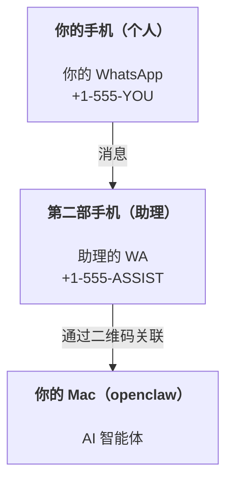

---
read_when:
    - 新智能体实例的新手引导
    - 审查安全性和权限方面的影响
summary: 将 OpenClaw 作为个人助理运行的端到端指南，包含安全注意事项
title: 个人助理设置
x-i18n:
    generated_at: "2026-07-12T14:46:28Z"
    model: gpt-5.6
    postprocess_version: locale-links-v1
    prompt_version: 15
    provider: openai
    source_hash: e8c34e31314f55647059fd600935330110add27b338a675bc0ce1529bebb207d
    source_path: start/openclaw.md
    workflow: 16
---

OpenClaw 是一个自托管 Gateway 网关，可将 Discord、Google Chat、iMessage、Matrix、Microsoft Teams、Signal、Slack、Telegram、WhatsApp、Zalo 等连接到 AI 智能体。本指南介绍“个人助理”设置：使用一个专用 WhatsApp 号码，让它充当随时在线的 AI 助理。

## 安全第一

为智能体接入渠道后，它便可以在你的机器上运行命令（具体取决于你的工具策略）、读取和写入工作区中的文件，并通过任何已连接的渠道向外发送消息。开始时应采取保守配置：

- 始终设置 `channels.whatsapp.allowFrom`（切勿在个人 Mac 上向全世界开放）。
- 为助理使用专用 WhatsApp 号码。
- Heartbeat 默认每 30 分钟运行一次。在你信任此设置之前，请通过设置 `agents.defaults.heartbeat.every: "0m"` 将其禁用。

## 前提条件

- 已安装 OpenClaw 并完成新手引导——如果尚未完成，请参阅[入门指南](/zh-CN/start/getting-started)
- 为助理准备第二个电话号码（SIM/eSIM/预付费号码）

## 双手机设置（推荐）

你需要如下设置：



如果你将个人 WhatsApp 关联到 OpenClaw，那么发送给你的每条消息都会成为“智能体输入”。这通常不是你想要的效果。

## 5 分钟快速开始

1. 配对 WhatsApp Web（显示二维码；使用助理手机扫描）：

```bash
openclaw channels login
```

2. 启动 Gateway 网关（保持运行）：

```bash
openclaw gateway --port 18789
```

3. 在 `~/.openclaw/openclaw.json` 中添加最简配置：

```json5
{
  gateway: { mode: "local" },
  channels: { whatsapp: { allowFrom: ["+15555550123"] } },
}
```

现在，从允许列表中的手机向助理号码发送消息。

新手引导完成后，OpenClaw 会自动打开仪表板，并输出一个简洁的（不含令牌的）链接。如果仪表板提示进行身份验证，请将配置的共享密钥粘贴到 Control UI 设置中。新手引导默认使用令牌（`gateway.auth.token`），但如果你已将 `gateway.auth.mode` 切换为 `password`，也可以使用密码身份验证。以后若要重新打开，请运行：`openclaw dashboard`。

## 为智能体提供工作区（AGENTS）

OpenClaw 从其工作区目录中读取操作说明和“记忆”。

默认情况下，OpenClaw 使用 `~/.openclaw/workspace` 作为 Agent 工作区，并在新手引导或智能体首次运行时自动创建该目录（以及初始的 `AGENTS.md`、`SOUL.md`、`TOOLS.md`、`IDENTITY.md`、`USER.md`、`HEARTBEAT.md`）。`BOOTSTRAP.md` 仅为全新的工作区创建，删除后不应再次出现。`MEMORY.md` 是可选文件，绝不会自动创建；如果存在，则会在普通会话中加载。子智能体会话仅注入 `AGENTS.md` 和 `TOOLS.md`。

<Tip>
将此文件夹视为 OpenClaw 的记忆，并将其设为 git 仓库（最好是私有仓库），以便备份你的 `AGENTS.md` 和记忆文件。如果已安装 git，全新的工作区会通过 `git init` 自动初始化。
</Tip>

如需在不运行完整新手引导向导的情况下创建工作区和配置文件夹，请运行：

```bash
openclaw setup --baseline
```

（不带参数的 `openclaw setup` 是 `openclaw onboard` 的别名，会运行完整的交互式向导。）

完整的工作区布局和备份指南：[Agent 工作区](/zh-CN/concepts/agent-workspace)
记忆工作流：[记忆](/zh-CN/concepts/memory)

可选：使用 `agents.defaults.workspace` 选择其他工作区（支持 `~`）。

```json5
{
  agents: {
    defaults: {
      workspace: "~/.openclaw/workspace",
    },
  },
}
```

如果你已经从仓库中提供自己的工作区文件，则可以完全禁用引导文件创建：

```json5
{
  agents: {
    defaults: {
      skipBootstrap: true,
    },
  },
}
```

## 将其变成“助手”的配置

OpenClaw 的默认设置已能提供良好的助手体验，但通常还需要调整：

- [`SOUL.md`](/zh-CN/concepts/soul) 中的角色设定/指令
- 思考默认值（如有需要）
- Heartbeat（在你信任它之后）

示例：

```json5
{
  logging: { level: "info" },
  agents: {
    defaults: {
      model: { primary: "anthropic/claude-opus-4-8" },
      workspace: "~/.openclaw/workspace",
      thinkingDefault: "high",
      timeoutSeconds: 1800,
      // 初始设为 0；稍后再启用。
      heartbeat: { every: "0m" },
    },
    list: [
      {
        id: "main",
        default: true,
        groupChat: {
          mentionPatterns: ["@openclaw", "openclaw"],
        },
      },
    ],
  },
  channels: {
    whatsapp: {
      allowFrom: ["+15555550123"],
      groups: {
        "*": { requireMention: true },
      },
    },
  },
  session: {
    scope: "per-sender",
    resetTriggers: ["/new", "/reset"],
    reset: {
      mode: "daily",
      atHour: 4,
      idleMinutes: 10080,
    },
  },
}
```

## 会话与记忆

- 会话行、转录行和元数据（令牌用量、上次路由等）：`~/.openclaw/agents/<agentId>/agent/openclaw-agent.sqlite`
- 旧版/归档转录工件：`~/.openclaw/agents/<agentId>/sessions/`
- 旧版行迁移来源：`~/.openclaw/agents/<agentId>/sessions/sessions.json`
- `/new` 或 `/reset` 会为该聊天启动一个新会话（可通过 `session.resetTriggers` 配置）。如果单独发送，OpenClaw 会确认重置，而不会调用模型。
- `/compact [instructions]` 会压缩会话上下文，并报告剩余的上下文预算。

## Heartbeat（主动模式）

默认情况下，OpenClaw 每 30 分钟运行一次 Heartbeat，并使用以下提示词：
`Read HEARTBEAT.md if it exists (workspace context). Follow it strictly. Do not infer or repeat old tasks from prior chats. If nothing needs attention, reply HEARTBEAT_OK.`
将 `agents.defaults.heartbeat.every: "0m"` 设置为禁用。

- 如果 `HEARTBEAT.md` 存在但实际上为空（仅包含空行、Markdown/HTML 注释、类似 `# Heading` 的 Markdown 标题、围栏标记或空的检查清单占位项），OpenClaw 会跳过 Heartbeat 运行以节省 API 调用。
- 如果文件缺失，Heartbeat 仍会运行，并由模型决定要执行的操作。
- 如果智能体回复 `HEARTBEAT_OK`（可附带少量简短文本；请参阅 `agents.defaults.heartbeat.ackMaxChars`），OpenClaw 会抑制该次 Heartbeat 的出站传递。
- 默认允许将 Heartbeat 传递到私信形式的 `user:<id>` 目标。将 `agents.defaults.heartbeat.directPolicy: "block"` 设置为阻止，可在保持 Heartbeat 运行的同时抑制向直接目标传递。
- Heartbeat 会运行完整的智能体轮次——间隔越短，消耗的 token 越多。

```json5
{
  agents: {
    defaults: {
      heartbeat: { every: "30m" },
    },
  },
}
```

## 媒体输入和输出

入站附件（图片/音频/文档）可通过模板提供给你的命令：

- `{{MediaPath}}`（本地临时文件路径）
- `{{MediaUrl}}`（伪 URL）
- `{{Transcript}}`（如果已启用音频转写）

智能体的出站附件使用消息工具或回复负载中的结构化媒体字段，例如 `media`、`mediaUrl`、`mediaUrls`、`path` 或 `filePath`。消息工具参数示例：

```json
{
  "message": "这是截图。",
  "mediaUrl": "https://example.com/screenshot.png"
}
```

OpenClaw 会随文本一起发送结构化媒体。为保持兼容性，旧版的最终助手回复可能仍会进行规范化，但工具输出、浏览器输出、流式传输块和消息操作不会将文本解析为附件命令。

本地路径行为遵循与智能体相同的文件读取信任模型：

- 如果 `tools.fs.workspaceOnly` 为 `true`，出站本地媒体路径仍仅限于 OpenClaw 临时根目录、媒体缓存、Agent 工作区路径和沙箱生成的文件。
- 如果 `tools.fs.workspaceOnly` 为 `false`，出站本地媒体可以使用智能体已获准读取的宿主机本地文件。
- 本地路径可以是绝对路径、工作区相对路径或以 `~/` 表示的主目录相对路径。
- 宿主机本地发送仍仅允许媒体和安全的文档类型（图片、音频、视频、PDF、Office 文档，以及经过验证的文本文档，例如 Markdown/MD、TXT、JSON、YAML 和 YML）。这是对现有宿主机读取信任边界的扩展，而不是秘密扫描器：如果智能体可以读取宿主机本地的 `secret.txt` 或 `config.json`，那么当扩展名和内容验证匹配时，它就可以附加该文件。

请将敏感文件存放在智能体可读文件系统之外，或保持 `tools.fs.workspaceOnly: true`，以对本地路径发送实施更严格的限制。

## 运维检查清单

```bash
openclaw status          # 本地状态（凭据、会话、排队事件）
openclaw status --all    # 完整诊断（只读，可直接粘贴）
openclaw status --deep   # 探测渠道（WhatsApp Web + Telegram + Discord + Slack + Signal）
openclaw health --json   # 通过 WS 连接获取 Gateway 网关健康快照
```

日志位于 `/tmp/openclaw/` 下（默认：`openclaw-YYYY-MM-DD.log`）。

## 后续步骤

- WebChat：[WebChat](/zh-CN/web/webchat)
- Gateway 网关运维：[Gateway 网关运行手册](/zh-CN/gateway)
- Cron + 唤醒：[Cron 作业](/zh-CN/automation/cron-jobs)
- macOS 菜单栏配套应用：[OpenClaw macOS 应用](/zh-CN/platforms/macos)
- iOS 节点应用：[iOS 应用](/zh-CN/platforms/ios)
- Android 节点应用：[Android 应用](/zh-CN/platforms/android)
- Windows Hub：[Windows](/zh-CN/platforms/windows)
- Linux 状态：[Linux 应用](/zh-CN/platforms/linux)
- 安全性：[安全性](/zh-CN/gateway/security)

## 相关内容

- [入门指南](/zh-CN/start/getting-started)
- [设置](/zh-CN/start/setup)
- [渠道概览](/zh-CN/channels)
