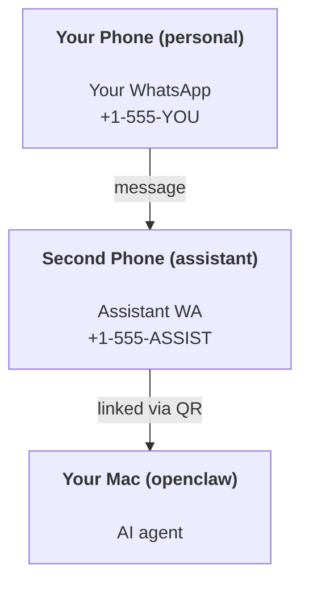

---
read_when:
    - 为新的助理实例进行新手引导
    - 检查安全性 / 权限影响
summary: 将 OpenClaw 作为个人助理运行的端到端指南及安全注意事项
title: 个人助理设置
x-i18n:
    generated_at: "2026-04-24T04:08:10Z"
    model: gpt-5.4
    provider: openai
    source_hash: 3048f2faae826fc33d962f1fac92da3c0ce464d2de803fee381c897eb6c76436
    source_path: start/openclaw.md
    workflow: 15
---

# 使用 OpenClaw 构建个人助理

OpenClaw 是一个自托管 Gateway 网关，可将 Discord、Google Chat、iMessage、Matrix、Microsoft Teams、Signal、Slack、Telegram、WhatsApp、Zalo 等连接到 AI 智能体。本指南介绍“个人助理”设置：一个专用的 WhatsApp 号码，它会表现得像你始终在线的 AI 助理。

## ⚠️ 安全第一

你正在把一个智能体置于以下位置：

- 在你的机器上运行命令（取决于你的工具策略）
- 在你的工作区中读写文件
- 通过 WhatsApp/Telegram/Discord/Mattermost 和其他内置渠道将消息发回外部

请从保守配置开始：

- 始终设置 `channels.whatsapp.allowFrom`（绝不要在你的个人 Mac 上以对全世界开放的方式运行）。
- 为助理使用一个专用的 WhatsApp 号码。
- Heartbeat 现在默认每 30 分钟运行一次。在你信任这套设置之前，请通过设置 `agents.defaults.heartbeat.every: "0m"` 将其禁用。

## 前提条件

- 已安装并完成 OpenClaw 新手引导——如果你还没有完成，请参见 [入门指南](/zh-CN/start/getting-started)
- 一个给助理使用的第二手机号（SIM/eSIM/预付费卡）

## 双手机设置（推荐）

你需要的是这个：



如果你把自己的个人 WhatsApp 连接到 OpenClaw，那么所有发给你的消息都会变成“智能体输入”。这通常不是你想要的。

## 5 分钟快速开始

1. 配对 WhatsApp Web（会显示 QR 码；用助理手机扫描）：

```bash
openclaw channels login
```

2. 启动 Gateway 网关（保持它持续运行）：

```bash
openclaw gateway --port 18789
```

3. 在 `~/.openclaw/openclaw.json` 中放入一个最小配置：

```json5
{
  gateway: { mode: "local" },
  channels: { whatsapp: { allowFrom: ["+15555550123"] } },
}
```

现在，从你的允许列表手机向助理号码发送消息。

当新手引导完成时，OpenClaw 会自动打开 dashboard，并打印一个干净的（非 token 化）链接。如果 dashboard 提示需要认证，请将已配置的共享密钥粘贴到 Control UI 设置中。新手引导默认使用令牌（`gateway.auth.token`），但如果你已将 `gateway.auth.mode` 切换为 `password`，密码认证也可以使用。稍后如需重新打开：`openclaw dashboard`。

## 给智能体一个工作区（AGENTS）

OpenClaw 会从其工作区目录读取运行指令和“记忆”。

默认情况下，OpenClaw 使用 `~/.openclaw/workspace` 作为智能体工作区，并会在设置 / 首次运行智能体时自动创建它（以及初始的 `AGENTS.md`、`SOUL.md`、`TOOLS.md`、`IDENTITY.md`、`USER.md`、`HEARTBEAT.md`）。`BOOTSTRAP.md` 仅在工作区全新时创建（删除后不应再次出现）。`MEMORY.md` 是可选的（不会自动创建）；存在时，会在普通会话中加载。子智能体会话只会注入 `AGENTS.md` 和 `TOOLS.md`。

提示：把这个文件夹当作 OpenClaw 的“记忆”，并将其设为一个 Git 仓库（最好设为私有），这样你的 `AGENTS.md` 和记忆文件就能备份。如果已安装 Git，全新工作区会自动初始化。

```bash
openclaw setup
```

完整的工作区布局和备份指南： [Agent workspace](/zh-CN/concepts/agent-workspace)
记忆工作流： [Memory](/zh-CN/concepts/memory)

可选：使用 `agents.defaults.workspace` 选择不同的工作区（支持 `~`）。

```json5
{
  agent: {
    workspace: "~/.openclaw/workspace",
  },
}
```

如果你已经从某个仓库提供了自己的工作区文件，可以完全禁用引导文件创建：

```json5
{
  agent: {
    skipBootstrap: true,
  },
}
```

## 将它变成“一个助理”的配置

OpenClaw 默认已经提供了不错的助理设置，但你通常还会想调整：

- [`SOUL.md`](/zh-CN/concepts/soul) 中的人设 / 指令
- thinking 默认值（如果需要）
- heartbeat（等你信任它之后再开启）

示例：

```json5
{
  logging: { level: "info" },
  agent: {
    model: "anthropic/claude-opus-4-6",
    workspace: "~/.openclaw/workspace",
    thinkingDefault: "high",
    timeoutSeconds: 1800,
    // Start with 0; enable later.
    heartbeat: { every: "0m" },
  },
  channels: {
    whatsapp: {
      allowFrom: ["+15555550123"],
      groups: {
        "*": { requireMention: true },
      },
    },
  },
  routing: {
    groupChat: {
      mentionPatterns: ["@openclaw", "openclaw"],
    },
  },
  session: {
    scope: "per-sender",
    resetTriggers: ["/new", "/reset"],
    reset: {
      mode: "daily",
      atHour: 4,
      idleMinutes: 10080,
    },
  },
}
```

## 会话与记忆

- 会话文件：`~/.openclaw/agents/<agentId>/sessions/{{SessionId}}.jsonl`
- 会话元数据（token 使用量、最后路由等）：`~/.openclaw/agents/<agentId>/sessions/sessions.json`（旧版位置：`~/.openclaw/sessions/sessions.json`）
- `/new` 或 `/reset` 会为该聊天启动一个新会话（可通过 `resetTriggers` 配置）。如果单独发送，智能体会回复一个简短问候，以确认已重置。
- `/compact [instructions]` 会压缩会话上下文，并报告剩余的上下文预算。

## Heartbeats（主动模式）

默认情况下，OpenClaw 每 30 分钟运行一次 heartbeat，提示为：
`Read HEARTBEAT.md if it exists (workspace context). Follow it strictly. Do not infer or repeat old tasks from prior chats. If nothing needs attention, reply HEARTBEAT_OK.`
设置 `agents.defaults.heartbeat.every: "0m"` 可禁用。

- 如果 `HEARTBEAT.md` 存在但实际上为空（只有空行和像 `# Heading` 这样的 Markdown 标题），OpenClaw 会跳过 heartbeat 运行，以节省 API 调用。
- 如果该文件缺失，heartbeat 仍会运行，并由模型决定该做什么。
- 如果智能体回复 `HEARTBEAT_OK`（可带简短填充；见 `agents.defaults.heartbeat.ackMaxChars`），OpenClaw 会抑制该 heartbeat 的出站投递。
- 默认情况下，允许将 heartbeat 投递到 `user:<id>` 这类私信风格目标。设置 `agents.defaults.heartbeat.directPolicy: "block"` 可抑制直接目标投递，同时保持 heartbeat 运行处于启用状态。
- Heartbeats 会运行完整的智能体轮次——更短的间隔会消耗更多 token。

```json5
{
  agent: {
    heartbeat: { every: "30m" },
  },
}
```

## 媒体的输入与输出

入站附件（图片 / 音频 / 文档）可以通过模板暴露给你的命令：

- `{{MediaPath}}`（本地临时文件路径）
- `{{MediaUrl}}`（伪 URL）
- `{{Transcript}}`（如果启用了音频转录）

来自智能体的出站附件：在单独一行中包含 `MEDIA:<path-or-url>`（不要有空格）。示例：

```
Here’s the screenshot.
MEDIA:https://example.com/screenshot.png
```

OpenClaw 会提取这些内容，并将它们作为媒体与文本一起发送。

本地路径行为遵循与智能体相同的文件读取信任模型：

- 如果 `tools.fs.workspaceOnly` 为 `true`，出站 `MEDIA:` 本地路径将仍然限制在 OpenClaw 临时根目录、媒体缓存、智能体工作区路径以及沙箱生成的文件之内。
- 如果 `tools.fs.workspaceOnly` 为 `false`，出站 `MEDIA:` 可以使用智能体已经被允许读取的主机本地文件。
- 主机本地发送仍然只允许媒体和安全文档类型（图片、音频、视频、PDF 和 Office 文档）。纯文本和类似机密的文件不会被视为可发送媒体。

这意味着，当你的文件系统策略已经允许这些读取时，工作区之外生成的图片 / 文件现在也可以发送，而不会重新打开任意主机文本附件外泄的风险。

## 运维检查清单

```bash
openclaw status          # 本地状态（凭证、会话、排队事件）
openclaw status --all    # 完整诊断（只读、可粘贴）
openclaw status --deep   # 向 gateway 请求实时健康探测；在支持时包含渠道探测
openclaw health --json   # gateway 健康快照（WS；默认可返回最新的缓存快照）
```

日志位于 `/tmp/openclaw/` 下（默认：`openclaw-YYYY-MM-DD.log`）。

## 下一步

- WebChat： [WebChat](/zh-CN/web/webchat)
- Gateway 网关运维： [Gateway runbook](/zh-CN/gateway)
- Cron + 唤醒： [Cron jobs](/zh-CN/automation/cron-jobs)
- macOS 菜单栏配套应用： [OpenClaw macOS app](/zh-CN/platforms/macos)
- iOS 节点应用： [iOS app](/zh-CN/platforms/ios)
- Android 节点应用： [Android app](/zh-CN/platforms/android)
- Windows 状态： [Windows (WSL2)](/zh-CN/platforms/windows)
- Linux 状态： [Linux app](/zh-CN/platforms/linux)
- 安全性： [Security](/zh-CN/gateway/security)

## 相关内容

- [入门指南](/zh-CN/start/getting-started)
- [设置](/zh-CN/start/setup)
- [渠道概览](/zh-CN/channels)
