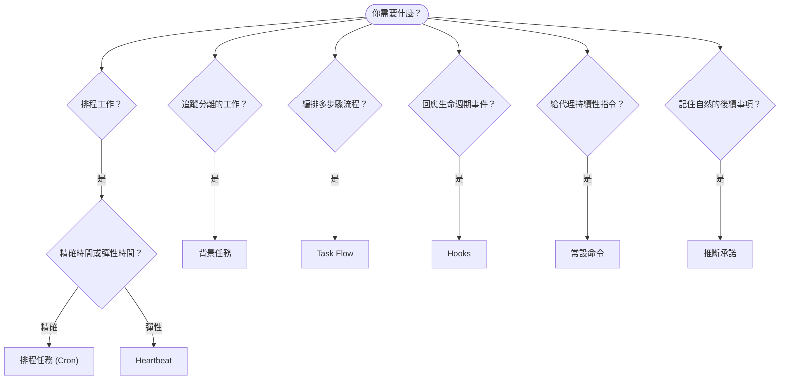

---
read_when:
    - 決定如何使用 OpenClaw 自動化工作
    - 在 Heartbeat、Cron、承諾事項、掛鉤與常設指令之間做選擇
    - 尋找合適的自動化入口點
summary: 自動化機制概覽：任務、Cron、掛鉤、常設指令，以及 TaskFlow
title: 自動化與任務
x-i18n:
    generated_at: "2026-04-30T02:45:11Z"
    model: gpt-5.5
    provider: openai
    source_hash: a2465c39f21db8bcb98f980a2c4b2c03018dddd5f43de59d8bf6ce0d6e97d9ef
    source_path: automation/index.md
    workflow: 16
---

OpenClaw 會透過任務、排程工作、推斷承諾、事件 Hook 與常設指令在背景執行工作。本頁協助你選擇合適的機制，並了解它們如何彼此配合。

## 快速決策指南

| 使用案例                                | 建議                   | 原因                                             |
| --------------------------------------- | ---------------------- | ------------------------------------------------ |
| 每天上午 9 點準時傳送報告               | 排程任務 (Cron)        | 精確時間、隔離執行                              |
| 20 分鐘後提醒我                         | 排程任務 (Cron)        | 具有精準時間的一次性任務 (`--at`)               |
| 執行每週深度分析                        | 排程任務 (Cron)        | 獨立任務，可使用不同模型                        |
| 每 30 分鐘檢查收件匣                    | Heartbeat              | 與其他檢查批次處理，具備情境感知                |
| 監控日曆中的即將到來事件                | Heartbeat              | 很自然適合週期性覺察                            |
| 在提到的面試後追蹤確認                  | 推斷承諾               | 類似記憶的後續追蹤，沒有精確提醒請求            |
| 根據使用者情境進行溫和關懷確認          | 推斷承諾               | 限定於同一代理與頻道                            |
| 檢查子代理或 ACP 執行狀態               | 背景任務               | 任務帳本會追蹤所有分離的工作                    |
| 稽核執行了什麼以及何時執行              | 背景任務               | `openclaw tasks list` 與 `openclaw tasks audit` |
| 多步驟研究後彙整摘要                    | Task Flow              | 具備修訂追蹤的持久編排                          |
| 在工作階段重設時執行腳本                | Hooks                  | 事件驅動，會在生命週期事件觸發                  |
| 在每次工具呼叫時執行程式碼              | Plugin hooks           | 程序內 Hook 可攔截工具呼叫                      |
| 回覆前一律檢查合規性                    | 常設命令               | 自動注入每個工作階段                            |

### 排程任務 (Cron) 與 Heartbeat

| 面向            | 排程任務 (Cron)                    | Heartbeat                             |
| --------------- | ----------------------------------- | ------------------------------------- |
| 時間            | 精確（cron 表達式、一次性）         | 近似（預設每 30 分鐘）                |
| 工作階段情境    | 全新（隔離）或共享                  | 完整主工作階段情境                    |
| 任務紀錄        | 一律建立                            | 從不建立                              |
| 交付            | 頻道、Webhook 或靜默                | 在主工作階段內內嵌                    |
| 最適合          | 報告、提醒、背景工作                | 收件匣檢查、日曆、通知                |

需要精確時間或隔離執行時，請使用排程任務 (Cron)。當工作受益於完整工作階段情境，而且近似時間即可時，請使用 Heartbeat。

## 核心概念

### 排程任務 (cron)

Cron 是 Gateway 內建的精確時間排程器。它會持久保存工作、在正確時間喚醒代理，並可將輸出交付到聊天頻道或 Webhook 端點。支援一次性提醒、週期性表達式與傳入 Webhook 觸發器。

請參閱[排程任務](/zh-TW/automation/cron-jobs)。

### 任務

背景任務帳本會追蹤所有分離的工作：ACP 執行、子代理產生、隔離的 cron 執行與 CLI 操作。任務是紀錄，不是排程器。使用 `openclaw tasks list` 與 `openclaw tasks audit` 來檢查它們。

請參閱[背景任務](/zh-TW/automation/tasks)。

### 推斷承諾

承諾是選擇加入、短期存在的後續追蹤記憶。OpenClaw 會從一般對話中推斷它們，將其限定於同一代理與頻道，並透過 Heartbeat 交付到期的確認。使用者明確請求的精確提醒仍屬於 cron。

請參閱[推斷承諾](/zh-TW/concepts/commitments)。

### Task Flow

Task Flow 是位於背景任務之上的流程編排基底。它會管理持久的多步驟流程，支援受管理與鏡像同步模式、修訂追蹤，以及用於檢查的 `openclaw tasks flow list|show|cancel`。

請參閱 [Task Flow](/zh-TW/automation/taskflow)。

### 常設命令

常設命令會授予代理針對已定義程式的永久操作權限。它們存放於工作區檔案中（通常是 `AGENTS.md`），並會注入每個工作階段。可搭配 cron 執行時間型強制要求。

請參閱[常設命令](/zh-TW/automation/standing-orders)。

### Hooks

內部 Hook 是由代理生命週期事件（`/new`、`/reset`、`/stop`）、工作階段 Compaction、Gateway 啟動與訊息流程觸發的事件驅動腳本。它們會從目錄中自動探索，並可使用 `openclaw hooks` 管理。若要進行程序內工具呼叫攔截，請使用 [Plugin hooks](/zh-TW/plugins/hooks)。

請參閱 [Hooks](/zh-TW/automation/hooks)。

### Heartbeat

Heartbeat 是週期性的主工作階段回合（預設每 30 分鐘）。它會在一個具備完整工作階段情境的代理回合中批次處理多項檢查（收件匣、日曆、通知）。Heartbeat 回合不會建立任務紀錄，也不會延長每日/閒置工作階段重設的新鮮度。可使用 `HEARTBEAT.md` 放置簡短檢查清單，或在你希望於 Heartbeat 本身內執行僅限到期的週期性檢查時使用 `tasks:` 區塊。空的 Heartbeat 檔案會以 `empty-heartbeat-file` 略過；僅限到期任務模式會以 `no-tasks-due` 略過。Heartbeat 會在 cron 工作處於作用中或已排入佇列時延後，而 `heartbeat.skipWhenBusy` 也可在子代理或巢狀通道忙碌時延後它們。

請參閱 [Heartbeat](/zh-TW/gateway/heartbeat)。

## 它們如何一起運作

- **Cron** 處理精確排程（每日報告、每週回顧）與一次性提醒。所有 cron 執行都會建立任務紀錄。
- **Heartbeat** 每 30 分鐘在一個批次回合中處理例行監控（收件匣、日曆、通知）。
- **Hooks** 使用自訂腳本回應特定事件（工作階段重設、Compaction、訊息流程）。Plugin hooks 涵蓋工具呼叫。
- **常設命令** 為代理提供持續性情境與權限邊界。
- **Task Flow** 在個別任務之上協調多步驟流程。
- **任務** 會自動追蹤所有分離的工作，讓你能檢查與稽核。

## 相關

- [排程任務](/zh-TW/automation/cron-jobs) — 精確排程與一次性提醒
- [推斷承諾](/zh-TW/concepts/commitments) — 類似記憶的後續追蹤確認
- [背景任務](/zh-TW/automation/tasks) — 所有分離工作的任務帳本
- [Task Flow](/zh-TW/automation/taskflow) — 持久的多步驟流程編排
- [Hooks](/zh-TW/automation/hooks) — 事件驅動的生命週期腳本
- [Plugin hooks](/zh-TW/plugins/hooks) — 程序內工具、提示、訊息與生命週期 Hook
- [常設命令](/zh-TW/automation/standing-orders) — 持續性代理指令
- [Heartbeat](/zh-TW/gateway/heartbeat) — 週期性主工作階段回合
- [設定參考](/zh-TW/gateway/configuration-reference) — 所有設定鍵
