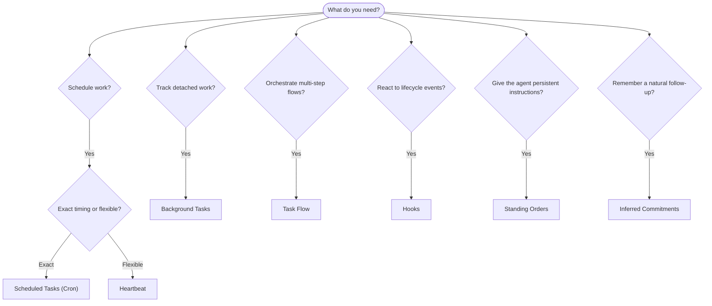

---
read_when:
    - 決定如何使用 OpenClaw 自動化工作
    - 在 Heartbeat、Cron、承諾事項、掛鉤與常設指令之間選擇
    - 尋找合適的自動化進入點
summary: 自動化機制概覽：任務、Cron、掛鉤、常設指令與 TaskFlow
title: 自動化與任務
x-i18n:
    generated_at: "2026-05-06T09:02:30Z"
    model: gpt-5.5
    provider: openai
    source_hash: ee7f34fa4840c0e43e50d09e415b2529ef0c8bc3ccb6e3546b8a873c9458832d
    source_path: automation/index.md
    workflow: 16
---

OpenClaw 透過工作、排程作業、推斷承諾、事件 hooks 和常駐指令在背景執行工作。本頁協助你選擇正確的機制，並了解它們如何相互配合。

## 快速決策指南

| 使用情境                                | 建議使用               | 原因                                             |
| --------------------------------------- | ---------------------- | ------------------------------------------------ |
| 每天上午 9 點準時傳送報告               | 排程工作 (Cron)        | 精確時間、隔離執行                               |
| 20 分鐘後提醒我                         | 排程工作 (Cron)        | 具精確時間的一次性工作 (`--at`)                  |
| 執行每週深度分析                        | 排程工作 (Cron)        | 獨立工作，可使用不同模型                         |
| 每 30 分鐘檢查收件匣                    | Heartbeat              | 與其他檢查一起批次執行，具情境感知               |
| 監控行事曆中的即將到來事件              | Heartbeat              | 非常適合週期性覺察                               |
| 在提到的面試後追蹤確認                  | 推斷承諾               | 類似記憶的後續追蹤，沒有精確提醒請求             |
| 根據使用者情境進行溫和關懷確認          | 推斷承諾               | 限定於相同 agent 和頻道                          |
| 檢查 subagent 或 ACP 執行狀態           | 背景工作               | 工作帳本追蹤所有分離工作                         |
| 稽核執行過哪些工作以及何時執行          | 背景工作               | `openclaw tasks list` 和 `openclaw tasks audit`  |
| 多步驟研究後彙整摘要                    | Task Flow              | 具有修訂追蹤的持久化編排                         |
| 在工作階段重設時執行 script             | Hooks                  | 事件驅動，會在生命週期事件觸發                   |
| 在每次工具呼叫時執行程式碼              | Plugin hooks           | 程序內 hooks 可攔截工具呼叫                      |
| 回覆前一律檢查合規性                    | 常駐指令               | 自動注入每個工作階段                             |

### 排程工作 (Cron) 與 Heartbeat

| 維度           | 排程工作 (Cron)                    | Heartbeat                             |
| --------------- | ----------------------------------- | ------------------------------------- |
| 時間安排        | 精確（cron 表達式、一次性）         | 近似（預設每 30 分鐘）                |
| 工作階段情境    | 全新（隔離）或共用                  | 完整的主要工作階段情境                |
| 工作記錄        | 一律建立                            | 永不建立                              |
| 傳遞方式        | 頻道、webhook 或靜默                | 內嵌於主要工作階段                    |
| 最適合          | 報告、提醒、背景作業                | 收件匣檢查、行事曆、通知              |

當你需要精確時間或隔離執行時，請使用排程工作 (Cron)。當工作受益於完整工作階段情境，且近似時間即可時，請使用 Heartbeat。

## 核心概念

### 排程工作 (cron)

Cron 是 Gateway 內建的精確時間排程器。它會持久化作業、在正確時間喚醒 agent，並可將輸出傳遞到聊天頻道或 webhook endpoint。支援一次性提醒、週期性表達式和傳入 webhook 觸發器。

請參閱[排程工作](/zh-TW/automation/cron-jobs)。

### 工作

背景工作帳本會追蹤所有分離工作：ACP 執行、subagent 產生、隔離 cron 執行和 CLI 操作。工作是記錄，不是排程器。使用 `openclaw tasks list` 和 `openclaw tasks audit` 檢查它們。

請參閱[背景工作](/zh-TW/automation/tasks)。

### 推斷承諾

承諾是選擇啟用、短期存在的後續追蹤記憶。OpenClaw 會從一般對話推斷承諾，將它們限定於相同 agent 和頻道，並透過 Heartbeat 傳遞到期確認。使用者明確要求的精確提醒仍屬於 cron。

請參閱[推斷承諾](/zh-TW/concepts/commitments)。

### Task Flow

Task Flow 是位於背景工作之上的流程編排基礎層。它會管理持久化多步驟流程，具備受管理與鏡像同步模式、修訂追蹤，以及用於檢查的 `openclaw tasks flow list|show|cancel`。

請參閱 [Task Flow](/zh-TW/automation/taskflow)。

### 常駐指令

常駐指令授予 agent 對已定義程式的永久操作權限。它們存放於工作區檔案中（通常是 `AGENTS.md`），並注入每個工作階段。可搭配 cron 進行以時間為基礎的執行。

請參閱[常駐指令](/zh-TW/automation/standing-orders)。

### Hooks

內部 hooks 是事件驅動 scripts，會由 agent 生命週期事件（`/new`、`/reset`、`/stop`）、工作階段 Compaction、Gateway 啟動和訊息流程觸發。它們會自動從目錄探索，並可使用 `openclaw hooks` 管理。若要進行程序內工具呼叫攔截，請使用 [Plugin hooks](/zh-TW/plugins/hooks)。

請參閱 [Hooks](/zh-TW/automation/hooks)。

### Heartbeat

Heartbeat 是週期性的主要工作階段回合（預設每 30 分鐘）。它會在一次 agent 回合中，以完整工作階段情境批次執行多項檢查（收件匣、行事曆、通知）。Heartbeat 回合不會建立工作記錄，也不會延長每日/閒置工作階段重設的新鮮度。使用 `HEARTBEAT.md` 放置小型檢查清單，或在你想於 Heartbeat 本身執行僅限到期的週期性檢查時使用 `tasks:` 區塊。空的 Heartbeat 檔案會以 `empty-heartbeat-file` 跳過；僅限到期工作模式會以 `no-tasks-due` 跳過。當 cron 工作正在執行或佇列中時，Heartbeat 會延後；`heartbeat.skipWhenBusy` 也可在 subagent 或巢狀 lane 忙碌時延後它們。

請參閱 [Heartbeat](/zh-TW/gateway/heartbeat)。

## 它們如何一起運作

- **Cron** 處理精確排程（每日報告、每週審查）和一次性提醒。所有 cron 執行都會建立工作記錄。
- **Heartbeat** 在每 30 分鐘一次的批次回合中處理例行監控（收件匣、行事曆、通知）。
- **Hooks** 透過自訂 scripts 回應特定事件（工作階段重設、Compaction、訊息流程）。Plugin hooks 涵蓋工具呼叫。
- **常駐指令** 提供 agent 持久情境與權限邊界。
- **Task Flow** 在個別工作之上協調多步驟流程。
- **工作** 會自動追蹤所有分離工作，讓你能檢查與稽核。

## 相關

- [排程工作](/zh-TW/automation/cron-jobs) — 精確排程與一次性提醒
- [推斷承諾](/zh-TW/concepts/commitments) — 類似記憶的後續追蹤確認
- [背景工作](/zh-TW/automation/tasks) — 所有分離工作的工作帳本
- [Task Flow](/zh-TW/automation/taskflow) — 持久化多步驟流程編排
- [Hooks](/zh-TW/automation/hooks) — 事件驅動的生命週期 scripts
- [Plugin hooks](/zh-TW/plugins/hooks) — 程序內工具、提示、訊息與生命週期 hooks
- [常駐指令](/zh-TW/automation/standing-orders) — 持久化 agent 指令
- [Heartbeat](/zh-TW/gateway/heartbeat) — 週期性主要工作階段回合
- [組態參考](/zh-TW/gateway/configuration-reference) — 所有 config keys
