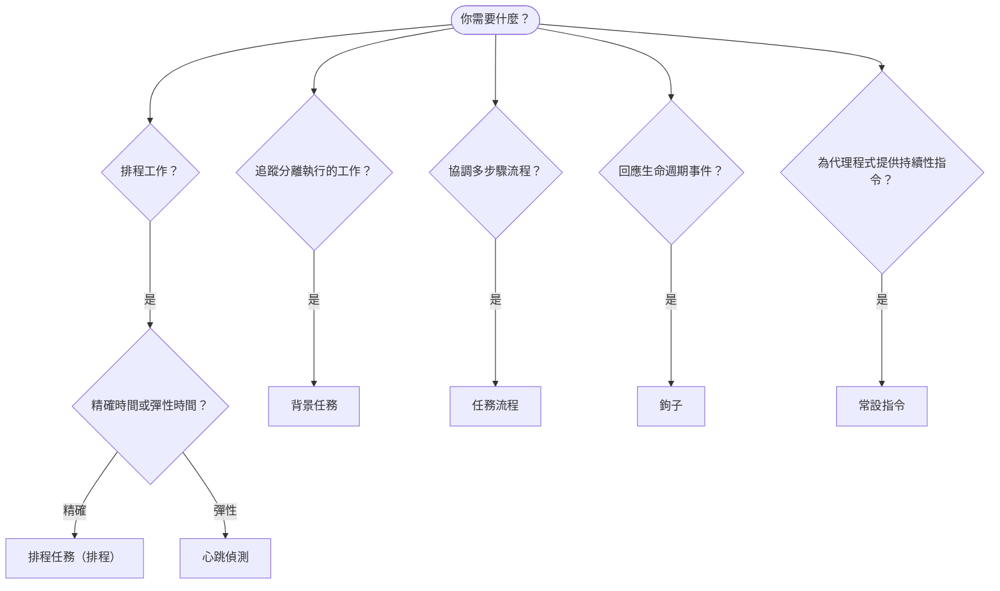

OpenClaw 透過任務、排程工作、事件鉤子和常設指令在背景執行工作。請使用本頁選擇合適的機制。

## 快速決策指南

| 使用情境                                | 建議機制            | 原因                                              |
| --------------------------------------- | ---------------------- | ------------------------------------------------ |
| 每天上午 9 點準時傳送報告         | 排程任務（排程） | 時間精確、隔離執行                 |
| 20 分鐘後提醒我                 | 排程任務（排程） | 精確計時的一次性任務（`--at`）            |
| 每週執行深入分析                | 排程任務（排程） | 獨立任務，可使用不同模型         |
| 每 30 分鐘檢查收件匣                | 心跳偵測              | 與其他檢查批次執行，並能感知情境         |
| 監控行事曆中的近期活動    | 心跳偵測              | 很適合週期性感知               |
| 檢查子代理程式或 ACP 執行的狀態 | 背景任務       | 任務帳本會追蹤所有分離執行的工作            |
| 稽核執行過哪些工作及其執行時間                 | 背景任務       | `openclaw tasks list` 和 `openclaw tasks audit` |
| 執行多步驟研究後再摘要      | 任務流程              | 具備修訂追蹤的持久化協調機制     |
| 在工作階段重設時執行指令碼           | 鉤子                  | 由事件驅動，在生命週期事件發生時觸發          |
| 每次工具呼叫時執行程式碼         | 外掛鉤子           | 同處理序鉤子可攔截工具呼叫        |
| 回覆前一律檢查合規性 | 常設指令        | 自動注入每個工作階段        |

### 排程任務（排程）與心跳偵測的比較

| 面向       | 排程任務（排程）              | 心跳偵測                             |
| --------------- | ----------------------------------- | ------------------------------------- |
| 時間          | 精確（排程運算式、一次性）  | 約略（預設每 30 分鐘）    |
| 工作階段情境 | 全新（隔離）或共用          | 完整的主要工作階段情境             |
| 任務記錄    | 一律建立                      | 從不建立                         |
| 傳遞方式        | 頻道、網路鉤子或靜默         | 直接顯示於主要工作階段中                |
| 最適合        | 報告、提醒、背景工作 | 收件匣檢查、行事曆、通知 |

需要精確時間或隔離執行時，請使用排程任務（排程）。如果工作能受益於完整的工作階段情境，且約略的執行時間即可，請使用心跳偵測。

## 核心概念

### 排程任務（排程）

排程是閘道內建的精確計時排程器。它會保存工作、在正確時間喚醒代理程式，並可將輸出傳遞至聊天頻道或網路鉤子端點。支援一次性提醒、週期性運算式和傳入網路鉤子觸發程序。

請參閱[排程任務](/zh-TW/automation/cron-jobs)。

### 任務

背景任務帳本會追蹤所有分離執行的工作：ACP 執行、子代理程式產生、隔離的排程執行，以及命令列介面操作。任務是記錄，而不是排程器。請使用 `openclaw tasks list` 和 `openclaw tasks audit` 進行檢查。

請參閱[背景任務](/zh-TW/automation/tasks)。

### 任務流程

任務流程是建構於背景任務之上的流程協調基礎。它以受管理和鏡像同步模式管理持久化的多步驟流程，並提供修訂追蹤和 `openclaw tasks flow list|show|cancel` 以供檢查。

請參閱[任務流程](/zh-TW/automation/taskflow)。

### 常設指令

常設指令會針對已定義的程式，授予代理程式永久的操作權限。這些指令存放於工作區檔案中（通常是 `AGENTS.md`），並會注入每個工作階段。可與排程搭配，以強制依時間執行。

請參閱[常設指令](/zh-TW/automation/standing-orders)。

### 鉤子

內部鉤子是由代理程式生命週期事件
（`/new`、`/reset`、`/stop`）、工作階段壓縮、閘道啟動和訊息
流程觸發的事件驅動指令碼。系統會從鉤子目錄探索這些鉤子，並使用
`openclaw hooks` 進行管理。如需在處理序內攔截工具呼叫，請使用
[外掛鉤子](/zh-TW/plugins/hooks)。

請參閱[鉤子](/zh-TW/automation/hooks)。

### 心跳偵測

心跳偵測是週期性的主要工作階段回合（預設每 30 分鐘）。它會在一個代理程式回合中，使用完整的工作階段情境批次執行多項檢查（收件匣、行事曆、通知）。心跳偵測回合不會建立任務記錄，也不會延長每日／閒置工作階段重設的新鮮度。請使用 `HEARTBEAT.md` 設定簡短的檢查清單；若要在心跳偵測本身執行僅限到期項目的週期性檢查，則可使用 `tasks:` 區塊。空白的心跳偵測檔案會以 `empty-heartbeat-file` 略過；僅限到期項目的任務模式會以 `no-tasks-due` 略過。當排程工作正在執行或排隊時，心跳偵測會延後；當同一代理程式以工作階段索引的子代理程式或巢狀通道正在忙碌時，`heartbeat.skipWhenBusy` 也可延後該代理程式。

請參閱[心跳偵測](/zh-TW/gateway/heartbeat)。

## 這些機制如何搭配運作

- **排程**負責精確排程（每日報告、每週審查）和一次性提醒。所有排程執行都會建立任務記錄。
- **心跳偵測**每 30 分鐘以單一批次回合處理例行監控（收件匣、行事曆、通知）。
- **鉤子**會透過自訂指令碼回應特定事件（工作階段重設、壓縮、訊息流程）。外掛鉤子則涵蓋工具呼叫。
- **常設指令**會為代理程式提供持續性情境和權限界線。
- **任務流程**會協調個別任務之上的多步驟流程。
- **任務**會自動追蹤所有分離執行的工作，讓你能夠檢查和稽核。

## 相關內容

- [排程任務](/zh-TW/automation/cron-jobs) — 精確排程和一次性提醒
- [背景任務](/zh-TW/automation/tasks) — 所有分離執行工作的任務帳本
- [任務流程](/zh-TW/automation/taskflow) — 持久化的多步驟流程協調
- [鉤子](/zh-TW/automation/hooks) — 事件驅動的生命週期指令碼
- [外掛鉤子](/zh-TW/plugins/hooks) — 處理序內的工具、提示、訊息和生命週期鉤子
- [常設指令](/zh-TW/automation/standing-orders) — 持續性的代理程式指令
- [心跳偵測](/zh-TW/gateway/heartbeat) — 週期性的主要工作階段回合
- [設定參考](/zh-TW/gateway/configuration-reference) — 所有設定鍵
