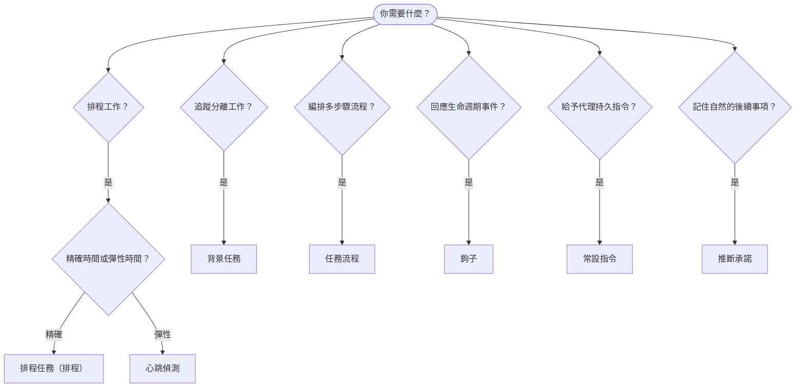

OpenClaw 會透過任務、排程作業、推斷承諾、事件鉤子與常設指令在背景執行工作。使用本頁選擇合適的機制。

## 快速決策指南

| 使用案例                                | 建議                   | 原因                                             |
| --------------------------------------- | ---------------------- | ------------------------------------------------ |
| 每天上午 9 點準時傳送報告              | 排程任務（排程）       | 精確時間、隔離執行                               |
| 20 分鐘後提醒我                        | 排程任務（排程）       | 使用精確時間的一次性任務（`--at`）              |
| 執行每週深度分析                       | 排程任務（排程）       | 獨立任務，可使用不同模型                         |
| 每 30 分鐘檢查收件匣                   | 心跳偵測               | 與其他檢查批次處理，具備情境感知                 |
| 監控行事曆中的即將到來事件             | 心跳偵測               | 非常適合週期性感知                               |
| 在提及的面試後查看狀態                 | 推斷承諾               | 類似記憶的後續事項，沒有精確提醒請求             |
| 根據使用者情境進行溫和關懷查看         | 推斷承諾               | 限定於相同代理與頻道                             |
| 檢查子代理或 ACP 執行的狀態            | 背景任務               | 任務帳本會追蹤所有分離工作                       |
| 稽核執行了什麼以及何時執行             | 背景任務               | `openclaw tasks list` 和 `openclaw tasks audit` |
| 多步驟研究後摘要                       | 任務流程               | 具備修訂追蹤的持久編排                           |
| 在工作階段重設時執行腳本               | 鉤子                   | 事件驅動，在生命週期事件時觸發                   |
| 在每次工具呼叫時執行程式碼             | 外掛鉤子               | 程序內鉤子可攔截工具呼叫                         |
| 回覆前一律檢查合規性                   | 常設指令               | 自動注入每個工作階段                             |

### 排程任務（排程）與心跳偵測

| 維度            | 排程任務（排程）                    | 心跳偵測                              |
| --------------- | ----------------------------------- | ------------------------------------- |
| 時間            | 精確（cron 運算式、一次性）         | 近似（預設每 30 分鐘）                |
| 工作階段情境    | 全新（隔離）或共享                  | 完整主工作階段情境                    |
| 任務記錄        | 一律建立                            | 永不建立                              |
| 傳遞            | 頻道、網路鉤子或靜默                | 內嵌於主工作階段                      |
| 最適合          | 報告、提醒、背景作業                | 收件匣檢查、行事曆、通知              |

需要精確時間或隔離執行時，請使用排程任務（排程）。當工作受益於完整工作階段情境，且近似時間即可時，請使用心跳偵測。

## 核心概念

### 排程任務（排程）

排程是閘道內建的精確時間排程器。它會持久保存作業、在正確時間喚醒代理，並可將輸出傳遞到聊天頻道或網路鉤子端點。支援一次性提醒、週期性運算式，以及入站網路鉤子觸發。

請參閱[排程任務](/zh-TW/automation/cron-jobs)。

### 任務

背景任務帳本會追蹤所有分離工作：ACP 執行、子代理生成、隔離排程執行，以及命令列介面操作。任務是記錄，不是排程器。使用 `openclaw tasks list` 和 `openclaw tasks audit` 檢查它們。

請參閱[背景任務](/zh-TW/automation/tasks)。

### 推斷承諾

承諾是選擇加入、短期存在的後續記憶。OpenClaw 會從一般對話中推斷它們，將其限定於相同代理與頻道，並透過心跳偵測傳遞到期查看。使用者明確請求的精確提醒仍屬於排程。

請參閱[推斷承諾](/zh-TW/concepts/commitments)。

### 任務流程

任務流程是位於背景任務之上的流程編排基礎層。它管理持久的多步驟流程，具備受管理與鏡像同步模式、修訂追蹤，以及用於檢查的 `openclaw tasks flow list|show|cancel`。

請參閱[任務流程](/zh-TW/automation/taskflow)。

### 常設指令

常設指令會授予代理針對已定義程式的永久操作權限。它們位於工作區檔案中（通常是 `AGENTS.md`），並注入每個工作階段。可與排程結合，用於基於時間的執行。

請參閱[常設指令](/zh-TW/automation/standing-orders)。

### 鉤子

內部鉤子是由代理生命週期事件（`/new`、`/reset`、`/stop`）、工作階段壓縮、閘道啟動和訊息流程觸發的事件驅動腳本。它們會從鉤子目錄中探索，並透過 `openclaw hooks` 管理。若要進行程序內工具呼叫攔截，請使用[外掛鉤子](/zh-TW/plugins/hooks)。

請參閱[鉤子](/zh-TW/automation/hooks)。

### 心跳偵測

心跳偵測是週期性的主工作階段回合（預設每 30 分鐘）。它會在一次代理回合中，以完整工作階段情境批次處理多個檢查（收件匣、行事曆、通知）。心跳偵測回合不會建立任務記錄，也不會延長每日/閒置工作階段重設新鮮度。使用 `HEARTBEAT.md` 放置小型檢查清單，或在想要於心跳偵測內部執行僅限到期的週期檢查時使用 `tasks:` 區塊。空的心跳偵測檔案會以 `empty-heartbeat-file` 跳過；僅限到期任務模式會以 `no-tasks-due` 跳過。當排程工作正在執行或佇列中時，心跳偵測會延後；`heartbeat.skipWhenBusy` 也可在相同代理的工作階段鍵控子代理或巢狀通道忙碌時延後該代理。

請參閱[心跳偵測](/zh-TW/gateway/heartbeat)。

## 它們如何協同運作

- **排程**處理精確排程（每日報告、每週回顧）和一次性提醒。所有排程執行都會建立任務記錄。
- **心跳偵測**以每 30 分鐘一次的批次回合處理例行監控（收件匣、行事曆、通知）。
- **鉤子**使用自訂腳本回應特定事件（工作階段重設、壓縮、訊息流程）。外掛鉤子涵蓋工具呼叫。
- **常設指令**為代理提供持久情境與權限邊界。
- **任務流程**在個別任務之上協調多步驟流程。
- **任務**會自動追蹤所有分離工作，讓你能檢查與稽核。

## 相關

- [排程任務](/zh-TW/automation/cron-jobs) — 精確排程與一次性提醒
- [推斷承諾](/zh-TW/concepts/commitments) — 類似記憶的後續查看
- [背景任務](/zh-TW/automation/tasks) — 所有分離工作的任務帳本
- [任務流程](/zh-TW/automation/taskflow) — 持久多步驟流程編排
- [鉤子](/zh-TW/automation/hooks) — 事件驅動生命週期腳本
- [外掛鉤子](/zh-TW/plugins/hooks) — 程序內工具、提示、訊息與生命週期鉤子
- [常設指令](/zh-TW/automation/standing-orders) — 持久代理指令
- [心跳偵測](/zh-TW/gateway/heartbeat) — 週期性主工作階段回合
- [設定參考](/zh-TW/gateway/configuration-reference) — 所有設定鍵
