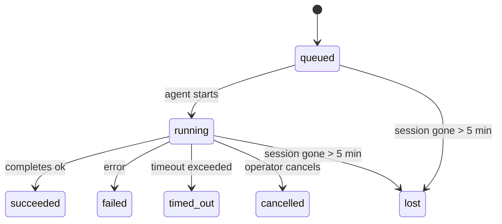

---
read_when:
    - 檢視進行中或最近完成的背景工作
    - 偵錯分離式代理執行的傳遞失敗
    - 了解背景執行與工作階段、Cron 和 Heartbeat 的關係
sidebarTitle: Background tasks
summary: 用於 ACP 執行、子代理程式、隔離的 Cron 作業和 CLI 操作的背景任務追蹤
title: 背景工作
x-i18n:
    generated_at: "2026-05-12T00:56:14Z"
    model: gpt-5.5
    provider: openai
    source_hash: 31cbf09df48bab0686a1350f91aefffffef899c86704bb97b68320fc47e78021
    source_path: automation/tasks.md
    workflow: 16
---

<Note>
想找排程功能嗎？請參閱 [Automation](/zh-TW/automation)，以選擇正確的機制。此頁面是背景工作的活動記錄簿，不是排程器。
</Note>

背景任務會追蹤在**主對話工作階段之外**執行的工作：ACP 執行、子代理程式產生、隔離的 Cron 工作執行，以及由 CLI 啟動的操作。

任務**不會**取代工作階段、Cron 工作或 Heartbeat - 它們是**活動記錄簿**，記錄發生了哪些分離式工作、何時發生，以及是否成功。

<Note>
並非每次代理程式執行都會建立任務。Heartbeat 回合和一般互動式聊天不會。所有 Cron 執行、ACP 產生、子代理程式產生，以及 CLI 代理程式命令都會。
</Note>

## TL;DR

- 任務是**記錄**，不是排程器 - Cron 和 Heartbeat 決定工作_何時_執行，任務則追蹤_發生了什麼_。
- ACP、子代理程式、所有 Cron 工作，以及 CLI 操作都會建立任務。Heartbeat 回合不會。
- 每個任務都會經過 `queued → running → terminal`（succeeded、failed、timed_out、cancelled 或 lost）。
- 只要 Cron 執行階段仍擁有該工作，Cron 任務就會維持即時狀態；如果
  記憶體中的執行階段狀態已消失，任務維護會先檢查持久化的 Cron
  執行歷史，再將任務標記為 lost。
- 完成是推送驅動的：分離式工作完成時可以直接通知，或喚醒
  請求者工作階段/Heartbeat，因此狀態輪詢迴圈
  通常不是正確的形態。
- 隔離的 Cron 執行和子代理程式完成，會在最終清理簿記前，以最佳努力方式清理其子工作階段追蹤的瀏覽器分頁/程序。
- 當後代子代理程式工作仍在收尾時，隔離的 Cron 遞送會抑制過時的中繼父層回覆，且若最終後代輸出在遞送前抵達，會優先使用該輸出。
- 完成通知會直接遞送到頻道，或排入佇列等待下一次 Heartbeat。
- `openclaw tasks list` 會顯示所有任務；`openclaw tasks audit` 會浮現問題。
- 終端記錄會保留 7 天，之後自動修剪。

## 快速開始

<Tabs>
  <Tab title="列出與篩選">
    ```bash
    # List all tasks (newest first)
    openclaw tasks list

    # Filter by runtime or status
    openclaw tasks list --runtime acp
    openclaw tasks list --status running
    ```

  </Tab>
  <Tab title="檢查">
    ```bash
    # Show details for a specific task (by ID, run ID, or session key)
    openclaw tasks show <lookup>
    ```
  </Tab>
  <Tab title="取消與通知">
    ```bash
    # Cancel a running task (kills the child session)
    openclaw tasks cancel <lookup>

    # Change notification policy for a task
    openclaw tasks notify <lookup> state_changes
    ```

  </Tab>
  <Tab title="稽核與維護">
    ```bash
    # Run a health audit
    openclaw tasks audit

    # Preview or apply maintenance
    openclaw tasks maintenance
    openclaw tasks maintenance --apply
    ```

  </Tab>
  <Tab title="TaskFlow 流程">
    ```bash
    # Inspect TaskFlow state
    openclaw tasks flow list
    openclaw tasks flow show <lookup>
    openclaw tasks flow cancel <lookup>
    ```
  </Tab>
</Tabs>

## 什麼會建立任務

| 來源                   | 執行階段類型 | 任務記錄建立時機                                       | 預設通知政策 |
| ---------------------- | ------------ | ------------------------------------------------------ | ------------ |
| ACP 背景執行           | `acp`        | 產生子 ACP 工作階段                                    | `done_only`  |
| 子代理程式協調         | `subagent`   | 透過 `sessions_spawn` 產生子代理程式                   | `done_only`  |
| Cron 工作（所有類型）  | `cron`       | 每次 Cron 執行（主工作階段與隔離式）                  | `silent`     |
| CLI 操作               | `cli`        | 透過 Gateway 執行的 `openclaw agent` 命令              | `silent`     |
| 代理程式媒體工作       | `cli`        | 由工作階段支援的 `music_generate`/`video_generate` 執行 | `silent`     |

<AccordionGroup>
  <Accordion title="Cron 與媒體的通知預設值">
    主工作階段 Cron 任務預設使用 `silent` 通知政策 - 它們會建立記錄供追蹤，但不會產生通知。隔離式 Cron 任務也預設為 `silent`，但因為它們在自己的工作階段中執行，所以更容易被看見。

    由工作階段支援的 `music_generate` 和 `video_generate` 執行也使用 `silent` 通知政策。它們仍會建立任務記錄，但完成狀態會以內部喚醒的方式交回原始代理程式工作階段，讓代理程式自行寫入後續訊息並附上完成的媒體。群組/頻道完成會遵循一般可見回覆政策，因此當來源遞送要求時，代理程式會使用訊息工具。如果完成代理程式在僅工具路由中未能產生訊息工具遞送證據，OpenClaw 會將完成備援直接傳送到原始頻道，而不是讓媒體保持私有。

  </Accordion>
  <Accordion title="並行 video_generate 防護欄">
    當由工作階段支援的 `video_generate` 任務仍處於作用中時，該工具也會充當防護欄：在同一工作階段中重複呼叫 `video_generate` 會回傳作用中任務狀態，而不是啟動第二個並行生成。當你想從代理程式端明確查詢進度/狀態時，請使用 `action: "status"`。
  </Accordion>
  <Accordion title="什麼不會建立任務">
    - Heartbeat 回合 - 主工作階段；請參閱 [Heartbeat](/zh-TW/gateway/heartbeat)
    - 一般互動式聊天回合
    - 直接 `/command` 回應

  </Accordion>
</AccordionGroup>

## 任務生命週期



| 狀態        | 意義                                                                       |
| ----------- | -------------------------------------------------------------------------- |
| `queued`    | 已建立，等待代理程式啟動                                                   |
| `running`   | 代理程式回合正在主動執行                                                   |
| `succeeded` | 已成功完成                                                                 |
| `failed`    | 已完成但發生錯誤                                                           |
| `timed_out` | 超過已設定的逾時時間                                                       |
| `cancelled` | 由操作者透過 `openclaw tasks cancel` 停止                                  |
| `lost`      | 執行階段在 5 分鐘寬限期後失去權威後備狀態                                  |

轉換會自動發生 - 當相關代理程式執行結束時，任務狀態會更新為相符狀態。

代理程式執行完成是作用中任務記錄的權威來源。成功的分離式執行會以 `succeeded` 結束，一般執行錯誤會以 `failed` 結束，而逾時或中止結果會以 `timed_out` 結束。如果操作者已取消任務，或執行階段已記錄更強的終端狀態，例如 `failed`、`timed_out` 或 `lost`，較晚的成功訊號不會將該終端狀態降級。

`lost` 會感知執行階段：

- ACP 任務：後備 ACP 子工作階段中繼資料已消失。
- 子代理程式任務：後備子工作階段已從目標代理程式儲存區消失。
- Cron 任務：Cron 執行階段不再將工作追蹤為作用中，且持久化的
  Cron 執行歷史未顯示該次執行的終端結果。離線 CLI
  稽核不會將自身空的程序內 Cron 執行階段狀態視為權威。
- CLI 任務：具有執行 ID/來源 ID 的任務會使用即時執行內容，因此
  Gateway 擁有的執行消失後，殘留的子工作階段或聊天工作階段資料列不會讓它們保持作用中。沒有執行身分的舊版 CLI 任務仍會
  回退到子工作階段。由 Gateway 支援的 `openclaw agent` 執行也會
  根據其執行結果結束，因此已完成的執行不會保持作用中，直到清掃器
  將它們標記為 `lost`。

## 遞送與通知

當任務達到終端狀態時，OpenClaw 會通知你。有兩條遞送路徑：

**直接遞送** - 如果任務有頻道目標（`requesterOrigin`），完成訊息會直接送到該頻道（Telegram、Discord、Slack 等）。群組與頻道任務完成則會透過請求者工作階段路由，讓父層代理程式可以寫入可見回覆。對於子代理程式完成，OpenClaw 也會在可用時保留繫結的執行緒/主題路由，並且可以先從請求者工作階段儲存的路由（`lastChannel` / `lastTo` / `lastAccountId`）補上缺漏的 `to` / 帳號，再放棄直接遞送。

**工作階段佇列遞送** - 如果直接遞送失敗或未設定來源，更新會作為系統事件排入請求者工作階段的佇列，並在下一次 Heartbeat 浮現。

<Tip>
任務完成會觸發立即 Heartbeat 喚醒，讓你快速看到結果 - 你不必等到下一次排程的 Heartbeat 刻點。
</Tip>

這表示一般工作流程是以推送為基礎：啟動一次分離式工作，然後讓執行階段在完成時喚醒或通知你。只有在需要偵錯、介入或明確稽核時，才輪詢任務狀態。

### 通知政策

控制你會收到多少關於每個任務的資訊：

| 政策                  | 會遞送的內容                                                            |
| --------------------- | ----------------------------------------------------------------------- |
| `done_only`（預設）   | 只有終端狀態（succeeded、failed 等）- **這是預設值**                    |
| `state_changes`       | 每次狀態轉換與進度更新                                                  |
| `silent`              | 完全不通知                                                              |

在任務執行期間變更政策：

```bash
openclaw tasks notify <lookup> state_changes
```

## CLI 參考

<AccordionGroup>
  <Accordion title="tasks list">
    ```bash
    openclaw tasks list [--runtime <acp|subagent|cron|cli>] [--status <status>] [--json]
    ```

    輸出欄位：任務 ID、種類、狀態、遞送、執行 ID、子工作階段、摘要。

  </Accordion>
  <Accordion title="tasks show">
    ```bash
    openclaw tasks show <lookup>
    ```

    查詢權杖接受任務 ID、執行 ID 或工作階段鍵。顯示完整記錄，包含時間、遞送狀態、錯誤與終端摘要。

  </Accordion>
  <Accordion title="tasks cancel">
    ```bash
    openclaw tasks cancel <lookup>
    ```

    對於 ACP 和子代理程式任務，這會終止子工作階段。對於由 CLI 追蹤的任務，取消會記錄在任務登錄中（沒有獨立的子執行階段控制代碼）。狀態會轉換為 `cancelled`，並在適用時傳送遞送通知。

  </Accordion>
  <Accordion title="tasks notify">
    ```bash
    openclaw tasks notify <lookup> <done_only|state_changes|silent>
    ```
  </Accordion>
  <Accordion title="tasks audit">
    ```bash
    openclaw tasks audit [--json]
    ```

    浮現作業問題。偵測到問題時，發現項也會出現在 `openclaw status` 中。

    | 發現項目                  | 嚴重性     | 觸發條件                                                                                                      |
    | ------------------------- | ---------- | ------------------------------------------------------------------------------------------------------------ |
    | `stale_queued`            | warn       | 佇列中超過 10 分鐘                                                                              |
    | `stale_running`           | error      | 執行中超過 30 分鐘                                                                             |
    | `lost`                    | warn/error | 執行階段支援的任務擁有權消失；保留的遺失任務在 `cleanupAfter` 之前會警告，之後變成錯誤 |
    | `delivery_failed`         | warn       | 傳遞失敗，且通知政策不是 `silent`                                                            |
    | `missing_cleanup`         | warn       | 終端任務沒有清理時間戳                                                                      |
    | `inconsistent_timestamps` | warn       | 時間軸違規（例如在開始之前就結束）                                                        |

  </Accordion>
  <Accordion title="tasks maintenance">
    ```bash
    openclaw tasks maintenance [--json]
    openclaw tasks maintenance --apply [--json]
    ```

    使用此命令預覽或套用任務、Task Flow 狀態，以及過期 Cron 執行工作階段登錄列的協調、清理標記和修剪。

    協調會感知執行階段：

    - ACP/subagent 任務會檢查其支援子工作階段。
    - 子工作階段具有重新啟動復原墓碑的 Subagent 任務會被標記為遺失，而不是被視為可復原的支援工作階段。
    - Cron 任務會檢查 Cron 執行階段是否仍擁有該工作，然後從持久化的 Cron 執行記錄/工作狀態復原終端狀態，最後才退回到 `lost`。只有 Gateway 行程對記憶體中的 Cron 作用中工作集合具有權威性；離線 CLI 稽核會使用持久歷史記錄，但不會只因為該本機 Set 是空的就將 Cron 任務標記為遺失。
    - 具有執行身分的 CLI 任務會檢查擁有它的即時執行內容，而不只是子工作階段或聊天工作階段列。

    完成清理也會感知執行階段：

    - Subagent 完成時，會在公告清理繼續之前盡力關閉為子工作階段追蹤的瀏覽器分頁/行程。
    - 隔離 Cron 完成時，會在執行完全拆除之前盡力關閉為 Cron 工作階段追蹤的瀏覽器分頁/行程。
    - 隔離 Cron 傳遞會在需要時等待後代 Subagent 後續動作完成，並抑制過期的父層確認文字，而不是公告它。
    - Subagent 完成傳遞會優先使用最新可見的助理文字；如果該文字為空，則退回使用經過清理的最新工具/toolResult 文字，而只有逾時的工具呼叫執行可收斂為簡短的部分進度摘要。終端失敗執行會公告失敗狀態，而不重播擷取到的回覆文字。
    - 清理失敗不會遮蔽真正的任務結果。

    套用維護時，OpenClaw 也會移除超過 7 天的過期 `cron:<jobId>:run:<uuid>` 工作階段登錄列，同時保留目前執行中的 Cron 工作列，並讓非 Cron 工作階段列保持不變。

  </Accordion>
  <Accordion title="tasks flow list | show | cancel">
    ```bash
    openclaw tasks flow list [--status <status>] [--json]
    openclaw tasks flow show <lookup> [--json]
    openclaw tasks flow cancel <lookup>
    ```

    當你關心的是編排中的 Task Flow，而不是單一背景任務記錄時，使用這些命令。

  </Accordion>
</AccordionGroup>

## 聊天任務看板 (`/tasks`)

在任何聊天工作階段中使用 `/tasks`，可查看連結到該工作階段的背景任務。看板會顯示作用中和最近完成的任務，以及執行階段、狀態、時間和進度或錯誤詳細資料。

當目前工作階段沒有可見的已連結任務時，`/tasks` 會退回顯示代理程式本機任務計數，因此你仍能取得概覽，而不會洩漏其他工作階段的詳細資料。

若要查看完整的操作員總帳，請使用 CLI：`openclaw tasks list`。

## 狀態整合（任務壓力）

`openclaw status` 包含一目了然的任務摘要：

```
Tasks: 3 queued · 2 running · 1 issues
```

摘要會報告：

- **active** - `queued` + `running` 的計數
- **failures** - `failed` + `timed_out` + `lost` 的計數
- **byRuntime** - 依 `acp`、`subagent`、`cron`、`cli` 分解

`/status` 和 `session_status` 工具都使用感知清理的任務快照：優先顯示作用中任務、隱藏過期的已完成列，且最近的失敗只會在沒有作用中工作留下時浮現。這能讓狀態卡片聚焦於目前真正重要的事項。

## 儲存與維護

### 任務存放位置

任務記錄會持久保存在 SQLite：

```
$OPENCLAW_STATE_DIR/tasks/runs.sqlite
```

登錄會在 Gateway 啟動時載入記憶體，並將寫入同步到 SQLite，以便在重新啟動後保有持久性。
Gateway 會使用 SQLite 的預設自動檢查點閾值，加上週期性與關機時的 `TRUNCATE` 檢查點，讓 SQLite 預寫記錄維持有界。

### 自動維護

清掃程式每 **60 秒** 執行一次，並處理四件事：

<Steps>
  <Step title="協調">
    檢查作用中任務是否仍有權威的執行階段支援。ACP/subagent 任務使用子工作階段狀態，Cron 任務使用作用中工作擁有權，而具有執行身分的 CLI 任務使用擁有它的執行內容。如果該支援狀態消失超過 5 分鐘，任務會被標記為 `lost`。
  </Step>
  <Step title="ACP 工作階段修復">
    關閉終端或孤立、由父層擁有的一次性 ACP 工作階段，並且只在沒有作用中對話綁定仍存在時，才關閉過期終端或孤立的持久 ACP 工作階段。
  </Step>
  <Step title="清理標記">
    在終端任務上設定 `cleanupAfter` 時間戳（endedAt + 7 天）。在保留期間，遺失任務仍會在稽核中以警告出現；在 `cleanupAfter` 到期後，或清理中繼資料缺失時，它們會成為錯誤。
  </Step>
  <Step title="修剪">
    刪除超過其 `cleanupAfter` 日期的記錄。
  </Step>
</Steps>

<Note>
**保留期：** 終端任務記錄會保留 **7 天**，然後自動修剪。不需要設定。
</Note>

## 任務如何與其他系統相關

<AccordionGroup>
  <Accordion title="任務與 Task Flow">
    [Task Flow](/zh-TW/automation/taskflow) 是位於背景任務之上的流程編排層。單一流程可在其生命週期內使用受管理或鏡像同步模式協調多個任務。使用 `openclaw tasks` 檢查個別任務記錄，並使用 `openclaw tasks flow` 檢查編排中的流程。

    如需詳細資料，請參閱 [Task Flow](/zh-TW/automation/taskflow)。

  </Accordion>
  <Accordion title="任務與 Cron">
    Cron 工作**定義**位於 `~/.openclaw/cron/jobs.json`；執行階段執行狀態則位於旁邊的 `~/.openclaw/cron/jobs-state.json`。**每次** Cron 執行都會建立任務記錄，包括主工作階段與隔離工作階段。主工作階段 Cron 任務預設為 `silent` 通知政策，因此它們會進行追蹤而不產生通知。

    請參閱 [Cron 工作](/zh-TW/automation/cron-jobs)。

  </Accordion>
  <Accordion title="任務與 Heartbeat">
    Heartbeat 執行是主工作階段回合，不會建立任務記錄。當任務完成時，它可以觸發 Heartbeat 喚醒，讓你能及時看到結果。

    請參閱 [Heartbeat](/zh-TW/gateway/heartbeat)。

  </Accordion>
  <Accordion title="任務與工作階段">
    任務可參照 `childSessionKey`（工作執行的位置）和 `requesterSessionKey`（啟動它的人）。工作階段是對話內容；任務則是在其上的活動追蹤。
  </Accordion>
  <Accordion title="任務與代理程式執行">
    任務的 `runId` 會連結到執行工作的代理程式執行。代理程式生命週期事件（開始、結束、錯誤）會自動更新任務狀態，你不需要手動管理生命週期。
  </Accordion>
</AccordionGroup>

## 相關

- [自動化](/zh-TW/automation) - 一目了然查看所有自動化機制
- [CLI：任務](/zh-TW/cli/tasks) - CLI 命令參考
- [Heartbeat](/zh-TW/gateway/heartbeat) - 週期性主工作階段回合
- [排程任務](/zh-TW/automation/cron-jobs) - 排程背景工作
- [Task Flow](/zh-TW/automation/taskflow) - 位於任務之上的流程編排
