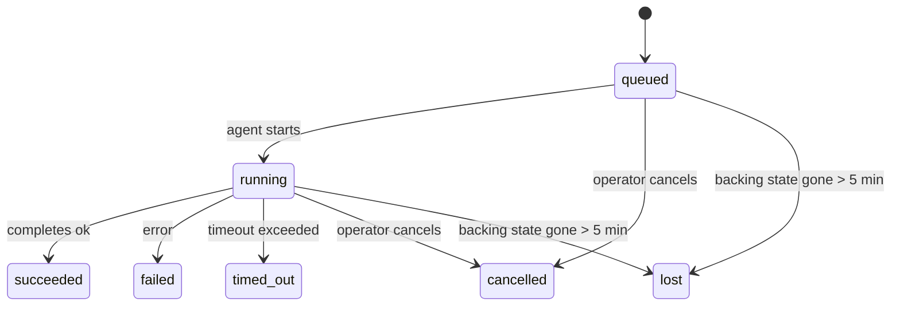

---
read_when:
    - 檢查正在進行或最近完成的背景工作
    - 偵錯已分離代理執行的傳送失敗
    - 了解背景執行如何與工作階段、排程和心跳偵測相關
sidebarTitle: Background tasks
summary: ACP 執行、子代理、排程執行與命令列介面操作的背景任務追蹤
title: 背景工作
x-i18n:
    generated_at: "2026-07-06T21:46:35Z"
    model: gpt-5.5
    postprocess_version: locale-links-v1
    provider: openai
    source_hash: 839c7ed9b199288ab577ab10cfad1dd6eba7054fef43d1dacc2d3a4483b4edf0
    source_path: automation/tasks.md
    workflow: 16
---

<Note>
想找排程功能？請參閱[自動化](/zh-TW/automation)以選擇正確的機制。本頁是背景工作的活動帳本，不是排程器。
</Note>

背景任務會追蹤在**主要對話工作階段之外**執行的工作：ACP 執行、子代理程式衍生、排程工作執行，以及由命令列介面啟動的操作。

任務**不會**取代工作階段、排程工作或心跳偵測 - 它們是**活動帳本**，記錄已分離工作發生了什麼、何時發生，以及是否成功。

<Note>
並非每次代理程式執行都會建立任務。心跳偵測回合和一般互動式聊天不會。所有排程執行、ACP 衍生、子代理程式衍生，以及由閘道派發的命令列介面代理程式命令都會建立任務。
</Note>

## 重點摘要

- 任務是**記錄**，不是排程器 - 排程和心跳偵測決定工作_何時_執行，任務則追蹤_發生了什麼_。
- ACP、子代理程式、所有排程工作，以及命令列介面操作都會建立任務。心跳偵測回合不會。
- 每個任務都會經過 `queued → running → terminal`（succeeded、failed、timed_out、cancelled 或 lost）。
- 只要排程執行階段仍擁有該工作，排程任務就會維持即時狀態；如果記憶體中的執行階段狀態已消失，任務維護會先檢查持久化的排程執行歷史，再將任務標記為 lost。
- 完成是由推送驅動：已分離工作可直接通知，或在完成時喚醒請求者工作階段/心跳偵測，因此狀態輪詢迴圈通常不是正確形式。
- 隔離排程執行和子代理程式完成時，會盡力為其子工作階段清理受追蹤的瀏覽器分頁/程序，然後再進行最終清理簿記。
- 隔離排程交付會在後代子代理程式工作仍在排空時，抑制過時的中繼父層回覆；若最終後代輸出在交付前抵達，則優先使用該輸出。
- 完成通知會直接送達頻道，或排入佇列等待下一次心跳偵測。
- `openclaw tasks list` 會顯示所有任務；`openclaw tasks audit` 會顯示問題。
- 終端記錄會保留 7 天（`lost` 記錄保留 24 小時），之後自動修剪。

## 快速開始

<Tabs>
  <Tab title="列出與篩選">
    ```bash
    # List all tasks (newest first)
    openclaw tasks list

    # Filter by runtime or status
    openclaw tasks list --runtime acp
    openclaw tasks list --status running
    ```

  </Tab>
  <Tab title="檢查">
    ```bash
    # Show details for a specific task (by task ID, run ID, or session key)
    openclaw tasks show <lookup>
    ```
  </Tab>
  <Tab title="取消與通知">
    ```bash
    # Cancel a running task (kills the child session)
    openclaw tasks cancel <lookup>

    # Change notification policy for a task
    openclaw tasks notify <lookup> state_changes
    ```

  </Tab>
  <Tab title="稽核與維護">
    ```bash
    # Run a health audit
    openclaw tasks audit

    # Preview or apply maintenance
    openclaw tasks maintenance
    openclaw tasks maintenance --apply
    ```

  </Tab>
  <Tab title="TaskFlow 流程">
    ```bash
    # Inspect TaskFlow state
    openclaw tasks flow list
    openclaw tasks flow show <lookup>
    openclaw tasks flow cancel <lookup>
    ```
  </Tab>
</Tabs>

## 什麼會建立任務

| 來源                   | 執行階段類型 | 建立任務記錄的時機                                                   | 預設通知策略 |
| ---------------------- | ------------ | ---------------------------------------------------------------------- | ------------ |
| ACP 背景執行           | `acp`        | 衍生子 ACP 工作階段                                                    | `done_only`  |
| 子代理程式編排         | `subagent`   | 透過 `sessions_spawn` 衍生子代理程式                                   | `done_only`  |
| 排程工作（所有類型）   | `cron`       | 每次排程執行（主要工作階段與隔離執行）                                | `silent`     |
| 命令列介面操作         | `cli`        | 透過閘道執行的 `openclaw agent` 命令                                   | `silent`     |
| 代理程式媒體工作       | `cli`        | 由工作階段支援的 `image_generate`/`music_generate`/`video_generate` 執行 | `silent`     |

<AccordionGroup>
  <Accordion title="排程與媒體的通知預設值">
    排程任務（主要工作階段與隔離執行）使用 `silent` 通知策略 - 它們會建立記錄以供追蹤，但不會自行產生任務通知；排程擁有自己的交付路徑。

    由工作階段支援的 `image_generate`、`music_generate` 和 `video_generate` 執行也會使用 `silent` 通知策略。它們仍會建立任務記錄，但完成結果會作為內部喚醒交回原始代理程式工作階段，讓代理程式可自行撰寫後續訊息並附加完成的媒體。請求者代理程式會遵循其一般可見回覆合約：設定時自動送出最終回覆，或在工作階段要求訊息工具回覆時使用 `message(action="send")` 加上 `NO_REPLY`。如果請求者工作階段已不再作用中，或其作用中喚醒失敗，且完成代理程式遺漏部分或全部產生的媒體，OpenClaw 會傳送冪等的直接後備，只將遺漏的媒體送至原始頻道目標。

  </Accordion>
  <Accordion title="並行媒體產生護欄">
    當由工作階段支援的媒體產生任務仍在作用中時，`image_generate`、`music_generate` 和 `video_generate` 會防止意外重試：對同一提示/請求重複呼叫時，會傳回相符的作用中任務狀態，而不是啟動重複任務；不同提示則可啟動自己的任務。當你希望從代理程式端明確查詢進度/狀態時，請使用 `action: "status"`。
  </Accordion>
  <Accordion title="什麼不會建立任務">
    - 心跳偵測回合 - 主要工作階段；請參閱[心跳偵測](/zh-TW/gateway/heartbeat)
    - 一般互動式聊天回合
    - 直接 `/command` 回應

  </Accordion>
</AccordionGroup>

## 任務生命週期



| 狀態        | 意義                                                                        |
| ----------- | --------------------------------------------------------------------------- |
| `queued`    | 已建立，等待代理程式啟動                                                    |
| `running`   | 代理程式回合正在主動執行                                                    |
| `succeeded` | 已成功完成                                                                  |
| `failed`    | 已完成但發生錯誤                                                            |
| `timed_out` | 超過設定的逾時                                                              |
| `cancelled` | 操作者透過 `openclaw tasks cancel` 停止，或該次執行已中止                  |
| `lost`      | 執行階段在 5 分鐘寬限期後遺失權威後援狀態                                  |

轉換會自動發生 - 代理程式執行生命週期事件（開始、結束、錯誤）會更新任務狀態；你不需要手動管理。

代理程式執行完成是作用中任務記錄的權威來源。成功的已分離執行會最終化為 `succeeded`，一般執行錯誤會最終化為 `failed`，逾時會最終化為 `timed_out`，取消/中止結果會最終化為 `cancelled`。任務一旦進入終端狀態，後續生命週期訊號不會將其降級 - 即使之後收到成功訊號，由操作者取消或已經是 `failed`/`timed_out`/`lost` 的任務仍會保持原狀。

`lost` 具備執行階段感知：

- ACP 任務：只有閘道中即時的程序內 ACP 回合能證明該次執行仍存活；僅有持久化工作階段中繼資料並不算。離線命令列介面稽核會保持保守，永不回收 ACP 任務。
- 子代理程式任務：後援子工作階段已從目標代理程式儲存區消失（或帶有重新啟動復原墓碑）。
- 排程任務：排程執行階段不再將該工作追蹤為作用中，且持久化排程執行歷史未顯示該次執行已有終端結果。離線命令列介面稽核不會把自身空的程序內排程執行階段狀態視為權威。
- 命令列介面任務：帶有執行 ID/來源 ID 的任務會使用即時執行內容，因此閘道擁有的執行消失後，殘留的子工作階段或聊天工作階段資料列不會讓它們保持存活。沒有執行身分的舊版命令列介面任務仍會退回使用子工作階段。由閘道支援的 `openclaw agent` 執行也會根據其執行結果最終化，因此已完成的執行不會一直保持作用中，直到清掃器將其標記為 `lost`。

## 交付與通知

當任務達到終端狀態時，OpenClaw 會通知你。有兩種交付路徑：

**直接交付** - 如果任務有頻道目標（`requesterOrigin`），完成訊息會直接送往該頻道（Discord、Slack、Telegram 等）。群組和頻道任務完成則會改由請求者工作階段路由，讓父層代理程式撰寫可見回覆。對於子代理程式完成，OpenClaw 也會在可用時保留已繫結的執行緒/主題路由，並可在放棄直接交付前，從請求者工作階段儲存的路由（`lastChannel` / `lastTo` / `lastAccountId`）補齊缺少的 `to` / 帳號。

**工作階段佇列交付** - 如果直接交付失敗或未設定來源，更新會以系統事件形式排入請求者的工作階段，並在下一次心跳偵測時顯示。

<Tip>
工作階段佇列中的任務完成會觸發立即的心跳偵測喚醒，因此你會很快看到結果 - 不必等待下一個排定的心跳偵測滴答。
</Tip>

這表示通常的工作流程是以推送為基礎：啟動一次已分離工作，然後讓執行階段在完成時喚醒或通知你。只有在需要偵錯、介入或明確稽核時，才輪詢任務狀態。

### 通知策略

控制每個任務會讓你收到多少資訊：

| 策略                  | 交付內容                                                |
| --------------------- | ------------------------------------------------------- |
| `done_only`（預設）   | 僅終端狀態（succeeded、failed 等）                      |
| `state_changes`       | 每次狀態轉換和進度更新                                  |
| `silent`              | 完全沒有（排程、命令列介面和媒體任務的預設值）          |

在任務執行期間變更策略：

```bash
openclaw tasks notify <lookup> state_changes
```

## 命令列介面參考

<AccordionGroup>
  <Accordion title="tasks list">
    ```bash
    openclaw tasks list [--runtime <acp|subagent|cron|cli>] [--status <status>] [--json]
    ```

    輸出欄位：Task、Kind、Status、Delivery、Run、Child Session、Summary。不帶參數的 `openclaw tasks` 行為與 `openclaw tasks list` 相同。

  </Accordion>
  <Accordion title="tasks show">
    ```bash
    openclaw tasks show <lookup> [--json]
    ```

    查詢權杖接受任務 ID、執行 ID 或工作階段鍵。顯示完整記錄，包括時間、交付狀態、錯誤和終端摘要。

  </Accordion>
  <Accordion title="tasks cancel">
    ```bash
    openclaw tasks cancel <lookup>
    ```

    對 ACP 和子代理程式任務而言，這會終止子工作階段；ACP 和排程取消會透過正在執行的閘道（`tasks.cancel`）路由。對由命令列介面追蹤的任務而言，取消會記錄在任務登錄中（沒有獨立的子執行階段控制代碼）。狀態會轉換為 `cancelled`，並在適用時送出交付通知。

  </Accordion>
  <Accordion title="tasks notify">
    ```bash
    openclaw tasks notify <lookup> <done_only|state_changes|silent>
    ```
  </Accordion>
  <Accordion title="tasks audit">
    ```bash
    openclaw tasks audit [--severity <warn|error>] [--code <name>] [--limit <n>] [--json]
    ```

    在同一份報告中顯示任務**和** TaskFlow 的操作問題。偵測到問題時，發現項目也會出現在 `openclaw status` 中。

    任務發現項目：

    | 發現                      | 嚴重性     | 觸發條件                                                                                                      |
    | ------------------------- | ---------- | ------------------------------------------------------------------------------------------------------------ |
    | `stale_queued`            | 警告       | 佇列超過 10 分鐘                                                                                              |
    | `stale_running`           | 錯誤       | 執行超過 30 分鐘                                                                                              |
    | `lost`                    | 警告/錯誤 | 由執行階段支援的任務擁有權已消失；保留的遺失任務在 `cleanupAfter` 前警告，之後變成錯誤 |
    | `delivery_failed`         | 警告       | 傳遞失敗且通知政策不是 `silent`                                                                                |
    | `missing_cleanup`         | 警告       | 終止任務沒有清理時間戳                                                                                        |
    | `inconsistent_timestamps` | 警告       | 時間軸違規（例如結束早於開始）                                                                                |

    TaskFlow 發現：

    | 發現                   | 嚴重性     | 觸發條件                                                                    |
    | ---------------------- | ---------- | --------------------------------------------------------------------------- |
    | `restore_failed`       | 錯誤       | 從 SQLite 還原流程登錄失敗                                                   |
    | `stale_running`        | 錯誤       | 執行中的流程超過 30 分鐘未前進                                                |
    | `stale_waiting`        | 警告       | 等待中的流程超過 30 分鐘未前進                                                |
    | `stale_blocked`        | 警告       | 受阻的流程超過 30 分鐘未前進                                                  |
    | `cancel_stuck`         | 警告       | 超過 5 分鐘前要求取消，沒有作用中的子任務，且仍未終止 |
    | `missing_linked_tasks` | 警告/錯誤 | 過時的受管理流程沒有連結任務或等待狀態                                        |
    | `blocked_task_missing` | 警告       | 受阻的流程指向不再存在的任務 ID                                               |

  </Accordion>
  <Accordion title="任務維護">
    ```bash
    openclaw tasks maintenance [--json]
    openclaw tasks maintenance --apply [--json]
    ```

    用它來預覽或套用任務、TaskFlow 狀態，以及過時的 cron 執行工作階段登錄列的調解、清理標記與修剪。

    調解會感知執行階段：

    - ACP 任務需要閘道中有即時的處理程序內回合；子代理任務會檢查其背後的子工作階段。
    - 子代理任務的子工作階段若有重新啟動復原墓碑，會標記為遺失，而不是視為可復原的支援工作階段。
    - 排程任務會檢查排程執行階段是否仍擁有該工作，然後從持久化的排程執行日誌/工作狀態復原終止狀態，最後才退回 `lost`。只有閘道處理程序對記憶體內的排程作用中工作集合具有權威性；離線命令列介面稽核會使用持久歷程，但不會只因該本機集合為空就將排程任務標記為遺失。
    - 具有執行身分的命令列介面任務會檢查所屬的即時執行內容，而不只是子工作階段或聊天工作階段列。

    完成清理也會感知執行階段：

    - 子代理完成時，會盡力關閉子工作階段追蹤的瀏覽器分頁/處理程序，然後再繼續公告清理。
    - 隔離排程完成時，會盡力關閉排程工作階段追蹤的瀏覽器分頁/處理程序，然後執行才會完全拆除。
    - 隔離排程傳遞會在需要時等待後代子代理的後續處理，並抑制過時的父項確認文字，而不是公告它。
    - 子代理完成傳遞只會使用子項最新可見的助理文字。Tool/toolResult 輸出不會提升為子項結果文字。終止的失敗執行會公告失敗狀態，而不重播擷取的回覆文字。
    - 清理失敗不會遮蔽真正的任務結果。

    套用維護時，OpenClaw 也會移除超過 7 天的過時 `cron:<jobId>:run:<runId>` 工作階段登錄列，同時保留目前執行中的排程工作列，並讓非排程工作階段列保持不變。

  </Accordion>
  <Accordion title="任務流程 list | show | cancel">
    ```bash
    openclaw tasks flow list [--status <status>] [--json]
    openclaw tasks flow show <lookup> [--json]
    openclaw tasks flow cancel <lookup>
    ```

    流程查詢權杖接受流程 ID 或擁有者鍵。當你關心的是協調中的 [Task Flow](/zh-TW/automation/taskflow)，而不是單一背景任務記錄時，請使用這些命令。

  </Accordion>
</AccordionGroup>

## 聊天任務看板 (`/tasks`)

在任何聊天工作階段中使用 `/tasks`，即可查看連結到該工作階段的背景任務。看板最多顯示五個作用中與最近完成的任務，並包含執行階段、狀態、時間，以及進度或錯誤詳細資料。

當目前工作階段沒有可見的連結任務時，`/tasks` 會退回代理本機任務計數，因此你仍能取得概覽，而不會洩漏其他工作階段的詳細資料。

若要查看完整的操作員帳本，請使用命令列介面：`openclaw tasks list`。

### 控制 UI

網頁控制 UI 的側邊欄中有一個 **任務** 頁面，顯示即時作用中與近期背景任務。用它來檢查進度、開啟連結的工作階段、重新整理帳本，或取消佇列中與執行中的任務。

## 狀態整合（任務壓力）

`openclaw status` 包含一行一目了然的任務資訊：

```
Tasks    2 active · 1 queued · 1 running · 1 issue · audit clean · 6 tracked
```

摘要會計算作用中工作（`queued` + `running`）、失敗（`failed` + `timed_out` + `lost`）、稽核發現，以及追蹤記錄總數；JSON 承載也會依執行階段（`acp`、`subagent`、`cron`、`cli`）細分計數。

`/status` 和 `session_status` 工具都會使用感知清理的任務快照：優先顯示作用中任務、隱藏過期列，而且終止任務只會在短暫的近期視窗（5 分鐘）內出現；當沒有作用中工作時，會聚焦於失敗。這讓狀態卡片保持聚焦於現在重要的事項。

## 儲存與維護

### 任務存放位置

任務記錄與傳遞狀態會持久化在共用的 OpenClaw SQLite 狀態資料庫中：

```
~/.openclaw/state/openclaw.sqlite   (tables: task_runs, task_delivery_state, flow_runs)
```

設定 `OPENCLAW_STATE_DIR` 可將整個狀態根目錄（預設 `~/.openclaw`）移到其他位置；共用資料庫路徑會一併移動。

登錄會在第一次使用時載入記憶體，並將每次寫入持久化回 SQLite，因此記錄能在閘道重新啟動後保留。WAL 成長會透過 SQLite 的預設自動檢查點閾值加上週期性 `PASSIVE` 檢查點維持有界；關閉與明確維護檢查點使用 `TRUNCATE`，因此一般關閉可回收 WAL 空間，而不會讓背景清掃器等待作用中的讀取者。

舊版安裝的傳統 sidecar 儲存（`tasks/runs.sqlite`、`flows/registry.sqlite`）會由 `openclaw doctor` 匯入共用資料庫。

### 自動維護

清掃器每 **60 秒** 執行一次（閘道啟動後約 5 秒進行第一次），並處理四件事：

<Steps>
  <Step title="調解">
    檢查作用中任務是否仍有權威的執行階段支援。ACP 任務需要即時的處理程序內回合，子代理任務使用子工作階段狀態，排程任務使用作用中工作擁有權加上持久執行歷程，而具有執行身分的命令列介面任務使用所屬的執行內容。若支援狀態消失超過 5 分鐘（無子項的原生子代理任務為 30 分鐘），任務會標記為 `lost`。
  </Step>
  <Step title="ACP 工作階段修復">
    關閉已終止或孤立的父項擁有一次性 ACP 工作階段，並且只有在沒有作用中對話繫結保留時，才關閉過時的已終止或孤立持久 ACP 工作階段。
  </Step>
  <Step title="清理標記">
    在終止任務上設定 `cleanupAfter` 時間戳（終止時間 + 保留視窗）。保留期間，遺失任務仍會在稽核中顯示為警告；當 `cleanupAfter` 到期或缺少清理中繼資料時，會變成錯誤。
  </Step>
  <Step title="修剪">
    刪除超過其 `cleanupAfter` 日期的記錄。
  </Step>
</Steps>

<Note>
**保留：** 終止任務記錄會保留 **7 天**（`lost` 記錄保留 **24 小時**），然後自動修剪。不需要設定。
</Note>

## 任務與其他系統的關係

<AccordionGroup>
  <Accordion title="任務與 Task Flow">
    [Task Flow](/zh-TW/automation/taskflow) 是位於背景任務之上的流程協調層。單一流程可在其生命週期中使用受管理或鏡像同步模式協調多個任務。使用 `openclaw tasks` 檢查個別任務記錄，並使用 `openclaw tasks flow` 檢查協調中的流程。

  </Accordion>
  <Accordion title="任務與排程">
    排程工作定義、執行階段執行狀態，以及執行歷程都存放在 OpenClaw 的共用 SQLite 狀態資料庫中。**每次**排程執行都會建立任務記錄，包括主工作階段與隔離工作階段，且通知政策為 `silent`，因此排程執行會被追蹤，而不會自行產生任務通知。

    請參閱 [排程工作](/zh-TW/automation/cron-jobs)。

  </Accordion>
  <Accordion title="任務與心跳偵測">
    心跳偵測執行是主工作階段回合，不會建立任務記錄。任務完成時，可以觸發心跳偵測喚醒，讓你能及時看到結果。

    請參閱 [心跳偵測](/zh-TW/gateway/heartbeat)。

  </Accordion>
  <Accordion title="任務與工作階段">
    任務可以參照 `childSessionKey`（工作執行的位置）和 `requesterSessionKey`（啟動它的人）。其 `agentId` 會識別執行工作的代理，而要求者與擁有者欄位會保留啟動與控制內容。工作階段是對話內容；任務是在其上的活動追蹤。
  </Accordion>
  <Accordion title="任務與代理執行">
    任務的 `runId` 會連結到執行工作的代理執行。代理生命週期事件（開始、結束、錯誤）會自動更新任務狀態，因此你不需要手動管理生命週期。
  </Accordion>
</AccordionGroup>

## 相關

- [自動化](/zh-TW/automation) - 所有自動化機制一覽
- [命令列介面：任務](/zh-TW/cli/tasks) - 命令列介面命令參考
- [心跳偵測](/zh-TW/gateway/heartbeat) - 週期性主工作階段回合
- [排程任務](/zh-TW/automation/cron-jobs) - 排定背景工作
- [Task Flow](/zh-TW/automation/taskflow) - 任務之上的流程協調
