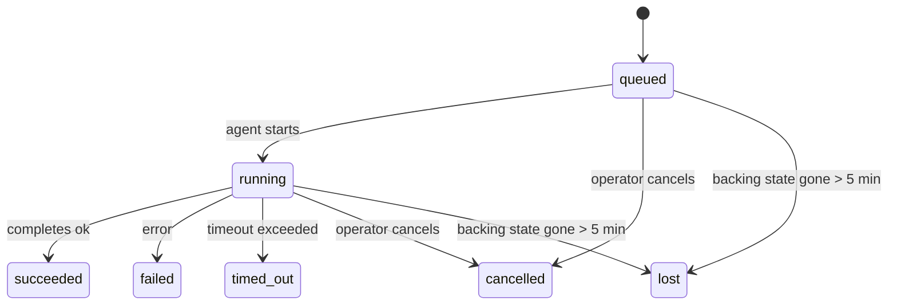

---
read_when:
    - 檢查正在進行或最近完成的背景工作
    - 偵錯分離式代理執行的傳送失敗
    - 了解背景執行如何與工作階段、排程和心跳偵測相關
sidebarTitle: Background tasks
summary: ACP 執行、子代理、排程執行與命令列介面操作的背景工作追蹤
title: 背景工作
x-i18n:
    generated_at: "2026-07-05T11:00:59Z"
    model: gpt-5.5
    postprocess_version: locale-links-v1
    provider: openai
    source_hash: 22f81c67fcdb5ef76f42b6afa96f3348614229f2f90dd870f821c32e9cf452a9
    source_path: automation/tasks.md
    workflow: 16
---

<Note>
在尋找排程安排嗎？請參閱 [Automation](/zh-TW/automation) 以選擇正確的機制。本頁是背景工作的活動帳本，不是排程器。
</Note>

背景任務會追蹤在**主要對話工作階段之外**執行的工作：ACP 執行、子代理衍生、排程工作執行，以及由命令列介面啟動的操作。

任務**不會**取代工作階段、排程工作或心跳偵測；它們是記錄已分離工作發生了什麼、何時發生，以及是否成功的**活動帳本**。

<Note>
並非每次代理執行都會建立任務。心跳偵測回合和一般互動式聊天不會。所有排程執行、ACP 衍生、子代理衍生，以及由閘道分派的命令列介面代理命令都會。
</Note>

## TL;DR

- 任務是**記錄**，不是排程器；排程與心跳偵測決定工作_何時_執行，任務追蹤_發生了什麼_。
- ACP、子代理、所有排程工作和命令列介面操作都會建立任務。心跳偵測回合不會。
- 每個任務都會經過 `queued → running → terminal`（succeeded、failed、timed_out、cancelled 或 lost）。
- 只要排程執行階段仍擁有該工作，排程任務就會保持存活；如果記憶體中的執行階段狀態已消失，任務維護會先檢查持久化的排程執行歷史，再將任務標記為 lost。
- 完成是推送驅動的：分離工作完成時可以直接通知，或喚醒請求者工作階段/心跳偵測，因此狀態輪詢迴圈通常不是正確形態。
- 隔離的排程執行與子代理完成會盡力清理其子工作階段所追蹤的瀏覽器分頁/處理程序，再進行最終清理記帳。
- 隔離的排程交付會在後代子代理工作仍在收尾時抑制過期的中間父回覆，並且在交付前收到最終後代輸出時優先使用該輸出。
- 完成通知會直接傳送到頻道，或排入佇列等待下一次心跳偵測。
- `openclaw tasks list` 會顯示所有任務；`openclaw tasks audit` 會顯示問題。
- 終端記錄會保留 7 天（`lost` 記錄保留 24 小時），之後自動清除。

## 快速開始

<Tabs>
  <Tab title="List and filter">
    ```bash
    # List all tasks (newest first)
    openclaw tasks list

    # Filter by runtime or status
    openclaw tasks list --runtime acp
    openclaw tasks list --status running
    ```

  </Tab>
  <Tab title="Inspect">
    ```bash
    # Show details for a specific task (by task ID, run ID, or session key)
    openclaw tasks show <lookup>
    ```
  </Tab>
  <Tab title="Cancel and notify">
    ```bash
    # Cancel a running task (kills the child session)
    openclaw tasks cancel <lookup>

    # Change notification policy for a task
    openclaw tasks notify <lookup> state_changes
    ```

  </Tab>
  <Tab title="Audit and maintenance">
    ```bash
    # Run a health audit
    openclaw tasks audit

    # Preview or apply maintenance
    openclaw tasks maintenance
    openclaw tasks maintenance --apply
    ```

  </Tab>
  <Tab title="Task flow">
    ```bash
    # Inspect TaskFlow state
    openclaw tasks flow list
    openclaw tasks flow show <lookup>
    openclaw tasks flow cancel <lookup>
    ```
  </Tab>
</Tabs>

## 什麼會建立任務

| 來源                   | 執行階段類型 | 任務記錄建立時機                                                       | 預設通知政策 |
| ---------------------- | ------------ | ---------------------------------------------------------------------- | ------------ |
| ACP 背景執行           | `acp`        | 衍生子 ACP 工作階段                                                    | `done_only`  |
| 子代理編排             | `subagent`   | 透過 `sessions_spawn` 衍生子代理                                       | `done_only`  |
| 排程工作（所有類型）   | `cron`       | 每次排程執行（主要工作階段與隔離執行）                                 | `silent`     |
| 命令列介面操作         | `cli`        | 透過閘道執行的 `openclaw agent` 命令                                   | `silent`     |
| 代理媒體工作           | `cli`        | 以工作階段為後盾的 `image_generate`/`music_generate`/`video_generate` 執行 | `silent`     |

<AccordionGroup>
  <Accordion title="Notify defaults for cron and media">
    排程任務（主要工作階段與隔離執行）使用 `silent` 通知政策；它們會建立記錄以供追蹤，但不會自行產生任務通知；排程擁有自己的交付路徑。

    以工作階段為後盾的 `image_generate`、`music_generate` 和 `video_generate` 執行也使用 `silent` 通知政策。它們仍會建立任務記錄，但完成會作為內部喚醒交還給原始代理工作階段，讓代理自行撰寫後續訊息並附加完成的媒體。請求者代理會遵循其一般可見回覆合約：設定時自動送出最終回覆，或在工作階段要求訊息工具回覆時使用 `message(action="send")` 加上 `NO_REPLY`。如果請求者工作階段不再作用中，或其作用中喚醒失敗，而完成代理漏掉部分或全部產生的媒體，OpenClaw 會向原始頻道目標傳送冪等的直接備援，只包含缺少的媒體。

  </Accordion>
  <Accordion title="Concurrent media-generation guardrail">
    當以工作階段為後盾的媒體產生任務仍處於作用中時，`image_generate`、`music_generate` 和 `video_generate` 會防止意外重試：對相同提示/請求重複呼叫會回傳相符的作用中任務狀態，而不是啟動重複任務；不同的提示則可以啟動自己的任務。當你想從代理端明確查詢進度/狀態時，請使用 `action: "status"`。
  </Accordion>
  <Accordion title="What does not create tasks">
    - 心跳偵測回合；主要工作階段；請參閱 [Heartbeat](/zh-TW/gateway/heartbeat)
    - 一般互動式聊天回合
    - 直接 `/command` 回應

  </Accordion>
</AccordionGroup>

## 任務生命週期



| 狀態        | 含義                                                                        |
| ----------- | --------------------------------------------------------------------------- |
| `queued`    | 已建立，等待代理啟動                                                        |
| `running`   | 代理回合正在主動執行                                                        |
| `succeeded` | 已成功完成                                                                  |
| `failed`    | 已完成但發生錯誤                                                            |
| `timed_out` | 超過設定的逾時                                                              |
| `cancelled` | 由操作員透過 `openclaw tasks cancel` 停止，或該執行已中止                   |
| `lost`      | 執行階段在 5 分鐘寬限期後失去權威後盾狀態                                   |

轉換會自動發生；代理執行生命週期事件（開始、結束、錯誤）會更新任務狀態；你不需要手動管理。

對於作用中的任務記錄，代理執行完成是權威來源。成功的分離執行會最終化為 `succeeded`，一般執行錯誤會最終化為 `failed`，逾時會最終化為 `timed_out`，取消/中止結果會最終化為 `cancelled`。一旦任務進入終端狀態，後續生命週期訊號不會將其降級；即使之後收到成功訊號，由操作員取消或已經是 `failed`/`timed_out`/`lost` 的任務仍會保持原狀。

`lost` 具備執行階段感知能力：

- ACP 任務：只有閘道中仍存活的處理程序內 ACP 回合能證明該執行仍存活；僅有持久化工作階段中繼資料並不足夠。離線命令列介面稽核保持保守，絕不回收 ACP 任務。
- 子代理任務：後盾子工作階段已從目標代理存放區消失（或帶有重新啟動復原墓碑）。
- 排程任務：排程執行階段不再將該工作追蹤為作用中，且持久化的排程執行歷史沒有顯示該次執行的終端結果。離線命令列介面稽核不會將自身空的處理程序內排程執行階段狀態視為權威。
- 命令列介面任務：具有執行 ID/來源 ID 的任務使用即時執行內容，因此在閘道擁有的執行消失後，殘留的子工作階段或聊天工作階段資料列不會讓它們保持存活。沒有執行身分的舊版命令列介面任務仍會退回使用子工作階段。以閘道為後盾的 `openclaw agent` 執行也會從其執行結果最終化，因此已完成的執行不會一直保持作用中，直到清掃器將其標記為 `lost`。

## 交付與通知

當任務達到終端狀態時，OpenClaw 會通知你。有兩種交付路徑：

**直接交付**：如果任務有頻道目標（`requesterOrigin`），完成訊息會直接送到該頻道（Discord、Slack、Telegram 等）。群組與頻道任務完成則會改透過請求者工作階段路由，讓父代理撰寫可見回覆。對於子代理完成，OpenClaw 也會在可用時保留已繫結的執行緒/主題路由，並且可以在放棄直接交付之前，從請求者工作階段儲存的路由（`lastChannel` / `lastTo` / `lastAccountId`）補上缺少的 `to` / 帳號。

**工作階段佇列交付**：如果直接交付失敗或未設定來源，更新會作為系統事件排入請求者的工作階段，並在下一次心跳偵測時顯示。

<Tip>
排入工作階段佇列的任務完成會觸發立即心跳偵測喚醒，因此你會很快看到結果；不必等待下一次排定的心跳偵測滴答。
</Tip>

這表示一般工作流程是推送式的：啟動一次分離工作，然後讓執行階段在完成時喚醒或通知你。只有在需要除錯、介入或明確稽核時才輪詢任務狀態。

### 通知政策

控制你會收到多少關於每個任務的資訊：

| 政策                  | 交付內容                                                |
| --------------------- | ------------------------------------------------------- |
| `done_only`（預設）   | 只有終端狀態（succeeded、failed 等）                    |
| `state_changes`       | 每次狀態轉換與進度更新                                  |
| `silent`              | 完全不交付（排程、命令列介面和媒體任務的預設值）        |

在任務執行期間變更政策：

```bash
openclaw tasks notify <lookup> state_changes
```

## 命令列介面參考

<AccordionGroup>
  <Accordion title="tasks list">
    ```bash
    openclaw tasks list [--runtime <acp|subagent|cron|cli>] [--status <status>] [--json]
    ```

    輸出欄位：任務、種類、狀態、交付、執行、子工作階段、摘要。裸 `openclaw tasks` 的行為與 `openclaw tasks list` 相同。

  </Accordion>
  <Accordion title="tasks show">
    ```bash
    openclaw tasks show <lookup> [--json]
    ```

    查詢權杖接受任務 ID、執行 ID 或工作階段鍵。顯示完整記錄，包括時間、交付狀態、錯誤和終端摘要。

  </Accordion>
  <Accordion title="tasks cancel">
    ```bash
    openclaw tasks cancel <lookup>
    ```

    對於 ACP 和子代理任務，這會終止子工作階段；ACP 和排程取消會透過正在執行的閘道（`tasks.cancel`）路由。對於由命令列介面追蹤的任務，取消會記錄在任務登錄中（沒有單獨的子執行階段控制代碼）。狀態會轉換為 `cancelled`，並在適用時傳送交付通知。

  </Accordion>
  <Accordion title="tasks notify">
    ```bash
    openclaw tasks notify <lookup> <done_only|state_changes|silent>
    ```
  </Accordion>
  <Accordion title="tasks audit">
    ```bash
    openclaw tasks audit [--severity <warn|error>] [--code <name>] [--limit <n>] [--json]
    ```

    在一份報告中顯示任務**與** TaskFlow 的操作問題。偵測到問題時，發現項目也會出現在 `openclaw status`。

    任務發現項目：

    | 發現項目                  | 嚴重性     | 觸發條件                                                                                                     |
    | ------------------------- | ---------- | ------------------------------------------------------------------------------------------------------------ |
    | `stale_queued`            | 警告       | 佇列中超過 10 分鐘                                                                                           |
    | `stale_running`           | 錯誤       | 執行中超過 30 分鐘                                                                                           |
    | `lost`                    | 警告/錯誤  | 由執行階段支援的任務所有權消失；保留的遺失任務在 `cleanupAfter` 前警告，之後變成錯誤                         |
    | `delivery_failed`         | 警告       | 傳送失敗且通知政策不是 `silent`                                                                               |
    | `missing_cleanup`         | 警告       | 終止任務沒有清理時間戳記                                                                                     |
    | `inconsistent_timestamps` | 警告       | 時間軸違規（例如結束時間早於開始時間）                                                                       |

    TaskFlow 發現項目：

    | 發現項目               | 嚴重性     | 觸發條件                                                                    |
    | ---------------------- | ---------- | --------------------------------------------------------------------------- |
    | `restore_failed`       | 錯誤       | 從 SQLite 還原流程登錄失敗                                                   |
    | `stale_running`        | 錯誤       | 執行中的流程超過 30 分鐘未推進                                                |
    | `stale_waiting`        | 警告       | 等待中的流程超過 30 分鐘未推進                                                |
    | `stale_blocked`        | 警告       | 受阻的流程超過 30 分鐘未推進                                                  |
    | `cancel_stuck`         | 警告       | 取消已在 5 分鐘前請求、沒有作用中的子任務，且仍未終止                         |
    | `missing_linked_tasks` | 警告/錯誤  | 過期的受管理流程沒有連結任務或等待狀態                                        |
    | `blocked_task_missing` | 警告       | 受阻流程指向不再存在的任務 ID                                                 |

  </Accordion>
  <Accordion title="任務維護">
    ```bash
    openclaw tasks maintenance [--json]
    openclaw tasks maintenance --apply [--json]
    ```

    使用此命令來預覽或套用任務、TaskFlow 狀態，以及過期排程執行工作階段登錄列的調解、清理標記與修剪。

    調解會感知執行階段：

    - ACP 任務需要閘道中有作用中的進程內回合；子代理任務會檢查其背後的子工作階段。
    - 如果子代理任務的子工作階段有重啟復原墓碑標記，會標記為遺失，而不是視為可復原的支援工作階段。
    - 排程任務會檢查排程執行階段是否仍擁有該作業，然後先從持久化的排程執行記錄/作業狀態復原終止狀態，再退回到 `lost`。只有閘道程序對記憶體中的排程作用中作業集合具有權威性；離線命令列介面稽核會使用持久歷史記錄，但不會只因為該本機集合為空就將排程任務標記為遺失。
    - 具有執行身分的命令列介面任務會檢查擁有者的即時執行內容，而不只是子工作階段或聊天工作階段列。

    完成清理也會感知執行階段：

    - 子代理完成時會盡力先關閉該子工作階段追蹤的瀏覽器分頁/程序，然後公告清理才會繼續。
    - 隔離排程完成時會盡力先關閉該排程工作階段追蹤的瀏覽器分頁/程序，然後執行才會完全拆除。
    - 隔離排程傳送會在需要時等待後代子代理後續作業完成，並抑制過期的父層確認文字，而不是公告它。
    - 子代理完成傳送只使用子項最新的可見助理文字。工具/toolResult 輸出不會提升為子項結果文字。終止且失敗的執行會公告失敗狀態，而不重播擷取到的回覆文字。
    - 清理失敗不會掩蓋真正的任務結果。

    套用維護時，OpenClaw 也會移除超過 7 天的過期 `cron:<jobId>:run:<runId>` 工作階段登錄列，同時保留目前正在執行的排程作業列，並讓非排程工作階段列保持不變。

  </Accordion>
  <Accordion title="任務流程 list | show | cancel">
    ```bash
    openclaw tasks flow list [--status <status>] [--json]
    openclaw tasks flow show <lookup> [--json]
    openclaw tasks flow cancel <lookup>
    ```

    流程查找權杖接受流程 ID 或擁有者鍵。當你關注的是協調用的 [Task Flow](/zh-TW/automation/taskflow)，而不是單一背景任務記錄時，請使用這些命令。

  </Accordion>
</AccordionGroup>

## 聊天任務看板 (`/tasks`)

在任何聊天工作階段中使用 `/tasks`，即可查看連結到該工作階段的背景任務。看板最多顯示五個作用中與最近完成的任務，包含執行階段、狀態、時間，以及進度或錯誤詳細資料。

當目前工作階段沒有可見的連結任務時，`/tasks` 會退回到代理本機任務計數，讓你仍可取得概覽，而不洩漏其他工作階段的詳細資料。

若要查看完整的操作員分類帳，請使用命令列介面：`openclaw tasks list`。

## 狀態整合（任務壓力）

`openclaw status` 包含一行快速掌握的任務資訊：

```
Tasks    2 active · 1 queued · 1 running · 1 issue · audit clean · 6 tracked
```

摘要會計算作用中工作（`queued` + `running`）、失敗（`failed` + `timed_out` + `lost`）、稽核發現項目，以及追蹤記錄總數；JSON 承載也會依執行階段（`acp`、`subagent`、`cron`、`cli`）拆分計數。

`/status` 和 `session_status` 工具都使用感知清理的任務快照：優先顯示作用中任務，隱藏過期列，而終止任務只會在短暫的最近時間窗（5 分鐘）內出現，且當沒有作用中工作時會聚焦於失敗。這會讓狀態卡片保持在此刻重要的事項上。

## 儲存與維護

### 任務所在位置

任務記錄與傳送狀態會持久化在共用的 OpenClaw SQLite 狀態資料庫中：

```
~/.openclaw/state/openclaw.sqlite   (tables: task_runs, task_delivery_state, flow_runs)
```

設定 `OPENCLAW_STATE_DIR` 可將整個狀態根目錄（預設為 `~/.openclaw`）移到其他位置；共用資料庫路徑會隨之移動。

登錄會在首次使用時載入記憶體，並將每次寫入持久化回 SQLite，因此記錄可在閘道重啟後保留。WAL 成長會透過 SQLite 的預設自動檢查點閾值加上定期 `PASSIVE` 檢查點保持有界；關閉和明確維護檢查點會使用 `TRUNCATE`，因此一般關閉可回收 WAL 空間，而不會讓背景清掃器等待作用中讀取者。

舊版安裝的舊式旁車儲存區（`tasks/runs.sqlite`、`flows/registry.sqlite`）會由 `openclaw doctor` 匯入共用資料庫。

### 自動維護

清掃器每 **60 秒** 執行一次（第一次約在閘道啟動後 5 秒），並處理四件事：

<Steps>
  <Step title="調解">
    檢查作用中任務是否仍有權威的執行階段支援。ACP 任務需要作用中的進程內回合，子代理任務使用子工作階段狀態，排程任務使用作用中作業所有權加上持久執行歷史，而具有執行身分的命令列介面任務使用擁有者的執行內容。如果支援狀態消失超過 5 分鐘（無子項的原生子代理任務為 30 分鐘），任務會被標記為 `lost`。
  </Step>
  <Step title="ACP 工作階段修復">
    關閉已終止或孤立的父層擁有一次性 ACP 工作階段；只有在沒有作用中對話繫結保留時，才關閉過期的終止或孤立持久 ACP 工作階段。
  </Step>
  <Step title="清理標記">
    在終止任務上設定 `cleanupAfter` 時間戳記（終止時間 + 保留時間窗）。在保留期間，遺失任務仍會在稽核中顯示為警告；在 `cleanupAfter` 到期後或清理中繼資料遺失時，它們會變成錯誤。
  </Step>
  <Step title="修剪">
    刪除超過其 `cleanupAfter` 日期的記錄。
  </Step>
</Steps>

<Note>
**保留：**終止任務記錄會保留 **7 天**（`lost` 記錄保留 **24 小時**），然後自動修剪。不需要設定。
</Note>

## 任務如何關聯到其他系統

<AccordionGroup>
  <Accordion title="任務與 Task Flow">
    [Task Flow](/zh-TW/automation/taskflow) 是位於背景任務之上的流程協調層。單一流程可在其生命週期中使用受管理或鏡像同步模式協調多個任務。使用 `openclaw tasks` 檢查個別任務記錄，使用 `openclaw tasks flow` 檢查協調用流程。

  </Accordion>
  <Accordion title="任務與排程">
    排程作業定義、執行階段執行狀態，以及執行歷史記錄都位於 OpenClaw 的共用 SQLite 狀態資料庫中。**每次**排程執行都會建立一筆任務記錄，包括主工作階段與隔離工作階段，且通知政策為 `silent`，因此排程執行會受到追蹤，但不會產生自己的任務通知。

    請參閱[排程作業](/zh-TW/automation/cron-jobs)。

  </Accordion>
  <Accordion title="任務與心跳偵測">
    心跳偵測執行是主工作階段回合，不會建立任務記錄。任務完成時，可以觸發心跳偵測喚醒，讓你能立即看到結果。

    請參閱[心跳偵測](/zh-TW/gateway/heartbeat)。

  </Accordion>
  <Accordion title="任務與工作階段">
    任務可以參照 `childSessionKey`（工作執行的位置）和 `requesterSessionKey`（啟動它的人）。其 `agentId` 識別執行工作的代理，而請求者與擁有者欄位會保留啟動與控制內容。工作階段是對話內容；任務則是在其上的活動追蹤。
  </Accordion>
  <Accordion title="任務與代理執行">
    任務的 `runId` 會連結到執行該工作的代理執行。代理生命週期事件（開始、結束、錯誤）會自動更新任務狀態，你不需要手動管理生命週期。
  </Accordion>
</AccordionGroup>

## 相關

- [自動化](/zh-TW/automation) - 一覽所有自動化機制
- [命令列介面：任務](/zh-TW/cli/tasks) - 命令列介面命令參考
- [心跳偵測](/zh-TW/gateway/heartbeat) - 定期主工作階段回合
- [排程任務](/zh-TW/automation/cron-jobs) - 排程背景工作
- [Task Flow](/zh-TW/automation/taskflow) - 任務之上的流程協調
