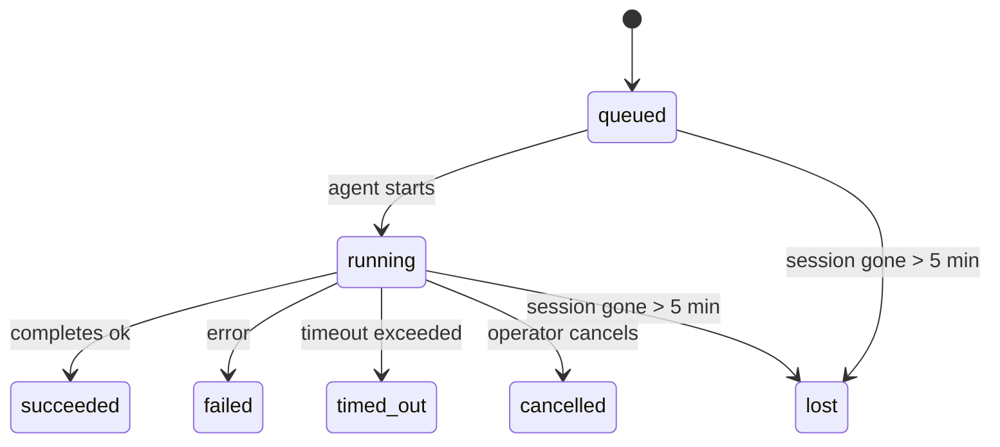

---
read_when:
    - 檢視進行中或最近完成的背景工作
    - 偵錯分離式代理執行的傳遞失敗
    - 了解背景執行如何與工作階段、Cron 和 Heartbeat 相關
sidebarTitle: Background tasks
summary: ACP 執行、子代理、隔離的 Cron 作業和 CLI 操作的背景工作追蹤
title: 背景任務
x-i18n:
    generated_at: "2026-04-30T02:45:25Z"
    model: gpt-5.5
    provider: openai
    source_hash: 4bbf74f3aeea532738b56b83cd2e1a0a3734bfd453da6636b8be985a28ccc027
    source_path: automation/tasks.md
    workflow: 16
---

<Note>
正在尋找排程功能嗎？請參閱[自動化與任務](/zh-TW/automation)以選擇正確機制。本頁是背景工作的活動帳本，不是排程器。
</Note>

背景任務會追蹤在**主要對話工作階段之外**執行的工作：ACP 執行、子代理生成、隔離的 cron 工作執行，以及 CLI 啟動的作業。

任務**不會**取代工作階段、cron 工作或 Heartbeat — 它們是記錄已分離工作發生內容、時間與是否成功的**活動帳本**。

<Note>
不是每次代理執行都會建立任務。Heartbeat 回合與一般互動式聊天不會。所有 cron 執行、ACP 生成、子代理生成與 CLI 代理命令都會。
</Note>

## TL;DR

- 任務是**記錄**，不是排程器 — cron 與 Heartbeat 決定工作_何時_執行，任務追蹤_發生了什麼_。
- ACP、子代理、所有 cron 工作與 CLI 作業都會建立任務。Heartbeat 回合不會。
- 每個任務都會經過 `queued → running → terminal`（succeeded、failed、timed_out、cancelled 或 lost）。
- 只要 cron 執行階段仍擁有該工作，cron 任務就會保持有效；如果
  記憶體中的執行階段狀態已消失，任務維護會先檢查持久化 cron
  執行歷史，然後才將任務標記為 lost。
- 完成是推送驅動的：分離的工作可以在完成時直接通知，或喚醒
  請求者工作階段/Heartbeat，因此狀態輪詢迴圈通常不是正確模式。
- 隔離的 cron 執行與子代理完成會在最終清理簿記前，盡力清理其子工作階段追蹤的瀏覽器分頁/程序。
- 當後代子代理工作仍在收尾時，隔離的 cron 傳遞會抑制過期的暫時父層回覆，並且在最終後代輸出先於傳遞抵達時優先使用它。
- 完成通知會直接傳送到頻道，或排入下一次 Heartbeat。
- `openclaw tasks list` 會顯示所有任務；`openclaw tasks audit` 會顯示問題。
- 終端記錄會保留 7 天，之後自動修剪。

## 快速開始

<Tabs>
  <Tab title="List and filter">
    ```bash
    # List all tasks (newest first)
    openclaw tasks list

    # Filter by runtime or status
    openclaw tasks list --runtime acp
    openclaw tasks list --status running
    ```

  </Tab>
  <Tab title="Inspect">
    ```bash
    # Show details for a specific task (by ID, run ID, or session key)
    openclaw tasks show <lookup>
    ```
  </Tab>
  <Tab title="Cancel and notify">
    ```bash
    # Cancel a running task (kills the child session)
    openclaw tasks cancel <lookup>

    # Change notification policy for a task
    openclaw tasks notify <lookup> state_changes
    ```

  </Tab>
  <Tab title="Audit and maintenance">
    ```bash
    # Run a health audit
    openclaw tasks audit

    # Preview or apply maintenance
    openclaw tasks maintenance
    openclaw tasks maintenance --apply
    ```

  </Tab>
  <Tab title="Task flow">
    ```bash
    # Inspect TaskFlow state
    openclaw tasks flow list
    openclaw tasks flow show <lookup>
    openclaw tasks flow cancel <lookup>
    ```
  </Tab>
</Tabs>

## 什麼會建立任務

| 來源                   | 執行階段類型 | 建立任務記錄的時機                                     | 預設通知政策 |
| ---------------------- | ------------ | ------------------------------------------------------ | ------------ |
| ACP 背景執行           | `acp`        | 生成子 ACP 工作階段                                   | `done_only`  |
| 子代理協調             | `subagent`   | 透過 `sessions_spawn` 生成子代理                      | `done_only`  |
| Cron 工作（所有類型）  | `cron`       | 每次 cron 執行（主要工作階段與隔離）                  | `silent`     |
| CLI 作業               | `cli`        | 透過 Gateway 執行的 `openclaw agent` 命令             | `silent`     |
| 代理媒體工作           | `cli`        | 由工作階段支援的 `video_generate` 執行                | `silent`     |

<AccordionGroup>
  <Accordion title="Notify defaults for cron and media">
    主要工作階段 cron 任務預設使用 `silent` 通知政策 — 它們會建立記錄以供追蹤，但不會產生通知。隔離的 cron 任務也預設為 `silent`，但因為它們在自己的工作階段中執行，所以更可見。

    由工作階段支援的 `video_generate` 執行也使用 `silent` 通知政策。它們仍會建立任務記錄，但完成結果會以內部喚醒的形式交回原始代理工作階段，讓代理可以撰寫後續訊息並自行附加完成的影片。如果你選擇啟用 `tools.media.asyncCompletion.directSend`，非同步 `music_generate` 與 `video_generate` 完成會先嘗試直接頻道傳遞，之後才退回請求者工作階段喚醒路徑。

  </Accordion>
  <Accordion title="Concurrent video_generate guardrail">
    當由工作階段支援的 `video_generate` 任務仍處於作用中時，該工具也會作為防護：同一工作階段中重複的 `video_generate` 呼叫會傳回作用中任務狀態，而不是開始第二個並行生成。當你需要從代理端明確查詢進度/狀態時，請使用 `action: "status"`。
  </Accordion>
  <Accordion title="What does not create tasks">
    - Heartbeat 回合 — 主要工作階段；請參閱 [Heartbeat](/zh-TW/gateway/heartbeat)
    - 一般互動式聊天回合
    - 直接 `/command` 回應

  </Accordion>
</AccordionGroup>

## 任務生命週期



| 狀態        | 意義                                                                       |
| ----------- | -------------------------------------------------------------------------- |
| `queued`    | 已建立，等待代理啟動                                                       |
| `running`   | 代理回合正在主動執行                                                       |
| `succeeded` | 已成功完成                                                                 |
| `failed`    | 已完成但發生錯誤                                                           |
| `timed_out` | 超過設定的逾時                                                             |
| `cancelled` | 由操作者透過 `openclaw tasks cancel` 停止                                  |
| `lost`      | 執行階段在 5 分鐘寬限期後失去權威後援狀態                                 |

轉換會自動發生 — 當關聯的代理執行結束時，任務狀態會更新為相符狀態。

代理執行完成是作用中任務記錄的權威來源。成功的分離執行會最終化為 `succeeded`，一般執行錯誤會最終化為 `failed`，逾時或中止結果會最終化為 `timed_out`。如果操作者已取消任務，或執行階段已記錄較強的終端狀態，例如 `failed`、`timed_out` 或 `lost`，後續的成功訊號不會將該終端狀態降級。

`lost` 具備執行階段感知能力：

- ACP 任務：後援 ACP 子工作階段中繼資料消失。
- 子代理任務：後援子工作階段從目標代理儲存中消失。
- Cron 任務：cron 執行階段不再將該工作追蹤為作用中，且持久化
  cron 執行歷史未顯示該次執行的終端結果。離線 CLI
  稽核不會將其自身空的程序內 cron 執行階段狀態視為權威。
- CLI 任務：隔離的子工作階段任務使用子工作階段；由聊天支援的
  CLI 任務則改用即時執行內容，因此殘留的
  頻道/群組/直接工作階段列不會讓它們保持有效。由 Gateway 支援的
  `openclaw agent` 執行也會從其執行結果最終化，因此已完成的執行
  不會一直保持作用中直到清掃器將它們標記為 `lost`。

## 傳遞與通知

當任務達到終端狀態時，OpenClaw 會通知你。共有兩種傳遞路徑：

**直接傳遞** — 如果任務有頻道目標（`requesterOrigin`），完成訊息會直接送到該頻道（Telegram、Discord、Slack 等）。對於子代理完成，OpenClaw 也會在可用時保留繫結的討論串/主題路由，並且可以在放棄直接傳遞前，從請求者工作階段儲存的路由（`lastChannel` / `lastTo` / `lastAccountId`）補上缺少的 `to` / 帳號。

**工作階段佇列傳遞** — 如果直接傳遞失敗或未設定來源，更新會以系統事件形式排入請求者的工作階段，並在下一次 Heartbeat 中顯示。

<Tip>
任務完成會觸發立即 Heartbeat 喚醒，讓你快速看到結果 — 你不必等到下一個排定的 Heartbeat tick。
</Tip>

這表示通常的工作流程是推送式：啟動一次分離工作，然後讓執行階段在完成時喚醒或通知你。只有在需要偵錯、介入或明確稽核時，才輪詢任務狀態。

### 通知政策

控制每個任務要聽到多少訊息：

| 政策                  | 傳遞內容                                                                |
| --------------------- | ----------------------------------------------------------------------- |
| `done_only`（預設）   | 僅終端狀態（succeeded、failed 等）— **這是預設值**                    |
| `state_changes`       | 每次狀態轉換與進度更新                                                  |
| `silent`              | 完全不傳遞                                                              |

在任務執行時變更政策：

```bash
openclaw tasks notify <lookup> state_changes
```

## CLI 參考

<AccordionGroup>
  <Accordion title="tasks list">
    ```bash
    openclaw tasks list [--runtime <acp|subagent|cron|cli>] [--status <status>] [--json]
    ```

    輸出欄位：任務 ID、種類、狀態、傳遞、執行 ID、子工作階段、摘要。

  </Accordion>
  <Accordion title="tasks show">
    ```bash
    openclaw tasks show <lookup>
    ```

    查詢權杖接受任務 ID、執行 ID 或工作階段鍵。顯示完整記錄，包括時間、傳遞狀態、錯誤與終端摘要。

  </Accordion>
  <Accordion title="tasks cancel">
    ```bash
    openclaw tasks cancel <lookup>
    ```

    對 ACP 與子代理任務而言，這會終止子工作階段。對 CLI 追蹤的任務而言，取消會記錄在任務登錄中（沒有單獨的子執行階段控制代碼）。狀態會轉換為 `cancelled`，並在適用時傳送傳遞通知。

  </Accordion>
  <Accordion title="tasks notify">
    ```bash
    openclaw tasks notify <lookup> <done_only|state_changes|silent>
    ```
  </Accordion>
  <Accordion title="tasks audit">
    ```bash
    openclaw tasks audit [--json]
    ```

    顯示營運問題。偵測到問題時，發現項目也會出現在 `openclaw status` 中。

    | 發現                      | 嚴重性     | 觸發條件                                                                                                     |
    | ------------------------- | ---------- | ------------------------------------------------------------------------------------------------------------ |
    | `stale_queued`            | warn       | 已佇列超過 10 分鐘                                                                                           |
    | `stale_running`           | error      | 已執行超過 30 分鐘                                                                                           |
    | `lost`                    | warn/error | 由執行階段支援的任務所有權已消失；保留的遺失任務在 `cleanupAfter` 前會警告，之後會變成錯誤                  |
    | `delivery_failed`         | warn       | 傳遞失敗且通知原則不是 `silent`                                                                               |
    | `missing_cleanup`         | warn       | 沒有清理時間戳記的終端任務                                                                                   |
    | `inconsistent_timestamps` | warn       | 時間軸違規（例如結束早於開始）                                                                                |

  </Accordion>
  <Accordion title="tasks maintenance">
    ```bash
    openclaw tasks maintenance [--json]
    openclaw tasks maintenance --apply [--json]
    ```

    使用此命令預覽或套用任務與 Task Flow 狀態的協調、清理標記與修剪。

    協調會感知執行階段：

    - ACP/subagent 任務會檢查其背後的子工作階段。
    - Cron 任務會檢查 cron 執行階段是否仍擁有該作業，然後先從持久化的 cron 執行記錄/作業狀態復原終端狀態，再退回到 `lost`。只有 Gateway 程序對記憶體內的 cron 作用中作業集合具有權威性；離線 CLI 稽核會使用持久化歷史，但不會只因為該本機 Set 是空的就將 cron 任務標記為遺失。
    - 由聊天支援的 CLI 任務會檢查擁有者的即時執行脈絡，而不只是聊天工作階段列。

    完成清理也會感知執行階段：

    - Subagent 完成會盡力關閉子工作階段追蹤的瀏覽器分頁/程序，然後繼續公告清理。
    - 隔離的 cron 完成會盡力關閉 cron 工作階段追蹤的瀏覽器分頁/程序，然後執行才會完全拆除。
    - 隔離的 cron 傳遞會在需要時等待後代 subagent 的後續作業，並抑制過時的父層確認文字，而不是公告它。
    - Subagent 完成傳遞會偏好最新可見的助理文字；如果該文字為空，則退回到已清理的最新 tool/toolResult 文字，且只有逾時的工具呼叫執行可以收斂成簡短的部分進度摘要。終端失敗執行會公告失敗狀態，而不重播擷取的回覆文字。
    - 清理失敗不會遮蔽真正的任務結果。

  </Accordion>
  <Accordion title="tasks flow list | show | cancel">
    ```bash
    openclaw tasks flow list [--status <status>] [--json]
    openclaw tasks flow show <lookup> [--json]
    openclaw tasks flow cancel <lookup>
    ```

    當你關心的是協調中的 Task Flow，而不是單一背景任務記錄時，使用這些命令。

  </Accordion>
</AccordionGroup>

## 聊天任務看板 (`/tasks`)

在任何聊天工作階段中使用 `/tasks`，即可查看連結到該工作階段的背景任務。看板會顯示作用中與最近完成的任務，以及執行階段、狀態、時間和進度或錯誤詳細資訊。

當目前工作階段沒有可見的連結任務時，`/tasks` 會退回到 agent 本機的任務計數，因此你仍可取得概覽，而不會洩漏其他工作階段的詳細資訊。

如需完整的操作員分類帳，請使用 CLI：`openclaw tasks list`。

## 狀態整合（任務壓力）

`openclaw status` 包含一眼可讀的任務摘要：

```
Tasks: 3 queued · 2 running · 1 issues
```

摘要會回報：

- **active** — `queued` + `running` 的計數
- **failures** — `failed` + `timed_out` + `lost` 的計數
- **byRuntime** — 依 `acp`、`subagent`、`cron`、`cli` 分解

`/status` 和 `session_status` 工具都會使用可感知清理的任務快照：優先顯示作用中任務、隱藏過時的已完成列，且只有在沒有作用中工作剩下時，才浮現最近的失敗。這會讓狀態卡片聚焦於目前重要的事項。

## 儲存與維護

### 任務所在位置

任務記錄會持久化到 SQLite，位於：

```
$OPENCLAW_STATE_DIR/tasks/runs.sqlite
```

登錄檔會在 gateway 啟動時載入記憶體，並將寫入同步到 SQLite，以便在重新啟動後保持持久性。
Gateway 會使用 SQLite 預設的 autocheckpoint 閾值，加上定期與關機時的 `TRUNCATE` checkpoint，讓 SQLite write-ahead log 維持有界。

### 自動維護

清掃器每 **60 秒** 執行一次，處理四件事：

<Steps>
  <Step title="協調">
    檢查作用中任務是否仍有具權威性的執行階段支援。ACP/subagent 任務使用子工作階段狀態，cron 任務使用作用中作業所有權，而由聊天支援的 CLI 任務則使用擁有者的執行脈絡。如果該支援狀態消失超過 5 分鐘，任務會被標記為 `lost`。
  </Step>
  <Step title="ACP 工作階段修復">
    關閉終端或孤立的父層擁有一次性 ACP 工作階段，且只有在沒有作用中對話繫結保留時，才關閉過時的終端或孤立的持久 ACP 工作階段。
  </Step>
  <Step title="清理標記">
    在終端任務上設定 `cleanupAfter` 時間戳記（endedAt + 7 天）。在保留期間，遺失任務仍會在稽核中顯示為警告；在 `cleanupAfter` 到期後，或清理中繼資料缺失時，它們會是錯誤。
  </Step>
  <Step title="修剪">
    刪除超過其 `cleanupAfter` 日期的記錄。
  </Step>
</Steps>

<Note>
**保留：**終端任務記錄會保留 **7 天**，然後自動修剪。不需要設定。
</Note>

## 任務如何與其他系統相關

<AccordionGroup>
  <Accordion title="任務與 Task Flow">
    [Task Flow](/zh-TW/automation/taskflow) 是位於背景任務之上的流程協調層。單一流程可在其生命週期中使用受管理或鏡像同步模式來協調多個任務。使用 `openclaw tasks` 檢查個別任務記錄，使用 `openclaw tasks flow` 檢查協調中的流程。

    詳情請參閱 [Task Flow](/zh-TW/automation/taskflow)。

  </Accordion>
  <Accordion title="任務與 cron">
    cron 作業**定義**位於 `~/.openclaw/cron/jobs.json`；執行階段執行狀態位於旁邊的 `~/.openclaw/cron/jobs-state.json`。**每次** cron 執行都會建立一筆任務記錄，包括主工作階段與隔離執行。主工作階段 cron 任務預設為 `silent` 通知原則，因此可以追蹤而不產生通知。

    請參閱 [Cron 作業](/zh-TW/automation/cron-jobs)。

  </Accordion>
  <Accordion title="任務與 heartbeat">
    Heartbeat 執行是主工作階段回合，它們不會建立任務記錄。任務完成時，可以觸發 heartbeat 喚醒，讓你能立即看到結果。

    請參閱 [Heartbeat](/zh-TW/gateway/heartbeat)。

  </Accordion>
  <Accordion title="任務與工作階段">
    任務可能會參照 `childSessionKey`（工作執行處）與 `requesterSessionKey`（啟動者）。工作階段是對話脈絡；任務是在其上的活動追蹤。
  </Accordion>
  <Accordion title="任務與 agent 執行">
    任務的 `runId` 會連結到正在執行工作的 agent 執行。Agent 生命週期事件（開始、結束、錯誤）會自動更新任務狀態，你不需要手動管理生命週期。
  </Accordion>
</AccordionGroup>

## 相關

- [自動化與任務](/zh-TW/automation) — 所有自動化機制一覽
- [CLI：任務](/zh-TW/cli/tasks) — CLI 命令參考
- [Heartbeat](/zh-TW/gateway/heartbeat) — 週期性主工作階段回合
- [排程任務](/zh-TW/automation/cron-jobs) — 排程背景工作
- [Task Flow](/zh-TW/automation/taskflow) — 任務之上的流程協調
