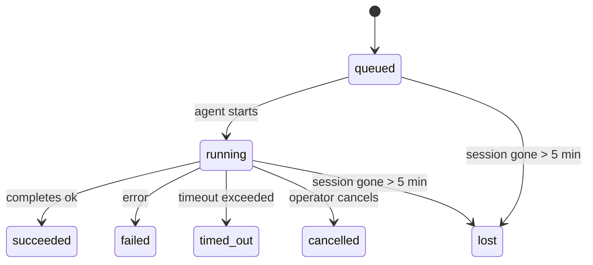

---
read_when:
    - 檢查進行中或最近完成的背景工作
    - 偵錯分離式代理執行的遞送失敗
    - 了解背景執行作業與工作階段、Cron 和 Heartbeat 的關係
sidebarTitle: Background tasks
summary: 背景任務追蹤，適用於 ACP 執行、子代理程式、隔離式 Cron 工作與 CLI 操作
title: 背景任務
x-i18n:
    generated_at: "2026-05-10T19:21:09Z"
    model: gpt-5.5
    provider: openai
    source_hash: 5764a89634f90181d826ff3990ec8dac9538239074934d30fd446c1eb4564869
    source_path: automation/tasks.md
    workflow: 16
---

<Note>
正在尋找排程？請參閱 [自動化與任務](/zh-TW/automation) 以選擇正確的機制。本頁是背景工作的活動帳本，不是排程器。
</Note>

背景任務會追蹤在**主要對話工作階段之外**執行的工作：ACP 執行、子代理產生、隔離 Cron 工作執行，以及 CLI 啟動的操作。

任務**不會**取代工作階段、Cron 工作或 Heartbeat - 它們是**活動帳本**，記錄發生了哪些分離式工作、何時發生，以及是否成功。

<Note>
並非每次代理執行都會建立任務。Heartbeat 回合和一般互動式聊天不會。所有 Cron 執行、ACP 產生、子代理產生，以及 CLI 代理命令都會。
</Note>

## TL;DR

- 任務是**記錄**，不是排程器 - Cron 和 Heartbeat 決定工作_何時_執行，任務追蹤_發生了什麼_。
- ACP、子代理、所有 Cron 工作，以及 CLI 操作都會建立任務。Heartbeat 回合不會。
- 每個任務都會經過 `queued → running → terminal`（succeeded、failed、timed_out、cancelled 或 lost）。
- 只要 Cron 執行階段仍擁有該工作，Cron 任務就會保持作用中；如果
  記憶體中的執行階段狀態已消失，任務維護會先檢查持久化的 Cron
  執行歷史，再將任務標記為 lost。
- 完成是推送驅動的：分離式工作完成時可以直接通知，或喚醒
  請求者工作階段/Heartbeat，因此狀態輪詢迴圈通常不是正確形態。
- 隔離 Cron 執行和子代理完成時，會盡力清理其子工作階段追蹤的瀏覽器分頁/程序，然後才進行最終清理簿記。
- 隔離 Cron 投遞會在後代子代理工作仍在收尾時，抑制過時的中途父層回覆，並在最終後代輸出於投遞前抵達時優先使用該輸出。
- 完成通知會直接投遞到頻道，或排入下一次 Heartbeat。
- `openclaw tasks list` 會顯示所有任務；`openclaw tasks audit` 會浮現問題。
- 終端記錄會保留 7 天，然後自動修剪。

## 快速開始

<Tabs>
  <Tab title="列出與篩選">
    ```bash
    # List all tasks (newest first)
    openclaw tasks list

    # Filter by runtime or status
    openclaw tasks list --runtime acp
    openclaw tasks list --status running
    ```

  </Tab>
  <Tab title="檢查">
    ```bash
    # Show details for a specific task (by ID, run ID, or session key)
    openclaw tasks show <lookup>
    ```
  </Tab>
  <Tab title="取消與通知">
    ```bash
    # Cancel a running task (kills the child session)
    openclaw tasks cancel <lookup>

    # Change notification policy for a task
    openclaw tasks notify <lookup> state_changes
    ```

  </Tab>
  <Tab title="稽核與維護">
    ```bash
    # Run a health audit
    openclaw tasks audit

    # Preview or apply maintenance
    openclaw tasks maintenance
    openclaw tasks maintenance --apply
    ```

  </Tab>
  <Tab title="任務流程">
    ```bash
    # Inspect TaskFlow state
    openclaw tasks flow list
    openclaw tasks flow show <lookup>
    openclaw tasks flow cancel <lookup>
    ```
  </Tab>
</Tabs>

## 什麼會建立任務

| 來源                   | 執行階段類型 | 建立任務記錄的時機                                     | 預設通知政策 |
| ---------------------- | ------------ | ------------------------------------------------------ | ------------ |
| ACP 背景執行           | `acp`        | 產生子 ACP 工作階段                                    | `done_only`  |
| 子代理協調             | `subagent`   | 透過 `sessions_spawn` 產生子代理                       | `done_only`  |
| Cron 工作（所有類型）  | `cron`       | 每次 Cron 執行（主要工作階段與隔離執行）               | `silent`     |
| CLI 操作               | `cli`        | 透過 Gateway 執行的 `openclaw agent` 命令              | `silent`     |
| 代理媒體工作           | `cli`        | 由工作階段支援的 `music_generate`/`video_generate` 執行 | `silent`     |

<AccordionGroup>
  <Accordion title="Cron 與媒體的通知預設值">
    主要工作階段 Cron 任務預設使用 `silent` 通知政策 - 它們會建立記錄供追蹤，但不會產生通知。隔離 Cron 任務也預設為 `silent`，但因為它們在自己的工作階段中執行，所以更容易看見。

    由工作階段支援的 `music_generate` 和 `video_generate` 執行也使用 `silent` 通知政策。它們仍會建立任務記錄，但完成會作為內部喚醒交回原始代理工作階段，讓代理可以寫入後續訊息並自行附上完成的媒體。群組/頻道完成會遵循一般可見回覆政策，因此當來源投遞需要時，代理會使用訊息工具。如果完成代理在僅工具路由中無法產生訊息工具投遞證據，OpenClaw 會將完成後備訊息直接傳送到原始頻道，而不是讓媒體保持私密。

  </Accordion>
  <Accordion title="並行 video_generate 護欄">
    當由工作階段支援的 `video_generate` 任務仍在作用中時，該工具也會作為護欄：同一工作階段中重複的 `video_generate` 呼叫會傳回作用中任務狀態，而不是啟動第二個並行生成。當你想從代理端明確查詢進度/狀態時，請使用 `action: "status"`。
  </Accordion>
  <Accordion title="什麼不會建立任務">
    - Heartbeat 回合 - 主要工作階段；請參閱 [Heartbeat](/zh-TW/gateway/heartbeat)
    - 一般互動式聊天回合
    - 直接 `/command` 回應

  </Accordion>
</AccordionGroup>

## 任務生命週期



| 狀態        | 意義                                                                       |
| ----------- | -------------------------------------------------------------------------- |
| `queued`    | 已建立，正在等待代理啟動                                                   |
| `running`   | 代理回合正在主動執行                                                       |
| `succeeded` | 已成功完成                                                                 |
| `failed`    | 已完成但發生錯誤                                                           |
| `timed_out` | 超過設定的逾時                                                             |
| `cancelled` | 操作者透過 `openclaw tasks cancel` 停止                                    |
| `lost`      | 執行階段在 5 分鐘寬限期後失去具權威性的支援狀態                            |

轉換會自動發生 - 當相關代理執行結束時，任務狀態會更新為相符狀態。

代理執行完成是作用中任務記錄的權威依據。成功的分離式執行會最終化為 `succeeded`，一般執行錯誤會最終化為 `failed`，逾時或中止結果會最終化為 `timed_out`。如果操作者已經取消任務，或執行階段已經記錄較強的終端狀態，例如 `failed`、`timed_out` 或 `lost`，較晚的成功訊號不會降級該終端狀態。

`lost` 具備執行階段感知：

- ACP 任務：支援的 ACP 子工作階段中繼資料消失。
- 子代理任務：支援的子工作階段從目標代理儲存中消失。
- Cron 任務：Cron 執行階段不再將工作追蹤為作用中，且持久化的
  Cron 執行歷史沒有顯示該次執行的終端結果。離線 CLI
  稽核不會將自身空的程序內 Cron 執行階段狀態視為權威。
- CLI 任務：具有執行 ID/來源 ID 的任務會使用即時執行內容，因此
  殘留的子工作階段或聊天工作階段列，不會在 Gateway 擁有的執行消失後
  讓它們保持作用中。沒有執行身分的舊式 CLI 任務仍會
  回退到子工作階段。Gateway 支援的 `openclaw agent` 執行也會
  從其執行結果最終化，因此已完成的執行不會一直維持作用中，直到清掃器
  將它們標記為 `lost`。

## 投遞與通知

當任務到達終端狀態時，OpenClaw 會通知你。有兩種投遞路徑：

**直接投遞** - 如果任務有頻道目標（`requesterOrigin`），完成訊息會直接送到該頻道（Telegram、Discord、Slack 等）。群組和頻道任務完成則會改由請求者工作階段路由，讓父代理可以寫入可見回覆。對於子代理完成，OpenClaw 也會在可用時保留繫結的討論串/主題路由，並可在放棄直接投遞前，從請求者工作階段儲存的路由（`lastChannel` / `lastTo` / `lastAccountId`）填補缺少的 `to` / 帳號。

**工作階段佇列投遞** - 如果直接投遞失敗或未設定來源，更新會作為系統事件排入請求者工作階段，並在下一次 Heartbeat 浮現。

<Tip>
任務完成會觸發立即的 Heartbeat 喚醒，讓你快速看到結果 - 你不必等待下一次排定的 Heartbeat tick。
</Tip>

這表示一般工作流程是推送式：啟動一次分離式工作，然後讓執行階段在完成時喚醒或通知你。只有在需要除錯、介入或明確稽核時，才輪詢任務狀態。

### 通知政策

控制你會收到多少關於每個任務的訊息：

| 政策                  | 投遞內容                                                                |
| --------------------- | ----------------------------------------------------------------------- |
| `done_only`（預設）   | 僅終端狀態（succeeded、failed 等）- **這是預設值**                      |
| `state_changes`       | 每個狀態轉換與進度更新                                                  |
| `silent`              | 完全不通知                                                              |

在任務執行中變更政策：

```bash
openclaw tasks notify <lookup> state_changes
```

## CLI 參考

<AccordionGroup>
  <Accordion title="tasks list">
    ```bash
    openclaw tasks list [--runtime <acp|subagent|cron|cli>] [--status <status>] [--json]
    ```

    輸出欄位：任務 ID、種類、狀態、投遞、執行 ID、子工作階段、摘要。

  </Accordion>
  <Accordion title="tasks show">
    ```bash
    openclaw tasks show <lookup>
    ```

    查詢權杖接受任務 ID、執行 ID 或工作階段鍵。顯示完整記錄，包括時間、投遞狀態、錯誤和終端摘要。

  </Accordion>
  <Accordion title="tasks cancel">
    ```bash
    openclaw tasks cancel <lookup>
    ```

    對於 ACP 和子代理任務，這會終止子工作階段。對於 CLI 追蹤的任務，取消會記錄在任務登錄中（沒有獨立的子執行階段控制代碼）。狀態會轉換為 `cancelled`，並在適用時傳送投遞通知。

  </Accordion>
  <Accordion title="tasks notify">
    ```bash
    openclaw tasks notify <lookup> <done_only|state_changes|silent>
    ```
  </Accordion>
  <Accordion title="tasks audit">
    ```bash
    openclaw tasks audit [--json]
    ```

    浮現操作問題。偵測到問題時，發現項目也會出現在 `openclaw status` 中。

    | 發現項目                  | 嚴重性     | 觸發條件                                                                                                      |
    | ------------------------- | ---------- | ------------------------------------------------------------------------------------------------------------ |
    | `stale_queued`            | warn       | 佇列中超過 10 分鐘                                                                                           |
    | `stale_running`           | error      | 執行中超過 30 分鐘                                                                                           |
    | `lost`                    | warn/error | 由執行階段支援的任務擁有權消失；保留的遺失任務在 `cleanupAfter` 前會發出警告，之後會變成錯誤                 |
    | `delivery_failed`         | warn       | 傳遞失敗，且通知政策不是 `silent`                                                                             |
    | `missing_cleanup`         | warn       | 終止任務沒有清理時間戳記                                                                                     |
    | `inconsistent_timestamps` | warn       | 時間軸違規（例如結束早於開始）                                                                               |

  </Accordion>
  <Accordion title="tasks maintenance">
    ```bash
    openclaw tasks maintenance [--json]
    openclaw tasks maintenance --apply [--json]
    ```

    使用這個命令來預覽或套用任務、Task Flow 狀態，以及過期 Cron 執行工作階段登錄資料列的重新協調、清理標記與剪除。

    重新協調會感知執行階段：

    - ACP/subagent 任務會檢查其背後的子工作階段。
    - 子工作階段有重新啟動復原墓碑記錄的 subagent 任務，會被標記為遺失，而不是視為可復原的支援工作階段。
    - Cron 任務會檢查 Cron 執行階段是否仍擁有該工作，然後先從持久化的 Cron 執行日誌/工作狀態復原終止狀態，再回退為 `lost`。只有 Gateway 程序對記憶體內的 Cron 作用中工作集合具有權威性；離線 CLI 稽核會使用持久歷史，但不會只因為該本機 Set 為空，就將 Cron 任務標記為遺失。
    - 具有執行身分的 CLI 任務會檢查擁有者的即時執行內容，而不只是子工作階段或聊天工作階段資料列。

    完成清理也會感知執行階段：

    - Subagent 完成時，會在宣告清理繼續前，盡力關閉子工作階段追蹤的瀏覽器分頁/程序。
    - 隔離的 Cron 完成時，會在執行完全拆除前，盡力關閉 Cron 工作階段追蹤的瀏覽器分頁/程序。
    - 隔離的 Cron 傳遞會在需要時等待後代 subagent 的後續處理，並抑制過期的父層確認文字，而不是宣告它。
    - Subagent 完成傳遞會優先使用最新可見的 assistant 文字；如果為空，則回退為清理過的最新 tool/toolResult 文字，而僅因逾時產生的工具呼叫執行可折疊成簡短的部分進度摘要。終止失敗的執行會宣告失敗狀態，而不重播擷取的回覆文字。
    - 清理失敗不會遮蔽真正的任務結果。

    套用維護時，OpenClaw 也會移除超過 7 天的過期 `cron:<jobId>:run:<uuid>` 工作階段登錄資料列，同時保留目前正在執行的 Cron 工作資料列，並讓非 Cron 工作階段資料列保持不變。

  </Accordion>
  <Accordion title="tasks flow list | show | cancel">
    ```bash
    openclaw tasks flow list [--status <status>] [--json]
    openclaw tasks flow show <lookup> [--json]
    openclaw tasks flow cancel <lookup>
    ```

    當你關注的是負責協調的 Task Flow，而不是單一背景任務記錄時，請使用這些命令。

  </Accordion>
</AccordionGroup>

## 聊天任務看板 (`/tasks`)

在任何聊天工作階段中使用 `/tasks`，即可查看連結到該工作階段的背景任務。看板會顯示作用中與最近完成的任務，包含執行階段、狀態、時間，以及進度或錯誤詳細資訊。

當目前工作階段沒有可見的已連結任務時，`/tasks` 會回退到 agent 本機任務計數，因此你仍可取得概覽，而不會洩漏其他工作階段的詳細資訊。

若要查看完整的操作員總帳，請使用 CLI：`openclaw tasks list`。

## 狀態整合（任務壓力）

`openclaw status` 會包含一目了然的任務摘要：

```
Tasks: 3 queued · 2 running · 1 issues
```

摘要會回報：

- **active** - `queued` + `running` 的數量
- **failures** - `failed` + `timed_out` + `lost` 的數量
- **byRuntime** - 依 `acp`、`subagent`、`cron`、`cli` 細分

`/status` 和 `session_status` 工具都會使用感知清理的任務快照：優先顯示作用中任務、隱藏過期的已完成資料列，且只有在沒有剩餘作用中工作時，才浮現最近的失敗。這會讓狀態卡片聚焦在目前重要的事項上。

## 儲存與維護

### 任務存放位置

任務記錄會持久化到 SQLite：

```
$OPENCLAW_STATE_DIR/tasks/runs.sqlite
```

登錄資料會在 Gateway 啟動時載入記憶體，並將寫入同步到 SQLite，以便在重新啟動之間保持耐久性。
Gateway 會透過 SQLite 的預設自動檢查點閾值，加上週期性和關機時的 `TRUNCATE` 檢查點，讓 SQLite 預寫式日誌維持在有界範圍內。

### 自動維護

清掃器每 **60 秒** 執行一次，並處理四件事：

<Steps>
  <Step title="重新協調">
    檢查作用中任務是否仍有權威執行階段支援。ACP/subagent 任務使用子工作階段狀態，Cron 任務使用作用中工作擁有權，而具有執行身分的 CLI 任務使用擁有者的執行內容。如果該支援狀態消失超過 5 分鐘，任務會被標記為 `lost`。
  </Step>
  <Step title="ACP 工作階段修復">
    關閉終止或孤立、由父層擁有的一次性 ACP 工作階段；並且只有在沒有作用中的對話繫結時，才關閉過期的終止或孤立持久 ACP 工作階段。
  </Step>
  <Step title="清理標記">
    在終止任務上設定 `cleanupAfter` 時間戳記（endedAt + 7 天）。保留期間內，遺失任務在稽核中仍會以警告顯示；`cleanupAfter` 到期後，或清理中繼資料缺失時，則會變成錯誤。
  </Step>
  <Step title="剪除">
    刪除超過其 `cleanupAfter` 日期的記錄。
  </Step>
</Steps>

<Note>
**保留：** 終止任務記錄會保留 **7 天**，之後自動剪除。不需要設定。
</Note>

## 任務如何與其他系統相關

<AccordionGroup>
  <Accordion title="任務與 Task Flow">
    [Task Flow](/zh-TW/automation/taskflow) 是位於背景任務之上的流程協調層。單一流程可在其生命週期中，使用受管理或鏡像同步模式來協調多個任務。使用 `openclaw tasks` 檢查個別任務記錄，並使用 `openclaw tasks flow` 檢查負責協調的流程。

    詳情請參閱 [Task Flow](/zh-TW/automation/taskflow)。

  </Accordion>
  <Accordion title="任務與 Cron">
    Cron 工作**定義**位於 `~/.openclaw/cron/jobs.json`；執行階段執行狀態則位於旁邊的 `~/.openclaw/cron/jobs-state.json`。**每次** Cron 執行都會建立一筆任務記錄，包括主工作階段與隔離工作階段。主工作階段 Cron 任務預設使用 `silent` 通知政策，因此可進行追蹤而不產生通知。

    請參閱 [Cron 工作](/zh-TW/automation/cron-jobs)。

  </Accordion>
  <Accordion title="任務與 Heartbeat">
    Heartbeat 執行是主工作階段回合，不會建立任務記錄。當任務完成時，它可以觸發 Heartbeat 喚醒，讓你能迅速看到結果。

    請參閱 [Heartbeat](/zh-TW/gateway/heartbeat)。

  </Accordion>
  <Accordion title="任務與工作階段">
    任務可以參照 `childSessionKey`（工作執行位置）和 `requesterSessionKey`（啟動它的人）。工作階段是對話內容；任務則是在其上的活動追蹤。
  </Accordion>
  <Accordion title="任務與 agent 執行">
    任務的 `runId` 會連結到執行工作的 agent 執行。Agent 生命週期事件（開始、結束、錯誤）會自動更新任務狀態，你不需要手動管理生命週期。
  </Accordion>
</AccordionGroup>

## 相關

- [自動化與任務](/zh-TW/automation) - 一覽所有自動化機制
- [CLI：任務](/zh-TW/cli/tasks) - CLI 命令參考
- [Heartbeat](/zh-TW/gateway/heartbeat) - 週期性的主工作階段回合
- [排程任務](/zh-TW/automation/cron-jobs) - 排程背景工作
- [Task Flow](/zh-TW/automation/taskflow) - 任務之上的流程協調
