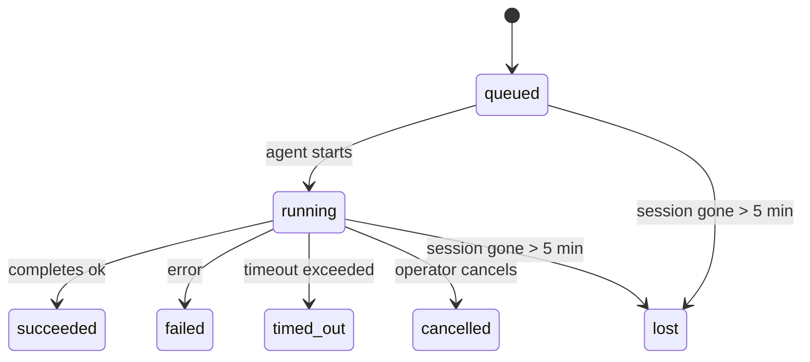

---
read_when:
    - 檢視進行中或最近完成的背景工作
    - 偵錯分離式代理程式執行作業的交付失敗
    - 了解背景執行作業與工作階段、Cron 和 Heartbeat 的關係
sidebarTitle: Background tasks
summary: 用於 ACP 執行、子代理、隔離的 Cron 作業和 CLI 操作的背景工作追蹤
title: 背景任務
x-i18n:
    generated_at: "2026-05-06T09:02:29Z"
    model: gpt-5.5
    provider: openai
    source_hash: 055e16b4f53dbd089cc72eea7fe80bdaee5451dc56fa6e88a742f98e566bb57a
    source_path: automation/tasks.md
    workflow: 16
---

<Note>
在找排程嗎？請參閱[自動化與工作](/zh-TW/automation)，以選擇正確的機制。本頁是背景工作的活動帳本，不是排程器。
</Note>

背景工作會追蹤在**主要對話工作階段之外**執行的工作：ACP 執行、子代理產生、隔離 Cron 工作執行，以及 CLI 啟動的操作。

工作**不會**取代工作階段、Cron 工作或 Heartbeat - 它們是**活動帳本**，記錄發生了哪些分離式工作、發生時間，以及是否成功。

<Note>
不是每次代理執行都會建立工作。Heartbeat 回合和一般互動聊天不會。所有 Cron 執行、ACP 產生、子代理產生，以及 CLI 代理命令都會。
</Note>

## TL;DR

- 工作是**記錄**，不是排程器 - Cron 和 Heartbeat 決定工作_何時_執行，工作追蹤_發生了什麼_。
- ACP、子代理、所有 Cron 工作和 CLI 操作都會建立工作。Heartbeat 回合不會。
- 每個工作都會經過 `queued → running → terminal`（succeeded、failed、timed_out、cancelled 或 lost）。
- 只要 Cron 執行階段仍擁有該工作，Cron 工作就會保持作用中；如果
  記憶體中的執行階段狀態已消失，工作維護會先檢查持久化 Cron
  執行歷程，再將工作標記為 lost。
- 完成是推送驅動的：分離式工作完成時可以直接通知，或喚醒
  請求者工作階段/Heartbeat，因此狀態輪詢迴圈通常不是正確形態。
- 隔離 Cron 執行和子代理完成會盡力為其子工作階段清理已追蹤的瀏覽器分頁/程序，然後再進行最終清理帳務記錄。
- 隔離 Cron 傳遞會在後代子代理工作仍在清空時抑制過期的中繼父層回覆，並且偏好使用在傳遞前抵達的最終後代輸出。
- 完成通知會直接傳遞到頻道，或排入下一次 Heartbeat。
- `openclaw tasks list` 會顯示所有工作；`openclaw tasks audit` 會顯示問題。
- 終端記錄會保留 7 天，然後自動清除。

## 快速開始

<Tabs>
  <Tab title="列出與篩選">
    ```bash
    # List all tasks (newest first)
    openclaw tasks list

    # Filter by runtime or status
    openclaw tasks list --runtime acp
    openclaw tasks list --status running
    ```

  </Tab>
  <Tab title="檢查">
    ```bash
    # Show details for a specific task (by ID, run ID, or session key)
    openclaw tasks show <lookup>
    ```
  </Tab>
  <Tab title="取消與通知">
    ```bash
    # Cancel a running task (kills the child session)
    openclaw tasks cancel <lookup>

    # Change notification policy for a task
    openclaw tasks notify <lookup> state_changes
    ```

  </Tab>
  <Tab title="稽核與維護">
    ```bash
    # Run a health audit
    openclaw tasks audit

    # Preview or apply maintenance
    openclaw tasks maintenance
    openclaw tasks maintenance --apply
    ```

  </Tab>
  <Tab title="工作流程">
    ```bash
    # Inspect TaskFlow state
    openclaw tasks flow list
    openclaw tasks flow show <lookup>
    openclaw tasks flow cancel <lookup>
    ```
  </Tab>
</Tabs>

## 什麼會建立工作

| 來源                   | 執行階段類型 | 何時建立工作記錄                                       | 預設通知政策 |
| ---------------------- | ------------ | ------------------------------------------------------ | ------------ |
| ACP 背景執行           | `acp`        | 產生子 ACP 工作階段                                    | `done_only`  |
| 子代理編排             | `subagent`   | 透過 `sessions_spawn` 產生子代理                       | `done_only`  |
| Cron 工作（所有類型）  | `cron`       | 每次 Cron 執行（主要工作階段與隔離）                   | `silent`     |
| CLI 操作               | `cli`        | 透過 Gateway 執行的 `openclaw agent` 命令              | `silent`     |
| 代理媒體工作           | `cli`        | 以工作階段為後盾的 `music_generate`/`video_generate` 執行 | `silent`     |

<AccordionGroup>
  <Accordion title="Cron 與媒體的通知預設值">
    主要工作階段 Cron 工作預設使用 `silent` 通知政策 - 它們會建立記錄以供追蹤，但不會產生通知。隔離 Cron 工作也預設為 `silent`，但因為它們在自己的工作階段中執行，所以更容易被看見。

    以工作階段為後盾的 `music_generate` 和 `video_generate` 執行也使用 `silent` 通知政策。它們仍會建立工作記錄，但完成會以內部喚醒方式交回原始代理工作階段，讓代理可以撰寫後續訊息並自行附上完成的媒體。群組/頻道完成會遵循一般可見回覆政策，因此當來源傳遞要求時，代理會使用訊息工具。如果完成代理在僅工具路由中未能產生訊息工具傳遞證據，OpenClaw 會將完成備援直接傳送到原始頻道，而不是讓媒體保持私有。

  </Accordion>
  <Accordion title="並行 video_generate 防護欄">
    當以工作階段為後盾的 `video_generate` 工作仍處於作用中時，該工具也會作為防護欄：同一工作階段中重複的 `video_generate` 呼叫會回傳作用中工作狀態，而不是啟動第二個並行產生。當你想從代理端明確查詢進度/狀態時，請使用 `action: "status"`。
  </Accordion>
  <Accordion title="什麼不會建立工作">
    - Heartbeat 回合 - 主要工作階段；請參閱 [Heartbeat](/zh-TW/gateway/heartbeat)
    - 一般互動聊天回合
    - 直接 `/command` 回應

  </Accordion>
</AccordionGroup>

## 工作生命週期



| 狀態        | 意義                                                                       |
| ----------- | -------------------------------------------------------------------------- |
| `queued`    | 已建立，正在等待代理啟動                                                   |
| `running`   | 代理回合正在主動執行                                                       |
| `succeeded` | 已成功完成                                                                 |
| `failed`    | 已完成但發生錯誤                                                           |
| `timed_out` | 超過已設定的逾時                                                           |
| `cancelled` | 操作者透過 `openclaw tasks cancel` 停止                                    |
| `lost`      | 執行階段在 5 分鐘寬限期後失去權威後盾狀態                                  |

轉換會自動發生 - 當相關代理執行結束時，工作狀態會更新為相符狀態。

代理執行完成是作用中工作記錄的權威來源。成功的分離式執行會最終化為 `succeeded`，一般執行錯誤會最終化為 `failed`，逾時或中止結果會最終化為 `timed_out`。如果操作者已取消工作，或執行階段已記錄更強的終端狀態，例如 `failed`、`timed_out` 或 `lost`，較晚抵達的成功訊號不會降級該終端狀態。

`lost` 會感知執行階段：

- ACP 工作：後盾 ACP 子工作階段中繼資料消失。
- 子代理工作：後盾子工作階段從目標代理儲存中消失。
- Cron 工作：Cron 執行階段不再將該工作追蹤為作用中，且持久化
  Cron 執行歷程未顯示該執行的終端結果。離線 CLI
  稽核不會將自身空的程序內 Cron 執行階段狀態視為權威。
- CLI 工作：隔離子工作階段工作使用子工作階段；聊天後盾的
  CLI 工作則改用即時執行內容，因此殘留的
  頻道/群組/直接工作階段列不會讓它們保持作用中。Gateway 後盾的
  `openclaw agent` 執行也會從其執行結果最終化，因此已完成的執行
  不會一直處於作用中，直到清掃器將它們標記為 `lost`。

## 傳遞與通知

當工作到達終端狀態時，OpenClaw 會通知你。有兩種傳遞路徑：

**直接傳遞** - 如果工作有頻道目標（`requesterOrigin`），完成訊息會直接送到該頻道（Telegram、Discord、Slack 等）。對於子代理完成，OpenClaw 也會在可用時保留已繫結的討論串/主題路由，並且可以在放棄直接傳遞前，從請求者工作階段儲存的路由（`lastChannel` / `lastTo` / `lastAccountId`）補上缺少的 `to` / 帳號。

**工作階段佇列傳遞** - 如果直接傳遞失敗或沒有設定來源，更新會以系統事件排入請求者的工作階段，並在下一次 Heartbeat 浮現。

<Tip>
工作完成會觸發立即 Heartbeat 喚醒，因此你可以快速看到結果 - 不必等到下一個排定的 Heartbeat tick。
</Tip>

這表示一般工作流程是推送式的：只啟動一次分離式工作，然後讓執行階段在完成時喚醒或通知你。只有在需要偵錯、介入或明確稽核時，才輪詢工作狀態。

### 通知政策

控制每個工作要通知多少內容：

| 政策                  | 傳遞內容                                                                |
| --------------------- | ----------------------------------------------------------------------- |
| `done_only`（預設）   | 只有終端狀態（succeeded、failed 等）- **這是預設值**                    |
| `state_changes`       | 每次狀態轉換與進度更新                                                  |
| `silent`              | 完全沒有                                                                |

在工作執行期間變更政策：

```bash
openclaw tasks notify <lookup> state_changes
```

## CLI 參考

<AccordionGroup>
  <Accordion title="tasks list">
    ```bash
    openclaw tasks list [--runtime <acp|subagent|cron|cli>] [--status <status>] [--json]
    ```

    輸出欄位：工作 ID、種類、狀態、傳遞、執行 ID、子工作階段、摘要。

  </Accordion>
  <Accordion title="tasks show">
    ```bash
    openclaw tasks show <lookup>
    ```

    查詢權杖接受工作 ID、執行 ID 或工作階段鍵。顯示完整記錄，包括時間、傳遞狀態、錯誤和終端摘要。

  </Accordion>
  <Accordion title="tasks cancel">
    ```bash
    openclaw tasks cancel <lookup>
    ```

    對於 ACP 和子代理工作，這會終止子工作階段。對於 CLI 追蹤的工作，取消會記錄在工作登錄中（沒有獨立的子執行階段控制代碼）。狀態會轉換為 `cancelled`，並在適用時傳送傳遞通知。

  </Accordion>
  <Accordion title="tasks notify">
    ```bash
    openclaw tasks notify <lookup> <done_only|state_changes|silent>
    ```
  </Accordion>
  <Accordion title="tasks audit">
    ```bash
    openclaw tasks audit [--json]
    ```

    顯示營運問題。偵測到問題時，發現也會出現在 `openclaw status` 中。

    | 發現項目                  | 嚴重性     | 觸發條件                                                                                                     |
    | ------------------------- | ---------- | ------------------------------------------------------------------------------------------------------------ |
    | `stale_queued`            | warn       | 佇列中超過 10 分鐘                                                                                           |
    | `stale_running`           | error      | 執行超過 30 分鐘                                                                                             |
    | `lost`                    | warn/error | 由執行階段支援的任務所有權消失；保留的遺失任務在 `cleanupAfter` 之前為警告，之後會變成錯誤 |
    | `delivery_failed`         | warn       | 傳遞失敗且通知原則不是 `silent`                                                                               |
    | `missing_cleanup`         | warn       | 終端任務沒有清理時間戳                                                                                       |
    | `inconsistent_timestamps` | warn       | 時間軸違規（例如結束時間早於開始時間）                                                                       |

  </Accordion>
  <Accordion title="tasks 維護">
    ```bash
    openclaw tasks maintenance [--json]
    openclaw tasks maintenance --apply [--json]
    ```

    使用此命令預覽或套用任務與 Task Flow 狀態的調和、清理標記與剪除。

    調和會感知執行階段：

    - ACP/subagent 任務會檢查其背後的子工作階段。
    - 子工作階段有重新啟動復原墓碑標記的 subagent 任務會被標記為遺失，而不是被視為可復原的支援工作階段。
    - Cron 任務會檢查 cron 執行階段是否仍擁有該工作，然後先從已持久化的 cron 執行記錄/工作狀態復原終端狀態，再退回到 `lost`。只有 Gateway 程序對記憶體中的 cron 活躍工作集合具有權威性；離線 CLI 稽核會使用持久化歷史，但不會只因為該本機 Set 為空就將 cron 任務標記為遺失。
    - 由聊天支援的 CLI 任務會檢查擁有者的即時執行內容，而不只是聊天工作階段資料列。

    完成清理也會感知執行階段：

    - subagent 完成時會盡力在宣告清理繼續前關閉為子工作階段追蹤的瀏覽器分頁/程序。
    - 隔離的 cron 完成時會盡力在執行完全拆除前關閉為 cron 工作階段追蹤的瀏覽器分頁/程序。
    - 隔離的 cron 傳遞會在需要時等待後代 subagent 的後續工作，並抑制陳舊的父項確認文字，而不是宣告它。
    - subagent 完成傳遞會優先使用最新可見的助理文字；若該內容為空，則退回到已清理的最新工具/toolResult 文字，而僅逾時的工具呼叫執行可折疊成簡短的部分進度摘要。終端失敗的執行會宣告失敗狀態，而不會重播擷取到的回覆文字。
    - 清理失敗不會遮蔽真正的任務結果。

  </Accordion>
  <Accordion title="tasks flow list | show | cancel">
    ```bash
    openclaw tasks flow list [--status <status>] [--json]
    openclaw tasks flow show <lookup> [--json]
    openclaw tasks flow cancel <lookup>
    ```

    當你關心的是協調中的 Task Flow，而不是單一背景任務記錄時，請使用這些命令。

  </Accordion>
</AccordionGroup>

## 聊天任務看板（`/tasks`）

在任何聊天工作階段中使用 `/tasks`，查看連結到該工作階段的背景任務。看板會顯示活躍和最近完成的任務，並包含執行階段、狀態、時間，以及進度或錯誤詳細資料。

當目前工作階段沒有可見的已連結任務時，`/tasks` 會退回到代理程式本機任務計數，因此你仍可取得概覽，而不會洩漏其他工作階段的詳細資料。

若要查看完整的操作員帳本，請使用 CLI：`openclaw tasks list`。

## 狀態整合（任務壓力）

`openclaw status` 包含一目了然的任務摘要：

```
Tasks: 3 queued · 2 running · 1 issues
```

摘要會報告：

- **active** - `queued` + `running` 的計數
- **failures** - `failed` + `timed_out` + `lost` 的計數
- **byRuntime** - 依 `acp`、`subagent`、`cron`、`cli` 分解

`/status` 和 `session_status` 工具都會使用感知清理的任務快照：優先顯示活躍任務，隱藏陳舊的已完成資料列，且只有在沒有剩餘活躍工作時才顯示最近的失敗。這會讓狀態卡片聚焦在目前真正重要的事項上。

## 儲存與維護

### 任務存放位置

任務記錄會持久化到 SQLite，位置為：

```
$OPENCLAW_STATE_DIR/tasks/runs.sqlite
```

登錄檔會在 gateway 啟動時載入記憶體，並將寫入同步到 SQLite，以便在重新啟動之間維持持久性。
Gateway 會使用 SQLite 的預設自動檢查點閾值，加上定期與關閉時的 `TRUNCATE` 檢查點，讓 SQLite 預寫式記錄保持有界。

### 自動維護

清掃器每 **60 秒** 執行一次，處理四件事：

<Steps>
  <Step title="調和">
    檢查活躍任務是否仍有權威的執行階段支援。ACP/subagent 任務使用子工作階段狀態，cron 任務使用活躍工作所有權，而由聊天支援的 CLI 任務使用擁有者執行內容。若該支援狀態消失超過 5 分鐘，任務會被標記為 `lost`。
  </Step>
  <Step title="ACP 工作階段修復">
    關閉終端或孤立的父項擁有一次性 ACP 工作階段，且只有在沒有剩餘活躍對話繫結時，才會關閉陳舊的終端或孤立的持久 ACP 工作階段。
  </Step>
  <Step title="清理標記">
    在終端任務上設定 `cleanupAfter` 時間戳（endedAt + 7 天）。在保留期間，遺失任務仍會在稽核中顯示為警告；`cleanupAfter` 到期後，或清理中繼資料缺失時，則會變成錯誤。
  </Step>
  <Step title="剪除">
    刪除超過 `cleanupAfter` 日期的記錄。
  </Step>
</Steps>

<Note>
**保留期：**終端任務記錄會保留 **7 天**，然後自動剪除。不需要設定。
</Note>

## 任務如何與其他系統相關

<AccordionGroup>
  <Accordion title="任務與 Task Flow">
    [Task Flow](/zh-TW/automation/taskflow) 是背景任務之上的流程協調層。單一流程可在其生命週期中使用受管理或鏡像同步模式協調多個任務。使用 `openclaw tasks` 檢查個別任務記錄，並使用 `openclaw tasks flow` 檢查協調中的流程。

    詳細資訊請參閱 [Task Flow](/zh-TW/automation/taskflow)。

  </Accordion>
  <Accordion title="任務與 cron">
    cron 工作**定義**位於 `~/.openclaw/cron/jobs.json`；執行階段執行狀態位於旁邊的 `~/.openclaw/cron/jobs-state.json`。**每次** cron 執行都會建立任務記錄，包括主工作階段和隔離工作階段。主工作階段 cron 任務預設使用 `silent` 通知原則，因此會進行追蹤但不產生通知。

    請參閱 [Cron Jobs](/zh-TW/automation/cron-jobs)。

  </Accordion>
  <Accordion title="任務與 Heartbeat">
    Heartbeat 執行是主工作階段回合，不會建立任務記錄。任務完成時，可以觸發 Heartbeat 喚醒，讓你立即看到結果。

    請參閱 [Heartbeat](/zh-TW/gateway/heartbeat)。

  </Accordion>
  <Accordion title="任務與工作階段">
    任務可以參照 `childSessionKey`（工作執行的位置）和 `requesterSessionKey`（啟動它的人）。工作階段是對話內容；任務是在其上的活動追蹤。
  </Accordion>
  <Accordion title="任務與代理程式執行">
    任務的 `runId` 會連結到執行工作的代理程式執行。代理程式生命週期事件（開始、結束、錯誤）會自動更新任務狀態，你不需要手動管理生命週期。
  </Accordion>
</AccordionGroup>

## 相關

- [自動化與任務](/zh-TW/automation) - 一覽所有自動化機制
- [CLI：任務](/zh-TW/cli/tasks) - CLI 命令參考
- [Heartbeat](/zh-TW/gateway/heartbeat) - 週期性的主工作階段回合
- [排程任務](/zh-TW/automation/cron-jobs) - 排程背景工作
- [Task Flow](/zh-TW/automation/taskflow) - 任務之上的流程協調
