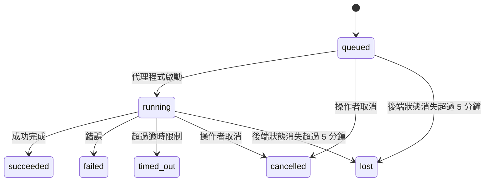

---
read_when:
    - 檢查進行中或最近完成的背景工作
    - 偵錯分離式代理程式執行的傳送失敗問題
    - 瞭解背景執行與工作階段、排程及心跳偵測之間的關係
sidebarTitle: Background tasks
summary: ACP 執行、子代理程式、排程執行與命令列介面操作的背景工作追蹤
title: 背景工作
x-i18n:
    generated_at: "2026-07-12T14:17:52Z"
    model: gpt-5.6
    postprocess_version: locale-links-v1
    prompt_version: 15
    provider: openai
    source_hash: 0a945e8103c5df5a64785f326a9d0b08784ac32a2ca6fa3d4c399d75fc54be2b
    source_path: automation/tasks.md
    workflow: 16
---

<Note>
想找排程功能嗎？請參閱[自動化](/zh-TW/automation)以選擇合適的機制。本頁是背景工作的活動紀錄，不是排程器。
</Note>

背景任務會追蹤在**主要對話工作階段之外**執行的工作：ACP 執行、子代理程式產生、排程工作執行，以及由命令列介面啟動的操作。

任務**不會**取代工作階段、排程工作或心跳偵測，而是記錄有哪些分離式工作發生、何時發生，以及是否成功的**活動紀錄**。

<Note>
並非每次代理程式執行都會建立任務。心跳偵測回合與一般互動式聊天不會。所有排程執行、ACP 產生、子代理程式產生，以及由閘道分派的命令列介面代理程式命令都會。
</Note>

## 摘要

- 任務是**紀錄**，不是排程器；排程和心跳偵測決定工作_何時_執行，任務則追蹤_發生了什麼_。
- ACP、子代理程式、所有排程工作及命令列介面操作都會建立任務。心跳偵測回合不會。
- 每個任務都會依序經過 `queued → running → terminal`（succeeded、failed、timed_out、cancelled 或 lost）。
- 只要排程執行階段仍擁有該工作，排程任務就會保持作用中；若記憶體內的執行階段狀態已消失，任務維護會先檢查持久化的排程執行歷程，再將任務標示為 lost。
- 完成通知由推送驅動：分離式工作完成時可以直接通知，或喚醒要求者的工作階段／心跳偵測，因此狀態輪詢迴圈通常不是正確的模式。
- 獨立排程執行和子代理程式完成時，會在最終清理記帳前，盡力清理其子工作階段所追蹤的瀏覽器分頁／程序。
- 當後代子代理程式工作仍在收尾時，獨立排程傳遞會抑制過時的中途父層回覆；若最終後代輸出在傳遞前抵達，則優先採用該輸出。
- 完成通知會直接傳送至頻道，或排入佇列等候下一次心跳偵測。
- `openclaw tasks list` 顯示所有任務；`openclaw tasks audit` 會揭示問題。
- 終止狀態紀錄會保留 7 天（`lost` 紀錄為 24 小時），之後自動清除。

## 快速開始

<Tabs>
  <Tab title="列出並篩選">
    ```bash
    # 列出所有任務（最新的優先）
    openclaw tasks list

    # 依執行階段或狀態篩選
    openclaw tasks list --runtime acp
    openclaw tasks list --status running
    ```

  </Tab>
  <Tab title="檢查">
    ```bash
    # 顯示特定任務的詳細資料（依任務 ID、執行 ID 或工作階段金鑰）
    openclaw tasks show <lookup>
    ```
  </Tab>
  <Tab title="取消與通知">
    ```bash
    # 取消執行中的任務（終止子工作階段）
    openclaw tasks cancel <lookup>

    # 變更任務的通知原則
    openclaw tasks notify <lookup> state_changes
    ```

  </Tab>
  <Tab title="稽核與維護">
    ```bash
    # 執行健康狀態稽核
    openclaw tasks audit

    # 預覽或套用維護
    openclaw tasks maintenance
    openclaw tasks maintenance --apply
    ```

  </Tab>
  <Tab title="TaskFlow 流程">
    ```bash
    # 檢查 TaskFlow 狀態
    openclaw tasks flow list
    openclaw tasks flow show <lookup>
    openclaw tasks flow cancel <lookup>
    ```
  </Tab>
</Tabs>

## 哪些操作會建立任務

| 來源                   | 執行階段類型 | 建立任務紀錄的時機                                                       | 預設通知原則 |
| ---------------------- | ------------ | ------------------------------------------------------------------------ | ------------ |
| ACP 背景執行           | `acp`        | 產生子 ACP 工作階段                                                      | `done_only`  |
| 子代理程式協調         | `subagent`   | 透過 `sessions_spawn` 產生子代理程式                                    | `done_only`  |
| 排程工作（所有類型）   | `cron`       | 每次排程執行（主要工作階段與獨立執行）                                  | `silent`     |
| 命令列介面操作         | `cli`        | 透過閘道執行的 `openclaw agent` 命令                                    | `silent`     |
| 代理程式媒體工作       | `cli`        | 由工作階段支援的 `image_generate`/`music_generate`/`video_generate` 執行 | `silent`     |

<AccordionGroup>
  <Accordion title="排程與媒體的通知預設值">
    排程任務（主要工作階段與獨立執行）使用 `silent` 通知原則；它們會建立紀錄供追蹤，但本身不會產生任務通知，傳遞路徑由排程負責。

    由工作階段支援的 `image_generate`、`music_generate` 和 `video_generate` 執行也使用 `silent` 通知原則。它們仍會建立任務紀錄，但完成結果會以內部喚醒的方式交回原始代理程式工作階段，讓代理程式撰寫後續訊息並自行附加完成的媒體。要求者代理程式會遵循其一般可見回覆契約：若已設定，則自動傳送最終回覆；若工作階段要求使用訊息工具回覆，則使用 `message(action="send")` 加上 `NO_REPLY`。如果要求者工作階段已不再作用中，或其作用中喚醒失敗，而且完成代理程式遺漏部分或全部產生的媒體，OpenClaw 會向原始頻道目標傳送具等冪性的直接備援，只包含遺漏的媒體。

  </Accordion>
  <Accordion title="並行媒體產生防護機制">
    當由工作階段支援的媒體產生任務仍在作用中時，`image_generate`、`music_generate` 和 `video_generate` 會防止意外重試：針對相同提示／要求重複呼叫時，會傳回相符的作用中任務狀態，而不會啟動重複任務；不同的提示則可啟動自己的任務。若要從代理程式端明確查詢進度／狀態，請使用 `action: "status"`。
  </Accordion>
  <Accordion title="哪些操作不會建立任務">
    - 心跳偵測回合（主要工作階段）；請參閱[心跳偵測](/zh-TW/gateway/heartbeat)
    - 一般互動式聊天回合
    - 直接的 `/command` 回應

  </Accordion>
</AccordionGroup>

## 任務生命週期



| 狀態        | 含義                                                                            |
| ----------- | ------------------------------------------------------------------------------- |
| `queued`    | 已建立，等待代理程式啟動                                                        |
| `running`   | 代理程式回合正在執行                                                            |
| `succeeded` | 已成功完成                                                                       |
| `failed`    | 因錯誤而完成                                                                     |
| `timed_out` | 超過已設定的逾時時間                                                             |
| `cancelled` | 操作者透過 `openclaw tasks cancel` 停止，或執行已中止                            |
| `lost`      | 經過 5 分鐘寬限期後，執行階段失去具權威性的後端狀態                             |

轉換會自動發生；代理程式執行生命週期事件（啟動、結束、錯誤）會更新任務狀態，你不需要手動管理。

對於作用中的任務紀錄，代理程式執行完成結果具有權威性。成功的分離式執行會以 `succeeded` 結束，一般執行錯誤會以 `failed` 結束，逾時會以 `timed_out` 結束，而取消／中止結果會以 `cancelled` 結束。任務一旦進入終止狀態，後續生命週期訊號不會將其降級；即使之後收到成功訊號，由操作者取消或已為 `failed`／`timed_out`／`lost` 的任務仍會維持原狀。

`lost` 會依執行階段判定：

- ACP 任務：只有閘道程序內仍作用中的 ACP 回合，才能證明該執行仍存活；僅有持久化的工作階段中繼資料並不足以證明。離線命令列介面稽核會採取保守做法，絕不回收 ACP 任務。
- 子代理程式任務：後端子工作階段已從目標代理程式儲存區消失（或帶有重新啟動復原墓碑）。
- 排程任務：排程執行階段已不再將該工作追蹤為作用中，而且持久化的排程執行歷程中沒有該次執行的終止結果。離線命令列介面稽核不會將自身空白的程序內排程執行階段狀態視為權威依據。
- 命令列介面任務：具有執行 ID／來源 ID 的任務會使用即時執行內容，因此閘道擁有的執行消失後，殘留的子工作階段或聊天工作階段資料列不會讓它們維持存活。沒有執行識別資訊的舊版命令列介面任務仍會退回使用子工作階段。由閘道支援的 `openclaw agent` 執行也會根據其執行結果結束，因此已完成的執行不會一直保持作用中，直到清理程式將其標示為 `lost`。

## 傳遞與通知

當任務達到終止狀態時，OpenClaw 會通知你。有兩種傳遞路徑：

**直接傳遞**：如果任務具有頻道目標（`requesterOrigin`），完成訊息會直接傳送至該頻道（Discord、Slack、Telegram 等）。群組和頻道任務的完成訊息則會透過要求者工作階段路由，讓父代理程式撰寫可見回覆。對於子代理程式完成事件，OpenClaw 也會在可用時保留已繫結的討論串／主題路由，並可在放棄直接傳遞前，從要求者工作階段儲存的路由（`lastChannel`／`lastTo`／`lastAccountId`）補上缺少的 `to`／帳號。

**工作階段佇列傳遞**：如果直接傳遞失敗或未設定來源，更新會以系統事件排入要求者工作階段的佇列，並在下一次心跳偵測時顯示。

<Tip>
排入工作階段佇列的任務完成事件會立即觸發心跳偵測喚醒，因此你可以快速看到結果，不必等到下一個排定的心跳偵測週期。
</Tip>

這表示一般工作流程是以推送為基礎：啟動一次分離式工作，然後讓執行階段在完成時喚醒或通知你。只有在需要偵錯、介入或明確稽核時，才輪詢任務狀態。

### 通知原則

控制每個任務向你回報的詳細程度：

| 原則                  | 傳遞內容                                              |
| --------------------- | ----------------------------------------------------- |
| `done_only`（預設）   | 僅終止狀態（succeeded、failed 等）                    |
| `state_changes`       | 每次狀態轉換與進度更新                                |
| `silent`              | 完全不傳遞（排程、命令列介面及媒體任務的預設值）      |

在任務執行期間變更原則：

```bash
openclaw tasks notify <lookup> state_changes
```

## 命令列介面參考

<AccordionGroup>
  <Accordion title="tasks list">
    ```bash
    openclaw tasks list [--runtime <acp|subagent|cron|cli>] [--status <status>] [--json]
    ```

    輸出欄：Task、Kind、Status、Delivery、Run、Child Session、Summary。直接執行 `openclaw tasks` 的行為等同於 `openclaw tasks list`。

  </Accordion>
  <Accordion title="tasks show">
    ```bash
    openclaw tasks show <lookup> [--json]
    ```

    查詢權杖可接受任務 ID、執行 ID 或工作階段金鑰。顯示完整紀錄，包括時間資訊、傳遞狀態、錯誤及終止摘要。

  </Accordion>
  <Accordion title="tasks cancel">
    ```bash
    openclaw tasks cancel <lookup>
    ```

    對 ACP 和子代理程式任務而言，這會終止子工作階段；ACP 和排程取消會透過執行中的閘道（`tasks.cancel`）路由。對於由命令列介面追蹤的任務，取消會記錄在任務登錄中（不存在個別的子執行階段控制代碼）。狀態會轉換為 `cancelled`，並在適用時傳送傳遞通知。

  </Accordion>
  <Accordion title="tasks notify">
    ```bash
    openclaw tasks notify <lookup> <done_only|state_changes|silent>
    ```
  </Accordion>
  <Accordion title="tasks audit">
    ```bash
    openclaw tasks audit [--severity <warn|error>] [--code <name>] [--limit <n>] [--json]
    ```

    在單一報告中揭示任務**以及** TaskFlow 的操作問題。偵測到問題時，發現項目也會出現在 `openclaw status` 中。

    任務發現項目：

    | 發現項目                  | 嚴重性     | 觸發條件                                                                                                     |
    | ------------------------- | ---------- | ------------------------------------------------------------------------------------------------------------ |
    | `stale_queued`            | 警告       | 已排入佇列超過 10 分鐘                                                                                       |
    | `stale_running`           | 錯誤       | 已執行超過 30 分鐘                                                                                           |
    | `lost`                    | 警告/錯誤  | 由執行階段支援的任務擁有權已消失；保留的遺失任務在 `cleanupAfter` 之前會發出警告，之後則成為錯誤              |
    | `delivery_failed`         | 警告       | 傳遞失敗，且通知原則不是 `silent`                                                                            |
    | `missing_cleanup`         | 警告       | 終止狀態任務沒有清理時間戳記                                                                                 |
    | `inconsistent_timestamps` | 警告       | 時間軸違規（例如結束時間早於開始時間）                                                                       |

    TaskFlow 發現項目：

    | 發現項目               | 嚴重性     | 觸發條件                                                                      |
    | ---------------------- | ---------- | ----------------------------------------------------------------------------- |
    | `restore_failed`       | 錯誤       | 無法從 SQLite 還原流程登錄                                                     |
    | `stale_running`        | 錯誤       | 執行中的流程已超過 30 分鐘沒有進展                                             |
    | `stale_waiting`        | 警告       | 等待中的流程已超過 30 分鐘沒有進展                                             |
    | `stale_blocked`        | 警告       | 受阻的流程已超過 30 分鐘沒有進展                                               |
    | `cancel_stuck`         | 警告       | 已在超過 5 分鐘前要求取消、沒有作用中的子任務，但仍未進入終止狀態              |
    | `missing_linked_tasks` | 警告/錯誤  | 過時的受管理流程沒有連結的任務或等待狀態                                       |
    | `blocked_task_missing` | 警告       | 受阻流程指向已不存在的任務 ID                                                  |

  </Accordion>
  <Accordion title="任務維護">
    ```bash
    openclaw tasks maintenance [--json]
    openclaw tasks maintenance --apply [--json]
    ```

    使用此功能可預覽或套用任務、TaskFlow 狀態及過時排程執行工作階段登錄資料列的協調、清理時間戳記設定與修剪作業。

    協調作業會感知執行階段狀態：

    - ACP 任務要求閘道中有即時的行程內回合；子代理程式任務會檢查其背後的子工作階段。
    - 若子代理程式任務的子工作階段具有重新啟動復原墓碑，該任務會標記為遺失，而不會將其視為可復原的背後工作階段。
    - 排程任務會檢查排程執行階段是否仍擁有該工作，接著從持久化的排程執行記錄／工作狀態復原終止狀態，最後才會退回使用 `lost`。只有閘道程序才是記憶體內排程作用中工作集合的權威來源；離線命令列介面稽核會使用持久化歷程，但不會只因該本機集合為空就將排程任務標記為遺失。
    - 具有執行識別資訊的命令列介面任務會檢查所屬的即時執行內容，而不只是子工作階段或聊天工作階段資料列。

    完成後的清理作業也會感知執行階段狀態：

    - 子代理程式完成時，會先盡力關閉為子工作階段追蹤的瀏覽器分頁／程序，然後再繼續進行公告清理。
    - 隔離式排程完成時，會在該次執行完全卸除前，盡力關閉為排程工作階段追蹤的瀏覽器分頁／程序。
    - 隔離式排程傳遞會在必要時等待後代子代理程式完成後續處理，並抑制過時的父層確認文字，而不是將其公告。
    - 子代理程式完成傳遞只會使用子項最新可見的助理文字。工具／toolResult 輸出不會提升為子項結果文字。以失敗終止的執行會公告失敗狀態，而不會重播擷取的回覆文字。
    - 清理失敗不會掩蓋真正的任務結果。

    套用維護時，OpenClaw 也會移除超過 7 天的過時 `cron:<jobId>:run:<runId>` 工作階段登錄資料列，同時保留目前執行中排程工作的資料列，且不會變更非排程工作階段資料列。

  </Accordion>
  <Accordion title="任務流程 list | show | cancel">
    ```bash
    openclaw tasks flow list [--status <status>] [--json]
    openclaw tasks flow show <lookup> [--json]
    openclaw tasks flow cancel <lookup>
    ```

    流程查詢權杖接受流程 ID 或擁有者索引鍵。當你關心的是負責協調的[任務流程](/zh-TW/automation/taskflow)，而不是個別背景任務記錄時，請使用這些命令。

  </Accordion>
</AccordionGroup>

## 聊天任務看板（`/tasks`）

在任何聊天工作階段中使用 `/tasks`，即可查看連結至該工作階段的背景任務。看板最多會顯示五個作用中及最近完成的任務，包含執行階段、狀態、時間資訊，以及進度或錯誤詳細資料。

當目前工作階段沒有可見的連結任務時，`/tasks` 會退回顯示代理程式本機的任務計數，讓你仍可取得概覽，而不會洩漏其他工作階段的詳細資料。

若要查看完整的操作員總帳，請使用命令列介面：`openclaw tasks list`。

### 控制介面

網頁控制介面的側邊欄中有一個 **任務** 頁面，可即時顯示作用中及近期的背景任務。你可以用它檢查進度、開啟連結的工作階段、重新整理總帳，或取消已排入佇列及執行中的任務。

聊天窗格也有一個限定於該窗格代理程式範圍、可收合的 **背景任務** 側欄：其中包含具備停止控制項的執行中任務與子代理程式、已完成區段，以及可前往各任務子工作階段的「檢視文字記錄」連結。你可以從窗格標頭中的活動切換按鈕開啟它（在單一窗格聊天中則使用浮動活動按鈕）。

## 狀態整合（任務壓力）

`openclaw status` 包含一行可快速掌握狀況的任務資訊：

```
任務    2 個作用中 · 1 個已排入佇列 · 1 個執行中 · 1 個問題 · 稽核無異常 · 6 筆追蹤記錄
```

摘要會統計作用中的工作（`queued` + `running`）、失敗（`failed` + `timed_out` + `lost`）、稽核發現，以及追蹤記錄總數；JSON 承載內容也會依執行環境（`acp`、`subagent`、`cron`、`cli`）細分計數。

`/status` 與 `session_status` 工具都使用會考量清理狀態的任務快照：優先顯示作用中的任務、隱藏已過期的資料列，而終止狀態的任務只會在最近的短暫時間範圍內（5 分鐘）顯示；若已無作用中的工作，則會聚焦顯示失敗項目。這能讓狀態卡片專注呈現當下重要的資訊。

## 儲存與維護

### 任務的儲存位置

任務記錄與傳遞狀態會持久儲存在共用的 OpenClaw SQLite 狀態資料庫中：

```
~/.openclaw/state/openclaw.sqlite   （資料表：task_runs、task_delivery_state、flow_runs）
```

設定 `OPENCLAW_STATE_DIR` 可將整個狀態根目錄（預設為 `~/.openclaw`）移至其他位置；共用資料庫路徑也會隨之移動。

登錄檔會在首次使用時載入記憶體，並將每次寫入持久儲存回 SQLite，因此記錄在閘道重新啟動後仍會保留。SQLite 的預設自動檢查點門檻加上定期 `PASSIVE` 檢查點，可限制 WAL 的成長；關閉與明確執行維護檢查點時則使用 `TRUNCATE`，使正常關閉能回收 WAL 空間，而不會讓背景清理器等候作用中的讀取者。

舊版安裝留下的傳統附屬儲存區（`tasks/runs.sqlite`、`flows/registry.sqlite`）會由 `openclaw doctor` 匯入共用資料庫。

### 自動維護

清理器每 **60 秒**執行一次（第一次約在閘道啟動 5 秒後執行），並處理以下四件事：

<Steps>
  <Step title="核對">
    檢查作用中的任務是否仍有權威的執行環境支援。ACP 任務需要有效的處理程序內回合，子代理程式任務使用子工作階段狀態，排程任務使用作用中工作的擁有權及持久執行記錄，而具有執行識別資訊的命令列介面任務則使用其所屬的執行內容。如果支援狀態消失超過 5 分鐘（沒有子項目的原生子代理程式任務為 30 分鐘），任務就會標記為 `lost`。
  </Step>
  <Step title="ACP 工作階段修復">
    關閉已終止或孤立、由父項擁有的單次 ACP 工作階段；對於過時、已終止或孤立的持久 ACP 工作階段，則僅在沒有作用中的對話繫結時將其關閉。
  </Step>
  <Step title="加註清理時間">
    在終止狀態的任務上設定 `cleanupAfter` 時間戳記（終止時間 + 保留期間）。在保留期間內，遺失的任務仍會在稽核中顯示為警告；`cleanupAfter` 到期後，或缺少清理中繼資料時，則會變成錯誤。
  </Step>
  <Step title="修剪">
    刪除已超過 `cleanupAfter` 日期的記錄。
  </Step>
</Steps>

<Note>
**保留期限：**終止狀態的任務記錄會保留 **7 天**（`lost` 記錄為 **24 小時**），之後自動修剪。無須設定。
</Note>

## 任務與其他系統的關係

<AccordionGroup>
  <Accordion title="任務與 TaskFlow">
    [TaskFlow](/zh-TW/automation/taskflow) 是位於背景任務之上的流程協調層。單一流程可在其生命週期中使用受管理或鏡像同步模式來協調多個任務。使用 `openclaw tasks` 檢視個別任務記錄，並使用 `openclaw tasks flow` 檢視負責協調的流程。

  </Accordion>
  <Accordion title="任務與排程">
    排程工作定義、執行環境的執行狀態及執行記錄都儲存在 OpenClaw 的共用 SQLite 狀態資料庫中。**每一次**排程執行都會建立任務記錄，包括主要工作階段與隔離工作階段，並採用 `silent` 通知政策，因此可以追蹤排程執行，而不會由其本身產生任務通知。

    請參閱[排程工作](/zh-TW/automation/cron-jobs)。

  </Accordion>
  <Accordion title="任務與心跳偵測">
    心跳偵測執行屬於主要工作階段的回合，不會建立任務記錄。任務完成時，可以觸發心跳偵測喚醒，讓你即時看到結果。

    請參閱[心跳偵測](/zh-TW/gateway/heartbeat)。

  </Accordion>
  <Accordion title="任務與工作階段">
    任務可參照 `childSessionKey`（工作執行的位置）與 `requesterSessionKey`（啟動者）。其 `agentId` 可識別執行工作的代理程式，而要求者與擁有者欄位則保留啟動及控制內容。工作階段是對話內容；任務則是在此之上的活動追蹤。
  </Accordion>
  <Accordion title="任務與代理程式執行">
    任務的 `runId` 會連結至執行該工作的代理程式執行。代理程式生命週期事件（開始、結束、錯誤）會自動更新任務狀態，你無須手動管理生命週期。
  </Accordion>
</AccordionGroup>

## 相關內容

- [自動化](/zh-TW/automation) - 快速瀏覽所有自動化機制
- [命令列介面：任務](/zh-TW/cli/tasks) - 命令列介面指令參考
- [心跳偵測](/zh-TW/gateway/heartbeat) - 定期執行的主要工作階段回合
- [排程任務](/zh-TW/automation/cron-jobs) - 排程背景工作
- [TaskFlow](/zh-TW/automation/taskflow) - 位於任務之上的流程協調
