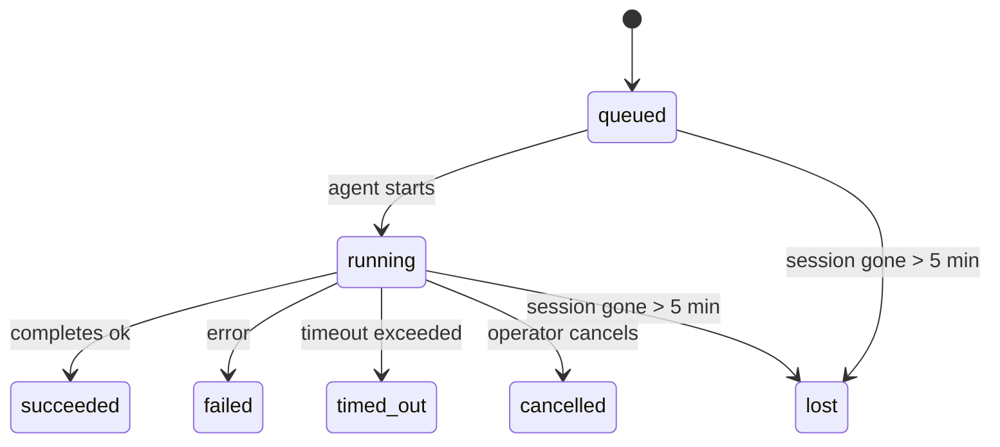

---
read_when:
    - 檢查進行中或最近完成的背景工作
    - 偵錯分離式 agent 執行的傳送失敗
    - 了解背景執行如何與工作階段、排程和心跳偵測相關
sidebarTitle: Background tasks
summary: ACP 執行、子代理程式、隔離排程作業和命令列介面操作的背景工作追蹤
title: 背景任務
x-i18n:
    generated_at: "2026-06-27T18:54:05Z"
    model: gpt-5.5
    postprocess_version: locale-links-v1
    provider: openai
    source_hash: 4a630a52d0d6bfd387a37415dd63fc4bfbce23f99eaa8cb780c3d6f8913675fd
    source_path: automation/tasks.md
    workflow: 16
---

<Note>
想找排程功能？請參閱 [Automation](/zh-TW/automation) 以選擇正確機制。本頁是背景工作的活動台帳，不是排程器。
</Note>

背景任務會追蹤在**主要對話工作階段之外**執行的工作：ACP 執行、子代理生成、隔離的排程作業執行，以及由命令列介面啟動的操作。

任務**不會**取代工作階段、排程作業或心跳偵測 - 它們是記錄已分離工作發生了什麼、何時發生，以及是否成功的**活動台帳**。

<Note>
並非每次代理執行都會建立任務。心跳偵測回合和一般互動式聊天不會。所有排程執行、ACP 生成、子代理生成，以及命令列介面代理命令都會。
</Note>

## TL;DR

- 任務是**記錄**，不是排程器 - 排程和心跳偵測決定工作_何時_執行，任務追蹤_發生了什麼_。
- ACP、子代理、所有排程作業和命令列介面操作都會建立任務。心跳偵測回合不會。
- 每個任務都會經過 `queued → running → terminal`（succeeded、failed、timed_out、cancelled 或 lost）。
- 只要排程執行階段仍然擁有該作業，排程任務就會保持有效；如果記憶體中的執行階段狀態已消失，任務維護會先檢查持久化的排程執行歷史，再將任務標記為 lost。
- 完成是推送驅動的：分離工作可以直接通知，或在完成時喚醒請求者工作階段/心跳偵測，因此狀態輪詢迴圈通常不是正確形態。
- 隔離的排程執行和子代理完成後，會盡力在最終清理記帳前，清理其子工作階段追蹤的瀏覽器分頁/程序。
- 隔離的排程傳遞會在後代子代理工作仍在排空時抑制過時的中途父層回覆，並且在最終後代輸出先於傳遞抵達時優先使用該輸出。
- 完成通知會直接傳遞到頻道，或排入佇列等待下一次心跳偵測。
- `openclaw tasks list` 會顯示所有任務；`openclaw tasks audit` 會顯示問題。
- 終端記錄會保留 7 天，之後自動修剪。

## 快速開始

<Tabs>
  <Tab title="列出與篩選">
    ```bash
    # List all tasks (newest first)
    openclaw tasks list

    # Filter by runtime or status
    openclaw tasks list --runtime acp
    openclaw tasks list --status running
    ```

  </Tab>
  <Tab title="檢查">
    ```bash
    # Show details for a specific task (by ID, run ID, or session key)
    openclaw tasks show <lookup>
    ```
  </Tab>
  <Tab title="取消與通知">
    ```bash
    # Cancel a running task (kills the child session)
    openclaw tasks cancel <lookup>

    # Change notification policy for a task
    openclaw tasks notify <lookup> state_changes
    ```

  </Tab>
  <Tab title="稽核與維護">
    ```bash
    # Run a health audit
    openclaw tasks audit

    # Preview or apply maintenance
    openclaw tasks maintenance
    openclaw tasks maintenance --apply
    ```

  </Tab>
  <Tab title="TaskFlow 流程">
    ```bash
    # Inspect TaskFlow state
    openclaw tasks flow list
    openclaw tasks flow show <lookup>
    openclaw tasks flow cancel <lookup>
    ```
  </Tab>
</Tabs>

## 什麼會建立任務

| 來源                   | 執行階段類型 | 建立任務記錄的時機                                                   | 預設通知政策 |
| ---------------------- | ------------ | ---------------------------------------------------------------------- | ------------ |
| ACP 背景執行           | `acp`        | 生成子 ACP 工作階段                                                    | `done_only`  |
| 子代理協調             | `subagent`   | 透過 `sessions_spawn` 生成子代理                                       | `done_only`  |
| 排程作業（所有類型）   | `cron`       | 每次排程執行（主要工作階段與隔離執行）                                | `silent`     |
| 命令列介面操作         | `cli`        | 透過閘道執行的 `openclaw agent` 命令                                  | `silent`     |
| 代理媒體作業           | `cli`        | 以工作階段為後盾的 `image_generate`/`music_generate`/`video_generate` 執行 | `silent`     |

<AccordionGroup>
  <Accordion title="排程與媒體的通知預設值">
    主要工作階段的排程任務預設使用 `silent` 通知政策 - 它們會建立記錄以供追蹤，但不會產生通知。隔離的排程任務也預設為 `silent`，但因為它們在自己的工作階段中執行，所以較容易被看見。

    以工作階段為後盾的 `image_generate`、`music_generate` 和 `video_generate` 執行也使用 `silent` 通知政策。它們仍會建立任務記錄，但完成結果會作為內部喚醒交還給原始代理工作階段，讓代理能自行撰寫後續訊息並附上完成的媒體。請求者代理會遵循其正常可見回覆契約：在已設定時自動送出最終回覆，或在工作階段要求使用訊息工具回覆時使用 `message(action="send")` 加上 `NO_REPLY`。如果請求者工作階段不再作用中，或其主動喚醒失敗，且完成代理漏掉部分或全部已生成媒體，OpenClaw 會將僅包含遺漏媒體的冪等直接備援傳送到原始頻道目標。

  </Accordion>
  <Accordion title="並行媒體生成護欄">
    當以工作階段為後盾的媒體生成任務仍在作用中時，媒體工具也會作為防止意外重試的護欄。對相同提示重複呼叫 `image_generate` 會回傳相符作用中任務的狀態，而不同的圖片提示可以啟動自己的任務。`music_generate` 和 `video_generate` 呼叫仍會回傳該工作階段的作用中任務狀態，而不是啟動第二個並行生成。當你想從代理端明確查詢進度/狀態時，請使用 `action: "status"`。
  </Accordion>
  <Accordion title="什麼不會建立任務">
    - 心跳偵測回合 - 主要工作階段；請參閱 [Heartbeat](/zh-TW/gateway/heartbeat)
    - 一般互動式聊天回合
    - 直接 `/command` 回應

  </Accordion>
</AccordionGroup>

## 任務生命週期



| 狀態        | 含義                                                                       |
| ----------- | -------------------------------------------------------------------------- |
| `queued`    | 已建立，等待代理啟動                                                       |
| `running`   | 代理回合正在主動執行                                                       |
| `succeeded` | 已成功完成                                                                 |
| `failed`    | 已完成但發生錯誤                                                           |
| `timed_out` | 超過設定的逾時時間                                                         |
| `cancelled` | 操作者透過 `openclaw tasks cancel` 停止                                    |
| `lost`      | 執行階段在 5 分鐘寬限期後失去權威後盾狀態                                  |

轉換會自動發生 - 當關聯的代理執行結束時，任務狀態會更新為相符狀態。

代理執行完成是作用中任務記錄的權威來源。成功的分離執行會最終化為 `succeeded`，一般執行錯誤會最終化為 `failed`，逾時或中止結果會最終化為 `timed_out`。如果操作者已取消任務，或執行階段已記錄較強的終端狀態，例如 `failed`、`timed_out` 或 `lost`，之後的成功訊號不會將該終端狀態降級。

`lost` 會感知執行階段：

- ACP 任務：後盾 ACP 子工作階段中繼資料已消失。
- 子代理任務：後盾子工作階段已從目標代理儲存中消失。
- 排程任務：排程執行階段不再將該作業追蹤為作用中，且持久化的排程執行歷史未顯示該執行的終端結果。離線命令列介面稽核不會把自身空的處理程序內排程執行階段狀態視為權威。
- 命令列介面任務：具有執行 ID/來源 ID 的任務會使用即時執行內容，因此在閘道擁有的執行消失後，殘留的子工作階段或聊天工作階段列不會讓它們保持存活。沒有執行身分的舊版命令列介面任務仍會退回使用子工作階段。以閘道為後盾的 `openclaw agent` 執行也會從其執行結果最終化，因此已完成的執行不會一直處於作用中，直到清掃器將其標記為 `lost`。

## 傳遞與通知

當任務到達終端狀態時，OpenClaw 會通知你。有兩種傳遞路徑：

**直接傳遞** - 如果任務有頻道目標（`requesterOrigin`），完成訊息會直接送到該頻道（Telegram、Discord、Slack 等）。群組與頻道任務完成則會透過請求者工作階段路由，讓父層代理能撰寫可見回覆。對於子代理完成，OpenClaw 也會在可用時保留綁定的執行緒/主題路由，並且可以在放棄直接傳遞前，從請求者工作階段儲存的路由（`lastChannel` / `lastTo` / `lastAccountId`）補上遺漏的 `to` / 帳戶。

**排入工作階段佇列的傳遞** - 如果直接傳遞失敗或未設定來源，更新會作為系統事件排入請求者工作階段，並在下一次心跳偵測時顯示。

<Tip>
任務完成會觸發立即的心跳偵測喚醒，讓你快速看到結果 - 你不必等待下一個排定的心跳偵測滴答。
</Tip>

這表示一般工作流程是以推送為基礎：啟動分離工作一次，然後讓執行階段在完成時喚醒或通知你。只有在需要除錯、介入或明確稽核時，才輪詢任務狀態。

### 通知政策

控制你會收到多少關於每個任務的訊息：

| 政策                  | 會傳遞的內容                                                          |
| --------------------- | --------------------------------------------------------------------- |
| `done_only`（預設）   | 僅終端狀態（succeeded、failed 等）- **這是預設值**                   |
| `state_changes`       | 每次狀態轉換和進度更新                                                |
| `silent`              | 完全不傳遞                                                            |

在任務執行中變更政策：

```bash
openclaw tasks notify <lookup> state_changes
```

## 命令列介面參考

<AccordionGroup>
  <Accordion title="tasks list">
    ```bash
    openclaw tasks list [--runtime <acp|subagent|cron|cli>] [--status <status>] [--json]
    ```

    輸出欄位：任務 ID、種類、狀態、傳遞、執行 ID、子工作階段、摘要。

  </Accordion>
  <Accordion title="tasks show">
    ```bash
    openclaw tasks show <lookup>
    ```

    查詢權杖接受任務 ID、執行 ID 或工作階段鍵。顯示完整記錄，包括時間、傳遞狀態、錯誤和終端摘要。

  </Accordion>
  <Accordion title="tasks cancel">
    ```bash
    openclaw tasks cancel <lookup>
    ```

    對於 ACP 和子代理任務，這會終止子工作階段。對於由命令列介面追蹤的任務，取消會記錄在任務登錄中（沒有獨立的子執行階段控制代碼）。狀態會轉換為 `cancelled`，並在適用時傳送傳遞通知。

  </Accordion>
  <Accordion title="tasks notify">
    ```bash
    openclaw tasks notify <lookup> <done_only|state_changes|silent>
    ```
  </Accordion>
  <Accordion title="tasks audit">
    ```bash
    openclaw tasks audit [--json]
    ```

    顯示操作問題。偵測到問題時，發現項目也會出現在 `openclaw status` 中。

    | 發現項目                  | 嚴重性     | 觸發條件                                                                                                     |
    | ------------------------- | ---------- | ------------------------------------------------------------------------------------------------------------ |
    | `stale_queued`            | 警告       | 已排隊超過 10 分鐘                                                                                           |
    | `stale_running`           | 錯誤       | 已執行超過 30 分鐘                                                                                           |
    | `lost`                    | 警告/錯誤  | 由執行階段支援的任務擁有權消失；保留的遺失任務在 `cleanupAfter` 前會發出警告，之後會變成錯誤 |
    | `delivery_failed`         | 警告       | 傳遞失敗，且通知策略不是 `silent`                                                                             |
    | `missing_cleanup`         | 警告       | 終端任務沒有清理時間戳                                                                                       |
    | `inconsistent_timestamps` | 警告       | 時間線違規（例如結束時間早於開始時間）                                                                       |

  </Accordion>
  <Accordion title="tasks maintenance">
    ```bash
    openclaw tasks maintenance [--json]
    openclaw tasks maintenance --apply [--json]
    ```

    使用此命令預覽或套用任務、任務流程狀態，以及過時排程執行工作階段登錄列的協調、清理標記與修剪。

    協調會感知執行階段：

    - ACP/子代理任務會檢查其背後的子工作階段。
    - 若子代理任務的子工作階段有重新啟動復原墓碑，會標記為遺失，而不是被視為可復原的背後工作階段。
    - 排程任務會檢查排程執行階段是否仍擁有該作業，然後先從持久化的排程執行記錄/作業狀態復原終端狀態，再退回到 `lost`。只有閘道程序對記憶體中的排程作用中作業集合具有權威性；離線命令列介面稽核會使用持久歷史，但不會只因為該本機 Set 為空就將排程任務標記為遺失。
    - 具有執行身分的命令列介面任務會檢查擁有它的即時執行上下文，而不只是子工作階段或聊天工作階段列。

    完成清理也會感知執行階段：

    - 子代理完成時，會在公告清理繼續前，盡力關閉針對子工作階段追蹤的瀏覽器分頁/程序。
    - 隔離排程完成時，會在執行完全拆除前，盡力關閉針對排程工作階段追蹤的瀏覽器分頁/程序。
    - 隔離排程傳遞會在必要時等待後代子代理後續動作完成，並抑制過時的父層確認文字，而不是公告它。
    - 子代理完成傳遞只會使用子項最新可見的助理文字。工具/toolResult 輸出不會提升為子項結果文字。終端失敗的執行會公告失敗狀態，而不重播擷取到的回覆文字。
    - 清理失敗不會遮蔽真實的任務結果。

    套用維護時，OpenClaw 也會移除超過 7 天的過時 `cron:<jobId>:run:<uuid>` 工作階段登錄列，同時保留目前執行中排程作業的列，並讓非排程工作階段列保持不變。

  </Accordion>
  <Accordion title="tasks flow list | show | cancel">
    ```bash
    openclaw tasks flow list [--status <status>] [--json]
    openclaw tasks flow show <lookup> [--json]
    openclaw tasks flow cancel <lookup>
    ```

    當你關注的是協調中的任務流程，而不是單一背景任務記錄時，請使用這些命令。

  </Accordion>
</AccordionGroup>

## 聊天任務看板（`/tasks`）

在任何聊天工作階段中使用 `/tasks`，即可查看連結到該工作階段的背景任務。看板會顯示作用中與最近完成的任務，包含執行階段、狀態、時間，以及進度或錯誤詳細資料。

當目前工作階段沒有可見的連結任務時，`/tasks` 會退回到代理本機任務計數，讓你仍可取得概覽，而不洩漏其他工作階段的詳細資料。

若要查看完整的操作員帳本，請使用命令列介面：`openclaw tasks list`。

## 狀態整合（任務壓力）

`openclaw status` 包含一目了然的任務摘要：

```
Tasks: 3 queued · 2 running · 1 issues
```

摘要會回報：

- **active** - `queued` + `running` 的數量
- **failures** - `failed` + `timed_out` + `lost` 的數量
- **byRuntime** - 依 `acp`、`subagent`、`cron`、`cli` 分解

`/status` 和 `session_status` 工具都會使用感知清理的任務快照：優先顯示作用中任務、隱藏過時的已完成列，且只有在沒有剩餘作用中工作時才浮現最近失敗。這能讓狀態卡片專注於目前重要的事項。

## 儲存與維護

### 任務存放位置

任務記錄會持久化到 SQLite：

```
$OPENCLAW_STATE_DIR/tasks/runs.sqlite
```

登錄會在閘道啟動時載入記憶體，並將寫入同步到 SQLite，以便在重新啟動之間保持耐久性。
閘道會透過 SQLite 的預設 autocheckpoint 閾值，加上定期的 `PASSIVE` checkpoint，讓 SQLite write-ahead log 維持在受限範圍內。關機和明確維護 checkpoint 仍會使用 `TRUNCATE`，因此一般關閉可以回收 WAL 空間，而不會讓背景清掃器等待作用中的讀取者。

### 自動維護

清掃器每 **60 秒** 執行一次，並處理四件事：

<Steps>
  <Step title="Reconciliation">
    檢查作用中任務是否仍有權威的執行階段支援。ACP/子代理任務使用子工作階段狀態，排程任務使用作用中作業擁有權，而具有執行身分的命令列介面任務則使用擁有它的執行上下文。如果該支援狀態消失超過 5 分鐘，任務會標記為 `lost`。
  </Step>
  <Step title="ACP session repair">
    關閉終端或孤立且由父層擁有的一次性 ACP 工作階段；只有在沒有剩餘作用中對話繫結時，才會關閉過時終端或孤立的持久 ACP 工作階段。
  </Step>
  <Step title="Cleanup stamping">
    在終端任務上設定 `cleanupAfter` 時間戳（endedAt + 7 天）。保留期間，遺失任務仍會在稽核中顯示為警告；在 `cleanupAfter` 到期後，或清理中繼資料遺失時，則會成為錯誤。
  </Step>
  <Step title="Pruning">
    刪除超過其 `cleanupAfter` 日期的記錄。
  </Step>
</Steps>

<Note>
**保留：**終端任務記錄會保留 **7 天**，然後自動修剪。不需要設定。
</Note>

## 任務如何與其他系統相關

<AccordionGroup>
  <Accordion title="Tasks and Task Flow">
    [任務流程](/zh-TW/automation/taskflow) 是位於背景任務之上的流程協調層。單一流程可能會在其生命週期中使用受管理或鏡像同步模式來協調多個任務。使用 `openclaw tasks` 檢查個別任務記錄，並使用 `openclaw tasks flow` 檢查協調流程。

    詳情請參閱[任務流程](/zh-TW/automation/taskflow)。

  </Accordion>
  <Accordion title="Tasks and cron">
    排程作業定義、執行階段執行狀態與執行歷史，都位於 OpenClaw 的共用 SQLite 狀態資料庫中。**每次**排程執行都會建立一筆任務記錄，包括主工作階段和隔離工作階段。主工作階段排程任務預設使用 `silent` 通知策略，因此可以追蹤但不產生通知。

    請參閱[排程作業](/zh-TW/automation/cron-jobs)。

  </Accordion>
  <Accordion title="Tasks and heartbeat">
    心跳偵測執行是主工作階段回合，不會建立任務記錄。任務完成時，可以觸發心跳偵測喚醒，讓你迅速看到結果。

    請參閱[心跳偵測](/zh-TW/gateway/heartbeat)。

  </Accordion>
  <Accordion title="Tasks and sessions">
    任務可以參照 `childSessionKey`（工作執行位置）和 `requesterSessionKey`（啟動者）。其 `agentId` 會識別執行工作的代理，而請求者與擁有者欄位會保留啟動與控制上下文。工作階段是對話上下文；任務則是在其上的活動追蹤。
  </Accordion>
  <Accordion title="Tasks and agent runs">
    任務的 `runId` 會連結到執行工作的代理執行。代理生命週期事件（開始、結束、錯誤）會自動更新任務狀態，你不需要手動管理生命週期。
  </Accordion>
</AccordionGroup>

## 相關

- [自動化](/zh-TW/automation) - 所有自動化機制概覽
- [命令列介面：任務](/zh-TW/cli/tasks) - 命令列介面命令參考
- [心跳偵測](/zh-TW/gateway/heartbeat) - 週期性主工作階段回合
- [排程任務](/zh-TW/automation/cron-jobs) - 排程背景工作
- [任務流程](/zh-TW/automation/taskflow) - 位於任務之上的流程協調
