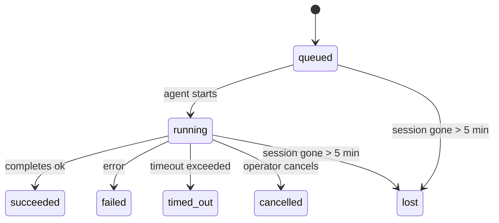

---
read_when:
    - 檢查正在進行或最近完成的背景工作
    - 偵錯分離式代理程式執行的傳遞失敗
    - 了解背景執行與工作階段、Cron 和 Heartbeat 的關係
sidebarTitle: Background tasks
summary: 用於 ACP 執行、子代理、隔離 Cron 工作和 CLI 操作的背景任務追蹤
title: 背景任務
x-i18n:
    generated_at: "2026-05-05T01:44:24Z"
    model: gpt-5.5
    provider: openai
    source_hash: 60d6ea6178535b19b95d761b8e8b05a665234584ae69852fd21097988aa32991
    source_path: automation/tasks.md
    workflow: 16
---

<Note>
正在尋找排程？請參閱[自動化與任務](/zh-TW/automation)，以選擇正確的機制。本頁是背景工作的活動帳本，不是排程器。
</Note>

背景任務會追蹤在**主要對話工作階段之外**執行的工作：ACP 執行、子代理產生、隔離的 cron 工作執行，以及由 CLI 啟動的操作。

任務**不會**取代工作階段、cron 工作或 heartbeats — 它們是**活動帳本**，記錄發生了哪些分離式工作、何時發生，以及是否成功。

<Note>
並非每次代理執行都會建立任務。Heartbeat 回合和一般互動式聊天不會。所有 cron 執行、ACP 產生、子代理產生，以及 CLI 代理命令都會。
</Note>

## 太長；沒讀

- 任務是**記錄**，不是排程器 — cron 和 heartbeat 決定工作_何時_執行，任務追蹤_發生了什麼_。
- ACP、子代理、所有 cron 工作，以及 CLI 操作都會建立任務。Heartbeat 回合不會。
- 每個任務都會經過 `queued → running → terminal`（succeeded、failed、timed_out、cancelled 或 lost）。
- 只要 cron runtime 仍擁有該工作，Cron 任務就會保持活動狀態；如果
  記憶體內的 runtime 狀態消失，任務維護會先檢查持久化的 cron
  執行歷史，再將任務標記為 lost。
- 完成是由推送驅動：分離式工作可以在完成時直接通知，或喚醒
  requester 工作階段/heartbeat，因此狀態輪詢迴圈
  通常不是正確的形式。
- 隔離的 cron 執行和子代理完成會盡力在最終清理簿記前，清理由其子工作階段追蹤的瀏覽器分頁/程序。
- 當後代子代理工作仍在清空時，隔離的 cron 傳遞會抑制過期的中繼父回覆，並且若最終後代輸出在傳遞前抵達，會優先使用該輸出。
- 完成通知會直接傳遞到頻道，或排入下一次 heartbeat。
- `openclaw tasks list` 會顯示所有任務；`openclaw tasks audit` 會呈現問題。
- 終端記錄會保留 7 天，然後自動清除。

## 快速開始

<Tabs>
  <Tab title="List and filter">
    ```bash
    # List all tasks (newest first)
    openclaw tasks list

    # Filter by runtime or status
    openclaw tasks list --runtime acp
    openclaw tasks list --status running
    ```

  </Tab>
  <Tab title="Inspect">
    ```bash
    # Show details for a specific task (by ID, run ID, or session key)
    openclaw tasks show <lookup>
    ```
  </Tab>
  <Tab title="Cancel and notify">
    ```bash
    # Cancel a running task (kills the child session)
    openclaw tasks cancel <lookup>

    # Change notification policy for a task
    openclaw tasks notify <lookup> state_changes
    ```

  </Tab>
  <Tab title="Audit and maintenance">
    ```bash
    # Run a health audit
    openclaw tasks audit

    # Preview or apply maintenance
    openclaw tasks maintenance
    openclaw tasks maintenance --apply
    ```

  </Tab>
  <Tab title="Task flow">
    ```bash
    # Inspect TaskFlow state
    openclaw tasks flow list
    openclaw tasks flow show <lookup>
    openclaw tasks flow cancel <lookup>
    ```
  </Tab>
</Tabs>

## 什麼會建立任務

| 來源                   | Runtime 類型 | 何時建立任務記錄                                         | 預設通知政策 |
| ---------------------- | ------------ | -------------------------------------------------------- | ------------ |
| ACP 背景執行           | `acp`        | 產生子 ACP 工作階段                                      | `done_only`  |
| 子代理協調             | `subagent`   | 透過 `sessions_spawn` 產生子代理                         | `done_only`  |
| Cron 工作（所有類型）  | `cron`       | 每次 cron 執行（主要工作階段和隔離）                     | `silent`     |
| CLI 操作               | `cli`        | 透過 gateway 執行的 `openclaw agent` 命令                | `silent`     |
| 代理媒體工作           | `cli`        | 由工作階段支援的 `music_generate`/`video_generate` 執行  | `silent`     |

<AccordionGroup>
  <Accordion title="Notify defaults for cron and media">
    主要工作階段 cron 任務預設使用 `silent` 通知政策 — 它們會建立用於追蹤的記錄，但不會產生通知。隔離的 cron 任務也預設為 `silent`，但因為它們在自己的工作階段中執行，所以更容易被看見。

    由工作階段支援的 `music_generate` 和 `video_generate` 執行也使用 `silent` 通知政策。它們仍會建立任務記錄，但完成會以內部喚醒的形式交回原始代理工作階段，讓代理能寫出後續訊息並自行附加完成的媒體。群組/頻道完成會遵循一般的可見回覆政策，因此當來源傳遞需要時，代理會使用訊息工具。

  </Accordion>
  <Accordion title="Concurrent video_generate guardrail">
    當由工作階段支援的 `video_generate` 任務仍在活動時，該工具也會作為護欄：同一工作階段中重複的 `video_generate` 呼叫會回傳作用中任務狀態，而不是開始第二個並行生成。當你想從代理端明確查詢進度/狀態時，請使用 `action: "status"`。
  </Accordion>
  <Accordion title="What does not create tasks">
    - Heartbeat 回合 — 主要工作階段；請參閱 [Heartbeat](/zh-TW/gateway/heartbeat)
    - 一般互動式聊天回合
    - 直接的 `/command` 回應

  </Accordion>
</AccordionGroup>

## 任務生命週期



| 狀態        | 意義                                                                       |
| ----------- | -------------------------------------------------------------------------- |
| `queued`    | 已建立，正在等待代理啟動                                                   |
| `running`   | 代理回合正在主動執行                                                       |
| `succeeded` | 已成功完成                                                                 |
| `failed`    | 已完成但發生錯誤                                                           |
| `timed_out` | 超過設定的逾時                                                             |
| `cancelled` | 由操作員透過 `openclaw tasks cancel` 停止                                  |
| `lost`      | runtime 在 5 分鐘寬限期後遺失權威的後備狀態                                |

轉換會自動發生 — 當關聯的代理執行結束時，任務狀態會更新為相符狀態。

代理執行完成是作用中任務記錄的權威依據。成功的分離式執行會最終化為 `succeeded`，一般執行錯誤會最終化為 `failed`，逾時或中止結果會最終化為 `timed_out`。如果操作員已取消任務，或 runtime 已記錄較強的終端狀態，例如 `failed`、`timed_out` 或 `lost`，稍後的成功訊號不會降級該終端狀態。

`lost` 會感知 runtime：

- ACP 任務：後備 ACP 子工作階段中繼資料消失。
- 子代理任務：後備子工作階段從目標代理儲存中消失。
- Cron 任務：cron runtime 不再將該工作追蹤為活動中，且持久化的
  cron 執行歷史未顯示該執行的終端結果。離線 CLI
  audit 不會將其自身空白的程序內 cron runtime 狀態視為權威。
- CLI 任務：隔離子工作階段任務使用子工作階段；由聊天支援的
  CLI 任務則使用即時執行內容，因此殘留的
  頻道/群組/直接訊息工作階段列不會讓它們維持活動。由 Gateway 支援的
  `openclaw agent` 執行也會依執行結果最終化，因此已完成的執行
  不會一直維持活動直到清掃器將它們標記為 `lost`。

## 傳遞與通知

當任務達到終端狀態時，OpenClaw 會通知你。有兩種傳遞路徑：

**直接傳遞** — 如果任務有頻道目標（`requesterOrigin`），完成訊息會直接送到該頻道（Telegram、Discord、Slack 等）。對於子代理完成，OpenClaw 也會在可用時保留綁定的執行緒/主題路由，並且可以在放棄直接傳遞前，從 requester 工作階段儲存的路由（`lastChannel` / `lastTo` / `lastAccountId`）補齊缺少的 `to` / 帳號。

**排入工作階段的傳遞** — 如果直接傳遞失敗或未設定來源，更新會作為系統事件排入 requester 的工作階段，並在下一次 heartbeat 出現。

<Tip>
任務完成會觸發立即的 heartbeat 喚醒，讓你很快看到結果 — 你不必等到下一個排程 heartbeat tick。
</Tip>

這表示一般工作流程是推送式的：啟動一次分離式工作，然後讓 runtime 在完成時喚醒或通知你。只有在需要除錯、介入或明確 audit 時，才輪詢任務狀態。

### 通知政策

控制你會收到多少關於每個任務的通知：

| 政策                  | 傳遞內容                                                                |
| --------------------- | ----------------------------------------------------------------------- |
| `done_only`（預設）   | 只有終端狀態（succeeded、failed 等）— **這是預設值**                    |
| `state_changes`       | 每次狀態轉換和進度更新                                                  |
| `silent`              | 完全不傳遞                                                              |

在任務執行中變更政策：

```bash
openclaw tasks notify <lookup> state_changes
```

## CLI 參考

<AccordionGroup>
  <Accordion title="tasks list">
    ```bash
    openclaw tasks list [--runtime <acp|subagent|cron|cli>] [--status <status>] [--json]
    ```

    輸出欄位：任務 ID、種類、狀態、傳遞、執行 ID、子工作階段、摘要。

  </Accordion>
  <Accordion title="tasks show">
    ```bash
    openclaw tasks show <lookup>
    ```

    查詢權杖接受任務 ID、執行 ID 或工作階段鍵。顯示完整記錄，包括時間、傳遞狀態、錯誤和終端摘要。

  </Accordion>
  <Accordion title="tasks cancel">
    ```bash
    openclaw tasks cancel <lookup>
    ```

    對於 ACP 和子代理任務，這會終止子工作階段。對於由 CLI 追蹤的任務，取消會記錄在任務登錄中（沒有單獨的子 runtime 控制代碼）。狀態會轉換為 `cancelled`，並在適用時傳送傳遞通知。

  </Accordion>
  <Accordion title="tasks notify">
    ```bash
    openclaw tasks notify <lookup> <done_only|state_changes|silent>
    ```
  </Accordion>
  <Accordion title="tasks audit">
    ```bash
    openclaw tasks audit [--json]
    ```

    呈現操作問題。偵測到問題時，發現也會出現在 `openclaw status` 中。

    | 發現項目                  | 嚴重性     | 觸發條件                                                                                                     |
    | ------------------------- | ---------- | ------------------------------------------------------------------------------------------------------------ |
    | `stale_queued`            | 警告       | 佇列超過 10 分鐘                                                                                             |
    | `stale_running`           | 錯誤       | 執行超過 30 分鐘                                                                                             |
    | `lost`                    | 警告/錯誤  | 由執行階段支援的任務所有權消失；保留的遺失任務在 `cleanupAfter` 前會警告，之後會變成錯誤                   |
    | `delivery_failed`         | 警告       | 傳送失敗且通知政策不是 `silent`                                                                              |
    | `missing_cleanup`         | 警告       | 終止任務沒有清理時間戳                                                                                       |
    | `inconsistent_timestamps` | 警告       | 時間軸違規（例如結束早於開始）                                                                               |

  </Accordion>
  <Accordion title="任務維護">
    ```bash
    openclaw tasks maintenance [--json]
    openclaw tasks maintenance --apply [--json]
    ```

    使用此命令來預覽或套用任務與任務流程狀態的協調、清理標記與剪除。

    協調會感知執行階段：

    - ACP/子代理任務會檢查其背後的子工作階段。
    - 子代理任務若其子工作階段有重啟復原墓碑，會被標記為遺失，而不是視為可復原的背後工作階段。
    - Cron 任務會檢查 cron 執行階段是否仍擁有該工作，然後從持久化的 cron 執行記錄/工作狀態復原終止狀態，再退回到 `lost`。只有 Gateway 程序對記憶體中的 cron 作用中工作集合具有權威性；離線 CLI 稽核會使用持久歷史，但不會只因為該本機 Set 為空就將 cron 任務標記為遺失。
    - 由聊天支援的 CLI 任務會檢查擁有它的即時執行上下文，而不只是聊天工作階段資料列。

    完成清理也會感知執行階段：

    - 子代理完成時，會盡力先關閉針對子工作階段追蹤的瀏覽器分頁/程序，然後公告清理才會繼續。
    - 隔離的 cron 完成時，會盡力先關閉針對 cron 工作階段追蹤的瀏覽器分頁/程序，然後執行才會完全拆除。
    - 隔離的 cron 傳送會在需要時等待後代子代理後續動作完成，並抑制過期的父層確認文字，而不是公告它。
    - 子代理完成傳送會偏好最新可見的助理文字；如果為空，會退回到已清理的最新工具/toolResult 文字，而且只有逾時的工具呼叫執行可收斂成簡短的部分進度摘要。終止失敗的執行會公告失敗狀態，而不重播擷取的回覆文字。
    - 清理失敗不會遮蔽真正的任務結果。

  </Accordion>
  <Accordion title="任務流程 list | show | cancel">
    ```bash
    openclaw tasks flow list [--status <status>] [--json]
    openclaw tasks flow show <lookup> [--json]
    openclaw tasks flow cancel <lookup>
    ```

    當你關心的是負責協調的任務流程，而不是單一背景任務記錄時，請使用這些命令。

  </Accordion>
</AccordionGroup>

## 聊天任務看板 (`/tasks`)

在任何聊天工作階段中使用 `/tasks`，即可查看連結到該工作階段的背景任務。看板會顯示作用中與最近完成的任務，以及執行階段、狀態、時間、進度或錯誤詳細資料。

當目前工作階段沒有可見的連結任務時，`/tasks` 會退回到代理本機任務計數，因此你仍能取得概覽，而不洩漏其他工作階段的詳細資料。

若要查看完整的操作員帳本，請使用 CLI：`openclaw tasks list`。

## 狀態整合（任務壓力）

`openclaw status` 包含一目了然的任務摘要：

```
Tasks: 3 queued · 2 running · 1 issues
```

摘要會回報：

- **作用中** — `queued` + `running` 的計數
- **失敗** — `failed` + `timed_out` + `lost` 的計數
- **依執行階段** — 依 `acp`、`subagent`、`cron`、`cli` 細分

`/status` 和 `session_status` 工具都會使用感知清理的任務快照：優先顯示作用中任務、隱藏過期的已完成資料列，而且只有在沒有作用中工作留下時才會顯示最近失敗。這會讓狀態卡片聚焦在目前重要的事項。

## 儲存與維護

### 任務存放位置

任務記錄會持久化到 SQLite，位置為：

```
$OPENCLAW_STATE_DIR/tasks/runs.sqlite
```

登錄檔會在 gateway 啟動時載入記憶體，並將寫入同步到 SQLite，以便在重啟之間保持耐久性。
Gateway 會使用 SQLite 的預設自動檢查點閾值，加上定期與關機時的 `TRUNCATE` 檢查點，讓 SQLite 預寫式記錄維持在受限大小。

### 自動維護

清掃器每 **60 秒** 執行一次，並處理四件事：

<Steps>
  <Step title="協調">
    檢查作用中任務是否仍有權威的執行階段支援。ACP/子代理任務使用子工作階段狀態，cron 任務使用作用中工作所有權，而由聊天支援的 CLI 任務使用擁有它的執行上下文。如果該支援狀態消失超過 5 分鐘，任務會被標記為 `lost`。
  </Step>
  <Step title="ACP 工作階段修復">
    關閉已終止或孤立的父層擁有一次性 ACP 工作階段；只有在沒有作用中的對話繫結留下時，才會關閉過期終止或孤立的持久 ACP 工作階段。
  </Step>
  <Step title="清理標記">
    在終止任務上設定 `cleanupAfter` 時間戳（endedAt + 7 天）。在保留期間，遺失任務仍會以警告形式出現在稽核中；`cleanupAfter` 過期後，或清理中繼資料缺失時，它們會成為錯誤。
  </Step>
  <Step title="剪除">
    刪除超過其 `cleanupAfter` 日期的記錄。
  </Step>
</Steps>

<Note>
**保留：**終止任務記錄會保留 **7 天**，然後自動剪除。不需要設定。
</Note>

## 任務如何與其他系統相關

<AccordionGroup>
  <Accordion title="任務與任務流程">
    [任務流程](/zh-TW/automation/taskflow) 是背景任務之上的流程協調層。單一流程可在其生命週期內使用受管或鏡像同步模式協調多個任務。使用 `openclaw tasks` 檢查個別任務記錄，並使用 `openclaw tasks flow` 檢查負責協調的流程。

    詳情請參閱[任務流程](/zh-TW/automation/taskflow)。

  </Accordion>
  <Accordion title="任務與 cron">
    cron 工作**定義**位於 `~/.openclaw/cron/jobs.json`；執行階段執行狀態則位於旁邊的 `~/.openclaw/cron/jobs-state.json`。**每次** cron 執行都會建立一筆任務記錄，包括主工作階段與隔離工作階段。主工作階段 cron 任務預設使用 `silent` 通知政策，因此可以追蹤而不產生通知。

    請參閱 [Cron 工作](/zh-TW/automation/cron-jobs)。

  </Accordion>
  <Accordion title="任務與 Heartbeat">
    Heartbeat 執行是主工作階段回合，它們不會建立任務記錄。任務完成時，可以觸發 Heartbeat 喚醒，讓你能立即看到結果。

    請參閱 [Heartbeat](/zh-TW/gateway/heartbeat)。

  </Accordion>
  <Accordion title="任務與工作階段">
    任務可以參照 `childSessionKey`（工作執行的位置）與 `requesterSessionKey`（啟動它的人）。工作階段是對話上下文；任務則是在其上的活動追蹤。
  </Accordion>
  <Accordion title="任務與代理執行">
    任務的 `runId` 會連結到正在執行工作的代理執行。代理生命週期事件（開始、結束、錯誤）會自動更新任務狀態，你不需要手動管理生命週期。
  </Accordion>
</AccordionGroup>

## 相關

- [自動化與任務](/zh-TW/automation) — 所有自動化機制一覽
- [CLI：任務](/zh-TW/cli/tasks) — CLI 命令參考
- [Heartbeat](/zh-TW/gateway/heartbeat) — 定期主工作階段回合
- [排程任務](/zh-TW/automation/cron-jobs) — 排程背景工作
- [任務流程](/zh-TW/automation/taskflow) — 任務之上的流程協調
