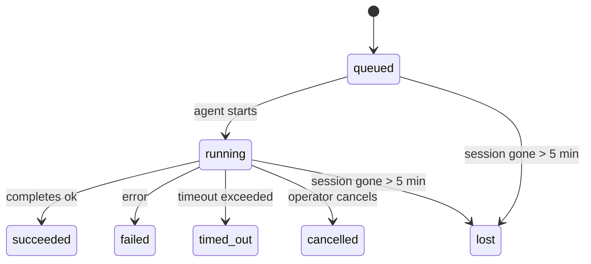

---
read_when:
    - 檢查正在進行或最近完成的背景工作
    - 偵錯分離式代理執行的傳遞失敗
    - 了解背景執行與工作階段、Cron 和 Heartbeat 的關係
sidebarTitle: Background tasks
summary: 用於 ACP 執行、子代理、隔離的 Cron 作業和 CLI 操作的背景任務追蹤
title: 背景任務
x-i18n:
    generated_at: "2026-04-30T16:27:59Z"
    model: gpt-5.5
    provider: openai
    source_hash: 999653c9360323d5135e33193c76458cba8c288227de46a6217f1ccbed2a6d34
    source_path: automation/tasks.md
    workflow: 16
---

<Note>
正在尋找排程功能嗎？請參閱[自動化與任務](/zh-TW/automation)以選擇正確機制。本頁是背景工作的活動帳本，不是排程器。
</Note>

背景任務會追蹤在**主要對話工作階段之外**執行的工作：ACP 執行、子代理程式產生、隔離的 Cron 工作執行，以及由 CLI 啟動的操作。

任務**不會**取代工作階段、Cron 工作或 Heartbeat——它們是記錄已分離工作發生了什麼、何時發生，以及是否成功的**活動帳本**。

<Note>
不是每次代理程式執行都會建立任務。Heartbeat 回合與一般互動式聊天不會。所有 Cron 執行、ACP 產生、子代理程式產生，以及 CLI 代理程式命令都會。
</Note>

## TL;DR

- 任務是**記錄**，不是排程器——Cron 和 Heartbeat 決定工作_何時_執行，任務追蹤_發生了什麼_。
- ACP、子代理程式、所有 Cron 工作，以及 CLI 操作都會建立任務。Heartbeat 回合不會。
- 每個任務都會經過 `queued → running → terminal`（succeeded、failed、timed_out、cancelled 或 lost）。
- 只要 Cron 執行階段仍擁有該工作，Cron 任務就會保持即時狀態；如果記憶體中的執行階段狀態已消失，任務維護會先檢查持久化的 Cron 執行歷史，再將任務標記為 lost。
- 完成是由推送驅動：分離的工作完成時可以直接通知，或喚醒請求者工作階段/Heartbeat，因此狀態輪詢迴圈通常不是正確形式。
- 隔離的 Cron 執行與子代理程式完成會在最終清理記帳前，盡力清理其子工作階段追蹤的瀏覽器分頁/程序。
- 當後代子代理程式工作仍在排空時，隔離的 Cron 遞送會抑制過期的暫時父層回覆；若最終後代輸出在遞送前抵達，則優先使用它。
- 完成通知會直接遞送到通道，或排入佇列等待下一次 Heartbeat。
- `openclaw tasks list` 顯示所有任務；`openclaw tasks audit` 會呈現問題。
- 終端記錄會保留 7 天，然後自動清除。

## 快速開始

<Tabs>
  <Tab title="列出與篩選">
    ```bash
    # List all tasks (newest first)
    openclaw tasks list

    # Filter by runtime or status
    openclaw tasks list --runtime acp
    openclaw tasks list --status running
    ```

  </Tab>
  <Tab title="檢查">
    ```bash
    # Show details for a specific task (by ID, run ID, or session key)
    openclaw tasks show <lookup>
    ```
  </Tab>
  <Tab title="取消與通知">
    ```bash
    # Cancel a running task (kills the child session)
    openclaw tasks cancel <lookup>

    # Change notification policy for a task
    openclaw tasks notify <lookup> state_changes
    ```

  </Tab>
  <Tab title="稽核與維護">
    ```bash
    # Run a health audit
    openclaw tasks audit

    # Preview or apply maintenance
    openclaw tasks maintenance
    openclaw tasks maintenance --apply
    ```

  </Tab>
  <Tab title="任務流程">
    ```bash
    # Inspect TaskFlow state
    openclaw tasks flow list
    openclaw tasks flow show <lookup>
    openclaw tasks flow cancel <lookup>
    ```
  </Tab>
</Tabs>

## 什麼會建立任務

| 來源                   | 執行階段類型 | 任務記錄建立時機                                         | 預設通知政策 |
| ---------------------- | ------------ | -------------------------------------------------------- | ------------ |
| ACP 背景執行           | `acp`        | 產生子 ACP 工作階段                                      | `done_only`  |
| 子代理程式編排         | `subagent`   | 透過 `sessions_spawn` 產生子代理程式                     | `done_only`  |
| Cron 工作（所有類型）  | `cron`       | 每次 Cron 執行（主要工作階段與隔離執行）                 | `silent`     |
| CLI 操作               | `cli`        | 透過 Gateway 執行的 `openclaw agent` 命令                | `silent`     |
| 代理程式媒體工作       | `cli`        | 以工作階段為後盾的 `video_generate` 執行                 | `silent`     |

<AccordionGroup>
  <Accordion title="Cron 與媒體的通知預設值">
    主要工作階段 Cron 任務預設使用 `silent` 通知政策——它們會建立記錄以供追蹤，但不會產生通知。隔離的 Cron 任務也預設為 `silent`，但因為它們在自己的工作階段中執行，所以更容易看見。

    以工作階段為後盾的 `video_generate` 執行也使用 `silent` 通知政策。它們仍會建立任務記錄，但完成會作為內部喚醒交還給原始代理程式工作階段，讓代理程式能自行寫入後續訊息並附上完成的影片。如果你選擇啟用 `tools.media.asyncCompletion.directSend`，非同步 `music_generate` 與 `video_generate` 完成會先嘗試直接通道遞送，然後才回退到請求者工作階段喚醒路徑。

  </Accordion>
  <Accordion title="並行 video_generate 防護">
    當以工作階段為後盾的 `video_generate` 任務仍在活動中時，該工具也會作為防護：同一工作階段中重複的 `video_generate` 呼叫會回傳活動任務狀態，而不是啟動第二個並行產生。當你想從代理程式端明確查詢進度/狀態時，請使用 `action: "status"`。
  </Accordion>
  <Accordion title="什麼不會建立任務">
    - Heartbeat 回合——主要工作階段；請參閱 [Heartbeat](/zh-TW/gateway/heartbeat)
    - 一般互動式聊天回合
    - 直接 `/command` 回應

  </Accordion>
</AccordionGroup>

## 任務生命週期



| 狀態        | 含義                                                                       |
| ----------- | -------------------------------------------------------------------------- |
| `queued`    | 已建立，等待代理程式啟動                                                   |
| `running`   | 代理程式回合正在主動執行                                                   |
| `succeeded` | 已成功完成                                                                 |
| `failed`    | 已完成但發生錯誤                                                           |
| `timed_out` | 超過設定的逾時                                                             |
| `cancelled` | 操作者透過 `openclaw tasks cancel` 停止                                    |
| `lost`      | 執行階段在 5 分鐘寬限期後失去具權威性的後盾狀態                            |

轉換會自動發生——當相關聯的代理程式執行結束時，任務狀態會更新為相符狀態。

代理程式執行完成是活動任務記錄的權威依據。成功的分離執行會最終化為 `succeeded`，一般執行錯誤會最終化為 `failed`，逾時或中止結果會最終化為 `timed_out`。如果操作者已取消任務，或執行階段已記錄較強的終端狀態，例如 `failed`、`timed_out` 或 `lost`，較晚到達的成功訊號不會降級該終端狀態。

`lost` 具備執行階段感知能力：

- ACP 任務：後盾 ACP 子工作階段中繼資料已消失。
- 子代理程式任務：後盾子工作階段已從目標代理程式儲存區消失。
- Cron 任務：Cron 執行階段不再將該工作追蹤為活動中，且持久化的 Cron 執行歷史未顯示該次執行的終端結果。離線 CLI 稽核不會將自身空的程序內 Cron 執行階段狀態視為權威。
- CLI 任務：隔離的子工作階段任務使用子工作階段；以聊天為後盾的 CLI 任務則使用即時執行脈絡，因此殘留的通道/群組/直接工作階段資料列不會讓它們保持活動。以 Gateway 為後盾的 `openclaw agent` 執行也會從其執行結果最終化，因此已完成的執行不會持續處於活動狀態，直到清掃器將它們標記為 `lost`。

## 遞送與通知

當任務到達終端狀態時，OpenClaw 會通知你。有兩種遞送路徑：

**直接遞送**——如果任務有通道目標（`requesterOrigin`），完成訊息會直接傳到該通道（Telegram、Discord、Slack 等）。對於子代理程式完成，OpenClaw 也會在可用時保留已繫結的執行緒/主題路由，並且可以在放棄直接遞送前，從請求者工作階段儲存的路由（`lastChannel` / `lastTo` / `lastAccountId`）補上缺少的 `to` / 帳戶。

**排入工作階段佇列的遞送**——如果直接遞送失敗或未設定來源，更新會作為系統事件排入請求者工作階段佇列，並在下一次 Heartbeat 顯示。

<Tip>
任務完成會觸發立即的 Heartbeat 喚醒，因此你可以快速看到結果——不需要等到下一個排定的 Heartbeat tick。
</Tip>

這表示通常的工作流程是推送式：啟動一次分離工作，然後讓執行階段在完成時喚醒或通知你。只有在需要偵錯、介入或明確稽核時，才輪詢任務狀態。

### 通知政策

控制你會收到每個任務多少資訊：

| 政策                  | 遞送內容                                                                  |
| --------------------- | ------------------------------------------------------------------------- |
| `done_only`（預設）   | 只有終端狀態（succeeded、failed 等）——**這是預設值**                      |
| `state_changes`       | 每次狀態轉換與進度更新                                                    |
| `silent`              | 完全不遞送                                                                |

在任務執行時變更政策：

```bash
openclaw tasks notify <lookup> state_changes
```

## CLI 參考

<AccordionGroup>
  <Accordion title="tasks list">
    ```bash
    openclaw tasks list [--runtime <acp|subagent|cron|cli>] [--status <status>] [--json]
    ```

    輸出欄位：任務 ID、種類、狀態、遞送、執行 ID、子工作階段、摘要。

  </Accordion>
  <Accordion title="tasks show">
    ```bash
    openclaw tasks show <lookup>
    ```

    查詢權杖接受任務 ID、執行 ID 或工作階段鍵。顯示完整記錄，包括時間、遞送狀態、錯誤與終端摘要。

  </Accordion>
  <Accordion title="tasks cancel">
    ```bash
    openclaw tasks cancel <lookup>
    ```

    對於 ACP 與子代理程式任務，這會終止子工作階段。對於由 CLI 追蹤的任務，取消會記錄在任務登錄中（沒有獨立的子執行階段控制代碼）。狀態會轉換為 `cancelled`，並在適用時傳送遞送通知。

  </Accordion>
  <Accordion title="tasks notify">
    ```bash
    openclaw tasks notify <lookup> <done_only|state_changes|silent>
    ```
  </Accordion>
  <Accordion title="tasks audit">
    ```bash
    openclaw tasks audit [--json]
    ```

    呈現作業問題。偵測到問題時，發現項目也會出現在 `openclaw status` 中。

    | 發現項目                  | 嚴重性     | 觸發條件                                                                                                     |
    | ------------------------- | ---------- | ------------------------------------------------------------------------------------------------------------ |
    | `stale_queued`            | warn       | 排入佇列超過 10 分鐘                                                                                         |
    | `stale_running`           | error      | 執行超過 30 分鐘                                                                                             |
    | `lost`                    | warn/error | 由執行階段支援的任務所有權消失；保留的遺失任務在 `cleanupAfter` 前會發出警告，之後會變成錯誤 |
    | `delivery_failed`         | warn       | 傳送失敗且通知政策不是 `silent`                                                                               |
    | `missing_cleanup`         | warn       | 沒有清理時間戳記的終止任務                                                                                   |
    | `inconsistent_timestamps` | warn       | 時間軸違規（例如結束時間早於開始時間）                                                                       |

  </Accordion>
  <Accordion title="任務維護">
    ```bash
    openclaw tasks maintenance [--json]
    openclaw tasks maintenance --apply [--json]
    ```

    使用此命令預覽或套用任務與任務流程狀態的對帳、清理標記與修剪。

    對帳會感知執行階段：

    - ACP/子代理任務會檢查其背後的子工作階段。
    - 子工作階段具有重新啟動復原墓碑的子代理任務，會被標記為遺失，而不是被視為可復原的背後工作階段。
    - Cron 任務會檢查 cron 執行階段是否仍擁有該工作，然後先從已持久化的 cron 執行記錄/工作狀態復原終止狀態，最後才退回到 `lost`。只有 Gateway 處理程序對記憶體中的 cron 作用中工作集合具有權威性；離線 CLI 稽核會使用持久化歷史記錄，但不會僅因該本機 Set 為空就將 cron 任務標記為遺失。
    - 由聊天支援的 CLI 任務會檢查擁有它的即時執行內容，而不只是聊天工作階段資料列。

    完成清理也會感知執行階段：

    - 子代理完成時，會盡力在宣告清理繼續前關閉為子工作階段追蹤的瀏覽器分頁/處理程序。
    - 隔離式 cron 完成時，會盡力在執行完全拆除前關閉為 cron 工作階段追蹤的瀏覽器分頁/處理程序。
    - 隔離式 cron 傳送會在必要時等待後代子代理的後續動作，並抑制過期的父層確認文字，而不是宣告它。
    - 子代理完成傳送會優先使用最新可見的助理文字；如果為空，則退回使用經清理的最新 tool/toolResult 文字，而只有逾時工具呼叫的執行可折疊成簡短的部分進度摘要。終止失敗的執行會宣告失敗狀態，而不會重播擷取到的回覆文字。
    - 清理失敗不會遮蔽真實的任務結果。

  </Accordion>
  <Accordion title="任務流程 list | show | cancel">
    ```bash
    openclaw tasks flow list [--status <status>] [--json]
    openclaw tasks flow show <lookup> [--json]
    openclaw tasks flow cancel <lookup>
    ```

    當你關注的是協調中的任務流程，而不是單一個別背景任務記錄時，請使用這些命令。

  </Accordion>
</AccordionGroup>

## 聊天任務看板 (`/tasks`)

在任何聊天工作階段中使用 `/tasks`，即可查看連結到該工作階段的背景任務。看板會顯示作用中與最近完成的任務，包含執行階段、狀態、時間，以及進度或錯誤詳細資訊。

當目前工作階段沒有可見的已連結任務時，`/tasks` 會退回顯示代理本機任務計數，因此你仍能取得概覽，而不會洩漏其他工作階段的詳細資訊。

若要查看完整的操作員總帳，請使用 CLI：`openclaw tasks list`。

## 狀態整合（任務壓力）

`openclaw status` 會包含一眼可讀的任務摘要：

```
Tasks: 3 queued · 2 running · 1 issues
```

摘要會回報：

- **作用中** — `queued` + `running` 的數量
- **失敗** — `failed` + `timed_out` + `lost` 的數量
- **byRuntime** — 依 `acp`、`subagent`、`cron`、`cli` 分類的細目

`/status` 和 `session_status` 工具都會使用感知清理的任務快照：優先顯示作用中任務、隱藏過期的已完成資料列，且只有在沒有作用中工作剩餘時才顯示最近的失敗。這會讓狀態卡片聚焦於目前最重要的事項。

## 儲存與維護

### 任務存放位置

任務記錄會持久化在 SQLite：

```
$OPENCLAW_STATE_DIR/tasks/runs.sqlite
```

登錄會在 Gateway 啟動時載入記憶體，並將寫入同步到 SQLite，以便在重新啟動之間保持耐久性。
Gateway 會使用 SQLite 的預設自動檢查點門檻，加上週期性與關機時的 `TRUNCATE` 檢查點，讓 SQLite 預寫式記錄保持在受控範圍內。

### 自動維護

清掃器每 **60 秒** 執行一次，並處理四件事：

<Steps>
  <Step title="對帳">
    檢查作用中任務是否仍有權威的執行階段支援。ACP/子代理任務使用子工作階段狀態，cron 任務使用作用中工作所有權，而由聊天支援的 CLI 任務使用擁有它的執行內容。如果該支援狀態消失超過 5 分鐘，任務會被標記為 `lost`。
  </Step>
  <Step title="ACP 工作階段修復">
    關閉終止或孤立且由父層擁有的一次性 ACP 工作階段；並且只有在沒有剩餘的作用中對話繫結時，才關閉過期的終止或孤立持久 ACP 工作階段。
  </Step>
  <Step title="清理標記">
    在終止任務上設定 `cleanupAfter` 時間戳記（endedAt + 7 天）。在保留期間，遺失任務仍會以警告形式出現在稽核中；在 `cleanupAfter` 到期後，或清理中繼資料缺漏時，它們會成為錯誤。
  </Step>
  <Step title="修剪">
    刪除超過其 `cleanupAfter` 日期的記錄。
  </Step>
</Steps>

<Note>
**保留：** 終止任務記錄會保留 **7 天**，然後自動修剪。不需要設定。
</Note>

## 任務如何與其他系統相關

<AccordionGroup>
  <Accordion title="任務與任務流程">
    [任務流程](/zh-TW/automation/taskflow) 是背景任務之上的流程協調層。單一流程可能會在其生命週期中使用受管理或鏡像同步模式協調多個任務。使用 `openclaw tasks` 檢查個別任務記錄，並使用 `openclaw tasks flow` 檢查協調中的流程。

    詳情請參閱[任務流程](/zh-TW/automation/taskflow)。

  </Accordion>
  <Accordion title="任務與 cron">
    cron 工作**定義**位於 `~/.openclaw/cron/jobs.json`；執行階段執行狀態位於旁邊的 `~/.openclaw/cron/jobs-state.json`。**每次** cron 執行都會建立一筆任務記錄，包括主工作階段與隔離式執行。主工作階段 cron 任務的預設通知政策是 `silent`，因此它們會追蹤但不產生通知。

    請參閱 [Cron 工作](/zh-TW/automation/cron-jobs)。

  </Accordion>
  <Accordion title="任務與 Heartbeat">
    Heartbeat 執行是主工作階段回合，不會建立任務記錄。任務完成時，可以觸發 Heartbeat 喚醒，讓你能立即看到結果。

    請參閱 [Heartbeat](/zh-TW/gateway/heartbeat)。

  </Accordion>
  <Accordion title="任務與工作階段">
    任務可以參照 `childSessionKey`（工作執行處）和 `requesterSessionKey`（啟動者）。工作階段是對話內容；任務是在其上的活動追蹤。
  </Accordion>
  <Accordion title="任務與代理執行">
    任務的 `runId` 會連結到執行工作的代理執行。代理生命週期事件（開始、結束、錯誤）會自動更新任務狀態，因此你不需要手動管理生命週期。
  </Accordion>
</AccordionGroup>

## 相關

- [自動化與任務](/zh-TW/automation) — 所有自動化機制概覽
- [CLI：任務](/zh-TW/cli/tasks) — CLI 命令參考
- [Heartbeat](/zh-TW/gateway/heartbeat) — 週期性的主工作階段回合
- [排程任務](/zh-TW/automation/cron-jobs) — 排程背景工作
- [任務流程](/zh-TW/automation/taskflow) — 任務之上的流程協調
