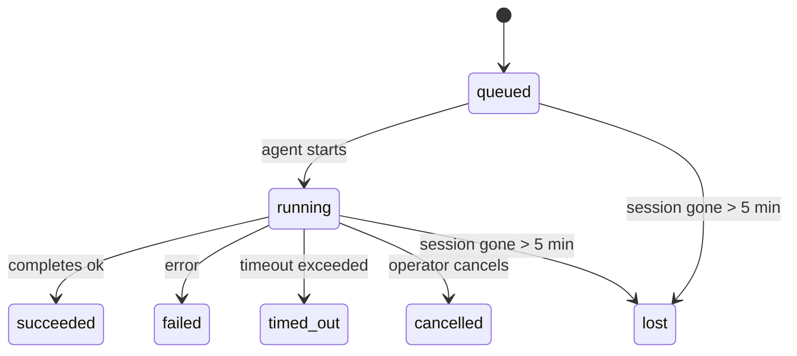

---
read_when:
    - 檢查正在進行或最近完成的背景工作
    - 偵錯分離式代理執行的傳遞失敗
    - 了解背景執行與工作階段、Cron 和 Heartbeat 的關係
sidebarTitle: Background tasks
summary: 針對 ACP 執行、子代理程式、隔離式 Cron 工作與 CLI 操作的背景任務追蹤
title: 背景任務
x-i18n:
    generated_at: "2026-05-05T06:16:10Z"
    model: gpt-5.5
    provider: openai
    source_hash: bafd959feaf2e220820ec56bf1ef144207d05757418e9971ebf427844cf30c46
    source_path: automation/tasks.md
    workflow: 16
---

<Note>
正在尋找排程？請參閱[自動化與任務](/zh-TW/automation)，以選擇合適的機制。本頁是背景工作的活動記錄，而不是排程器。
</Note>

背景任務會追蹤在**主要對話工作階段之外**執行的工作：ACP 執行、子代理產生、隔離的 Cron 作業執行，以及由 CLI 啟動的操作。

任務**不會**取代工作階段、Cron 作業或 Heartbeat，它們是記錄已分離工作發生了什麼、何時發生，以及是否成功的**活動記錄**。

<Note>
並非每次代理執行都會建立任務。Heartbeat 回合和一般互動式聊天不會。所有 Cron 執行、ACP 產生、子代理產生，以及 CLI 代理指令都會建立任務。
</Note>

## TL;DR

- 任務是**記錄**，不是排程器；Cron 和 Heartbeat 決定工作_何時_執行，任務追蹤_發生了什麼_。
- ACP、子代理、所有 Cron 作業，以及 CLI 操作都會建立任務。Heartbeat 回合不會。
- 每個任務都會經過 `queued → running → terminal`（succeeded、failed、timed_out、cancelled 或 lost）。
- 只要 Cron 執行階段仍然擁有該作業，Cron 任務就會保持作用中；如果
  記憶體中的執行階段狀態已消失，任務維護會先檢查持久化的 Cron
  執行歷史，然後才將任務標記為 lost。
- 完成是推送驅動的：分離的工作可以在完成時直接通知，或喚醒
  請求者工作階段/Heartbeat，因此狀態輪詢迴圈通常不是正確形式。
- 隔離的 Cron 執行和子代理完成會盡最大努力，在最終清理簿記之前，清理其子工作階段所追蹤的瀏覽器分頁/程序。
- 隔離的 Cron 傳遞會在後代子代理工作仍在排空時，抑制過時的中間父層回覆，並且在後代最終輸出於傳遞前抵達時優先採用該輸出。
- 完成通知會直接傳遞到頻道，或排入佇列等候下一次 Heartbeat。
- `openclaw tasks list` 會顯示所有任務；`openclaw tasks audit` 會顯示問題。
- 終端記錄會保留 7 天，之後自動清除。

## 快速開始

<Tabs>
  <Tab title="列出與篩選">
    ```bash
    # List all tasks (newest first)
    openclaw tasks list

    # Filter by runtime or status
    openclaw tasks list --runtime acp
    openclaw tasks list --status running
    ```

  </Tab>
  <Tab title="檢查">
    ```bash
    # Show details for a specific task (by ID, run ID, or session key)
    openclaw tasks show <lookup>
    ```
  </Tab>
  <Tab title="取消與通知">
    ```bash
    # Cancel a running task (kills the child session)
    openclaw tasks cancel <lookup>

    # Change notification policy for a task
    openclaw tasks notify <lookup> state_changes
    ```

  </Tab>
  <Tab title="稽核與維護">
    ```bash
    # Run a health audit
    openclaw tasks audit

    # Preview or apply maintenance
    openclaw tasks maintenance
    openclaw tasks maintenance --apply
    ```

  </Tab>
  <Tab title="任務流程">
    ```bash
    # Inspect TaskFlow state
    openclaw tasks flow list
    openclaw tasks flow show <lookup>
    openclaw tasks flow cancel <lookup>
    ```
  </Tab>
</Tabs>

## 什麼會建立任務

| 來源                   | 執行階段類型 | 任務記錄建立時機                                       | 預設通知政策 |
| ---------------------- | ------------ | ------------------------------------------------------ | ------------ |
| ACP 背景執行           | `acp`        | 產生子 ACP 工作階段                                   | `done_only`  |
| 子代理協調             | `subagent`   | 透過 `sessions_spawn` 產生子代理                       | `done_only`  |
| Cron 作業（所有類型）  | `cron`       | 每次 Cron 執行（主要工作階段與隔離）                  | `silent`     |
| CLI 操作               | `cli`        | 透過 Gateway 執行的 `openclaw agent` 指令              | `silent`     |
| 代理媒體作業           | `cli`        | 以工作階段為基礎的 `music_generate`/`video_generate` 執行 | `silent`     |

<AccordionGroup>
  <Accordion title="Cron 與媒體的通知預設值">
    主要工作階段 Cron 任務預設使用 `silent` 通知政策；它們會建立記錄以供追蹤，但不會產生通知。隔離的 Cron 任務也預設為 `silent`，但因為它們在自己的工作階段中執行，所以較容易看見。

    以工作階段為基礎的 `music_generate` 和 `video_generate` 執行也使用 `silent` 通知政策。它們仍會建立任務記錄，但完成結果會以內部喚醒的方式交回原始代理工作階段，讓代理自行寫入後續訊息並附加完成的媒體。群組/頻道完成會遵循一般可見回覆政策，因此在來源傳遞需要時，代理會使用訊息工具。如果完成代理在僅工具路由中無法產生訊息工具傳遞證據，OpenClaw 會將完成後備訊息直接傳送到原始頻道，而不是讓媒體保持私密。

  </Accordion>
  <Accordion title="並行 video_generate 防護欄">
    當以工作階段為基礎的 `video_generate` 任務仍在作用中時，該工具也會充當防護欄：同一工作階段中重複的 `video_generate` 呼叫會回傳作用中任務狀態，而不是啟動第二個並行生成。當你想要代理端明確查詢進度/狀態時，請使用 `action: "status"`。
  </Accordion>
  <Accordion title="什麼不會建立任務">
    - Heartbeat 回合；主要工作階段；請參閱 [Heartbeat](/zh-TW/gateway/heartbeat)
    - 一般互動式聊天回合
    - 直接 `/command` 回應

  </Accordion>
</AccordionGroup>

## 任務生命週期



| 狀態        | 意義                                                                       |
| ----------- | -------------------------------------------------------------------------- |
| `queued`    | 已建立，正在等待代理啟動                                                   |
| `running`   | 代理回合正在主動執行                                                       |
| `succeeded` | 已成功完成                                                                 |
| `failed`    | 已完成但發生錯誤                                                           |
| `timed_out` | 超過設定的逾時                                                             |
| `cancelled` | 操作者透過 `openclaw tasks cancel` 停止                                     |
| `lost`      | 執行階段在 5 分鐘寬限期後失去權威的支援狀態                                |

轉換會自動發生；當相關的代理執行結束時，任務狀態會更新為相符狀態。

代理執行完成是作用中任務記錄的權威來源。成功的分離執行會最終化為 `succeeded`，一般執行錯誤會最終化為 `failed`，逾時或中止結果會最終化為 `timed_out`。如果操作者已經取消任務，或執行階段已經記錄了更強的終端狀態，例如 `failed`、`timed_out` 或 `lost`，之後的成功訊號不會降低該終端狀態。

`lost` 具有執行階段感知：

- ACP 任務：支援的 ACP 子工作階段中繼資料已消失。
- 子代理任務：支援的子工作階段已從目標代理儲存區消失。
- Cron 任務：Cron 執行階段不再將該作業追蹤為作用中，而且持久化的
  Cron 執行歷史未顯示該次執行的終端結果。離線 CLI
  稽核不會將其自身空的程序內 Cron 執行階段狀態視為權威。
- CLI 任務：隔離的子工作階段任務使用子工作階段；以聊天為基礎的
  CLI 任務則使用即時執行內容，因此殘留的
  頻道/群組/直接工作階段資料列不會讓它們保持作用中。由 Gateway 支援的
  `openclaw agent` 執行也會依其執行結果最終化，因此已完成的執行
  不會保持作用中直到清掃器將其標記為 `lost`。

## 傳遞與通知

當任務到達終端狀態時，OpenClaw 會通知你。有兩種傳遞路徑：

**直接傳遞**：如果任務有頻道目標（`requesterOrigin`），完成訊息會直接送到該頻道（Telegram、Discord、Slack 等）。對於子代理完成，OpenClaw 也會在可用時保留繫結的執行緒/主題路由，並且可以在放棄直接傳遞前，從請求者工作階段儲存的路由（`lastChannel` / `lastTo` / `lastAccountId`）補上缺少的 `to` / 帳戶。

**排入工作階段佇列的傳遞**：如果直接傳遞失敗或未設定來源，更新會作為系統事件排入請求者的工作階段，並在下一次 Heartbeat 顯示。

<Tip>
任務完成會觸發立即的 Heartbeat 喚醒，讓你快速看到結果；你不必等到下一個排定的 Heartbeat tick。
</Tip>

這表示一般工作流程是以推送為基礎：啟動一次分離工作，然後讓執行階段在完成時喚醒或通知你。只有在需要偵錯、介入或明確稽核時，才輪詢任務狀態。

### 通知政策

控制每個任務要收到多少訊息：

| 政策                  | 傳遞內容                                                                  |
| --------------------- | ------------------------------------------------------------------------- |
| `done_only`（預設）   | 只有終端狀態（succeeded、failed 等）；**這是預設值**                       |
| `state_changes`       | 每次狀態轉換與進度更新                                                    |
| `silent`              | 完全不傳遞                                                                |

在任務執行期間變更政策：

```bash
openclaw tasks notify <lookup> state_changes
```

## CLI 參考

<AccordionGroup>
  <Accordion title="tasks list">
    ```bash
    openclaw tasks list [--runtime <acp|subagent|cron|cli>] [--status <status>] [--json]
    ```

    輸出欄位：任務 ID、種類、狀態、傳遞、執行 ID、子工作階段、摘要。

  </Accordion>
  <Accordion title="tasks show">
    ```bash
    openclaw tasks show <lookup>
    ```

    查詢權杖接受任務 ID、執行 ID 或工作階段金鑰。顯示完整記錄，包括時間、傳遞狀態、錯誤與終端摘要。

  </Accordion>
  <Accordion title="tasks cancel">
    ```bash
    openclaw tasks cancel <lookup>
    ```

    對於 ACP 和子代理任務，這會終止子工作階段。對於由 CLI 追蹤的任務，取消會記錄在任務登錄中（沒有個別的子執行階段控制代碼）。狀態會轉換為 `cancelled`，並在適用時傳送傳遞通知。

  </Accordion>
  <Accordion title="tasks notify">
    ```bash
    openclaw tasks notify <lookup> <done_only|state_changes|silent>
    ```
  </Accordion>
  <Accordion title="tasks audit">
    ```bash
    openclaw tasks audit [--json]
    ```

    顯示操作問題。偵測到問題時，發現項目也會出現在 `openclaw status` 中。

    | 發現項目                  | 嚴重性     | 觸發條件                                                                                                     |
    | ------------------------- | ---------- | ------------------------------------------------------------------------------------------------------------ |
    | `stale_queued`            | 警告       | 佇列中超過 10 分鐘                                                                                           |
    | `stale_running`           | 錯誤       | 執行中超過 30 分鐘                                                                                           |
    | `lost`                    | 警告/錯誤  | 由執行階段支援的任務所有權消失；保留的遺失任務會在 `cleanupAfter` 前發出警告，之後變成錯誤                  |
    | `delivery_failed`         | 警告       | 傳遞失敗，且通知政策不是 `silent`                                                                            |
    | `missing_cleanup`         | 警告       | 終端任務沒有清理時間戳記                                                                                    |
    | `inconsistent_timestamps` | 警告       | 時間軸違規（例如結束時間早於開始時間）                                                                       |

  </Accordion>
  <Accordion title="tasks maintenance">
    ```bash
    openclaw tasks maintenance [--json]
    openclaw tasks maintenance --apply [--json]
    ```

    使用此指令預覽或套用任務與任務流程狀態的協調、清理標記與修剪。

    協調會感知執行階段：

    - ACP/子代理任務會檢查其後端子工作階段。
    - 子代理任務如果其子工作階段有重新啟動復原墓碑，會被標記為遺失，而不是被視為可復原的後端工作階段。
    - Cron 任務會檢查 Cron 執行階段是否仍擁有該工作，然後從持久化的 Cron 執行記錄/工作狀態復原終端狀態，再回退為 `lost`。只有 Gateway 程序對記憶體中的 Cron 作用中工作集合具權威性；離線 CLI 稽核會使用持久歷史，但不會只因為該本機 Set 為空就將 Cron 任務標記為遺失。
    - 由聊天支援的 CLI 任務會檢查擁有者的即時執行內容，而不只是聊天工作階段資料列。

    完成清理也會感知執行階段：

    - 子代理完成時會盡力在公告清理繼續之前關閉子工作階段追蹤的瀏覽器分頁/程序。
    - 隔離 Cron 完成時會盡力在執行完全拆除之前關閉 Cron 工作階段追蹤的瀏覽器分頁/程序。
    - 隔離 Cron 傳遞會在需要時等待後代子代理的後續處理，並抑制過期的父層確認文字，而不是公告它。
    - 子代理完成傳遞會優先使用最新可見的助理文字；如果為空，則回退到已清理的最新工具/toolResult 文字，而僅逾時的工具呼叫執行可縮減為簡短的部分進度摘要。終端失敗執行會公告失敗狀態，而不會重播擷取到的回覆文字。
    - 清理失敗不會遮蔽真正的任務結果。

  </Accordion>
  <Accordion title="tasks flow list | show | cancel">
    ```bash
    openclaw tasks flow list [--status <status>] [--json]
    openclaw tasks flow show <lookup> [--json]
    openclaw tasks flow cancel <lookup>
    ```

    當你關注的是協調中的任務流程，而不是單一背景任務記錄時，請使用這些指令。

  </Accordion>
</AccordionGroup>

## 聊天任務板（`/tasks`）

在任何聊天工作階段中使用 `/tasks`，即可查看連結到該工作階段的背景任務。任務板會顯示作用中與最近完成的任務，包含執行階段、狀態、時間，以及進度或錯誤詳細資料。

當目前工作階段沒有可見的連結任務時，`/tasks` 會回退為代理本機任務計數，讓你仍可取得概覽，而不會洩漏其他工作階段的詳細資料。

若要查看完整的操作員帳本，請使用 CLI：`openclaw tasks list`。

## 狀態整合（任務壓力）

`openclaw status` 包含一目了然的任務摘要：

```
Tasks: 3 queued · 2 running · 1 issues
```

摘要會回報：

- **作用中** — `queued` + `running` 的數量
- **失敗** — `failed` + `timed_out` + `lost` 的數量
- **依執行階段** — 依 `acp`、`subagent`、`cron`、`cli` 分解

`/status` 和 `session_status` 工具都會使用感知清理的任務快照：優先顯示作用中任務、隱藏過期的已完成資料列，且只有在沒有任何作用中工作時才顯示最近的失敗。這能讓狀態卡片聚焦於目前重要的事項。

## 儲存與維護

### 任務存放位置

任務記錄會持久化到 SQLite，位置為：

```
$OPENCLAW_STATE_DIR/tasks/runs.sqlite
```

登錄會在 Gateway 啟動時載入記憶體，並將寫入同步到 SQLite，以便在重新啟動之間保持耐久性。
Gateway 會使用 SQLite 預設的自動檢查點閾值，加上定期與關閉時的 `TRUNCATE` 檢查點，讓 SQLite 預寫式記錄保持有界。

### 自動維護

清掃器每 **60 秒** 執行一次，並處理四件事：

<Steps>
  <Step title="協調">
    檢查作用中任務是否仍有具權威性的執行階段後端支援。ACP/子代理任務使用子工作階段狀態，Cron 任務使用作用中工作所有權，而由聊天支援的 CLI 任務使用擁有者的執行內容。如果該後端狀態消失超過 5 分鐘，任務會被標記為 `lost`。
  </Step>
  <Step title="ACP 工作階段修復">
    關閉終端或孤立的父層擁有一次性 ACP 工作階段；只有在沒有作用中對話繫結仍存在時，才會關閉過期終端或孤立的持久 ACP 工作階段。
  </Step>
  <Step title="清理標記">
    在終端任務上設定 `cleanupAfter` 時間戳記（endedAt + 7 天）。保留期間內，遺失任務仍會在稽核中顯示為警告；在 `cleanupAfter` 到期後，或清理中繼資料缺失時，它們會變成錯誤。
  </Step>
  <Step title="修剪">
    刪除超過其 `cleanupAfter` 日期的記錄。
  </Step>
</Steps>

<Note>
**保留：**終端任務記錄會保留 **7 天**，之後自動修剪。不需要設定。
</Note>

## 任務與其他系統的關係

<AccordionGroup>
  <Accordion title="任務與任務流程">
    [任務流程](/zh-TW/automation/taskflow) 是背景任務之上的流程協調層。單一流程可能會在其生命週期中，使用受管理或鏡像同步模式協調多個任務。使用 `openclaw tasks` 檢查個別任務記錄，並使用 `openclaw tasks flow` 檢查協調中的流程。

    詳情請參閱[任務流程](/zh-TW/automation/taskflow)。

  </Accordion>
  <Accordion title="任務與 Cron">
    Cron 工作**定義**位於 `~/.openclaw/cron/jobs.json`；執行階段執行狀態位於旁邊的 `~/.openclaw/cron/jobs-state.json`。**每次** Cron 執行都會建立一筆任務記錄，包括主工作階段與隔離工作階段。主工作階段 Cron 任務預設為 `silent` 通知政策，因此會進行追蹤但不產生通知。

    請參閱 [Cron 工作](/zh-TW/automation/cron-jobs)。

  </Accordion>
  <Accordion title="任務與 Heartbeat">
    Heartbeat 執行是主工作階段回合，它們不會建立任務記錄。任務完成時，可以觸發 Heartbeat 喚醒，讓你能即時看到結果。

    請參閱 [Heartbeat](/zh-TW/gateway/heartbeat)。

  </Accordion>
  <Accordion title="任務與工作階段">
    任務可能會參照 `childSessionKey`（工作執行的位置）與 `requesterSessionKey`（啟動它的人）。工作階段是對話內容；任務是在其上的活動追蹤。
  </Accordion>
  <Accordion title="任務與代理執行">
    任務的 `runId` 會連結到執行工作的代理執行。代理生命週期事件（開始、結束、錯誤）會自動更新任務狀態，你不需要手動管理生命週期。
  </Accordion>
</AccordionGroup>

## 相關

- [自動化與任務](/zh-TW/automation) — 所有自動化機制一覽
- [CLI：任務](/zh-TW/cli/tasks) — CLI 指令參考
- [Heartbeat](/zh-TW/gateway/heartbeat) — 定期主工作階段回合
- [排程任務](/zh-TW/automation/cron-jobs) — 排程背景工作
- [任務流程](/zh-TW/automation/taskflow) — 任務之上的流程協調
