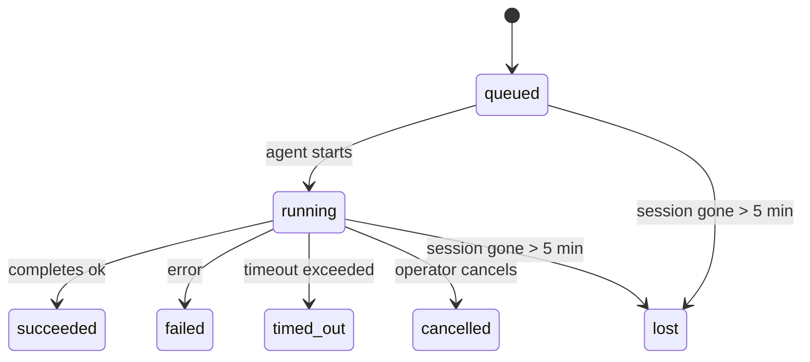

---
read_when:
    - 檢視正在進行或最近完成的背景工作
    - 偵錯分離式代理程式執行的送達失敗
    - 了解背景執行與工作階段、Cron 和 Heartbeat 的關係
sidebarTitle: Background tasks
summary: 針對 ACP 執行、子代理、隔離的 Cron 作業和 CLI 操作的背景任務追蹤
title: 背景任務
x-i18n:
    generated_at: "2026-05-07T13:13:33Z"
    model: gpt-5.5
    provider: openai
    source_hash: a91a04ef6142e488d2fbc459d2c663afb93816a58fe9f52e0a51420703ea2d4d
    source_path: automation/tasks.md
    workflow: 16
---

<Note>
正在尋找排程功能？請參閱[自動化和工作](/zh-TW/automation)，以選擇合適的機制。此頁面是背景工作的活動帳本，而不是排程器。
</Note>

背景工作會追蹤在**主要對話工作階段之外**執行的工作：ACP 執行、子代理程式衍生、隔離的 Cron 作業執行，以及 CLI 啟動的操作。

工作**不會**取代工作階段、Cron 作業或 Heartbeat，它們是記錄已分離工作發生內容、時間，以及是否成功的**活動帳本**。

<Note>
並非每次代理程式執行都會建立工作。Heartbeat 回合和一般互動式聊天不會。所有 Cron 執行、ACP 衍生、子代理程式衍生，以及 CLI 代理程式命令都會。
</Note>

## TL;DR

- 工作是**記錄**，不是排程器；Cron 和 Heartbeat 決定工作_何時_執行，工作則追蹤_發生了什麼_。
- ACP、子代理程式、所有 Cron 作業，以及 CLI 操作都會建立工作。Heartbeat 回合不會。
- 每個工作都會經過 `queued → running → terminal`（succeeded、failed、timed_out、cancelled 或 lost）。
- 只要 Cron 執行階段仍擁有該作業，Cron 工作就會保持作用中；如果
  記憶體內的執行階段狀態消失，工作維護會先檢查持久化 Cron
  執行歷史，再將工作標記為 lost。
- 完成是由推送驅動：分離的工作可以在完成時直接通知，或喚醒
  請求者工作階段/Heartbeat，因此狀態輪詢迴圈通常不是正確形式。
- 隔離的 Cron 執行和子代理程式完成時，會盡力為其子工作階段清理受追蹤的瀏覽器分頁/程序，然後再進行最終清理記帳。
- 隔離的 Cron 傳遞會在後代子代理程式工作仍在排空時抑制過時的暫時性父層回覆，並且偏好在傳遞前抵達的最終後代輸出。
- 完成通知會直接傳遞到頻道，或排入佇列等待下一次 Heartbeat。
- `openclaw tasks list` 會顯示所有工作；`openclaw tasks audit` 會呈現問題。
- 終端記錄會保留 7 天，然後自動修剪。

## 快速開始

<Tabs>
  <Tab title="列出與篩選">
    ```bash
    # List all tasks (newest first)
    openclaw tasks list

    # Filter by runtime or status
    openclaw tasks list --runtime acp
    openclaw tasks list --status running
    ```

  </Tab>
  <Tab title="檢查">
    ```bash
    # Show details for a specific task (by ID, run ID, or session key)
    openclaw tasks show <lookup>
    ```
  </Tab>
  <Tab title="取消並通知">
    ```bash
    # Cancel a running task (kills the child session)
    openclaw tasks cancel <lookup>

    # Change notification policy for a task
    openclaw tasks notify <lookup> state_changes
    ```

  </Tab>
  <Tab title="稽核與維護">
    ```bash
    # Run a health audit
    openclaw tasks audit

    # Preview or apply maintenance
    openclaw tasks maintenance
    openclaw tasks maintenance --apply
    ```

  </Tab>
  <Tab title="工作流程">
    ```bash
    # Inspect TaskFlow state
    openclaw tasks flow list
    openclaw tasks flow show <lookup>
    openclaw tasks flow cancel <lookup>
    ```
  </Tab>
</Tabs>

## 什麼會建立工作

| 來源                   | 執行階段類型 | 建立工作記錄的時機                                       | 預設通知原則 |
| ---------------------- | ------------ | -------------------------------------------------------- | ------------ |
| ACP 背景執行           | `acp`        | 衍生子 ACP 工作階段                                      | `done_only`  |
| 子代理程式編排         | `subagent`   | 透過 `sessions_spawn` 衍生子代理程式                     | `done_only`  |
| Cron 作業（所有類型）  | `cron`       | 每次 Cron 執行（主要工作階段和隔離）                     | `silent`     |
| CLI 操作               | `cli`        | 透過 Gateway 執行的 `openclaw agent` 命令                | `silent`     |
| 代理程式媒體作業       | `cli`        | 以工作階段為基礎的 `music_generate`/`video_generate` 執行 | `silent`     |

<AccordionGroup>
  <Accordion title="Cron 和媒體的通知預設值">
    主要工作階段 Cron 工作預設使用 `silent` 通知原則；它們會建立記錄以便追蹤，但不會產生通知。隔離的 Cron 工作也預設為 `silent`，但因為它們在自己的工作階段中執行，所以更容易看見。

    以工作階段為基礎的 `music_generate` 和 `video_generate` 執行也使用 `silent` 通知原則。它們仍會建立工作記錄，但完成結果會作為內部喚醒交回原始代理程式工作階段，讓代理程式可以撰寫後續訊息並自行附加完成的媒體。群組/頻道完成會遵循一般可見回覆原則，因此當來源傳遞需要時，代理程式會使用訊息工具。如果完成代理程式在僅工具路徑中未能產生訊息工具傳遞證據，OpenClaw 會將完成後備訊息直接傳送到原始頻道，而不是讓媒體保持私有。

  </Accordion>
  <Accordion title="並行 video_generate 防護">
    當以工作階段為基礎的 `video_generate` 工作仍在作用中時，此工具也會作為防護：同一工作階段中重複的 `video_generate` 呼叫會傳回作用中工作狀態，而不是啟動第二個並行生成。當你想從代理程式端明確查詢進度/狀態時，請使用 `action: "status"`。
  </Accordion>
  <Accordion title="什麼不會建立工作">
    - Heartbeat 回合；主要工作階段；請參閱 [Heartbeat](/zh-TW/gateway/heartbeat)
    - 一般互動式聊天回合
    - 直接 `/command` 回應

  </Accordion>
</AccordionGroup>

## 工作生命週期



| 狀態        | 含義                                                                     |
| ----------- | ------------------------------------------------------------------------ |
| `queued`    | 已建立，正在等待代理程式啟動                                             |
| `running`   | 代理程式回合正在主動執行                                                 |
| `succeeded` | 已成功完成                                                               |
| `failed`    | 已完成但發生錯誤                                                         |
| `timed_out` | 超過設定的逾時時間                                                       |
| `cancelled` | 操作者透過 `openclaw tasks cancel` 停止                                  |
| `lost`      | 執行階段在 5 分鐘寬限期後失去權威支援狀態                                |

轉換會自動發生；當相關代理程式執行結束時，工作狀態會更新為相符狀態。

對於作用中的工作記錄，代理程式執行完成是權威依據。成功的分離執行會最終化為 `succeeded`，一般執行錯誤會最終化為 `failed`，逾時或中止結果會最終化為 `timed_out`。如果操作者已經取消該工作，或執行階段已經記錄了更強的終端狀態，例如 `failed`、`timed_out` 或 `lost`，稍後的成功訊號不會降級該終端狀態。

`lost` 具備執行階段感知：

- ACP 工作：支援用的 ACP 子工作階段中繼資料消失。
- 子代理程式工作：支援用的子工作階段已從目標代理程式存放區消失。
- Cron 工作：Cron 執行階段不再將該作業追蹤為作用中，且持久化
  Cron 執行歷史並未顯示該執行有終端結果。離線 CLI
  稽核不會將自身空的程序內 Cron 執行階段狀態視為權威。
- CLI 工作：具有執行 ID/來源 ID 的工作會使用即時執行內容，因此
  在 Gateway 擁有的執行消失後，殘留的子工作階段或聊天工作階段資料列不會讓它們保持作用中。沒有執行身分的舊版 CLI 工作仍會退回使用子工作階段。由 Gateway 支援的 `openclaw agent` 執行也會依據其執行結果最終化，因此已完成的執行不會一直保持作用中，直到清掃器將它們標記為 `lost`。

## 傳遞與通知

當工作達到終端狀態時，OpenClaw 會通知你。共有兩種傳遞路徑：

**直接傳遞**；如果工作有頻道目標（`requesterOrigin`），完成訊息會直接傳到該頻道（Telegram、Discord、Slack 等）。對於子代理程式完成，OpenClaw 也會在可用時保留已繫結的執行緒/主題路由，並且可以在放棄直接傳遞前，從請求者工作階段儲存的路由（`lastChannel` / `lastTo` / `lastAccountId`）補齊缺少的 `to` / 帳戶。

**工作階段佇列傳遞**；如果直接傳遞失敗或未設定來源，更新會在請求者工作階段中排入佇列作為系統事件，並在下一次 Heartbeat 時呈現。

<Tip>
工作完成會觸發立即 Heartbeat 喚醒，因此你可以很快看見結果；不必等待下一個排程的 Heartbeat tick。
</Tip>

這表示一般工作流程是以推送為基礎：啟動一次分離工作，然後讓執行階段在完成時喚醒或通知你。只有在需要除錯、介入，或明確稽核時，才輪詢工作狀態。

### 通知原則

控制你會聽到每個工作的多少資訊：

| 原則                  | 傳遞內容                                                               |
| --------------------- | ---------------------------------------------------------------------- |
| `done_only`（預設）   | 只有終端狀態（succeeded、failed 等）；**這是預設值**                   |
| `state_changes`       | 每次狀態轉換和進度更新                                                 |
| `silent`              | 完全不傳遞                                                             |

在工作執行中變更原則：

```bash
openclaw tasks notify <lookup> state_changes
```

## CLI 參考

<AccordionGroup>
  <Accordion title="tasks list">
    ```bash
    openclaw tasks list [--runtime <acp|subagent|cron|cli>] [--status <status>] [--json]
    ```

    輸出欄位：工作 ID、種類、狀態、傳遞、執行 ID、子工作階段、摘要。

  </Accordion>
  <Accordion title="tasks show">
    ```bash
    openclaw tasks show <lookup>
    ```

    查找權杖接受工作 ID、執行 ID 或工作階段鍵。顯示完整記錄，包括時間、傳遞狀態、錯誤和終端摘要。

  </Accordion>
  <Accordion title="tasks cancel">
    ```bash
    openclaw tasks cancel <lookup>
    ```

    對 ACP 和子代理程式工作，這會終止子工作階段。對於 CLI 追蹤的工作，取消會記錄在工作登錄中（沒有獨立的子執行階段控制代碼）。狀態會轉換為 `cancelled`，並在適用時傳送傳遞通知。

  </Accordion>
  <Accordion title="tasks notify">
    ```bash
    openclaw tasks notify <lookup> <done_only|state_changes|silent>
    ```
  </Accordion>
  <Accordion title="tasks audit">
    ```bash
    openclaw tasks audit [--json]
    ```

    呈現操作問題。偵測到問題時，發現項目也會出現在 `openclaw status` 中。

    | 發現項目                  | 嚴重性     | 觸發條件                                                                                                      |
    | ------------------------- | ---------- | ------------------------------------------------------------------------------------------------------------ |
    | `stale_queued`            | 警告       | 佇列等待超過 10 分鐘                                                                              |
    | `stale_running`           | 錯誤      | 執行超過 30 分鐘                                                                             |
    | `lost`                    | 警告/錯誤 | 由執行階段支援的任務擁有權已消失；保留的遺失任務在 `cleanupAfter` 前會警告，之後會變成錯誤 |
    | `delivery_failed`         | 警告       | 傳遞失敗且通知政策不是 `silent`                                                            |
    | `missing_cleanup`         | 警告       | 終端任務沒有清理時間戳                                                                      |
    | `inconsistent_timestamps` | 警告       | 時間軸違規（例如結束早於開始）                                                        |

  </Accordion>
  <Accordion title="任務維護">
    ```bash
    openclaw tasks maintenance [--json]
    openclaw tasks maintenance --apply [--json]
    ```

    使用此命令來預覽或套用任務與 Task Flow 狀態的協調、清理標記和修剪。

    協調會感知執行階段：

    - ACP/子代理程式任務會檢查其背後的子工作階段。
    - 子代理程式任務若其子工作階段有重新啟動復原墓碑，會標記為遺失，而不是視為可復原的支援工作階段。
    - Cron 任務會檢查 cron 執行階段是否仍擁有該作業，然後從持久化的 cron 執行記錄/作業狀態復原終端狀態，再退回到 `lost`。只有 Gateway 程序對記憶體中的 cron 作用中作業集合具有權威性；離線 CLI 稽核會使用持久歷史記錄，但不會只因為該本機 Set 為空就將 cron 任務標記為遺失。
    - 具有執行身分的 CLI 任務會檢查擁有中的即時執行內容，而不只是子工作階段或聊天工作階段資料列。

    完成清理也會感知執行階段：

    - 子代理程式完成時，會在公告清理繼續之前盡力關閉為子工作階段追蹤的瀏覽器分頁/程序。
    - 隔離的 cron 完成時，會在執行完全拆除之前盡力關閉為 cron 工作階段追蹤的瀏覽器分頁/程序。
    - 隔離的 cron 傳遞會在需要時等待後代子代理程式的後續動作，並抑制過時的父層確認文字，而不是公告它。
    - 子代理程式完成傳遞會優先使用最新可見的助理文字；如果為空，則退回到已清理的最新工具/toolResult 文字，而只有逾時的工具呼叫執行可縮減為簡短的部分進度摘要。終端失敗執行會公告失敗狀態，而不重播擷取到的回覆文字。
    - 清理失敗不會遮蔽真正的任務結果。

  </Accordion>
  <Accordion title="任務流程 list | show | cancel">
    ```bash
    openclaw tasks flow list [--status <status>] [--json]
    openclaw tasks flow show <lookup> [--json]
    openclaw tasks flow cancel <lookup>
    ```

    當你關注的是編排中的 Task Flow，而不是單一背景任務記錄時，請使用這些命令。

  </Accordion>
</AccordionGroup>

## 聊天任務看板 (`/tasks`)

在任何聊天工作階段中使用 `/tasks`，即可查看連結到該工作階段的背景任務。看板會顯示作用中和最近完成的任務，以及執行階段、狀態、時間和進度或錯誤詳細資訊。

當目前工作階段沒有可見的已連結任務時，`/tasks` 會退回到代理程式本機任務計數，因此你仍可取得概覽，而不會洩漏其他工作階段的詳細資訊。

若要查看完整的操作員總帳，請使用 CLI：`openclaw tasks list`。

## 狀態整合（任務壓力）

`openclaw status` 包含一眼可讀的任務摘要：

```
Tasks: 3 queued · 2 running · 1 issues
```

摘要會回報：

- **作用中** - `queued` + `running` 的數量
- **失敗** - `failed` + `timed_out` + `lost` 的數量
- **byRuntime** - 依 `acp`、`subagent`、`cron`、`cli` 分解

`/status` 和 `session_status` 工具都使用會感知清理的任務快照：優先顯示作用中任務、隱藏過時的已完成資料列，而且只有在沒有剩餘作用中工作時才顯示近期失敗。這會讓狀態卡專注於目前重要的事項。

## 儲存與維護

### 任務存放位置

任務記錄持久化於 SQLite：

```
$OPENCLAW_STATE_DIR/tasks/runs.sqlite
```

登錄檔會在 gateway 啟動時載入記憶體，並將寫入同步至 SQLite，以便在重新啟動後保持耐久性。
Gateway 會使用 SQLite 的預設自動檢查點閾值，加上定期和關機時的 `TRUNCATE` 檢查點，讓 SQLite 預寫式記錄保持有界。

### 自動維護

清掃器每 **60 秒**執行一次，並處理四件事：

<Steps>
  <Step title="協調">
    檢查作用中任務是否仍有權威性的執行階段支援。ACP/子代理程式任務使用子工作階段狀態，cron 任務使用作用中作業擁有權，而具有執行身分的 CLI 任務使用擁有中的執行內容。如果該支援狀態消失超過 5 分鐘，任務會標記為 `lost`。
  </Step>
  <Step title="ACP 工作階段修復">
    關閉終端或孤立的父層擁有一次性 ACP 工作階段，並且只有在沒有作用中對話繫結保留時，才關閉過時的終端或孤立持久 ACP 工作階段。
  </Step>
  <Step title="清理標記">
    在終端任務上設定 `cleanupAfter` 時間戳（endedAt + 7 天）。在保留期間，遺失任務仍會在稽核中顯示為警告；`cleanupAfter` 到期後或缺少清理中繼資料時，它們會是錯誤。
  </Step>
  <Step title="修剪">
    刪除超過其 `cleanupAfter` 日期的記錄。
  </Step>
</Steps>

<Note>
**保留：**終端任務記錄會保留 **7 天**，然後自動修剪。不需要設定。
</Note>

## 任務如何與其他系統相關

<AccordionGroup>
  <Accordion title="任務與 Task Flow">
    [Task Flow](/zh-TW/automation/taskflow) 是背景任務之上的流程編排層。單一流程可在其生命週期中使用受管理或鏡像同步模式協調多個任務。使用 `openclaw tasks` 檢查個別任務記錄，並使用 `openclaw tasks flow` 檢查編排中的流程。

    詳情請參閱 [Task Flow](/zh-TW/automation/taskflow)。

  </Accordion>
  <Accordion title="任務與 cron">
    cron 作業**定義**位於 `~/.openclaw/cron/jobs.json`；執行階段執行狀態則位於旁邊的 `~/.openclaw/cron/jobs-state.json`。**每次** cron 執行都會建立一筆任務記錄，包括主要工作階段和隔離工作階段。主要工作階段 cron 任務預設使用 `silent` 通知政策，因此可進行追蹤而不產生通知。

    請參閱 [Cron 作業](/zh-TW/automation/cron-jobs)。

  </Accordion>
  <Accordion title="任務與 Heartbeat">
    Heartbeat 執行是主要工作階段回合，不會建立任務記錄。當任務完成時，它可以觸發 Heartbeat 喚醒，讓你及時看到結果。

    請參閱 [Heartbeat](/zh-TW/gateway/heartbeat)。

  </Accordion>
  <Accordion title="任務與工作階段">
    任務可能參照 `childSessionKey`（工作執行位置）和 `requesterSessionKey`（啟動者）。工作階段是對話內容；任務則是在其上的活動追蹤。
  </Accordion>
  <Accordion title="任務與代理程式執行">
    任務的 `runId` 會連結到正在執行工作的代理程式執行。代理程式生命週期事件（開始、結束、錯誤）會自動更新任務狀態，你不需要手動管理生命週期。
  </Accordion>
</AccordionGroup>

## 相關

- [自動化與任務](/zh-TW/automation) - 所有自動化機制一覽
- [CLI：任務](/zh-TW/cli/tasks) - CLI 命令參考
- [Heartbeat](/zh-TW/gateway/heartbeat) - 定期的主要工作階段回合
- [排程任務](/zh-TW/automation/cron-jobs) - 排程背景工作
- [Task Flow](/zh-TW/automation/taskflow) - 任務之上的流程編排
