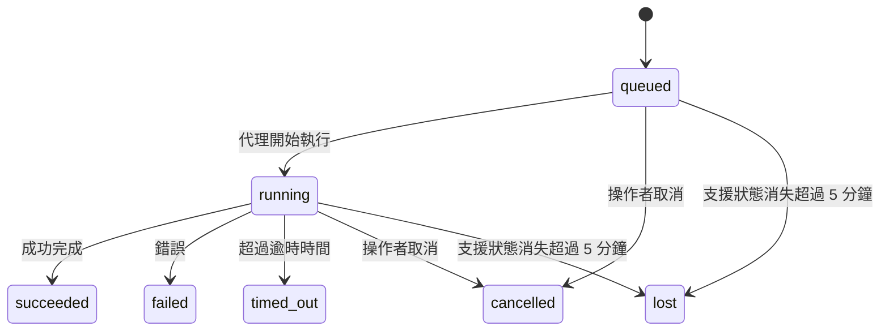

---
read_when:
    - 檢查進行中或最近完成的背景工作
    - 偵錯分離式代理程式執行的傳送失敗
    - 瞭解背景執行與工作階段、排程及心跳偵測之間的關係
sidebarTitle: Background tasks
summary: ACP 執行、子代理、排程執行和命令列介面操作的背景工作追蹤
title: 背景工作
x-i18n:
    generated_at: "2026-07-19T13:34:29Z"
    model: gpt-5.6
    postprocess_version: locale-links-v1
    prompt_version: 32
    provider: openai
    source_hash: dbdc5ced133764fec0c8b9ae7b1957e24272dc9c1c86099de81f6923955d6b5a
    source_path: automation/tasks.md
    workflow: 16
---

<Note>
想找排程功能嗎？請參閱[自動化](/zh-TW/automation)以選擇合適的機制。本頁是背景工作的活動紀錄帳，而不是排程器。
</Note>

背景任務會追蹤在**主要對話工作階段之外**執行的工作：ACP 執行、子代理產生、排程工作執行，以及由命令列介面啟動的操作。

任務**不會**取代工作階段、排程工作或心跳偵測——它們是記錄哪些分離式工作曾經執行、何時執行，以及是否成功的**活動紀錄帳**。

<Note>
並非每次代理執行都會建立任務。心跳偵測回合與一般互動式聊天不會。所有排程執行、ACP 產生、子代理產生、由閘道分派的命令列介面代理命令，以及代理啟動的背景 `exec` 命令都會。
</Note>

## 重點摘要

- 任務是**紀錄**，不是排程器——排程與心跳偵測決定工作_何時_執行，任務則追蹤_發生了什麼_。
- ACP、子代理、所有排程工作及命令列介面操作都會建立任務。心跳偵測回合不會。
- 每個任務都會經過 `queued → running → terminal`（成功、失敗、逾時、已取消或遺失）。
- 只要排程執行階段仍擁有該工作，排程任務就會維持運作中；如果記憶體內的執行階段狀態已消失，任務維護會先檢查持久化的排程執行歷程，再將任務標記為遺失。
- 完成通知由推送驅動：分離式工作完成時，可直接通知或喚醒要求者的工作階段／心跳偵測，因此狀態輪詢迴圈通常不是正確的做法。
- 獨立排程執行與子代理完成時，會盡力清理其子工作階段中受追蹤的瀏覽器分頁／處理程序，再進行最終清理記帳。
- 獨立排程傳遞會在後代子代理工作仍在收尾時抑制過時的中間父層回覆；如果最終後代輸出在傳遞前抵達，則會優先採用該輸出。
- 完成通知會直接傳遞至頻道，或排入佇列等待下一次心跳偵測。
- `openclaw tasks list` 會顯示所有任務；`openclaw tasks audit` 會呈現問題。
- 終止紀錄會保留 7 天（`lost` 紀錄為 24 小時），之後自動清除。

## 快速開始

<Tabs>
  <Tab title="列出與篩選">
    ```bash
    # 列出所有任務（最新的優先）
    openclaw tasks list

    # 依執行階段或狀態篩選
    openclaw tasks list --runtime acp
    openclaw tasks list --status running
    ```

  </Tab>
  <Tab title="檢查">
    ```bash
    # 顯示特定任務的詳細資料（依任務 ID、執行 ID 或工作階段鍵）
    openclaw tasks show <lookup>
    ```
  </Tab>
  <Tab title="取消與通知">
    ```bash
    # 取消執行中的任務（終止子工作階段）
    openclaw tasks cancel <lookup>

    # 變更任務的通知原則
    openclaw tasks notify <lookup> state_changes
    ```

  </Tab>
  <Tab title="稽核與維護">
    ```bash
    # 執行健康狀態稽核
    openclaw tasks audit

    # 預覽或套用維護
    openclaw tasks maintenance
    openclaw tasks maintenance --apply
    ```

  </Tab>
  <Tab title="TaskFlow 流程">
    ```bash
    # 檢查 TaskFlow 狀態
    openclaw tasks flow list
    openclaw tasks flow show <lookup>
    openclaw tasks flow cancel <lookup>
    ```
  </Tab>
</Tabs>

## 哪些操作會建立任務

| 來源                   | 執行階段類型 | 建立任務紀錄的時機                                                       | 預設通知原則 |
| ---------------------- | ------------ | ---------------------------------------------------------------------- | --------------------- |
| ACP 背景執行           | `acp`        | 產生子 ACP 工作階段                                                    | `done_only`           |
| 子代理協調             | `subagent`   | 透過 `sessions_spawn` 產生子代理                                      | `done_only`           |
| 排程工作（所有類型）   | `cron`       | 每次排程執行（主要工作階段與獨立工作階段）                              | `silent`              |
| 命令列介面操作         | `cli`        | 透過閘道執行的 `openclaw agent` 命令                                  | `silent`              |
| 代理媒體工作           | `cli`        | 由工作階段支援的 `image_generate`/`music_generate`/`video_generate` 執行 | `silent`              |

<AccordionGroup>
  <Accordion title="排程與媒體的通知預設值">
    排程任務（主要工作階段與獨立工作階段）使用 `silent` 通知原則——它們會建立紀錄以供追蹤，但不會自行產生任務通知；排程會負責其傳遞路徑。

    由工作階段支援的 `image_generate`、`music_generate` 和 `video_generate` 執行也使用 `silent` 通知原則。它們仍會建立任務紀錄，但完成結果會以內部喚醒方式交回原始代理工作階段，讓代理能撰寫後續訊息並自行附加完成的媒體。要求者代理會遵循其一般可見回覆契約：設定時自動傳送最終回覆，或在工作階段要求使用訊息工具回覆時使用 `message(action="send")` 加上 `NO_REPLY`。如果要求者工作階段已不再作用中或其主動喚醒失敗，且完成代理遺漏部分或全部產生的媒體，OpenClaw 會向原始頻道目標傳送具冪等性的直接備援，且只包含遺漏的媒體。

  </Accordion>
  <Accordion title="並行媒體產生防護機制">
    當由工作階段支援的媒體產生任務仍處於作用中時，`image_generate`、`music_generate` 和 `video_generate` 會防止意外重試：對相同提示／要求重複呼叫時，會傳回相符的作用中任務狀態，而不會啟動重複任務；不同的提示則可啟動自己的任務。若要從代理端明確查詢進度／狀態，請使用 `action: "status"`。
  </Accordion>
  <Accordion title="哪些操作不會建立任務">
    - 心跳偵測回合——主要工作階段；請參閱[心跳偵測](/zh-TW/gateway/heartbeat)
    - 一般互動式聊天回合
    - 直接 `/command` 回應

  </Accordion>
</AccordionGroup>

## 任務生命週期



| 狀態        | 意義                                                                        |
| ----------- | --------------------------------------------------------------------------- |
| `queued`    | 已建立，等待代理開始執行                                                    |
| `running`   | 代理回合正在執行                                                            |
| `succeeded` | 已成功完成                                                                  |
| `failed`    | 因錯誤而完成                                                                |
| `timed_out` | 超過設定的逾時時間                                                          |
| `cancelled` | 操作者透過 `openclaw tasks cancel` 停止，或執行已中止 |
| `lost`      | 經過 5 分鐘寬限期後，執行階段失去具權威性的支援狀態                         |

轉換會自動發生——代理執行生命週期事件（開始、結束、錯誤）會更新任務狀態；你不需手動管理。

對於作用中的任務紀錄，代理執行完成結果具有權威性。成功的分離式執行最終會成為 `succeeded`，一般執行錯誤最終會成為 `failed`，逾時最終會成為 `timed_out`，而取消／中止結果最終會成為 `cancelled`。任務一旦進入終止狀態，後續生命週期訊號不會將其降級——即使之後收到成功訊號，由操作者取消或已處於 `failed`/`timed_out`/`lost` 狀態的任務仍會維持原狀。

`lost` 會感知執行階段：

- ACP 任務：只有閘道中作用中的同一處理程序 ACP 回合能證明執行仍在進行；僅有持久化工作階段中繼資料並不足夠。離線命令列介面稽核會保持保守，絕不回收 ACP 任務。
- 子代理任務：支援的子工作階段已從目標代理儲存區消失（或帶有重新啟動復原墓碑）。
- 排程任務：排程執行階段已不再將該工作追蹤為作用中，且持久化的排程執行歷程未顯示該次執行的終止結果。離線命令列介面稽核不會將其自身空白的同一處理程序排程執行階段狀態視為權威依據。
- 命令列介面任務：具有執行 ID／來源 ID 的任務會使用即時執行內容，因此在閘道擁有的執行消失後，殘留的子工作階段或聊天工作階段資料列不會讓它們維持作用中。沒有執行識別資訊的舊版命令列介面任務仍會退回使用子工作階段。由閘道支援的 `openclaw agent` 執行也會依其執行結果完成，因此已完成的執行不會一直維持作用中，直到清理器將其標記為 `lost`。

## 傳遞與通知

當任務進入終止狀態時，OpenClaw 會通知你。共有兩種傳遞路徑：

**直接傳遞**——如果任務具有頻道目標（即 `requesterOrigin`），完成訊息會直接傳送至該頻道（Discord、Slack、Telegram 等）。群組與頻道任務的完成訊息則會改經由要求者工作階段路由，讓父代理撰寫可見回覆。對於子代理完成訊息，OpenClaw 也會在可用時保留已繫結的討論串／主題路由，並可在放棄直接傳遞前，從要求者工作階段儲存的路由（`lastChannel` / `lastTo` / `lastAccountId`）補入缺少的 `to`／帳戶。

**工作階段佇列傳遞**——如果直接傳遞失敗或未設定來源，更新會以系統事件排入要求者工作階段的佇列，並在下一次心跳偵測時呈現。

<Tip>
排入工作階段佇列的任務完成事件會立即觸發心跳偵測喚醒，因此你可以很快看到結果——不必等待下一個排定的心跳偵測週期。
</Tip>

這表示一般工作流程以推送為基礎：啟動分離式工作一次，然後讓執行階段在完成時喚醒或通知你。只有在需要偵錯、介入或明確稽核時，才輪詢任務狀態。

### 通知原則

控制每個任務向你傳遞多少資訊：

| 原則                  | 傳遞內容                                                |
| --------------------- | ------------------------------------------------------- |
| `done_only`（預設） | 僅終止狀態（成功、失敗等）                              |
| `state_changes`       | 每次狀態轉換與進度更新                                  |
| `silent`              | 完全不傳遞（排程、命令列介面及媒體任務的預設值）        |

在任務執行期間變更原則：

```bash
openclaw tasks notify <lookup> state_changes
```

## 命令列介面參考

<AccordionGroup>
  <Accordion title="tasks list">
    ```bash
    openclaw tasks list [--runtime <acp|subagent|cron|cli>] [--status <status>] [--json]
    ```

    輸出欄位：任務、種類、狀態、傳遞、執行、子工作階段、摘要。單獨使用 `openclaw tasks` 的行為如同 `openclaw tasks list`。

  </Accordion>
  <Accordion title="tasks show">
    ```bash
    openclaw tasks show <lookup> [--json]
    ```

    查詢權杖接受任務 ID、執行 ID 或工作階段鍵。顯示完整紀錄，包括時間資訊、傳遞狀態、錯誤及終止摘要。

  </Accordion>
  <Accordion title="tasks cancel">
    ```bash
    openclaw tasks cancel <lookup>
    ```

    對於 ACP 和子代理工作，這會終止子工作階段；ACP 與排程取消會透過執行中的閘道 (`tasks.cancel`) 路由。對於由命令列介面追蹤的工作，取消會記錄於工作登錄檔中（沒有獨立的子執行階段控制代碼）。狀態會轉換為 `cancelled`，並在適用時傳送遞送通知。

  </Accordion>
  <Accordion title="工作通知">
    ```bash
    openclaw tasks notify <lookup> <done_only|state_changes|silent>
    ```
  </Accordion>
  <Accordion title="工作稽核">
    ```bash
    openclaw tasks audit [--severity <warn|error>] [--code <name>] [--limit <n>] [--json]
    ```

    在單一報告中呈現工作**和** TaskFlow 的操作問題。偵測到問題時，發現項目也會顯示於 `openclaw status`。

    工作發現項目：

    | 發現項目                   | 嚴重性   | 觸發條件                                                                                                      |
    | ------------------------- | ---------- | ------------------------------------------------------------------------------------------------------------ |
    | `stale_queued`            | 警告       | 排入佇列超過 10 分鐘                                                                              |
    | `stale_running`           | 錯誤      | 執行超過 30 分鐘                                                                             |
    | `lost`                    | 警告/錯誤 | 由執行階段支援的工作擁有權已消失；保留的遺失工作在 `cleanupAfter` 前會發出警告，之後則變成錯誤 |
    | `delivery_failed`         | 警告       | 遞送失敗，且通知原則不是 `silent`                                                            |
    | `missing_cleanup`         | 警告       | 終止工作沒有清理時間戳記                                                                      |
    | `inconsistent_timestamps` | 警告       | 時間軸違規（例如結束時間早於開始時間）                                                        |

    TaskFlow 發現項目：

    | 發現項目                | 嚴重性   | 觸發條件                                                                    |
    | ---------------------- | ---------- | --------------------------------------------------------------------------- |
    | `restore_failed`       | 錯誤      | 從 SQLite 還原流程登錄檔失敗                                    |
    | `stale_running`        | 錯誤      | 執行中的流程超過 30 分鐘未推進                      |
    | `stale_waiting`        | 警告       | 等待中的流程超過 30 分鐘未推進                      |
    | `stale_blocked`        | 警告       | 遭封鎖的流程超過 30 分鐘未推進                      |
    | `cancel_stuck`         | 警告       | 已在超過 5 分鐘前要求取消，沒有作用中的子工作，但仍未終止 |
    | `missing_linked_tasks` | 警告/錯誤 | 過時的受管理流程沒有連結的工作或等待狀態                       |
    | `blocked_task_missing` | 警告       | 遭封鎖的流程指向已不存在的工作 ID                      |

  </Accordion>
  <Accordion title="工作維護">
    ```bash
    openclaw tasks maintenance [--json]
    openclaw tasks maintenance --apply [--json]
    ```

    使用此命令預覽或套用工作、TaskFlow 狀態及過時排程執行工作階段登錄列的協調、清理標記與修剪。

    協調會感知執行階段：

    - ACP 工作要求閘道中存在即時的處理程序內回合；子代理工作則檢查其後端子工作階段。
    - 若子代理工作的子工作階段具有重新啟動復原墓碑，該工作會標記為遺失，而不會將其視為可復原的後端工作階段。
    - 排程工作會檢查排程執行階段是否仍擁有該作業，接著從持久化的排程執行記錄／作業狀態中復原終止狀態，最後才退回使用 `lost`。只有閘道處理程序對記憶體內的排程作用中作業集合具有權威性；離線命令列介面稽核會使用持久化歷程，但不會只因該本機集合為空就將排程工作標記為遺失。
    - 具有執行識別資訊的命令列介面工作會檢查所屬的即時執行內容，而不只是子工作階段或聊天工作階段資料列。

    完成清理也會感知執行階段：

    - 子代理完成時，會在公告清理繼續前，盡力關閉為該子工作階段追蹤的瀏覽器分頁／處理程序。
    - 隔離排程完成時，會在執行完全拆除前，盡力關閉為該排程工作階段追蹤的瀏覽器分頁／處理程序。
    - 隔離排程遞送會在需要時等待後代子代理的後續處理完成，並抑制過時的父層確認文字，而不予公告。
    - 子代理完成遞送只會使用子代理最新可見的助理文字。工具／工具結果輸出不會提升為子代理結果文字。以失敗終止的執行會公告失敗狀態，而不會重播擷取的回覆文字。
    - 清理失敗不會掩蓋真正的工作結果。

    套用維護時，OpenClaw 也會移除超過 7 天的過時 `cron:<jobId>:run:<runId>` 工作階段登錄列，同時保留目前執行中排程作業的資料列，且不變更非排程工作階段資料列。

  </Accordion>
  <Accordion title="工作流程清單 | 顯示 | 取消">
    ```bash
    openclaw tasks flow list [--status <status>] [--json]
    openclaw tasks flow show <lookup> [--json]
    openclaw tasks flow cancel <lookup>
    ```

    流程查詢權杖可接受流程 ID 或擁有者金鑰。當你關注的是協調用的 [Task Flow](/zh-TW/automation/taskflow)，而不是某一筆個別的背景工作記錄時，請使用這些命令。

  </Accordion>
</AccordionGroup>

## 聊天工作看板 (`/tasks`)

在任何聊天工作階段中使用 `/tasks`，即可查看連結至該工作階段的背景工作。看板最多顯示五個作用中及最近完成的工作，包含執行階段、狀態、時間資訊，以及進度或錯誤詳細資料。

當目前工作階段沒有可見的已連結工作時，`/tasks` 會退回顯示代理程式本機工作計數，讓你仍可取得概覽，而不會洩漏其他工作階段的詳細資料。

如需完整的操作員分類帳，請使用命令列介面：`openclaw tasks list`。

### 控制介面

網頁版控制介面的側邊欄中有一個**工作**頁面，會即時顯示作用中及最近的背景工作。你可以用它檢查進度、開啟已連結的工作階段、重新整理分類帳，或取消排入佇列及執行中的工作。

聊天窗格也有一個可收合的**背景工作**側欄，其範圍限定於該窗格的代理程式：其中包含具停止控制項的執行中工作與子代理、已完成區段，以及可進入各工作子工作階段的「檢視逐字稿」連結。你可以從窗格標頭中的活動切換按鈕開啟（或在單窗格聊天中使用浮動活動按鈕）。

在側欄中選取工作，即可檢查其受限的輸入提示及最新輸出或錯誤摘要。執行中的工作會與已完成的工作分開，已完成的資料列則會顯示工作是完成還是失敗。在 iOS 上，開啟**聊天操作 → 背景工作**；在 Android 上，開啟聊天溢位選單並選取**背景工作**。兩個行動版檢視都使用相同的「執行中」與「已完成」分組，並在選取時開啟工作詳細資料。

## 狀態整合（工作壓力）

`openclaw status` 包含一行可快速瀏覽的工作資訊：

```
工作    2 個作用中 · 1 個已排入佇列 · 1 個執行中 · 1 個問題 · 稽核無異常 · 追蹤 6 筆
```

摘要會計算作用中工作（`queued` + `running`）、失敗（`failed` + `timed_out` + `lost`）、稽核發現項目及追蹤記錄總數；JSON 承載資料也會依執行階段細分計數（`acp`、`subagent`、`cron`、`cli`）。

`/status` 和 `session_status` 工具都使用可感知清理狀態的工作快照：優先顯示作用中工作、隱藏已過期資料列，而終止工作只會在最近的短暫期間（5 分鐘）內顯示；若沒有剩餘的作用中工作，則聚焦顯示失敗。如此可讓狀態卡片聚焦於當下的重要事項。

## 儲存與維護

### 工作儲存位置

工作記錄與遞送狀態會持久化於共用的 OpenClaw SQLite 狀態資料庫：

```
~/.openclaw/state/openclaw.sqlite   （資料表：task_runs、task_delivery_state、flow_runs）
```

設定 `OPENCLAW_STATE_DIR` 可將整個狀態根目錄（預設為 `~/.openclaw`）移至其他位置；共用資料庫路徑也會隨之移動。

登錄檔會在首次使用時載入記憶體，且每次寫入都會持久化回 SQLite，因此記錄可在閘道重新啟動後保留。WAL 的成長會透過 SQLite 的預設自動檢查點門檻及定期 `PASSIVE` 檢查點維持在有限範圍內；關閉及明確維護的檢查點會使用 `TRUNCATE`，讓正常關閉可回收 WAL 空間，而不必讓背景清理程式等待作用中的讀取者。

較舊安裝版本的舊式附屬儲存區（`tasks/runs.sqlite`、`flows/registry.sqlite`）會由 `openclaw doctor` 匯入共用資料庫。

### 自動維護

清理程式每 **60 秒**執行一次（第一次約在閘道啟動 5 秒後執行），並處理四件事：

<Steps>
  <Step title="協調">
    檢查作用中工作是否仍有具權威性的執行階段後端。ACP 工作要求即時的處理程序內回合，子代理工作使用子工作階段狀態，排程工作使用作用中作業擁有權加上持久化執行歷程，而具有執行識別資訊的命令列介面工作則使用所屬執行內容。若後端狀態消失超過 5 分鐘（沒有子工作階段的原生子代理工作則為 30 分鐘），工作會標記為 `lost`。
  </Step>
  <Step title="ACP 工作階段修復">
    關閉已終止或成為孤兒且由父層擁有的一次性 ACP 工作階段；只有在沒有剩餘作用中對話繫結時，才會關閉過時、已終止或成為孤兒的持久 ACP 工作階段。
  </Step>
  <Step title="清理標記">
    在終止工作上設定 `cleanupAfter` 時間戳記（終止時間 + 保留期間）。保留期間內，遺失工作仍會在稽核中顯示為警告；`cleanupAfter` 到期後，或缺少清理中繼資料時，則會變成錯誤。
  </Step>
  <Step title="修剪">
    刪除超過其 `cleanupAfter` 日期的記錄。
  </Step>
</Steps>

<Note>
**保留期間：**終止工作記錄會保留 **7 天**（`lost` 記錄保留 **24 小時**），之後自動修剪。不需要設定。
</Note>

## 工作與其他系統的關係

<AccordionGroup>
  <Accordion title="工作與 Task Flow">
    [Task Flow](/zh-TW/automation/taskflow) 是位於背景工作之上的流程協調層。單一流程可在其生命週期內使用受管理或鏡像同步模式協調多個工作。使用 `openclaw tasks` 檢查個別工作記錄，並使用 `openclaw tasks flow` 檢查協調流程。

  </Accordion>
  <Accordion title="工作與排程">
    排程作業定義、執行階段執行狀態及執行歷程會儲存於 OpenClaw 的共用 SQLite 狀態資料庫中。**每一次**排程執行都會建立一筆工作記錄——包含主要工作階段及隔離工作階段——並使用 `silent` 通知原則，因此可追蹤排程執行，而不會另外產生工作通知。

    請參閱[排程作業](/zh-TW/automation/cron-jobs)。

  </Accordion>
  <Accordion title="工作與心跳偵測">
    心跳偵測執行屬於主要工作階段回合，不會建立工作記錄。工作完成時，可觸發心跳偵測喚醒，讓你立即看到結果。

    請參閱[心跳偵測](/zh-TW/gateway/heartbeat)。

  </Accordion>
  <Accordion title="任務與工作階段">
    任務可能會參照 `childSessionKey`（工作執行的位置）和 `requesterSessionKey`（啟動者）。其 `agentId` 用於識別執行工作的代理程式，而請求者與擁有者欄位則保留啟動與控制的情境。工作階段是對話情境；任務則是在此基礎上的活動追蹤。
  </Accordion>
  <Accordion title="任務與代理程式執行">
    任務的 `runId` 會連結至執行該工作的代理程式執行。代理程式生命週期事件（開始、結束、錯誤）會自動更新任務狀態，你不需要手動管理生命週期。
  </Accordion>
</AccordionGroup>

## 相關內容

- [自動化](/zh-TW/automation) - 一覽所有自動化機制
- [命令列介面：任務](/zh-TW/cli/tasks) - 命令列介面命令參考
- [心跳偵測](/zh-TW/gateway/heartbeat) - 定期進行的主要工作階段輪次
- [排程任務](/zh-TW/automation/cron-jobs) - 排程背景工作
- [TaskFlow](/zh-TW/automation/taskflow) - 位於任務之上的流程協調機制
