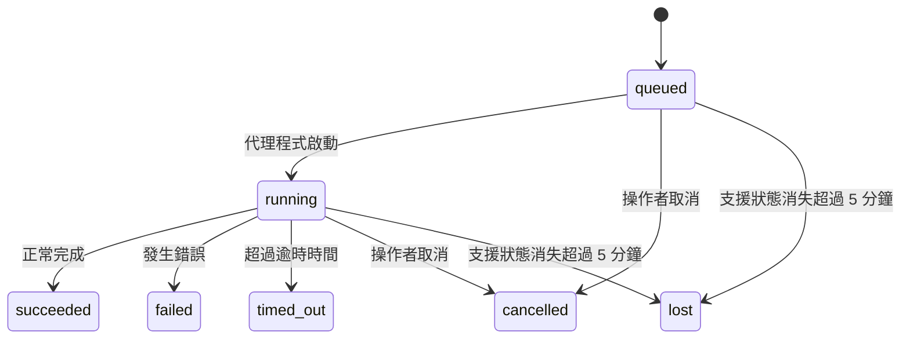

---
read_when:
    - 檢查正在進行或最近完成的背景工作
    - 偵錯分離式代理程式執行的傳遞失敗
    - 瞭解背景執行與工作階段、排程及心跳偵測之間的關係
sidebarTitle: Background tasks
summary: ACP 執行、子代理、排程執行與命令列介面操作的背景任務追蹤
title: 背景工作
x-i18n:
    generated_at: "2026-07-11T21:05:19Z"
    model: gpt-5.6
    postprocess_version: locale-links-v1
    provider: openai
    source_hash: 0a945e8103c5df5a64785f326a9d0b08784ac32a2ca6fa3d4c399d75fc54be2b
    source_path: automation/tasks.md
    workflow: 16
---

<Note>
想要排程功能嗎？請參閱[自動化](/zh-TW/automation)，以選擇合適的機制。本頁是背景工作的活動帳本，而不是排程器。
</Note>

背景任務會追蹤在**主要對話工作階段之外**執行的工作：ACP 執行、子代理程式建立、排程工作執行，以及由命令列介面啟動的作業。

任務**不會**取代工作階段、排程工作或心跳偵測，而是記錄已發生哪些分離式工作、發生時間及是否成功的**活動帳本**。

<Note>
並非每次代理程式執行都會建立任務。心跳偵測回合和一般互動式聊天不會建立任務。所有排程執行、ACP 建立、子代理程式建立，以及由閘道分派的命令列介面代理程式命令都會建立任務。
</Note>

## 摘要

- 任務是**記錄**，不是排程器——排程和心跳偵測決定工作_何時_執行，任務則追蹤_發生了什麼_。
- ACP、子代理程式、所有排程工作及命令列介面作業都會建立任務。心跳偵測回合不會。
- 每個任務都會依序經過 `queued → running → terminal`（成功、失敗、逾時、已取消或遺失）。
- 只要排程執行階段仍擁有工作，排程任務就會保持作用中；如果記憶體內的執行階段狀態已消失，任務維護程序會先檢查持久化的排程執行歷程，再將任務標記為遺失。
- 完成處理由推送驅動：分離式工作可在完成時直接通知，或喚醒請求者工作階段／心跳偵測，因此狀態輪詢迴圈通常不是正確的做法。
- 獨立排程執行和子代理程式完成時，會在最終清理簿記前，盡力清理其子工作階段所追蹤的瀏覽器分頁／處理程序。
- 當後代子代理程式工作仍在收尾時，獨立排程傳遞會抑制過時的中間父層回覆；若最終後代輸出在傳遞前抵達，則會優先採用該輸出。
- 完成通知會直接傳遞至頻道，或排入下一次心跳偵測的佇列。
- `openclaw tasks list` 顯示所有任務；`openclaw tasks audit` 顯示問題。
- 終止狀態記錄會保留 7 天（`lost` 記錄保留 24 小時），之後自動刪除。

## 快速開始

<Tabs>
  <Tab title="列出與篩選">
    ```bash
    # 列出所有任務（最新的優先）
    openclaw tasks list

    # 依執行階段或狀態篩選
    openclaw tasks list --runtime acp
    openclaw tasks list --status running
    ```

  </Tab>
  <Tab title="檢查">
    ```bash
    # 顯示特定任務的詳細資料（依任務 ID、執行 ID 或工作階段鍵）
    openclaw tasks show <lookup>
    ```
  </Tab>
  <Tab title="取消與通知">
    ```bash
    # 取消執行中的任務（終止子工作階段）
    openclaw tasks cancel <lookup>

    # 變更任務的通知原則
    openclaw tasks notify <lookup> state_changes
    ```

  </Tab>
  <Tab title="稽核與維護">
    ```bash
    # 執行健康狀況稽核
    openclaw tasks audit

    # 預覽或套用維護
    openclaw tasks maintenance
    openclaw tasks maintenance --apply
    ```

  </Tab>
  <Tab title="任務流程">
    ```bash
    # 檢查 TaskFlow 狀態
    openclaw tasks flow list
    openclaw tasks flow show <lookup>
    openclaw tasks flow cancel <lookup>
    ```
  </Tab>
</Tabs>

## 哪些作業會建立任務

| 來源                   | 執行階段類型 | 建立任務記錄的時機                                                       | 預設通知原則 |
| ---------------------- | ------------ | ------------------------------------------------------------------------ | ------------ |
| ACP 背景執行           | `acp`        | 建立子 ACP 工作階段                                                      | `done_only`  |
| 子代理程式協調         | `subagent`   | 透過 `sessions_spawn` 建立子代理程式                                    | `done_only`  |
| 排程工作（所有類型）   | `cron`       | 每次排程執行（主要工作階段與獨立工作階段）                               | `silent`     |
| 命令列介面作業         | `cli`        | 透過閘道執行的 `openclaw agent` 命令                                    | `silent`     |
| 代理程式媒體工作       | `cli`        | 以工作階段為基礎的 `image_generate`/`music_generate`/`video_generate` 執行 | `silent`     |

<AccordionGroup>
  <Accordion title="排程與媒體的通知預設值">
    排程任務（主要工作階段與獨立工作階段）使用 `silent` 通知原則——它們會建立記錄以供追蹤，但本身不會產生任務通知；傳遞路徑由排程擁有。

    以工作階段為基礎的 `image_generate`、`music_generate` 和 `video_generate` 執行也使用 `silent` 通知原則。它們仍會建立任務記錄，但完成結果會以內部喚醒的方式交回原始代理程式工作階段，讓代理程式撰寫後續訊息並自行附加完成的媒體。請求者代理程式會遵循其一般的可見回覆合約：設定後自動傳送最終回覆，或在工作階段要求使用訊息工具回覆時，使用 `message(action="send")` 加上 `NO_REPLY`。如果請求者工作階段已不再作用中，或其作用中喚醒失敗，而且完成代理程式遺漏部分或全部產生的媒體，OpenClaw 會向原始頻道目標傳送僅包含遺漏媒體、具冪等性的直接備援訊息。

  </Accordion>
  <Accordion title="並行媒體產生防護">
    當以工作階段為基礎的媒體產生任務仍在作用中時，`image_generate`、`music_generate` 和 `video_generate` 會防止意外重試：針對相同提示／請求重複呼叫時，會傳回相符的作用中任務狀態，而不是啟動重複任務；不同的提示則可啟動自己的任務。若要從代理程式端明確查詢進度／狀態，請使用 `action: "status"`。
  </Accordion>
  <Accordion title="哪些作業不會建立任務">
    - 心跳偵測回合——主要工作階段；請參閱[心跳偵測](/zh-TW/gateway/heartbeat)
    - 一般互動式聊天回合
    - 直接 `/command` 回應

  </Accordion>
</AccordionGroup>

## 任務生命週期



| 狀態        | 含義                                                                        |
| ----------- | --------------------------------------------------------------------------- |
| `queued`    | 已建立，正在等待代理程式啟動                                                |
| `running`   | 代理程式回合正在執行                                                        |
| `succeeded` | 已成功完成                                                                  |
| `failed`    | 完成時發生錯誤                                                              |
| `timed_out` | 超過設定的逾時時間                                                          |
| `cancelled` | 由操作者透過 `openclaw tasks cancel` 停止，或執行已中止                     |
| `lost`      | 經過 5 分鐘寬限期後，執行階段遺失具權威性的支援狀態                         |

狀態轉換會自動發生——代理程式執行生命週期事件（開始、結束、錯誤）會更新任務狀態；您不需要手動管理。

對於作用中的任務記錄，代理程式執行完成結果具有權威性。成功的分離式執行會最終定案為 `succeeded`，一般執行錯誤會定案為 `failed`，逾時會定案為 `timed_out`，取消／中止結果則會定案為 `cancelled`。任務一旦進入終止狀態，後續生命週期訊號不會將其降級——由操作者取消或已為 `failed`/`timed_out`/`lost` 的任務，即使之後收到成功訊號，也會維持原狀。

`lost` 會感知執行階段：

- ACP 任務：只有閘道程序中仍作用中的 ACP 回合才能證明該執行仍存活；僅有持久化工作階段中繼資料並不足夠。離線命令列介面稽核會採取保守做法，永遠不會回收 ACP 任務。
- 子代理程式任務：支援它的子工作階段已從目標代理程式儲存區消失（或帶有重新啟動復原墓碑）。
- 排程任務：排程執行階段不再將該工作追蹤為作用中，且持久化排程執行歷程未顯示該次執行的終止結果。離線命令列介面稽核不會將自身空白的程序內排程執行階段狀態視為權威依據。
- 命令列介面任務：具有執行 ID／來源 ID 的任務會使用即時執行內容，因此閘道所擁有的執行消失後，殘留的子工作階段或聊天工作階段資料列不會讓它們繼續存活。沒有執行身分的舊版命令列介面任務仍會退回使用子工作階段。由閘道支援的 `openclaw agent` 執行也會依其執行結果定案，因此已完成的執行不會持續處於作用中，直到清理器將其標記為 `lost`。

## 傳遞與通知

當任務到達終止狀態時，OpenClaw 會通知您。共有兩種傳遞路徑：

**直接傳遞**——如果任務具有頻道目標（`requesterOrigin`），完成訊息會直接傳送至該頻道（Discord、Slack、Telegram 等）。群組和頻道任務的完成結果則會改由請求者工作階段路由，讓父代理程式撰寫可見回覆。對於子代理程式完成結果，OpenClaw 也會在可用時保留已繫結的討論串／主題路由，並可在放棄直接傳遞前，使用請求者工作階段儲存的路由（`lastChannel` / `lastTo` / `lastAccountId`）補齊缺少的 `to`／帳戶。

**工作階段佇列傳遞**——如果直接傳遞失敗或未設定來源，更新會以系統事件形式排入請求者工作階段的佇列，並在下一次心跳偵測時顯示。

<Tip>
排入工作階段佇列的任務完成事件會立即觸發心跳偵測喚醒，因此您可以快速看到結果——不必等待下一個排定的心跳偵測週期。
</Tip>

這表示一般工作流程是以推送為基礎：啟動一次分離式工作，然後讓執行階段在完成時喚醒或通知您。只有在需要偵錯、介入或明確稽核時，才輪詢任務狀態。

### 通知原則

控制每個任務的通知量：

| 原則                  | 傳遞內容                                                |
| --------------------- | ------------------------------------------------------- |
| `done_only`（預設）   | 僅終止狀態（成功、失敗等）                              |
| `state_changes`       | 每次狀態轉換和進度更新                                  |
| `silent`              | 完全不傳遞（排程、命令列介面和媒體任務的預設值）        |

在任務執行期間變更原則：

```bash
openclaw tasks notify <lookup> state_changes
```

## 命令列介面參考

<AccordionGroup>
  <Accordion title="tasks list">
    ```bash
    openclaw tasks list [--runtime <acp|subagent|cron|cli>] [--status <status>] [--json]
    ```

    輸出欄位：任務、種類、狀態、傳遞、執行、子工作階段、摘要。單獨執行 `openclaw tasks` 的行為等同於 `openclaw tasks list`。

  </Accordion>
  <Accordion title="tasks show">
    ```bash
    openclaw tasks show <lookup> [--json]
    ```

    查詢權杖接受任務 ID、執行 ID 或工作階段鍵。顯示完整記錄，包括時間資訊、傳遞狀態、錯誤及終止摘要。

  </Accordion>
  <Accordion title="tasks cancel">
    ```bash
    openclaw tasks cancel <lookup>
    ```

    對 ACP 和子代理程式任務而言，這會終止子工作階段；ACP 與排程取消會透過執行中的閘道（`tasks.cancel`）路由。對於由命令列介面追蹤的任務，取消會記錄於任務登錄中（沒有獨立的子執行階段控制代碼）。狀態會轉換為 `cancelled`，並在適用時傳送傳遞通知。

  </Accordion>
  <Accordion title="tasks notify">
    ```bash
    openclaw tasks notify <lookup> <done_only|state_changes|silent>
    ```
  </Accordion>
  <Accordion title="tasks audit">
    ```bash
    openclaw tasks audit [--severity <warn|error>] [--code <name>] [--limit <n>] [--json]
    ```

    在單一報告中顯示任務**及** TaskFlow 的作業問題。偵測到問題時，調查結果也會顯示於 `openclaw status`。

    任務調查結果：

    | 發現                      | 嚴重性     | 觸發條件                                                                                                      |
    | ------------------------- | ---------- | ------------------------------------------------------------------------------------------------------------ |
    | `stale_queued`            | 警告       | 排入佇列超過 10 分鐘                                                                                          |
    | `stale_running`           | 錯誤       | 執行超過 30 分鐘                                                                                              |
    | `lost`                    | 警告/錯誤  | 由執行階段支援的任務擁有權已消失；保留的遺失任務在 `cleanupAfter` 前會發出警告，之後則成為錯誤                  |
    | `delivery_failed`         | 警告       | 傳遞失敗，且通知原則不是 `silent`                                                                             |
    | `missing_cleanup`         | 警告       | 終止任務沒有清理時間戳記                                                                                      |
    | `inconsistent_timestamps` | 警告       | 時間軸違規（例如結束時間早於開始時間）                                                                        |

    TaskFlow 發現：

    | 發現                   | 嚴重性     | 觸發條件                                                                      |
    | ---------------------- | ---------- | ----------------------------------------------------------------------------- |
    | `restore_failed`       | 錯誤       | 從 SQLite 還原流程登錄失敗                                                     |
    | `stale_running`        | 錯誤       | 執行中的流程超過 30 分鐘未有進展                                               |
    | `stale_waiting`        | 警告       | 等待中的流程超過 30 分鐘未有進展                                               |
    | `stale_blocked`        | 警告       | 已封鎖的流程超過 30 分鐘未有進展                                               |
    | `cancel_stuck`         | 警告       | 已於超過 5 分鐘前要求取消，沒有作用中的子任務，但仍未終止                       |
    | `missing_linked_tasks` | 警告/錯誤  | 過期的受管理流程沒有連結的任務或等待狀態                                       |
    | `blocked_task_missing` | 警告       | 已封鎖的流程指向一個已不存在的任務 ID                                          |

  </Accordion>
  <Accordion title="任務維護">
    ```bash
    openclaw tasks maintenance [--json]
    openclaw tasks maintenance --apply [--json]
    ```

    使用此命令可預覽或套用任務、TaskFlow 狀態及過期排程執行工作階段登錄資料列的協調、清理時間戳記設定與修剪。

    協調會感知執行階段：

    - ACP 任務要求閘道中有作用中的程序內回合；子代理程式任務則檢查其支援的子工作階段。
    - 若子代理程式任務的子工作階段具有重新啟動復原墓碑，該任務會標記為遺失，而不會將其視為可復原的支援工作階段。
    - 排程任務會檢查排程執行階段是否仍擁有該工作，接著從持久化的排程執行日誌／工作狀態復原終止狀態，最後才退回 `lost`。只有閘道程序對記憶體內的排程作用中工作集合具有權威性；離線命令列介面稽核會使用持久化歷程，但不會僅因該本機集合為空而將排程任務標記為遺失。
    - 具有執行識別資訊的命令列介面任務會檢查所屬的作用中執行內容，而不只檢查子工作階段或聊天工作階段資料列。

    完成後的清理也會感知執行階段：

    - 子代理程式完成時，會先盡力關閉為子工作階段追蹤的瀏覽器分頁／程序，再繼續進行公告清理。
    - 隔離的排程完成時，會先盡力關閉為排程工作階段追蹤的瀏覽器分頁／程序，再完全拆除該次執行。
    - 必要時，隔離排程的傳遞會等待後代子代理程式完成後續工作，並抑制過期的父層確認文字，而不會將其公告。
    - 子代理程式完成傳遞只會使用子項目最新且可見的助理文字。`tool`／`toolResult` 輸出不會提升為子項目結果文字。終止的失敗執行會公告失敗狀態，但不會重播已擷取的回覆文字。
    - 清理失敗不會掩蓋真正的任務結果。

    套用維護時，OpenClaw 也會移除超過 7 天的過期 `cron:<jobId>:run:<runId>` 工作階段登錄資料列，同時保留目前執行中排程工作的資料列，且不會變更非排程工作階段資料列。

  </Accordion>
  <Accordion title="任務流程列出 | 顯示 | 取消">
    ```bash
    openclaw tasks flow list [--status <status>] [--json]
    openclaw tasks flow show <lookup> [--json]
    openclaw tasks flow cancel <lookup>
    ```

    流程查詢權杖接受流程 ID 或擁有者鍵。當你關注的是負責協調的[任務流程](/zh-TW/automation/taskflow)，而非單一背景任務記錄時，請使用這些命令。

  </Accordion>
</AccordionGroup>

## 聊天任務看板（`/tasks`）

在任何聊天工作階段中使用 `/tasks`，即可查看連結至該工作階段的背景任務。看板最多顯示五個作用中及最近完成的任務，包含執行階段、狀態、時間資訊，以及進度或錯誤詳細資料。

當目前工作階段沒有可見的已連結任務時，`/tasks` 會退回顯示代理程式本機任務計數，讓你仍能取得概覽，而不會洩漏其他工作階段的詳細資料。

若要查看完整的操作員總帳，請使用命令列介面：`openclaw tasks list`。

### 控制介面

網頁控制介面的側邊欄中有一個**任務**頁面，可即時顯示作用中及最近的背景任務。使用此頁面可檢查進度、開啟已連結的工作階段、重新整理總帳，或取消已排入佇列及執行中的任務。

聊天窗格也有一個可收合的**背景任務**側欄，其範圍限定於該窗格的代理程式：其中包含具停止控制項的執行中任務與子代理程式、已完成區段，以及可前往各任務子工作階段的「檢視逐字稿」連結。從窗格標題列的活動切換按鈕開啟（單窗格聊天則使用浮動活動按鈕）。

## 狀態整合（任務壓力）

`openclaw status` 包含一行可快速掌握情況的任務資訊：

```
任務    2 個作用中 · 1 個已排入佇列 · 1 個執行中 · 1 個問題 · 稽核無異常 · 追蹤 6 筆
```

摘要會計算作用中工作（`queued` + `running`）、失敗（`failed` + `timed_out` + `lost`）、稽核發現及追蹤記錄總數；JSON 承載內容也會依執行階段（`acp`、`subagent`、`cron`、`cli`）細分計數。

`/status` 與 `session_status` 工具都使用可感知清理狀態的任務快照：優先顯示作用中任務、隱藏已過期資料列，而終止任務只會在最近的短暫時段（5 分鐘）內顯示；若沒有剩餘的作用中工作，則會著重顯示失敗。如此可讓狀態卡片聚焦於目前的重要事項。

## 儲存與維護

### 任務的儲存位置

任務記錄與傳遞狀態會持久化至 OpenClaw 共用的 SQLite 狀態資料庫：

```
~/.openclaw/state/openclaw.sqlite   （資料表：task_runs、task_delivery_state、flow_runs）
```

設定 `OPENCLAW_STATE_DIR` 可將整個狀態根目錄（預設為 `~/.openclaw`）移至其他位置；共用資料庫路徑也會隨之移動。

登錄會在首次使用時載入記憶體，並將每次寫入持久化回 SQLite，因此記錄可在閘道重新啟動後保留。透過 SQLite 的預設自動檢查點臨界值及定期 `PASSIVE` 檢查點，可限制 WAL 的增長；關閉及明確維護時的檢查點則使用 `TRUNCATE`，使正常關閉能回收 WAL 空間，而不必讓背景清理器等待作用中的讀取者。

舊版安裝中的傳統附屬儲存區（`tasks/runs.sqlite`、`flows/registry.sqlite`）會由 `openclaw doctor` 匯入共用資料庫。

### 自動維護

清理器每 **60 秒**執行一次（第一次約在閘道啟動 5 秒後），並處理四件事：

<Steps>
  <Step title="協調">
    檢查作用中任務是否仍有權威的執行階段支援。ACP 任務要求有作用中的程序內回合，子代理程式任務使用子工作階段狀態，排程任務使用作用中工作擁有權與持久化執行歷程，而具有執行識別資訊的命令列介面任務則使用所屬的執行內容。若支援狀態消失超過 5 分鐘（沒有子項目的原生子代理程式任務為 30 分鐘），任務會標記為 `lost`。
  </Step>
  <Step title="ACP 工作階段修復">
    關閉已終止或孤立、由父層擁有的一次性 ACP 工作階段；只有在沒有作用中的對話繫結時，才會關閉過期且已終止或孤立的持久 ACP 工作階段。
  </Step>
  <Step title="清理時間戳記設定">
    在終止任務上設定 `cleanupAfter` 時間戳記（終止時間 + 保留期間）。在保留期間內，遺失的任務仍會以警告形式出現在稽核中；`cleanupAfter` 到期後，或缺少清理中繼資料時，則會成為錯誤。
  </Step>
  <Step title="修剪">
    刪除已超過其 `cleanupAfter` 日期的記錄。
  </Step>
</Steps>

<Note>
**保留期間：**終止任務記錄會保留 **7 天**（`lost` 記錄為 **24 小時**），之後自動修剪。無須設定。
</Note>

## 任務與其他系統的關係

<AccordionGroup>
  <Accordion title="任務與任務流程">
    [任務流程](/zh-TW/automation/taskflow)是背景任務之上的流程協調層。單一流程可在其生命週期內使用受管理或鏡像同步模式來協調多個任務。使用 `openclaw tasks` 檢查個別任務記錄，並使用 `openclaw tasks flow` 檢查負責協調的流程。

  </Accordion>
  <Accordion title="任務與排程">
    排程工作定義、執行階段執行狀態及執行歷程都儲存在 OpenClaw 的共用 SQLite 狀態資料庫中。**每一次**排程執行都會建立一筆任務記錄，不論是主工作階段或隔離工作階段，並採用 `silent` 通知原則，因此會追蹤排程執行，但不會自行產生任務通知。

    請參閱[排程工作](/zh-TW/automation/cron-jobs)。

  </Accordion>
  <Accordion title="任務與心跳偵測">
    心跳偵測執行屬於主工作階段回合，不會建立任務記錄。任務完成時，可以觸發心跳偵測喚醒，讓你及時看到結果。

    請參閱[心跳偵測](/zh-TW/gateway/heartbeat)。

  </Accordion>
  <Accordion title="任務與工作階段">
    任務可能會參照 `childSessionKey`（工作執行的位置）及 `requesterSessionKey`（啟動者）。其 `agentId` 識別執行工作的代理程式，而請求者與擁有者欄位則保留啟動及控制內容。工作階段是對話內容；任務則是在其上層進行的活動追蹤。
  </Accordion>
  <Accordion title="任務與代理程式執行">
    任務的 `runId` 會連結至執行該工作的代理程式執行。代理程式生命週期事件（開始、結束、錯誤）會自動更新任務狀態，你無須手動管理生命週期。
  </Accordion>
</AccordionGroup>

## 相關內容

- [自動化](/zh-TW/automation) - 快速總覽所有自動化機制
- [命令列介面：任務](/zh-TW/cli/tasks) - 命令列介面命令參考
- [心跳偵測](/zh-TW/gateway/heartbeat) - 定期主工作階段回合
- [排程任務](/zh-TW/automation/cron-jobs) - 排定背景工作的執行時間
- [任務流程](/zh-TW/automation/taskflow) - 任務之上的流程協調
