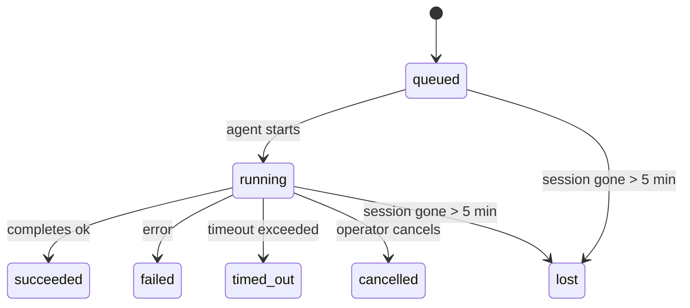

---
read_when:
    - 檢視進行中或最近完成的背景作業
    - 偵錯分離式代理執行的傳遞失敗
    - 了解背景執行與工作階段、Cron 和 Heartbeat 的關係
sidebarTitle: Background tasks
summary: 用於 ACP 執行、子代理、隔離式 Cron 作業和 CLI 操作的背景任務追蹤
title: 背景任務
x-i18n:
    generated_at: "2026-05-02T02:44:06Z"
    model: gpt-5.5
    provider: openai
    source_hash: 8782987a79989264ae3bd1ca4b16755bdfb7e295e4f77933bf3a38c136d837f4
    source_path: automation/tasks.md
    workflow: 16
---

<Note>
正在尋找排程功能？請參閱[自動化與任務](/zh-TW/automation)以選擇合適的機制。此頁面是背景工作的活動帳本，而不是排程器。
</Note>

背景任務會追蹤在**主要對話工作階段之外**執行的工作：ACP 執行、子代理產生、隔離的 cron 作業執行，以及由 CLI 啟動的操作。

任務**不會**取代工作階段、cron 作業或 Heartbeat —— 它們是**活動帳本**，用來記錄發生了哪些分離式工作、發生時間，以及是否成功。

<Note>
不是每次代理執行都會建立任務。Heartbeat 回合與一般互動式聊天不會。所有 cron 執行、ACP 產生、子代理產生，以及 CLI 代理命令都會建立任務。
</Note>

## 簡短摘要

- 任務是**記錄**，不是排程器 —— cron 和 Heartbeat 決定工作_何時_執行，任務追蹤_發生了什麼_。
- ACP、子代理、所有 cron 作業，以及 CLI 操作都會建立任務。Heartbeat 回合不會。
- 每個任務都會經過 `queued → running → terminal`（succeeded、failed、timed_out、cancelled 或 lost）。
- 只要 cron 執行階段仍然擁有該作業，Cron 任務就會保持啟用；如果
  記憶體中的執行階段狀態已消失，任務維護會先檢查持久化 cron
  執行歷史，再將任務標記為 lost。
- 完成是推送驅動的：分離式工作可在完成時直接通知，或喚醒
  請求者工作階段/Heartbeat，因此狀態輪詢迴圈通常不是正確形態。
- 隔離的 cron 執行與子代理完成時，會盡力在最終清理記帳前，清理其子工作階段追蹤的瀏覽器分頁/程序。
- 當後代子代理工作仍在排空時，隔離的 cron 傳遞會抑制過期的臨時父回覆；若最終後代輸出在傳遞前抵達，則優先使用該輸出。
- 完成通知會直接傳遞到頻道，或排入下一次 Heartbeat。
- `openclaw tasks list` 顯示所有任務；`openclaw tasks audit` 會顯示問題。
- 終端記錄會保留 7 天，然後自動修剪。

## 快速開始

<Tabs>
  <Tab title="列出與篩選">
    ```bash
    # List all tasks (newest first)
    openclaw tasks list

    # Filter by runtime or status
    openclaw tasks list --runtime acp
    openclaw tasks list --status running
    ```

  </Tab>
  <Tab title="檢查">
    ```bash
    # Show details for a specific task (by ID, run ID, or session key)
    openclaw tasks show <lookup>
    ```
  </Tab>
  <Tab title="取消與通知">
    ```bash
    # Cancel a running task (kills the child session)
    openclaw tasks cancel <lookup>

    # Change notification policy for a task
    openclaw tasks notify <lookup> state_changes
    ```

  </Tab>
  <Tab title="稽核與維護">
    ```bash
    # Run a health audit
    openclaw tasks audit

    # Preview or apply maintenance
    openclaw tasks maintenance
    openclaw tasks maintenance --apply
    ```

  </Tab>
  <Tab title="任務流程">
    ```bash
    # Inspect TaskFlow state
    openclaw tasks flow list
    openclaw tasks flow show <lookup>
    openclaw tasks flow cancel <lookup>
    ```
  </Tab>
</Tabs>

## 什麼會建立任務

| 來源                   | 執行階段類型 | 任務記錄建立時機                                       | 預設通知政策          |
| ---------------------- | ------------ | ------------------------------------------------------ | --------------------- |
| ACP 背景執行           | `acp`        | 產生子 ACP 工作階段                                    | `done_only`           |
| 子代理編排             | `subagent`   | 透過 `sessions_spawn` 產生子代理                       | `done_only`           |
| Cron 作業（所有類型）  | `cron`       | 每次 cron 執行（主要工作階段與隔離執行）               | `silent`              |
| CLI 操作               | `cli`        | 透過 Gateway 執行的 `openclaw agent` 命令              | `silent`              |
| 代理媒體作業           | `cli`        | 由工作階段支援的 `music_generate`/`video_generate` 執行 | `silent`              |

<AccordionGroup>
  <Accordion title="cron 與媒體的通知預設值">
    主要工作階段 cron 任務預設使用 `silent` 通知政策 —— 它們會建立記錄以供追蹤，但不會產生通知。隔離的 cron 任務也預設為 `silent`，但因為它們在自己的工作階段中執行，所以更容易被看到。

    由工作階段支援的 `music_generate` 與 `video_generate` 執行也使用 `silent` 通知政策。它們仍會建立任務記錄，但完成結果會作為內部喚醒交回原始代理工作階段，讓代理可以自行寫入後續訊息並附上完成的媒體。如果你選擇啟用 `tools.media.asyncCompletion.directSend`，非同步 `video_generate` 完成可以先嘗試直接傳遞到頻道；非同步 `music_generate` 完成則維持在請求者工作階段喚醒路徑上。

  </Accordion>
  <Accordion title="並行 video_generate 防護">
    當由工作階段支援的 `video_generate` 任務仍處於作用中時，該工具也會充當防護：同一工作階段中重複的 `video_generate` 呼叫會回傳作用中任務狀態，而不是啟動第二個並行產生。當你想從代理端明確查詢進度/狀態時，請使用 `action: "status"`。
  </Accordion>
  <Accordion title="什麼不會建立任務">
    - Heartbeat 回合 —— 主要工作階段；請參閱 [Heartbeat](/zh-TW/gateway/heartbeat)
    - 一般互動式聊天回合
    - 直接的 `/command` 回應

  </Accordion>
</AccordionGroup>

## 任務生命週期



| 狀態        | 含義                                                                       |
| ----------- | -------------------------------------------------------------------------- |
| `queued`    | 已建立，正在等待代理啟動                                                   |
| `running`   | 代理回合正在主動執行                                                       |
| `succeeded` | 已成功完成                                                                 |
| `failed`    | 已完成但發生錯誤                                                           |
| `timed_out` | 超過設定的逾時時間                                                         |
| `cancelled` | 由操作員透過 `openclaw tasks cancel` 停止                                  |
| `lost`      | 執行階段在 5 分鐘寬限期後失去權威後端狀態                                  |

轉換會自動發生 —— 當關聯的代理執行結束時，任務狀態會更新為相符狀態。

代理執行完成是作用中任務記錄的權威依據。成功的分離式執行會最終化為 `succeeded`，一般執行錯誤會最終化為 `failed`，逾時或中止結果會最終化為 `timed_out`。如果操作員已取消任務，或執行階段已記錄更強的終端狀態，例如 `failed`、`timed_out` 或 `lost`，較晚的成功訊號不會將該終端狀態降級。

`lost` 會感知執行階段：

- ACP 任務：後端 ACP 子工作階段中繼資料消失。
- 子代理任務：後端子工作階段從目標代理儲存中消失。
- Cron 任務：cron 執行階段不再將該作業追蹤為作用中，且持久化
  cron 執行歷史未顯示該次執行的終端結果。離線 CLI
  稽核不會將它自己的空白程序內 cron 執行階段狀態視為權威。
- CLI 任務：隔離的子工作階段任務使用子工作階段；由聊天支援的
  CLI 任務改用即時執行脈絡，因此殘留的
  頻道/群組/直接工作階段列不會讓它們保持作用中。由 Gateway 支援的
  `openclaw agent` 執行也會根據其執行結果最終化，因此已完成的執行
  不會一直處於作用中，直到清掃器將它們標記為 `lost`。

## 傳遞與通知

當任務到達終端狀態時，OpenClaw 會通知你。有兩種傳遞路徑：

**直接傳遞** —— 如果任務有頻道目標（`requesterOrigin`），完成訊息會直接送到該頻道（Telegram、Discord、Slack 等）。對於子代理完成，OpenClaw 也會在可用時保留繫結的執行緒/主題路由，並可在放棄直接傳遞前，從請求者工作階段儲存的路由（`lastChannel` / `lastTo` / `lastAccountId`）補上缺少的 `to` / 帳號。

**工作階段佇列傳遞** —— 如果直接傳遞失敗或未設定來源，更新會作為系統事件排入請求者的工作階段，並在下一次 Heartbeat 顯示。

<Tip>
任務完成會觸發立即 Heartbeat 喚醒，讓你能快速看到結果 —— 你不必等待下一個排定的 Heartbeat tick。
</Tip>

這表示一般工作流程是以推送為基礎：啟動一次分離式工作，然後讓執行階段在完成時喚醒或通知你。只有在需要偵錯、介入或明確稽核時，才輪詢任務狀態。

### 通知政策

控制你會收到每個任務多少資訊：

| 政策                  | 傳遞內容                                                                |
| --------------------- | ----------------------------------------------------------------------- |
| `done_only`（預設）   | 只有終端狀態（succeeded、failed 等）—— **這是預設值**                  |
| `state_changes`       | 每次狀態轉換與進度更新                                                  |
| `silent`              | 完全不傳遞                                                              |

在任務執行期間變更政策：

```bash
openclaw tasks notify <lookup> state_changes
```

## CLI 參考

<AccordionGroup>
  <Accordion title="tasks list">
    ```bash
    openclaw tasks list [--runtime <acp|subagent|cron|cli>] [--status <status>] [--json]
    ```

    輸出欄位：任務 ID、種類、狀態、傳遞、執行 ID、子工作階段、摘要。

  </Accordion>
  <Accordion title="tasks show">
    ```bash
    openclaw tasks show <lookup>
    ```

    查詢權杖接受任務 ID、執行 ID 或工作階段鍵。顯示完整記錄，包括時間、傳遞狀態、錯誤與終端摘要。

  </Accordion>
  <Accordion title="tasks cancel">
    ```bash
    openclaw tasks cancel <lookup>
    ```

    對 ACP 與子代理任務，這會終止子工作階段。對 CLI 追蹤的任務，取消會記錄在任務登錄檔中（沒有獨立的子執行階段控制代碼）。狀態會轉換為 `cancelled`，並在適用時傳送傳遞通知。

  </Accordion>
  <Accordion title="tasks notify">
    ```bash
    openclaw tasks notify <lookup> <done_only|state_changes|silent>
    ```
  </Accordion>
  <Accordion title="tasks audit">
    ```bash
    openclaw tasks audit [--json]
    ```

    顯示操作問題。偵測到問題時，發現項目也會出現在 `openclaw status` 中。

    | 發現項目                  | 嚴重性     | 觸發條件                                                                                                     |
    | ------------------------- | ---------- | ------------------------------------------------------------------------------------------------------------ |
    | `stale_queued`            | 警告       | 排入佇列超過 10 分鐘                                                                                         |
    | `stale_running`           | 錯誤       | 執行超過 30 分鐘                                                                                             |
    | `lost`                    | 警告/錯誤  | 由 runtime 支援的任務擁有權消失；保留的遺失任務在 `cleanupAfter` 前會發出警告，之後會變成錯誤              |
    | `delivery_failed`         | 警告       | 傳送失敗，且通知政策不是 `silent`                                                                            |
    | `missing_cleanup`         | 警告       | 終端任務沒有清理時間戳記                                                                                    |
    | `inconsistent_timestamps` | 警告       | 時間軸違規（例如結束時間早於開始時間）                                                                      |

  </Accordion>
  <Accordion title="任務維護">
    ```bash
    openclaw tasks maintenance [--json]
    openclaw tasks maintenance --apply [--json]
    ```

    使用這個指令預覽或套用任務與 Task Flow 狀態的調節、清理標記和剪除。

    調節會感知 runtime：

    - ACP/subagent 任務會檢查其背後的子 session。
    - 子 session 有 restart-recovery tombstone 的 subagent 任務，會標記為遺失，而不是被視為可復原的背後 session。
    - Cron 任務會檢查 cron runtime 是否仍擁有該 job，接著從持久化的 cron 執行記錄/job 狀態復原終端狀態，然後才回退到 `lost`。只有 Gateway 程序對記憶體內的 cron active-job set 具有權威性；離線 CLI 稽核會使用持久化歷史，但不會只因為該本機 Set 是空的，就將 cron 任務標記為遺失。
    - 由聊天支援的 CLI 任務會檢查所屬的即時 run context，而不只是聊天 session row。

    完成清理也會感知 runtime：

    - Subagent 完成時，會在宣布清理繼續前盡力關閉為子 session 追蹤的瀏覽器分頁/程序。
    - 隔離 cron 完成時，會在該次執行完全拆除前盡力關閉為 cron session 追蹤的瀏覽器分頁/程序。
    - 隔離 cron 傳送會在需要時等候後代 subagent follow-up，並抑制過時的父層確認文字，而不是宣布它。
    - Subagent 完成傳送會偏好最新可見的 assistant 文字；如果它是空的，會回退到已清理的最新 tool/toolResult 文字，而只有逾時 tool-call 的執行可以折疊為簡短的部分進度摘要。終端失敗的執行會宣布失敗狀態，而不重播擷取到的回覆文字。
    - 清理失敗不會遮蔽真正的任務結果。

  </Accordion>
  <Accordion title="任務流程 list | show | cancel">
    ```bash
    openclaw tasks flow list [--status <status>] [--json]
    openclaw tasks flow show <lookup> [--json]
    openclaw tasks flow cancel <lookup>
    ```

    當你關心的是編排中的 Task Flow，而不是單一背景任務記錄時，請使用這些指令。

  </Accordion>
</AccordionGroup>

## 聊天任務看板 (`/tasks`)

在任何聊天 session 中使用 `/tasks`，即可查看連結到該 session 的背景任務。看板會顯示作用中和最近完成的任務，包含 runtime、狀態、時間，以及進度或錯誤詳細資料。

當目前 session 沒有可見的連結任務時，`/tasks` 會回退到 agent-local 任務計數，因此你仍能取得概覽，而不洩漏其他 session 的詳細資料。

如需完整的 operator ledger，請使用 CLI：`openclaw tasks list`。

## 狀態整合（任務壓力）

`openclaw status` 包含一目了然的任務摘要：

```
Tasks: 3 queued · 2 running · 1 issues
```

摘要會回報：

- **作用中** — `queued` + `running` 的數量
- **失敗** — `failed` + `timed_out` + `lost` 的數量
- **byRuntime** — 依 `acp`、`subagent`、`cron`、`cli` 的細分

`/status` 和 `session_status` 工具都使用會感知清理的任務快照：優先顯示作用中任務，隱藏過時的已完成 row，而且只有在沒有作用中工作剩餘時，才會顯示最近的失敗。這讓狀態卡片能專注於目前真正重要的事項。

## 儲存與維護

### 任務存放位置

任務記錄會持久化在 SQLite：

```
$OPENCLAW_STATE_DIR/tasks/runs.sqlite
```

registry 會在 gateway 啟動時載入到記憶體，並將寫入同步到 SQLite，以便跨重新啟動保持持久性。
Gateway 會使用 SQLite 預設的 autocheckpoint threshold，加上定期和關閉時的 `TRUNCATE` checkpoints，來限制 SQLite write-ahead log 的大小。

### 自動維護

sweeper 每 **60 秒** 執行一次，並處理四件事：

<Steps>
  <Step title="調節">
    檢查作用中任務是否仍有權威 runtime backing。ACP/subagent 任務使用 child-session 狀態，cron 任務使用 active-job 擁有權，而由聊天支援的 CLI 任務使用所屬的 run context。如果該 backing 狀態消失超過 5 分鐘，任務會標記為 `lost`。
  </Step>
  <Step title="ACP session 修復">
    關閉已終止或孤立、由父層擁有的一次性 ACP session；並且只有在沒有剩餘作用中的 conversation binding 時，才關閉過時的終端或孤立持久 ACP session。
  </Step>
  <Step title="清理標記">
    在終端任務上設定 `cleanupAfter` 時間戳記（endedAt + 7 天）。在保留期間，遺失任務仍會在稽核中以警告顯示；在 `cleanupAfter` 到期後，或清理 metadata 遺失時，它們會成為錯誤。
  </Step>
  <Step title="剪除">
    刪除超過其 `cleanupAfter` 日期的記錄。
  </Step>
</Steps>

<Note>
**保留：** 終端任務記錄會保留 **7 天**，然後自動剪除。不需要設定。
</Note>

## 任務與其他系統的關係

<AccordionGroup>
  <Accordion title="任務與 Task Flow">
    [Task Flow](/zh-TW/automation/taskflow) 是背景任務上方的流程編排層。單一 flow 可以在其生命週期中使用受管理或鏡像的同步模式來協調多個任務。使用 `openclaw tasks` 檢查個別任務記錄，並使用 `openclaw tasks flow` 檢查編排中的 flow。

    詳情請參閱 [Task Flow](/zh-TW/automation/taskflow)。

  </Accordion>
  <Accordion title="任務與 cron">
    cron job **定義** 位於 `~/.openclaw/cron/jobs.json`；runtime 執行狀態則位於旁邊的 `~/.openclaw/cron/jobs-state.json`。**每次** cron 執行都會建立任務記錄，包含 main-session 和隔離執行。Main-session cron 任務預設使用 `silent` 通知政策，因此它們會被追蹤，但不會產生通知。

    請參閱 [Cron Jobs](/zh-TW/automation/cron-jobs)。

  </Accordion>
  <Accordion title="任務與 Heartbeat">
    Heartbeat 執行是 main-session turn，不會建立任務記錄。當任務完成時，可以觸發 heartbeat 喚醒，讓你能立即看到結果。

    請參閱 [Heartbeat](/zh-TW/gateway/heartbeat)。

  </Accordion>
  <Accordion title="任務與 session">
    任務可以參照 `childSessionKey`（工作執行的位置）和 `requesterSessionKey`（啟動它的人）。Session 是對話情境；任務則是在其上方進行活動追蹤。
  </Accordion>
  <Accordion title="任務與 agent 執行">
    任務的 `runId` 會連結到正在執行工作的 agent run。Agent 生命週期事件（開始、結束、錯誤）會自動更新任務狀態，你不需要手動管理生命週期。
  </Accordion>
</AccordionGroup>

## 相關

- [自動化與任務](/zh-TW/automation) — 所有自動化機制一覽
- [CLI：任務](/zh-TW/cli/tasks) — CLI 指令參考
- [Heartbeat](/zh-TW/gateway/heartbeat) — 定期 main-session turn
- [排程任務](/zh-TW/automation/cron-jobs) — 排程背景工作
- [Task Flow](/zh-TW/automation/taskflow) — 任務上方的流程編排
