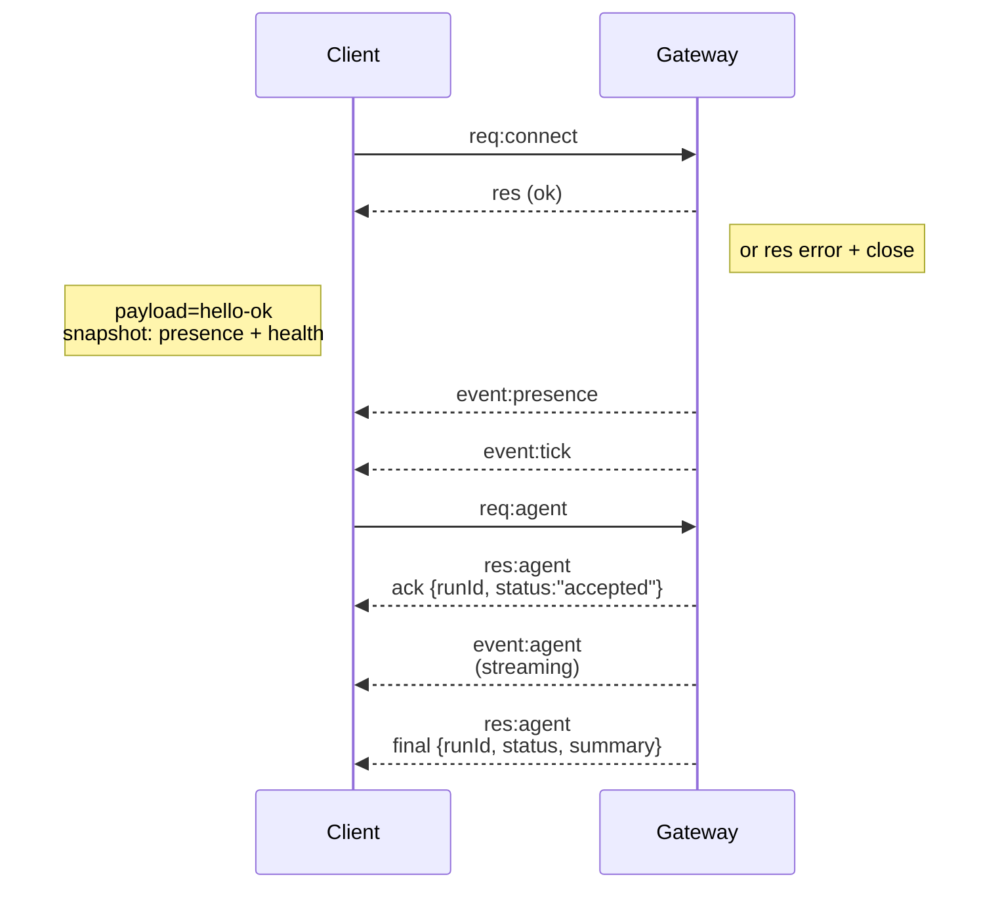

---
read_when:
    - 處理 Gateway 協定、用戶端或傳輸層
summary: WebSocket Gateway 架構、元件與用戶端流程
title: Gateway 架構
x-i18n:
    generated_at: "2026-04-30T02:58:10Z"
    model: gpt-5.5
    provider: openai
    source_hash: 91c553489da18b6ad83fc860014f5bfb758334e9789cb7893d4d00f81c650f02
    source_path: concepts/architecture.md
    workflow: 16
---

## 概覽

- 單一長期運行的 **Gateway** 擁有所有訊息介面（透過
  Baileys 的 WhatsApp、透過 grammY 的 Telegram、Slack、Discord、Signal、iMessage、WebChat）。
- 控制平面用戶端（macOS 應用程式、CLI、網頁 UI、自動化）透過已設定的綁定主機（預設
  `127.0.0.1:18789`）上的 **WebSocket** 連線到
  Gateway。
- **Node**（macOS/iOS/Android/headless）也透過 **WebSocket** 連線，但會
  以明確的 caps/commands 宣告 `role: node`。
- 每台主機一個 Gateway；它是唯一會開啟 WhatsApp 工作階段的位置。
- **畫布主機** 由 Gateway HTTP 伺服器在以下路徑提供：
  - `/__openclaw__/canvas/`（可由代理編輯的 HTML/CSS/JS）
  - `/__openclaw__/a2ui/`（A2UI 主機）
    它使用與 Gateway 相同的連接埠（預設 `18789`）。

## 元件與流程

### Gateway（常駐程式）

- 維護供應者連線。
- 暴露型別化的 WS API（請求、回應、伺服器推送事件）。
- 依據 JSON Schema 驗證傳入 frame。
- 發出如 `agent`、`chat`、`presence`、`health`、`heartbeat`、`cron` 等事件。

### 用戶端（Mac 應用程式 / CLI / 網頁管理介面）

- 每個用戶端一條 WS 連線。
- 傳送請求（`health`、`status`、`send`、`agent`、`system-presence`）。
- 訂閱事件（`tick`、`agent`、`presence`、`shutdown`）。

### Node（macOS / iOS / Android / headless）

- 以 `role: node` 連線到**同一個 WS 伺服器**。
- 在 `connect` 中提供裝置身分；配對是**以裝置為基礎**（角色 `node`），且
  核准狀態存在於裝置配對儲存區。
- 暴露如 `canvas.*`、`camera.*`、`screen.record`、`location.get` 等命令。

通訊協定細節：

- [Gateway 通訊協定](/zh-TW/gateway/protocol)

### WebChat

- 靜態 UI，使用 Gateway WS API 取得聊天記錄並傳送訊息。
- 在遠端設定中，透過與其他用戶端相同的 SSH/Tailscale 通道連線。

## 連線生命週期（單一用戶端）



## 線路通訊協定（摘要）

- 傳輸：WebSocket，包含 JSON payload 的文字 frame。
- 第一個 frame **必須**是 `connect`。
- 握手後：
  - 請求：`{type:"req", id, method, params}` → `{type:"res", id, ok, payload|error}`
  - 事件：`{type:"event", event, payload, seq?, stateVersion?}`
- `hello-ok.features.methods` / `events` 是探索中繼資料，而不是
  每個可呼叫輔助路由的產生式傾印。
- 共用密鑰驗證會使用 `connect.params.auth.token` 或
  `connect.params.auth.password`，取決於已設定的 Gateway 驗證模式。
- 具身分的模式，例如 Tailscale Serve
  (`gateway.auth.allowTailscale: true`) 或非 loopback 的
  `gateway.auth.mode: "trusted-proxy"`，會改從請求標頭滿足驗證，
  而不是 `connect.params.auth.*`。
- 私有入口 `gateway.auth.mode: "none"` 會完全停用共用密鑰驗證；
  請勿在公開或不受信任的入口啟用該模式。
- 具有副作用的方法（`send`、`agent`）需要冪等鍵才能
  安全重試；伺服器會保留短期的去重快取。
- Node 必須在 `connect` 中包含 `role: "node"` 以及 caps/commands/permissions。

## 配對與本機信任

- 所有 WS 用戶端（操作員 + Node）都會在 `connect` 時包含**裝置身分**。
- 新裝置 ID 需要配對核准；Gateway 會發出**裝置權杖**
  供後續連線使用。
- 直接 local loopback 連線可自動核准，以保持同主機 UX 順暢。
- OpenClaw 也有一條狹窄的後端/容器本機自我連線路徑，用於
  受信任的共用密鑰輔助流程。
- Tailnet 與 LAN 連線，包括同主機 tailnet 綁定，仍需要
  明確配對核准。
- 所有連線都必須簽署 `connect.challenge` nonce。
- 簽章 payload `v3` 也會綁定 `platform` + `deviceFamily`；Gateway
  會在重新連線時固定已配對的中繼資料，且中繼資料變更時需要修復配對。
- **非本機**連線仍需要明確核准。
- Gateway 驗證（`gateway.auth.*`）仍適用於**所有**連線，無論本機或遠端。

詳細資訊：[Gateway 通訊協定](/zh-TW/gateway/protocol)、[配對](/zh-TW/channels/pairing)、
[安全性](/zh-TW/gateway/security)。

## 通訊協定型別與程式碼產生

- TypeBox schema 定義通訊協定。
- JSON Schema 由這些 schema 產生。
- Swift 模型由 JSON Schema 產生。

## 遠端存取

- 偏好方式：Tailscale 或 VPN。
- 替代方式：SSH 通道

  ```bash
  ssh -N -L 18789:127.0.0.1:18789 user@host
  ```

- 相同的握手與驗證權杖會套用於通道。
- 遠端設定中的 WS 可啟用 TLS 與選用的 pinning。

## 操作快照

- 啟動：`openclaw gateway`（前景執行，記錄輸出到 stdout）。
- 健康狀態：透過 WS 的 `health`（也包含於 `hello-ok`）。
- 監督：使用 launchd/systemd 自動重新啟動。

## 不變條件

- 每台主機上恰好一個 Gateway 控制單一 Baileys 工作階段。
- 握手是必要的；任何非 JSON 或第一個 frame 不是 connect 的情況都會強制關閉。
- 事件不會重播；用戶端必須在出現間隙時重新整理。

## 相關

- [代理迴圈](/zh-TW/concepts/agent-loop) — 詳細的代理執行週期
- [Gateway 通訊協定](/zh-TW/gateway/protocol) — WebSocket 通訊協定合約
- [佇列](/zh-TW/concepts/queue) — 命令佇列與並行
- [安全性](/zh-TW/gateway/security) — 信任模型與強化
