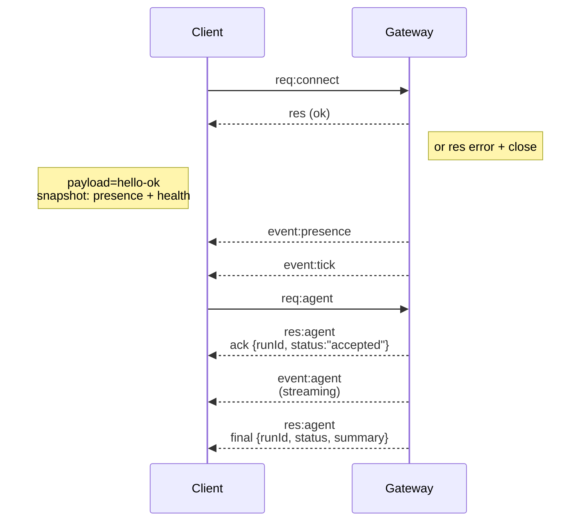

---
read_when:
    - 處理 Gateway 協定、用戶端或傳輸方式
summary: WebSocket Gateway 架構、元件與用戶端流程
title: Gateway 架構
x-i18n:
    generated_at: "2026-05-06T02:44:51Z"
    model: gpt-5.5
    provider: openai
    source_hash: 433489081bfe07691b211f5076ec45ce0ed3fd043eb86128f73121f2cab71cd3
    source_path: concepts/architecture.md
    workflow: 16
    postprocess_version: locale-links-v1
---

## 概觀

- 單一長時間執行的 **Gateway** 擁有所有訊息介面（WhatsApp 透過
  Baileys、Telegram 透過 grammY、Slack、Discord、Signal、iMessage、WebChat）。
- 控制平面用戶端（macOS app、CLI、網頁 UI、自動化）透過設定的綁定位址主機（預設
  `127.0.0.1:18789`）上的 **WebSocket** 連接到
  Gateway。
- **Node**（macOS/iOS/Android/headless）也透過 **WebSocket** 連接，但會以明確的 caps/commands
  宣告 `role: node`。
- 每台主機一個 Gateway；它是唯一會開啟 WhatsApp 工作階段的地方。
- **canvas host** 由 Gateway HTTP 伺服器提供，路徑如下：
  - `/__openclaw__/canvas/`（代理可編輯的 HTML/CSS/JS）
  - `/__openclaw__/a2ui/`（A2UI 主機）
    它使用與 Gateway 相同的連接埠（預設 `18789`）。

## 元件與流程

### Gateway（daemon）

- 維護提供者連線。
- 公開型別化的 WS API（請求、回應、伺服器推送事件）。
- 依 JSON Schema 驗證傳入的 frame。
- 發出像是 `agent`、`chat`、`presence`、`health`、`heartbeat`、`cron` 等事件。

### 用戶端（Mac app / CLI / 網頁管理）

- 每個用戶端一條 WS 連線。
- 傳送請求（`health`、`status`、`send`、`agent`、`system-presence`）。
- 訂閱事件（`tick`、`agent`、`presence`、`shutdown`）。

### Node（macOS / iOS / Android / headless）

- 以 `role: node` 連接到**同一個 WS 伺服器**。
- 在 `connect` 中提供裝置身分；配對是**以裝置為基礎**（角色 `node`），核准狀態存放在裝置配對儲存區中。
- 公開像是 `canvas.*`、`camera.*`、`screen.record`、`location.get` 等命令。

協定詳細資訊：

- [Gateway 協定](/zh-TW/gateway/protocol)

### WebChat

- 使用 Gateway WS API 取得聊天歷史並傳送訊息的靜態 UI。
- 在遠端設定中，會透過與其他用戶端相同的 SSH/Tailscale 通道連接。

## 連線生命週期（單一用戶端）



## 傳輸協定（摘要）

- 傳輸：WebSocket，帶有 JSON payload 的文字 frame。
- 第一個 frame **必須**是 `connect`。
- 握手後：
  - 請求：`{type:"req", id, method, params}` → `{type:"res", id, ok, payload|error}`
  - 事件：`{type:"event", event, payload, seq?, stateVersion?}`
- `hello-ok.features.methods` / `events` 是探索中繼資料，而不是每個可呼叫 helper route 的產生式完整傾印。
- shared-secret 驗證會依設定的 Gateway 驗證模式，使用 `connect.params.auth.token` 或
  `connect.params.auth.password`。
- 帶有身分的模式，例如 Tailscale Serve
  (`gateway.auth.allowTailscale: true`) 或非迴圈位址的
  `gateway.auth.mode: "trusted-proxy"`，會改由請求標頭完成驗證，而不是使用 `connect.params.auth.*`。
- 私有入口 `gateway.auth.mode: "none"` 會完全停用 shared-secret 驗證；不要在公開或不受信任的入口啟用該模式。
- 具副作用的方法（`send`、`agent`）需要冪等性金鑰，以便安全重試；伺服器會保留短時間的去重快取。
- Node 必須在 `connect` 中包含 `role: "node"` 以及 caps/commands/permissions。

## 配對與本機信任

- 所有 WS 用戶端（操作員 + Node）都會在 `connect` 時包含**裝置身分**。
- 新裝置 ID 需要配對核准；Gateway 會簽發**裝置 token** 供後續連線使用。
- 直接的 local loopback 連線可以自動核准，讓同主機體驗保持順暢。
- OpenClaw 也有一條狹窄的後端/容器本機自連路徑，用於受信任的 shared-secret helper 流程。
- Tailnet 與 LAN 連線，包括同主機的 tailnet 綁定，仍然需要明確的配對核准。
- 所有連線都必須簽署 `connect.challenge` nonce。
- 簽章 payload `v3` 也會綁定 `platform` + `deviceFamily`；Gateway 會在重新連線時釘選已配對的中繼資料，並在中繼資料變更時要求修復配對。
- **非本機**連線仍然需要明確核准。
- Gateway 驗證（`gateway.auth.*`）仍適用於**所有**連線，無論本機或遠端。

詳細資訊：[Gateway 協定](/zh-TW/gateway/protocol)、[配對](/zh-TW/channels/pairing)、
[安全性](/zh-TW/gateway/security)。

## 協定型別與程式碼產生

- TypeBox schema 定義協定。
- JSON Schema 由這些 schema 產生。
- Swift model 由 JSON Schema 產生。

## 遠端存取

- 首選：Tailscale 或 VPN。
- 替代方案：SSH 通道

  ```bash
  ssh -N -L 18789:127.0.0.1:18789 user@host
  ```

- 相同的握手與驗證 token 會套用在通道上。
- 在遠端設定中，可為 WS 啟用 TLS 與選用的 pinning。

## 操作快照

- 啟動：`openclaw gateway`（前景執行，記錄輸出至 stdout）。
- 健康狀態：透過 WS 使用 `health`（也包含在 `hello-ok` 中）。
- 監督：使用 launchd/systemd 進行自動重新啟動。

## 不變條件

- 每台主機上，恰好一個 Gateway 控制單一 Baileys 工作階段。
- 握手是強制的；任何非 JSON 或第一個 frame 不是 connect 的情況都會硬關閉。
- 事件不會重播；用戶端必須在出現缺口時重新整理。

## 相關

- [Agent 迴圈](/zh-TW/concepts/agent-loop) — 詳細的代理執行週期
- [Gateway 協定](/zh-TW/gateway/protocol) — WebSocket 協定合約
- [佇列](/zh-TW/concepts/queue) — 命令佇列與並行
- [安全性](/zh-TW/gateway/security) — 信任模型與強化
