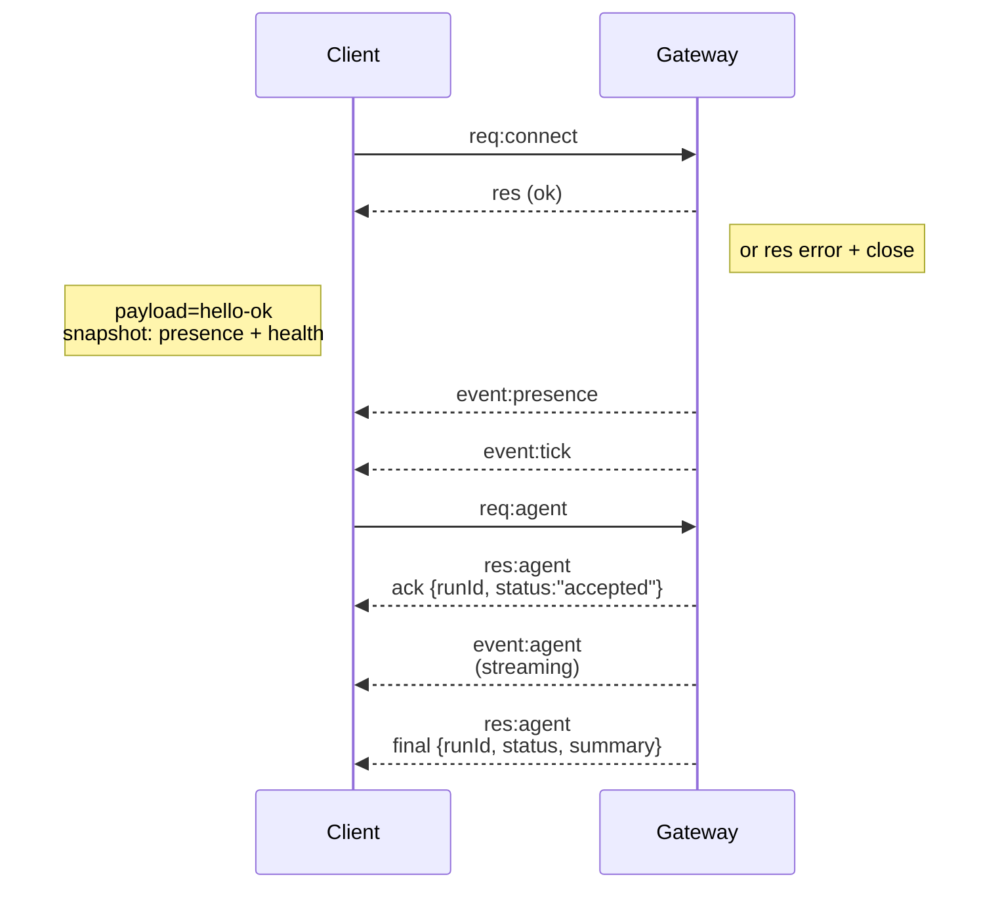

---
read_when:
    - 處理閘道協定、用戶端或傳輸
summary: WebSocket 閘道架構、元件與用戶端流程
title: 閘道架構
x-i18n:
    generated_at: "2026-07-05T11:14:37Z"
    model: gpt-5.5
    postprocess_version: locale-links-v1
    provider: openai
    source_hash: f8054bd87f738b957c24f8d6965d55365de2293d44902530a9ba778afa597cc7
    source_path: concepts/architecture.md
    workflow: 16
---

## 概觀

- 單一長時間執行的**閘道**擁有所有訊息介面（WhatsApp 經由
  Baileys、Telegram 經由 grammY、Slack、Discord、Signal、iMessage、WebChat）。
- 控制平面用戶端（macOS app、命令列介面、網頁 UI、自動化）會透過設定的綁定主機（預設
  `127.0.0.1:18789`）上的 **WebSocket** 連線到閘道。
- **節點**（macOS/iOS/Android/headless）也會透過 **WebSocket** 連線，但會以明確的 caps/commands
  宣告 `role: node`。
- 每台主機一個閘道；它是唯一會開啟 WhatsApp 工作階段的地方。
- **canvas host** 由閘道 HTTP 伺服器在以下路徑提供：
  - `/__openclaw__/canvas/`（代理程式可編輯的 HTML/CSS/JS）
  - `/__openclaw__/a2ui/`（A2UI host）

  它使用與閘道相同的連接埠（預設 `18789`）。

## 元件與流程

### 閘道（daemon）

- 維護 provider 連線。
- 公開具型別的 WS API（請求、回應、伺服器推送事件）。
- 依據 JSON Schema 驗證傳入 frame。
- 發出如 `agent`、`chat`、`presence`、`health`、`heartbeat`、`cron` 等事件。

### 用戶端（Mac app / 命令列介面 / web admin）

- 每個用戶端一條 WS 連線。
- 傳送請求（`health`、`status`、`send`、`agent`、`system-presence`）。
- 訂閱事件（`tick`、`agent`、`presence`、`shutdown`）。

### 節點（macOS / iOS / Android / headless）

- 以 `role: node` 連線到**同一個 WS 伺服器**。
- 在 `connect` 中提供裝置身分；配對是**以裝置為基礎**（角色 `node`），且
  核准資料位於裝置配對儲存區。
- 公開如 `canvas.*`、`camera.*`、`screen.record`、`location.get` 等命令。

協定詳細資訊：[閘道協定](/zh-TW/gateway/protocol)

### WebChat

- 靜態 UI，使用閘道 WS API 取得聊天歷史並傳送訊息。
- 在遠端設定中，會透過與其他用戶端相同的 SSH/Tailscale 通道連線。

## 連線生命週期（單一用戶端）



## 線路協定（摘要）

- 傳輸：WebSocket，帶有 JSON payload 的文字 frame。
- 第一個 frame **必須**是 `connect`。
- 握手之後：
  - 請求：`{type:"req", id, method, params}` → `{type:"res", id, ok, payload|error}`
  - 事件：`{type:"event", event, payload, seq?, stateVersion?}`
- `hello-ok.features.methods` / `events` 是探索中繼資料，不是
  每個可呼叫 helper route 的產生式傾印。
- Shared-secret auth 會使用 `connect.params.auth.token` 或
  `connect.params.auth.password`，取決於設定的 gateway auth mode。
- 帶有身分的模式，例如 Tailscale Serve
  (`gateway.auth.allowTailscale: true`) 或非 loopback 的
  `gateway.auth.mode: "trusted-proxy"`，會從請求標頭滿足 auth，
  而不是使用 `connect.params.auth.*`。
- Private-ingress `gateway.auth.mode: "none"` 會完全停用 shared-secret auth；
  請勿在公開/不受信任的 ingress 上啟用該模式。
- 具副作用的方法（`send`、`agent`）需要 idempotency key 才能
  安全重試；伺服器會保留短時間存活的去重快取。
- 節點必須在 `connect` 中包含 `role: "node"` 以及 caps/commands/permissions。

## 配對與本機信任

- 所有 WS 用戶端（操作員 + 節點）都會在 `connect` 上包含**裝置身分**。
- 新裝置 ID 需要配對核准；閘道會發出**裝置 token** 供後續連線使用。
- 直接的 local loopback 連線可自動核准，以維持同主機 UX 順暢。
- OpenClaw 也有一條狹窄的後端/container-local 自我連線路徑，用於
  受信任的 shared-secret helper 流程。
- Tailnet 與 LAN 連線，包括同主機 tailnet 綁定，仍然需要
  明確的配對核准。
- 所有連線都必須簽署 `connect.challenge` nonce。簽章 payload `v3`
  也會綁定 `platform` 與 `deviceFamily`；閘道會在重新連線時釘選已配對的中繼資料，
  並在中繼資料變更時要求修復配對。
- **非本機**連線仍然需要明確核准。
- 閘道 auth（`gateway.auth.*`）仍套用於**所有**連線，無論本機或
  遠端。

詳細資訊：[閘道協定](/zh-TW/gateway/protocol)、[配對](/zh-TW/channels/pairing)、
[安全性](/zh-TW/gateway/security)。

## 協定型別與 codegen

- TypeBox schemas 定義協定。
- JSON Schema 由這些 schemas 產生。
- Swift models 由 JSON Schema 產生。

## 遠端存取

- 首選：Tailscale 或 VPN。
- 替代方案：SSH 通道

  ```bash
  ssh -N -L 18789:127.0.0.1:18789 user@gateway-host
  ```

- 相同的握手 + auth token 會套用於通道上。
- 在遠端設定中，可為 WS 啟用 TLS + 選用 pinning。

## 維運快照

- 啟動：`openclaw gateway`（前景執行，記錄到 stdout）。
- 健康狀態：透過 WS 的 `health`（也包含在 `hello-ok` 中）。
- 監督：launchd/systemd 用於自動重新啟動。

## 不變條件

- 每台主機上，只有一個閘道控制單一 Baileys 工作階段。
- 握手是強制的；任何非 JSON 或非 connect 的第一個 frame 都會被硬性關閉。
- 事件不會重放；用戶端必須在出現缺口時重新整理。

## 相關

- [代理程式迴圈](/zh-TW/concepts/agent-loop) — 詳細的代理程式執行週期
- [閘道協定](/zh-TW/gateway/protocol) — WebSocket 協定契約
- [佇列](/zh-TW/concepts/queue) — 命令佇列與並行
- [安全性](/zh-TW/gateway/security) — 信任模型與強化
