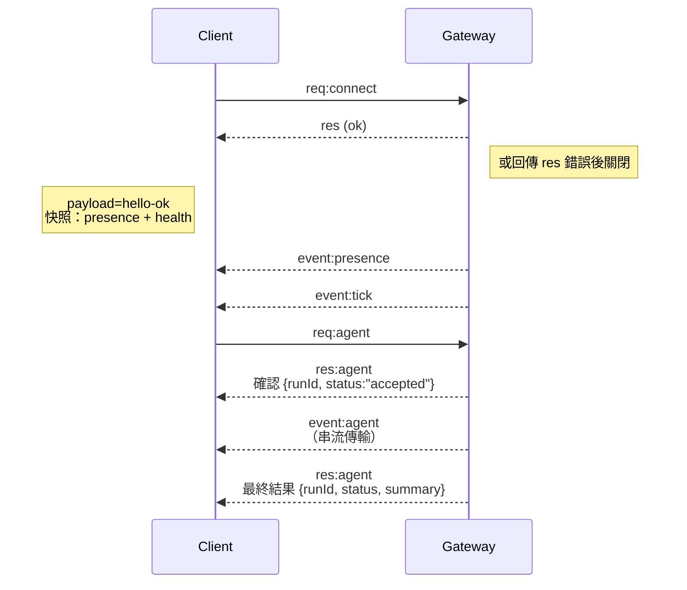

---
read_when:
    - 處理閘道協定、用戶端或傳輸層相關工作
summary: WebSocket 閘道架構、元件與用戶端流程
title: 閘道架構
x-i18n:
    generated_at: "2026-07-11T21:14:07Z"
    model: gpt-5.6
    postprocess_version: locale-links-v1
    provider: openai
    source_hash: f8054bd87f738b957c24f8d6965d55365de2293d44902530a9ba778afa597cc7
    source_path: concepts/architecture.md
    workflow: 16
---

## 概述

- 單一長期執行的**閘道**負責所有訊息介面（透過 Baileys 的 WhatsApp、透過 grammY 的 Telegram、Slack、Discord、Signal、iMessage、WebChat）。
- 控制層用戶端（macOS 應用程式、命令列介面、網頁介面、自動化流程）透過設定之繫結主機上的 **WebSocket** 連線至閘道（預設為 `127.0.0.1:18789`）。
- **節點**（macOS/iOS/Android/無頭模式）也透過 **WebSocket** 連線，但會宣告 `role: node`，並明確指定能力與命令。
- 每部主機僅有一個閘道；它是唯一會開啟 WhatsApp 工作階段的位置。
- **畫布主機**由閘道 HTTP 伺服器在以下路徑提供：
  - `/__openclaw__/canvas/`（代理程式可編輯的 HTML/CSS/JS）
  - `/__openclaw__/a2ui/`（A2UI 主機）

  它與閘道使用相同的連接埠（預設為 `18789`）。

## 元件與流程

### 閘道（常駐程式）

- 維護提供者連線。
- 提供具型別的 WS API（請求、回應、伺服器推送事件）。
- 依據 JSON Schema 驗證傳入的訊框。
- 發出 `agent`、`chat`、`presence`、`health`、`heartbeat`、`cron` 等事件。

### 用戶端（Mac 應用程式／命令列介面／網頁管理介面）

- 每個用戶端各有一個 WS 連線。
- 傳送請求（`health`、`status`、`send`、`agent`、`system-presence`）。
- 訂閱事件（`tick`、`agent`、`presence`、`shutdown`）。

### 節點（macOS／iOS／Android／無頭模式）

- 使用 `role: node` 連線至**同一部 WS 伺服器**。
- 在 `connect` 中提供裝置身分；配對**以裝置為基礎**（角色為 `node`），核准資訊儲存於裝置配對儲存區。
- 提供 `canvas.*`、`camera.*`、`screen.record`、`location.get` 等命令。

通訊協定詳細資訊：[閘道通訊協定](/zh-TW/gateway/protocol)

### WebChat

- 使用閘道 WS API 取得聊天記錄並傳送訊息的靜態介面。
- 在遠端設定中，透過與其他用戶端相同的 SSH/Tailscale 通道連線。

## 連線生命週期（單一用戶端）



## 線路通訊協定（摘要）

- 傳輸方式：WebSocket，使用含 JSON 承載內容的文字訊框。
- 第一個訊框**必須**是 `connect`。
- 交握完成後：
  - 請求：`{type:"req", id, method, params}` → `{type:"res", id, ok, payload|error}`
  - 事件：`{type:"event", event, payload, seq?, stateVersion?}`
- `hello-ok.features.methods`／`events` 是探索中繼資料，而非每個可呼叫輔助路由的自動產生完整清單。
- 共用祕密驗證會依照設定的閘道驗證模式，使用 `connect.params.auth.token` 或 `connect.params.auth.password`。
- 具身分資訊的模式，例如 Tailscale Serve（`gateway.auth.allowTailscale: true`）或非迴路位址的 `gateway.auth.mode: "trusted-proxy"`，會透過請求標頭完成驗證，而非使用 `connect.params.auth.*`。
- 私有入口的 `gateway.auth.mode: "none"` 會完全停用共用祕密驗證；請勿在公開或不受信任的入口使用此模式。
- 具有副作用的方法（`send`、`agent`）必須使用冪等性金鑰，才能安全重試；伺服器會保留短期的重複資料刪除快取。
- 節點必須在 `connect` 中包含 `role: "node"`，以及能力、命令和權限。

## 配對與本機信任

- 所有 WS 用戶端（操作端與節點）都會在 `connect` 中包含**裝置身分**。
- 新的裝置 ID 必須經過配對核准；閘道會核發**裝置權杖**供後續連線使用。
- 直接透過 local loopback 的連線可自動核准，以維持同一主機上的順暢使用體驗。
- OpenClaw 也為受信任的共用祕密輔助流程提供範圍有限的後端／容器本機自我連線路徑。
- Tailnet 與區域網路連線（包括同一主機上的 Tailnet 繫結）仍須明確核准配對。
- 所有連線都必須簽署 `connect.challenge` 隨機數。簽章承載內容 `v3` 也會繫結 `platform` 與 `deviceFamily`；重新連線時，閘道會鎖定已配對的中繼資料，若中繼資料變更則須進行修復配對。
- **非本機**連線仍須明確核准。
- 無論本機或遠端，閘道驗證（`gateway.auth.*`）仍適用於**所有**連線。

詳細資訊：[閘道通訊協定](/zh-TW/gateway/protocol)、[配對](/zh-TW/channels/pairing)、
[安全性](/zh-TW/gateway/security)。

## 通訊協定型別與程式碼產生

- TypeBox 結構描述定義通訊協定。
- JSON Schema 由這些結構描述產生。
- Swift 模型由 JSON Schema 產生。

## 遠端存取

- 建議使用：Tailscale 或 VPN。
- 替代方案：SSH 通道

  ```bash
  ssh -N -L 18789:127.0.0.1:18789 user@gateway-host
  ```

- 通道上會套用相同的交握程序與驗證權杖。
- 在遠端設定中，可為 WS 啟用 TLS 與選用的憑證固定。

## 操作摘要

- 啟動：`openclaw gateway`（前景執行，將記錄輸出至標準輸出）。
- 健康狀態：透過 WS 使用 `health`（也包含於 `hello-ok` 中）。
- 監督：使用 launchd/systemd 自動重新啟動。

## 不變條件

- 每部主機恰好由一個閘道控制單一 Baileys 工作階段。
- 交握是必要程序；任何非 JSON 或第一個訊框不是 `connect` 的情況，都會立即關閉連線。
- 事件不會重播；發生缺漏時，用戶端必須重新整理。

## 相關內容

- [代理程式迴圈](/zh-TW/concepts/agent-loop) — 詳細的代理程式執行週期
- [閘道通訊協定](/zh-TW/gateway/protocol) — WebSocket 通訊協定合約
- [佇列](/zh-TW/concepts/queue) — 命令佇列與並行處理
- [安全性](/zh-TW/gateway/security) — 信任模型與強化措施
