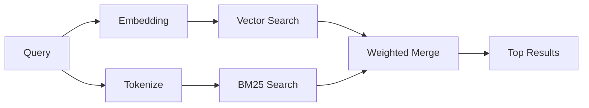

---
read_when:
    - 你想了解 memory_search 的運作方式
    - 您想選擇嵌入提供者
    - 您想調整搜尋品質
summary: 記憶搜尋如何使用嵌入和混合檢索找到相關筆記
title: 記憶搜尋
x-i18n:
    generated_at: "2026-04-30T16:27:54Z"
    model: gpt-5.5
    provider: openai
    source_hash: 7f40bbe32453a28070ffc67f19a4c06e2fe59a24237a2aef353f4b9b8260bcf2
    source_path: concepts/memory-search.md
    workflow: 16
---

`memory_search` 會從你的記憶檔案中尋找相關筆記，即使用詞與原始文字不同也可以。它的運作方式是將記憶索引成小型區塊，並使用嵌入、關鍵字或兩者來搜尋。

## 快速開始

如果你已設定 GitHub Copilot 訂閱、OpenAI、Gemini、Voyage 或 Mistral API 金鑰，記憶搜尋會自動運作。若要明確設定提供者：

```json5
{
  agents: {
    defaults: {
      memorySearch: {
        provider: "openai", // or "gemini", "local", "ollama", etc.
      },
    },
  },
}
```

對於多端點設定，當該提供者設定了 `api: "ollama"` 或其他嵌入配接器擁有者時，`provider` 也可以是自訂的 `models.providers.<id>` 項目，例如 `ollama-5080`。

若要使用不需 API 金鑰的本機嵌入，請設定 `provider: "local"`。封裝安裝會在 OpenClaw 受管理的 Plugin runtime-deps 樹中保留原生 `node-llama-cpp` 執行階段；如果該樹需要修復，請執行 `openclaw doctor --fix`。

某些 OpenAI 相容的嵌入端點需要不對稱標籤，例如搜尋使用 `input_type: "query"`，索引區塊使用 `input_type: "document"` 或 `"passage"`。請使用 `memorySearch.queryInputType` 和 `memorySearch.documentInputType` 設定這些項目；請參閱[記憶設定參考](/zh-TW/reference/memory-config#provider-specific-config)。

## 支援的提供者

| 提供者         | ID               | 需要 API 金鑰 | 備註                                                 |
| -------------- | ---------------- | ------------- | ---------------------------------------------------- |
| Bedrock        | `bedrock`        | 否            | AWS 憑證鏈解析成功時自動偵測                        |
| Gemini         | `gemini`         | 是            | 支援影像/音訊索引                                   |
| GitHub Copilot | `github-copilot` | 否            | 自動偵測，使用 Copilot 訂閱                         |
| Local          | `local`          | 否            | GGUF 模型，下載約 0.6 GB                            |
| Mistral        | `mistral`        | 是            | 自動偵測                                             |
| Ollama         | `ollama`         | 否            | 本機，必須明確設定                                  |
| OpenAI         | `openai`         | 是            | 自動偵測，速度快                                    |
| Voyage         | `voyage`         | 是            | 自動偵測                                             |

## 搜尋如何運作

OpenClaw 會平行執行兩條檢索路徑並合併結果：



- **向量搜尋**會尋找語意相近的筆記（"gateway host" 會符合 "the machine running OpenClaw"）。
- **BM25 關鍵字搜尋**會尋找精確符合項（ID、錯誤字串、設定鍵）。

如果只有一條路徑可用（沒有嵌入或沒有 FTS），另一條會單獨執行。

當嵌入不可用時，OpenClaw 仍會對 FTS 結果使用詞彙排序，而不是只退回原始的精確符合排序。這種降級模式會提升查詢詞涵蓋度更高且檔案路徑相關的區塊，因此即使沒有 `sqlite-vec` 或嵌入提供者，也能維持有用的召回率。

## 改善搜尋品質

當你有大量筆記歷史時，兩個選用功能會有所幫助：

### 時間衰減

舊筆記會逐漸降低排序權重，讓近期資訊優先浮現。使用預設的 30 天半衰期時，上個月的筆記分數會是原始權重的 50%。像 `MEMORY.md` 這類長青檔案不會衰減。

<Tip>
如果你的代理程式已有數月的每日筆記，而且過時資訊持續排在近期脈絡之前，請啟用時間衰減。
</Tip>

### MMR（多樣性）

減少重複結果。如果五則筆記都提到相同的路由器設定，MMR 會確保頂部結果涵蓋不同主題，而不是重複顯示。

<Tip>
如果 `memory_search` 持續從不同每日筆記傳回幾乎重複的片段，請啟用 MMR。
</Tip>

### 同時啟用兩者

```json5
{
  agents: {
    defaults: {
      memorySearch: {
        query: {
          hybrid: {
            mmr: { enabled: true },
            temporalDecay: { enabled: true },
          },
        },
      },
    },
  },
}
```

## 多模態記憶

使用 Gemini Embedding 2 時，你可以將影像和音訊檔案與 Markdown 一起索引。搜尋查詢仍是文字，但會比對視覺與音訊內容。設定方式請參閱[記憶設定參考](/zh-TW/reference/memory-config)。

## 工作階段記憶搜尋

你可以選擇索引工作階段逐字稿，讓 `memory_search` 能回想較早的對話。這需要透過 `memorySearch.experimental.sessionMemory` 明確加入。詳情請參閱[設定參考](/zh-TW/reference/memory-config)。

## 疑難排解

**沒有結果？** 執行 `openclaw memory status` 檢查索引。如果是空的，請執行 `openclaw memory index --force`。

**只有關鍵字符合？** 你的嵌入提供者可能尚未設定。請檢查 `openclaw memory status --deep`。

**本機嵌入逾時？** `ollama`、`lmstudio` 和 `local` 預設使用較長的內嵌批次逾時。如果主機只是較慢，請設定 `agents.defaults.memorySearch.sync.embeddingBatchTimeoutSeconds`，然後重新執行 `openclaw memory index --force`。

**找不到 CJK 文字？** 使用 `openclaw memory index --force` 重建 FTS 索引。

## 延伸閱讀

- [Active Memory](/zh-TW/concepts/active-memory) -- 互動式聊天工作階段的子代理程式記憶
- [記憶](/zh-TW/concepts/memory) -- 檔案版面配置、後端、工具
- [記憶設定參考](/zh-TW/reference/memory-config) -- 所有設定旋鈕

## 相關

- [記憶概觀](/zh-TW/concepts/memory)
- [Active Memory](/zh-TW/concepts/active-memory)
- [內建記憶引擎](/zh-TW/concepts/memory-builtin)
