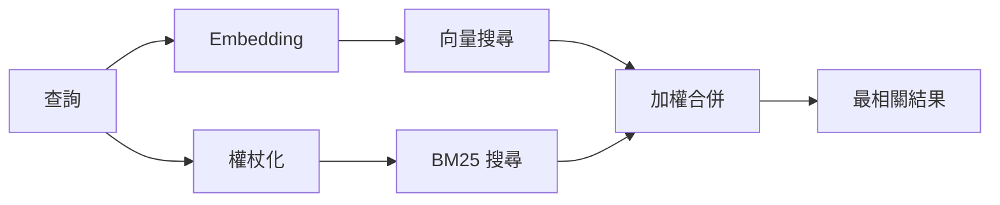

---
read_when:
    - 您想了解 memory_search 的運作方式
    - 您想選擇嵌入向量提供者
    - 你想調整搜尋品質
summary: 記憶搜尋如何使用嵌入與混合檢索找到相關筆記
title: 記憶搜尋
x-i18n:
    generated_at: "2026-05-02T02:47:50Z"
    model: gpt-5.5
    provider: openai
    source_hash: 2a71fb0809d5c70689e8046f854e4b4b4e79f45769ac2964e40a762ebb4e91a8
    source_path: concepts/memory-search.md
    workflow: 16
---

`memory_search` 會從你的記憶檔案中找出相關筆記，即使用字與原始文字不同也可以。它的運作方式是將記憶索引成小區塊，並使用 embeddings、關鍵字或兩者來搜尋。

## 快速開始

如果你已設定 GitHub Copilot 訂閱、OpenAI、Gemini、Voyage 或 Mistral API 金鑰，記憶搜尋會自動運作。若要明確設定供應商：

```json5
{
  agents: {
    defaults: {
      memorySearch: {
        provider: "openai", // or "gemini", "local", "ollama", etc.
      },
    },
  },
}
```

對於多端點設定，當該供應商設定 `api: "ollama"` 或其他 embedding adapter 擁有者時，`provider` 也可以是自訂的 `models.providers.<id>` 項目，例如 `ollama-5080`。

若要使用不需要 API 金鑰的本機 embeddings，請設定 `provider: "local"`。原始碼 checkout 可能仍需要核准原生建置：`pnpm approve-builds`，接著執行 `pnpm rebuild node-llama-cpp`。

某些 OpenAI 相容的 embedding 端點需要非對稱標籤，例如搜尋時使用 `input_type: "query"`，索引區塊時使用 `input_type: "document"` 或 `"passage"`。請使用 `memorySearch.queryInputType` 和 `memorySearch.documentInputType` 設定這些項目；請參閱[記憶設定參考](/zh-TW/reference/memory-config#provider-specific-config)。

## 支援的供應商

| 供應商         | ID               | 需要 API 金鑰 | 備註                                             |
| -------------- | ---------------- | ------------- | ------------------------------------------------ |
| Bedrock        | `bedrock`        | 否            | AWS 憑證鏈可解析時自動偵測                      |
| Gemini         | `gemini`         | 是            | 支援圖片/音訊索引                               |
| GitHub Copilot | `github-copilot` | 否            | 自動偵測，使用 Copilot 訂閱                     |
| 本機           | `local`          | 否            | GGUF 模型，下載約 0.6 GB                        |
| Mistral        | `mistral`        | 是            | 自動偵測                                        |
| Ollama         | `ollama`         | 否            | 本機，必須明確設定                              |
| OpenAI         | `openai`         | 是            | 自動偵測，速度快                                |
| Voyage         | `voyage`         | 是            | 自動偵測                                        |

## 搜尋的運作方式

OpenClaw 會平行執行兩條擷取路徑，並合併結果：



- **向量搜尋**會找出意義相近的筆記（「gateway host」會符合「執行 OpenClaw 的機器」）。
- **BM25 關鍵字搜尋**會找出完全符合的項目（ID、錯誤字串、設定鍵）。

如果只有一條路徑可用（沒有 embeddings 或沒有 FTS），另一條路徑會單獨執行。

當 embeddings 無法使用時，OpenClaw 仍會對 FTS 結果使用詞彙排名，而不是只退回原始的完全符合排序。這種降級模式會提升查詢詞涵蓋度較強且檔案路徑相關的區塊，讓即使沒有 `sqlite-vec` 或 embedding 供應商時，召回率仍保持實用。

## 改善搜尋品質

當你有大量筆記歷史時，兩個選用功能會有所幫助：

### 時間衰減

舊筆記會逐漸降低排名權重，讓近期資訊優先浮現。使用預設 30 天半衰期時，上個月的筆記分數會是原始權重的 50%。像 `MEMORY.md` 這類長青檔案永遠不會衰減。

<Tip>
如果你的代理有數個月的每日筆記，且過時資訊持續排在近期內容前面，請啟用時間衰減。
</Tip>

### MMR（多樣性）

減少重複結果。如果五則筆記都提到相同的路由器設定，MMR 會確保最相關結果涵蓋不同主題，而不是重複相同內容。

<Tip>
如果 `memory_search` 持續從不同每日筆記傳回近似重複的片段，請啟用 MMR。
</Tip>

### 同時啟用兩者

```json5
{
  agents: {
    defaults: {
      memorySearch: {
        query: {
          hybrid: {
            mmr: { enabled: true },
            temporalDecay: { enabled: true },
          },
        },
      },
    },
  },
}
```

## 多模態記憶

使用 Gemini Embedding 2 時，你可以將圖片和音訊檔案與 Markdown 一起索引。搜尋查詢仍是文字，但會與視覺和音訊內容比對。設定方式請參閱[記憶設定參考](/zh-TW/reference/memory-config)。

## 工作階段記憶搜尋

你可以選擇性索引工作階段逐字稿，讓 `memory_search` 能回想先前的對話。這需要透過 `memorySearch.experimental.sessionMemory` 選擇啟用。詳情請參閱[設定參考](/zh-TW/reference/memory-config)。

## 疑難排解

**沒有結果？** 執行 `openclaw memory status` 檢查索引。如果是空的，請執行 `openclaw memory index --force`。

**只有關鍵字符合？** 你的 embedding 供應商可能尚未設定。請檢查 `openclaw memory status --deep`。

**本機 embeddings 逾時？** `ollama`、`lmstudio` 和 `local` 預設會使用較長的 inline 批次逾時。如果主機只是速度較慢，請設定 `agents.defaults.memorySearch.sync.embeddingBatchTimeoutSeconds`，然後重新執行 `openclaw memory index --force`。

**找不到 CJK 文字？** 使用 `openclaw memory index --force` 重建 FTS 索引。

## 延伸閱讀

- [Active Memory](/zh-TW/concepts/active-memory) -- 互動式聊天工作階段的子代理記憶
- [記憶](/zh-TW/concepts/memory) -- 檔案配置、後端、工具
- [記憶設定參考](/zh-TW/reference/memory-config) -- 所有設定選項

## 相關

- [記憶概觀](/zh-TW/concepts/memory)
- [Active Memory](/zh-TW/concepts/active-memory)
- [內建記憶引擎](/zh-TW/concepts/memory-builtin)
