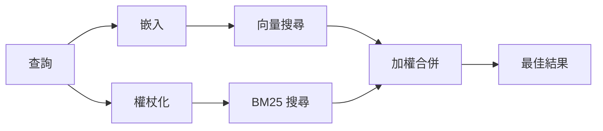

---
read_when:
    - 你想了解 memory_search 的運作方式
    - 你想要選擇嵌入向量提供者
    - 你想要調整搜尋品質
summary: 記憶搜尋如何使用嵌入與混合式檢索找出相關筆記
title: 記憶搜尋
x-i18n:
    generated_at: "2026-07-12T14:25:59Z"
    model: gpt-5.6
    postprocess_version: locale-links-v1
    prompt_version: 15
    provider: openai
    source_hash: 2ae0830843fba28c24159d85425240051fb8caf086cd0563d3091890045dcfad
    source_path: concepts/memory-search.md
    workflow: 16
---

`memory_search` 會從你的記憶檔案中找出相關筆記，即使用詞與原始文字不同也能找到。它會將記憶切分成小片段，並使用嵌入、關鍵字或兩者進行搜尋。

## 快速開始

OpenClaw 預設使用 OpenAI 嵌入。若要使用其他供應商，請明確設定：

```json5
{
  agents: {
    defaults: {
      memorySearch: {
        provider: "openai", // 或 "gemini"、"voyage"、"mistral"、"bedrock"、"local"、"ollama"、"lmstudio"、"github-copilot"、"openai-compatible"
      },
    },
  },
}
```

`provider` 也可以參照自訂的 `models.providers.<id>` 項目（例如 `ollama-5080`），但該項目必須將 `api` 設為 `"ollama"`，或設為另一個具有記憶嵌入轉接器的供應商 ID。

若要使用不需要 API 金鑰的本機嵌入，請安裝官方 llama.cpp 供應商外掛，並設定 `provider: "local"`：

```bash
openclaw plugins install @openclaw/llama-cpp-provider
```

原始碼簽出仍需核准原生建置：先執行 `pnpm approve-builds`，再執行 `pnpm rebuild node-llama-cpp`。

某些相容 OpenAI 的嵌入端點需要非對稱的 `input_type` 標籤，例如搜尋使用 `"query"`，而建立索引的片段使用 `"document"`/`"passage"`。請使用 `queryInputType` 和 `documentInputType` 設定；請參閱[記憶設定參考](/zh-TW/reference/memory-config#provider-specific-config)。

## 支援的供應商

| 供應商            | ID                  | 需要 API 金鑰 | 備註                              |
| ----------------- | ------------------- | ------------- | --------------------------------- |
| Bedrock           | `bedrock`           | 否            | 使用 AWS 認證資訊鏈               |
| DeepInfra         | `deepinfra`         | 是            | 預設模型 `BAAI/bge-m3`            |
| Gemini            | `gemini`            | 是            | 支援圖片／音訊索引                 |
| GitHub Copilot    | `github-copilot`    | 否            | 使用你的 Copilot 訂閱              |
| 本機              | `local`             | 否            | GGUF 模型，自動下載約 0.6 GB       |
| LM Studio         | `lmstudio`          | 否            | 本機／自行託管伺服器               |
| Mistral           | `mistral`           | 是            |                                   |
| Ollama            | `ollama`            | 否            | 本機／自行託管伺服器               |
| OpenAI            | `openai`            | 是            | 預設                              |
| OpenAI 相容       | `openai-compatible` | 通常需要      | 通用 `/v1/embeddings` 端點         |
| Voyage            | `voyage`            | 是            |                                   |

## 搜尋的運作方式

OpenClaw 會平行執行兩條擷取路徑，並合併結果：



- **向量搜尋**會比對相似語意（「閘道主機」可比對「執行 OpenClaw 的機器」）。
- **BM25 關鍵字搜尋**會比對完全相符的字詞（ID、錯誤字串、設定鍵）。
- **檔名搜尋**會將路徑與筆記本文分開建立索引。完全相符的完整路徑、基本檔名和檔名字幹，排名會高於部分路徑比對；摘要片段和本文關鍵字分數仍來自筆記內容。

如果只有一條路徑可用，則會單獨執行該路徑。

**僅 FTS 模式。** 設定 `provider: "none"` 可刻意停用嵌入，只使用關鍵字搜尋。若未設定 `provider` 或設為 `"auto"`，在未設定嵌入驗證時也會退回僅使用關鍵字排名，且不會回報錯誤；`provider: "local"`（GGUF/llama.cpp 供應商）失敗時亦同。

**明確指定的供應商無法使用。** 如果你明確指定任何其他供應商（例如 `openai`、`ollama`、`gemini`），而該供應商在請求時無法使用（驗證錯誤、網路故障），`memory_search` 會回報記憶功能無法使用，而不會無聲降級為僅 FTS 的結果。這能讓已設定但故障的供應商問題保持可見。若要刻意只使用 FTS 回想，請設定 `provider: "none"`；若要恢復語意排名，請修正供應商／驗證設定。

## 改善搜尋品質

兩項選用功能有助於處理大量筆記歷史記錄。

### 時間衰減

舊筆記的排名權重會逐漸降低，讓近期資訊優先浮現。使用預設的 30 天半衰期時，上個月的筆記分數會是其原始權重的 50%。`MEMORY.md` 和 `memory/` 下其他未標日期的檔案會永久保留權重，永不衰減；只有含日期的 `memory/YYYY-MM-DD.md` 檔案會衰減。

<Tip>
如果你的代理程式累積了數個月的每日筆記，而過時資訊持續排在近期內容之前，請啟用此功能。
</Tip>

### MMR（多樣性）

減少重複結果。如果五則筆記都提到相同的路由器設定，MMR 會確保最佳結果涵蓋不同主題，而不是重複相同內容。

<Tip>
如果 `memory_search` 持續從不同的每日筆記傳回近乎重複的摘要片段，請啟用此功能。
</Tip>

### 同時啟用兩者

```json5
{
  agents: {
    defaults: {
      memorySearch: {
        query: {
          hybrid: {
            mmr: { enabled: true },
            temporalDecay: { enabled: true },
          },
        },
      },
    },
  },
}
```

## 多模態記憶

使用 `gemini-embedding-2-preview`，你可以將圖片和音訊與 Markdown 一同建立索引。這僅適用於 `memorySearch.extraPaths` 下的檔案；預設記憶根目錄（`MEMORY.md`、`memory/*.md`）仍僅支援 Markdown。搜尋查詢仍是文字，但可以比對視覺和音訊內容。設定方式請參閱[記憶設定參考](/zh-TW/reference/memory-config#multimodal-memory-gemini)。

## 工作階段記憶搜尋

若要從工作階段逐字記錄中進行完全相符的全文回想，請使用 [`sessions_search`](/zh-TW/concepts/session-search)，然後透過 `sessions_history` 開啟結果。工作階段記憶搜尋仍是其實驗性的語意補充功能。

你也可以選擇為工作階段逐字記錄建立索引，讓 `memory_search` 回想較早的對話。此功能需選擇啟用：設定 `experimental.sessionMemory: true`，並將 `"sessions"` 加入 `sources`（`sources` 預設為 `["memory"]`）。

工作階段命中結果會遵循 `tools.sessions.visibility`：預設值 `"tree"` 只會公開目前工作階段及其產生的工作階段。若要從不同工作階段回想同一代理程式中不相關的工作階段（例如從私訊派送至閘道的工作階段），請將可見性擴大為 `"agent"`。

使用 QMD 後端時，還要設定 `memory.qmd.sessions.enabled: true`，逐字記錄才會匯出至 QMD 集合；僅設定 `experimental.sessionMemory` 和 `sources` 不會將逐字記錄匯出至 QMD。請參閱[設定參考](/zh-TW/reference/memory-config#session-memory-search-experimental)。

## 疑難排解

**沒有結果？** 執行 `openclaw memory status` 檢查索引。如果索引為空，請執行 `openclaw memory index --force`。

**只有關鍵字比對？** 你的嵌入供應商可能尚未設定。請檢查 `openclaw memory status --deep`。

**本機嵌入逾時？** `ollama`、`lmstudio` 和 `local` 預設使用較長的行內批次逾時。如果只是主機速度較慢，請設定 `agents.defaults.memorySearch.sync.embeddingBatchTimeoutSeconds`，然後重新執行 `openclaw memory index --force`。

**找不到中日韓文字？** 請使用 `openclaw memory index --force` 重建 FTS 索引。

## 相關內容

- [記憶概覽](/zh-TW/concepts/memory)
- [主動記憶](/zh-TW/concepts/active-memory)
- [內建記憶引擎](/zh-TW/concepts/memory-builtin)
- [記憶設定參考](/zh-TW/reference/memory-config)
