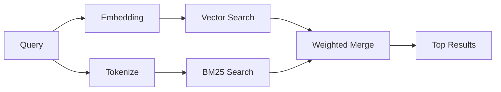

---
read_when:
    - 你想了解 memory_search 的運作方式
    - 你想要選擇嵌入提供者
    - 你想調整搜尋品質
summary: 記憶搜尋如何使用嵌入和混合檢索找到相關筆記
title: 記憶搜尋
x-i18n:
    generated_at: "2026-06-27T19:11:44Z"
    model: gpt-5.5
    postprocess_version: locale-links-v1
    provider: openai
    source_hash: b0bcb8cf400100ba8b6ddbb46bdf8b2a89a8bc32a550ee6df47c874e7e9e0879
    source_path: concepts/memory-search.md
    workflow: 16
---

`memory_search` 會從你的記憶檔案中找出相關筆記，即使措辭與原文不同也能找到。它的運作方式是將記憶索引成小型區塊，並使用嵌入向量、關鍵字，或兩者一起搜尋。

## 快速開始

記憶搜尋預設使用 OpenAI 嵌入向量。若要使用其他嵌入向量後端，請明確設定提供者：

```json5
{
  agents: {
    defaults: {
      memorySearch: {
        provider: "openai", // or "gemini", "local", "ollama", "openai-compatible", etc.
      },
    },
  },
}
```

對於具有記憶專用提供者的多端點設定，`provider` 也可以是自訂的 `models.providers.<id>` 項目，例如 `ollama-5080`，前提是該提供者設定了 `api: "ollama"` 或其他記憶嵌入向量配接器擁有者。

若要使用不需 API 金鑰的本機嵌入向量，請安裝 `@openclaw/llama-cpp-provider` 並設定 `provider: "local"`。原始碼 checkout 仍可能需要原生建置核准：先執行 `pnpm approve-builds`，再執行 `pnpm rebuild node-llama-cpp`。

某些 OpenAI 相容的嵌入向量端點需要非對稱標籤，例如搜尋使用 `input_type: "query"`，索引區塊使用 `input_type: "document"` 或 `"passage"`。請使用 `memorySearch.queryInputType` 和 `memorySearch.documentInputType` 設定這些值；請參閱[記憶設定參考](/zh-TW/reference/memory-config#provider-specific-config)。

## 支援的提供者

| 提供者            | ID                  | 需要 API 金鑰 | 備註                          |
| ----------------- | ------------------- | ------------- | ----------------------------- |
| Bedrock           | `bedrock`           | 否            | 使用 AWS 憑證鏈               |
| DeepInfra         | `deepinfra`         | 是            | 預設：`BAAI/bge-m3`           |
| Gemini            | `gemini`            | 是            | 支援影像/音訊索引             |
| GitHub Copilot    | `github-copilot`    | 否            | 使用 Copilot 訂閱             |
| 本機              | `local`             | 否            | GGUF 模型，下載約 0.6 GB      |
| Mistral           | `mistral`           | 是            |                               |
| Ollama            | `ollama`            | 否            | 本機/自行託管                 |
| OpenAI            | `openai`            | 是            | 預設                          |
| OpenAI 相容       | `openai-compatible` | 通常需要      | 通用 `/v1/embeddings`         |
| Voyage            | `voyage`            | 是            |                               |

## 搜尋的運作方式

OpenClaw 會並行執行兩條檢索路徑，並合併結果：



- **向量搜尋**會找出語意相近的筆記（"gateway host" 會符合 "the machine running OpenClaw"）。
- **BM25 關鍵字搜尋**會找出精確符合項（ID、錯誤字串、設定鍵）。

如果只有一條路徑可用，就只會執行該路徑。有意的純 FTS 模式（`provider: "none"`）和自動/預設提供者選擇，在嵌入向量不可用時仍可使用詞彙排序。

明確的非本機嵌入向量提供者則不同。如果你將 `memorySearch.provider` 設為具體的遠端支援提供者，而該提供者在執行階段不可用，`memory_search` 會回報記憶不可用，而不是默默使用純 FTS 結果。這會讓設定壞掉的語意提供者保持可見。若要刻意使用純 FTS 召回，請設定 `provider: "none"`；或修正提供者/驗證設定，以恢復語意排序。

## 改善搜尋品質

當你有大量筆記歷史時，兩個選用功能會有所幫助：

### 時間衰減

舊筆記會逐漸降低排序權重，讓近期資訊優先浮現。在預設 30 天半衰期下，上個月的筆記分數會是原始權重的 50%。像 `MEMORY.md` 這類長青檔案永遠不會衰減。

<Tip>
如果你的 agent 有數月的每日筆記，而且過時資訊持續排名高於近期脈絡，請啟用時間衰減。
</Tip>

### MMR（多樣性）

減少重複結果。如果五則筆記都提到同一個路由器設定，MMR 會確保排名最前的結果涵蓋不同主題，而不是重複顯示。

<Tip>
如果 `memory_search` 持續從不同每日筆記回傳近乎重複的片段，請啟用 MMR。
</Tip>

### 同時啟用兩者

```json5
{
  agents: {
    defaults: {
      memorySearch: {
        query: {
          hybrid: {
            mmr: { enabled: true },
            temporalDecay: { enabled: true },
          },
        },
      },
    },
  },
}
```

## 多模態記憶

使用 Gemini Embedding 2 時，你可以將影像和音訊檔案與 Markdown 一起建立索引。搜尋查詢仍是文字，但會與視覺和音訊內容進行比對。設定方式請參閱[記憶設定參考](/zh-TW/reference/memory-config)。

## 工作階段記憶搜尋

你可以選擇為工作階段逐字稿建立索引，讓 `memory_search` 能回想較早的對話。這需要透過 `memorySearch.experimental.sessionMemory` 選擇啟用。詳細資訊請參閱[設定參考](/zh-TW/reference/memory-config)。

## 疑難排解

**沒有結果？** 執行 `openclaw memory status` 檢查索引。如果是空的，請執行 `openclaw memory index --force`。

**只有關鍵字符合？** 你的嵌入向量提供者可能尚未設定。請檢查 `openclaw memory status --deep`。

**本機嵌入向量逾時？** `ollama`、`lmstudio` 和 `local` 預設使用較長的 inline 批次逾時時間。如果主機只是速度較慢，請設定 `agents.defaults.memorySearch.sync.embeddingBatchTimeoutSeconds`，然後重新執行 `openclaw memory index --force`。

**找不到 CJK 文字？** 使用 `openclaw memory index --force` 重建 FTS 索引。

## 延伸閱讀

- [主動記憶](/zh-TW/concepts/active-memory) -- 互動式聊天工作階段的 sub-agent 記憶
- [記憶](/zh-TW/concepts/memory) -- 檔案配置、後端、工具
- [記憶設定參考](/zh-TW/reference/memory-config) -- 所有設定旋鈕

## 相關內容

- [記憶概觀](/zh-TW/concepts/memory)
- [主動記憶](/zh-TW/concepts/active-memory)
- [內建記憶引擎](/zh-TW/concepts/memory-builtin)
