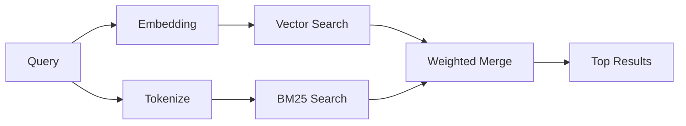

---
read_when:
    - 你想了解 memory_search 如何運作
    - 你想選擇嵌入提供者
    - 你想調整搜尋品質
summary: 記憶搜尋如何使用嵌入與混合檢索尋找相關筆記
title: 記憶搜尋
x-i18n:
    generated_at: "2026-06-28T22:33:35Z"
    model: gpt-5.5
    postprocess_version: locale-links-v1
    provider: openai
    source_hash: 32ffb9d996851566eb92b7812c5425f545ecbb5387a0a445686df35a6c8ae143
    source_path: concepts/memory-search.md
    workflow: 16
---

`memory_search` 會從你的記憶檔案中尋找相關筆記，即使用詞與原文不同也可以。它的運作方式是將記憶索引成小區塊，並使用嵌入、關鍵字，或兩者一起搜尋。

## 快速開始

記憶搜尋預設使用 OpenAI 嵌入。若要使用其他嵌入後端，請明確設定提供者：

```json5
{
  agents: {
    defaults: {
      memorySearch: {
        provider: "openai", // or "gemini", "local", "ollama", "openai-compatible", etc.
      },
    },
  },
}
```

對於具有記憶專用提供者的多端點設定，當該提供者設定了 `api: "ollama"` 或其他記憶嵌入配接器擁有者時，`provider` 也可以是自訂的 `models.providers.<id>` 項目，例如 `ollama-5080`。

若要使用不需 API 金鑰的本機嵌入，請安裝 `@openclaw/llama-cpp-provider` 並設定 `provider: "local"`。原始碼 checkout 可能仍需要原生建置核准：先執行 `pnpm approve-builds`，再執行 `pnpm rebuild node-llama-cpp`。

某些 OpenAI 相容嵌入端點需要非對稱標籤，例如搜尋使用 `input_type: "query"`，而已索引區塊使用 `input_type: "document"` 或 `"passage"`。請用 `memorySearch.queryInputType` 和 `memorySearch.documentInputType` 設定；請參閱[記憶設定參考](/zh-TW/reference/memory-config#provider-specific-config)。

## 支援的提供者

| 提供者 | ID | 需要 API 金鑰 | 備註 |
| ----------------- | ------------------- | ------------- | ----------------------------- |
| Bedrock | `bedrock` | 否 | 使用 AWS 憑證鏈 |
| DeepInfra | `deepinfra` | 是 | 預設：`BAAI/bge-m3` |
| Gemini | `gemini` | 是 | 支援圖片/音訊索引 |
| GitHub Copilot | `github-copilot` | 否 | 使用 Copilot 訂閱 |
| 本機 | `local` | 否 | GGUF 模型，約 0.6 GB 下載 |
| Mistral | `mistral` | 是 | |
| Ollama | `ollama` | 否 | 本機/自行託管 |
| OpenAI | `openai` | 是 | 預設 |
| OpenAI 相容 | `openai-compatible` | 通常需要 | 通用 `/v1/embeddings` |
| Voyage | `voyage` | 是 | |

## 搜尋如何運作

OpenClaw 會平行執行兩條檢索路徑，並合併結果：



- **向量搜尋**會尋找意義相近的筆記（「gateway host」會匹配「執行 OpenClaw 的機器」）。
- **BM25 關鍵字搜尋**會尋找精確匹配（ID、錯誤字串、設定鍵）。

如果只有一條路徑可用，另一條會單獨執行。有意使用的僅 FTS 模式（`provider: "none"`）以及自動/預設提供者選擇，在嵌入不可用時仍可使用詞彙排名。

明確的非本機嵌入提供者則不同。如果你將 `memorySearch.provider` 設為具體的遠端支援提供者，而該提供者在執行階段不可用，`memory_search` 會回報記憶不可用，而不是悄悄使用僅 FTS 結果。這會讓損壞的已設定語意提供者保持可見。若要刻意使用僅 FTS 召回，請設定 `provider: "none"`；或修正提供者/驗證設定以恢復語意排名。

## 改善搜尋品質

當你有大量筆記歷史時，兩項選用功能會有所幫助：

### 時間衰減

舊筆記的排名權重會逐漸降低，讓近期資訊優先浮現。使用預設 30 天半衰期時，上個月的筆記分數會是原始權重的 50%。像 `MEMORY.md` 這類常青檔案永不衰減。

<Tip>
如果你的代理程式有數月的每日筆記，且陳舊資訊持續排名高於近期脈絡，請啟用時間衰減。
</Tip>

### MMR（多樣性）

減少重複結果。如果五則筆記都提到相同的路由器設定，MMR 會確保頂端結果涵蓋不同主題，而不是重複出現。

<Tip>
如果 `memory_search` 持續從不同每日筆記傳回近似重複的片段，請啟用 MMR。
</Tip>

### 同時啟用兩者

```json5
{
  agents: {
    defaults: {
      memorySearch: {
        query: {
          hybrid: {
            mmr: { enabled: true },
            temporalDecay: { enabled: true },
          },
        },
      },
    },
  },
}
```

## 多模態記憶

使用 Gemini Embedding 2 時，你可以在 Markdown 之外一併索引圖片和音訊檔案。搜尋查詢仍是文字，但會與視覺和音訊內容匹配。設定方式請參閱[記憶設定參考](/zh-TW/reference/memory-config)。

## 工作階段記憶搜尋

你可以選擇索引工作階段逐字稿，讓 `memory_search` 可以回想較早的對話。這透過 `memorySearch.experimental.sessionMemory` 和 `sources: ["sessions"]` 選擇啟用；預設來源清單僅限記憶。實驗性旗標會啟用工作階段逐字稿索引，而 `sources` 則控制是否搜尋工作階段區塊。

工作階段命中會遵守 `tools.sessions.visibility`：預設的 `tree` 設定只會公開目前工作階段及其產生的工作階段。若要從另一個 DM 工作階段回想不相關、同代理程式且由閘道分派的工作階段，請刻意將可見性擴大到 `agent`。

使用 QMD 時，也請設定 `memory.qmd.sessions.enabled: true`，讓逐字稿匯出到 QMD 集合。詳情請參閱[設定參考](/zh-TW/reference/memory-config)。

## 疑難排解

**沒有結果？** 執行 `openclaw memory status` 檢查索引。如果是空的，請執行 `openclaw memory index --force`。

**只有關鍵字匹配？** 你的嵌入提供者可能尚未設定。請檢查 `openclaw memory status --deep`。

**本機嵌入逾時？** `ollama`、`lmstudio` 和 `local` 預設使用較長的行內批次逾時。如果主機只是速度較慢，請設定 `agents.defaults.memorySearch.sync.embeddingBatchTimeoutSeconds`，並重新執行 `openclaw memory index --force`。

**找不到 CJK 文字？** 使用 `openclaw memory index --force` 重建 FTS 索引。

## 延伸閱讀

- [主動記憶](/zh-TW/concepts/active-memory) -- 互動式聊天工作階段的子代理程式記憶
- [記憶](/zh-TW/concepts/memory) -- 檔案配置、後端、工具
- [記憶設定參考](/zh-TW/reference/memory-config) -- 所有設定旋鈕

## 相關

- [記憶概觀](/zh-TW/concepts/memory)
- [主動記憶](/zh-TW/concepts/active-memory)
- [內建記憶引擎](/zh-TW/concepts/memory-builtin)
