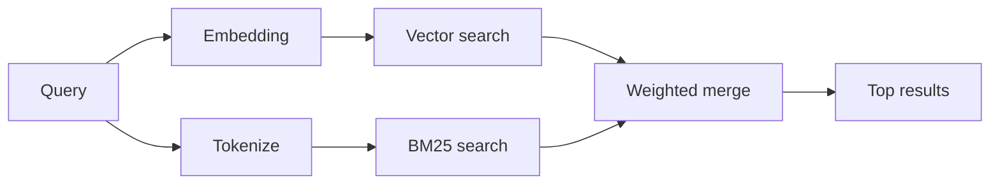

---
read_when:
    - 你想了解 `memory_search` 的運作方式
    - 你想要選擇嵌入提供者
    - 你想要調整搜尋品質
summary: 記憶搜尋如何使用嵌入與混合檢索找出相關筆記
title: 記憶搜尋
x-i18n:
    generated_at: "2026-07-05T11:14:26Z"
    model: gpt-5.5
    postprocess_version: locale-links-v1
    provider: openai
    source_hash: 1a29115d09ffc919e48a08e4b1ae4945f40b1e49c71c8a0a63af6f9f5ead1ddc
    source_path: concepts/memory-search.md
    workflow: 16
---

`memory_search` 會從你的記憶檔案中找出相關筆記，即使措辭與原始文字不同也能找到。它會將記憶切成小片段，並使用嵌入、關鍵字或兩者進行搜尋。

## 快速開始

OpenClaw 預設使用 OpenAI 嵌入。若要使用其他提供者，請明確設定：

```json5
{
  agents: {
    defaults: {
      memorySearch: {
        provider: "openai", // or "gemini", "voyage", "mistral", "bedrock", "local", "ollama", "lmstudio", "github-copilot", "openai-compatible"
      },
    },
  },
}
```

`provider` 也可以參照自訂的 `models.providers.<id>` 項目（例如 `ollama-5080`），只要該項目將 `api` 設為 `"ollama"`，或設為另一個具有記憶嵌入配接器的提供者 ID。

若要使用不需 API 金鑰的本機嵌入，請安裝官方 llama.cpp 提供者外掛，並設定 `provider: "local"`：

```bash
openclaw plugins install @openclaw/llama-cpp-provider
```

原始碼 checkout 仍需要原生建置核准：`pnpm approve-builds`，然後執行 `pnpm rebuild node-llama-cpp`。

部分 OpenAI 相容的嵌入端點需要非對稱的 `input_type` 標籤，例如搜尋使用 `"query"`，索引區塊使用 `"document"`/`"passage"`。請用 `queryInputType` 和 `documentInputType` 設定；詳見[記憶設定參考](/zh-TW/reference/memory-config#provider-specific-config)。

## 支援的提供者

| 提供者            | ID                  | 需要 API 金鑰 | 備註                              |
| ----------------- | ------------------- | ------------- | --------------------------------- |
| Bedrock           | `bedrock`           | 否            | 使用 AWS 憑證鏈                   |
| DeepInfra         | `deepinfra`         | 是            | 預設模型 `BAAI/bge-m3`            |
| Gemini            | `gemini`            | 是            | 支援圖片/音訊索引                 |
| GitHub Copilot    | `github-copilot`    | 否            | 使用你的 Copilot 訂閱             |
| 本機              | `local`             | 否            | GGUF 模型，約 0.6 GB 自動下載     |
| LM Studio         | `lmstudio`          | 否            | 本機/自架伺服器                   |
| Mistral           | `mistral`           | 是            |                                   |
| Ollama            | `ollama`            | 否            | 本機/自架伺服器                   |
| OpenAI            | `openai`            | 是            | 預設                              |
| OpenAI 相容       | `openai-compatible` | 通常需要      | 通用 `/v1/embeddings` 端點        |
| Voyage            | `voyage`            | 是            |                                   |

## 搜尋如何運作

OpenClaw 會平行執行兩條擷取路徑，並合併結果：



- **向量搜尋**會比對相近語意（「gateway host」會比對到「執行 OpenClaw 的機器」）。
- **BM25 關鍵字搜尋**會比對精確詞彙（ID、錯誤字串、設定鍵）。

如果只有一條路徑可用，則只會執行該路徑。

**僅 FTS 模式。** 設定 `provider: "none"` 可刻意停用嵌入，並只用關鍵字搜尋。若 `provider` 未設定或設為 `"auto"`，在未設定嵌入驗證時也會退回到僅關鍵字排序，且不會報錯；`provider: "local"`（GGUF/llama.cpp 提供者）失敗時也是如此。

**明確指定的提供者無法使用。** 如果你明確指定任何其他提供者（例如 `openai`、`ollama`、`gemini`），而它在請求時無法使用（驗證錯誤、網路失敗），`memory_search` 會回報記憶不可用，而不是靜默降級為僅 FTS 結果。這能讓設定錯誤的提供者保持可見。若要刻意使用僅 FTS 召回，請設定 `provider: "none"`；或修正提供者/驗證設定以恢復語意排序。

## 改善搜尋品質

兩個選用功能可協助處理大量筆記歷史。

### 時間衰減

舊筆記會逐漸降低排序權重，讓近期資訊優先浮現。使用預設 30 天半衰期時，上個月的筆記分數會是原始權重的 50%。`memory/` 底下的 `MEMORY.md` 和其他無日期檔案會視為常青內容，永不衰減；只有有日期的 `memory/YYYY-MM-DD.md` 檔案會衰減。

<Tip>
如果你的代理有數個月的每日筆記，且過時資訊一直排在近期脈絡之前，請啟用此功能。
</Tip>

### MMR（多樣性）

減少重複結果。如果五則筆記都提到同一個路由器設定，MMR 會確保最高排名結果涵蓋不同主題，而不是重複同樣內容。

<Tip>
如果 `memory_search` 持續從不同每日筆記傳回近似重複的片段，請啟用此功能。
</Tip>

### 同時啟用兩者

```json5
{
  agents: {
    defaults: {
      memorySearch: {
        query: {
          hybrid: {
            mmr: { enabled: true },
            temporalDecay: { enabled: true },
          },
        },
      },
    },
  },
}
```

## 多模態記憶

使用 `gemini-embedding-2-preview` 時，你可以將圖片和音訊與 Markdown 一起索引。這只適用於 `memorySearch.extraPaths` 底下的檔案；預設記憶根目錄（`MEMORY.md`、`memory/*.md`）仍僅限 Markdown。搜尋查詢仍是文字，但會比對視覺與音訊內容。設定方式請見[記憶設定參考](/zh-TW/reference/memory-config#multimodal-memory-gemini)。

## 工作階段記憶搜尋

你可以選擇索引工作階段逐字稿，讓 `memory_search` 能回想先前的對話。這是選用功能：設定 `experimental.sessionMemory: true`，並將 `"sessions"` 加入 `sources`（預設 `sources` 是 `["memory"]`）。

工作階段命中會遵守 `tools.sessions.visibility`：預設的 `"tree"` 只會公開目前工作階段及其衍生的工作階段。若要從不同工作階段回想不相關的同代理工作階段（例如由閘道分派、來自 DM 的工作階段），請將可見性放寬為 `"agent"`。

使用 QMD 後端時，也請設定 `memory.qmd.sessions.enabled: true`，讓逐字稿匯出到 QMD 集合；單靠 `experimental.sessionMemory` 和 `sources` 不會將逐字稿匯出到 QMD。請見[設定參考](/zh-TW/reference/memory-config#session-memory-search-experimental)。

## 疑難排解

**沒有結果？** 執行 `openclaw memory status` 檢查索引。如果是空的，請執行 `openclaw memory index --force`。

**只有關鍵字比對？** 你的嵌入提供者可能尚未設定。請檢查 `openclaw memory status --deep`。

**本機嵌入逾時？** `ollama`、`lmstudio` 和 `local` 預設使用較長的行內批次逾時。如果主機只是速度較慢，請設定 `agents.defaults.memorySearch.sync.embeddingBatchTimeoutSeconds`，並重新執行 `openclaw memory index --force`。

**找不到 CJK 文字？** 使用 `openclaw memory index --force` 重建 FTS 索引。

## 相關

- [記憶概觀](/zh-TW/concepts/memory)
- [主動記憶](/zh-TW/concepts/active-memory)
- [內建記憶引擎](/zh-TW/concepts/memory-builtin)
- [記憶設定參考](/zh-TW/reference/memory-config)
