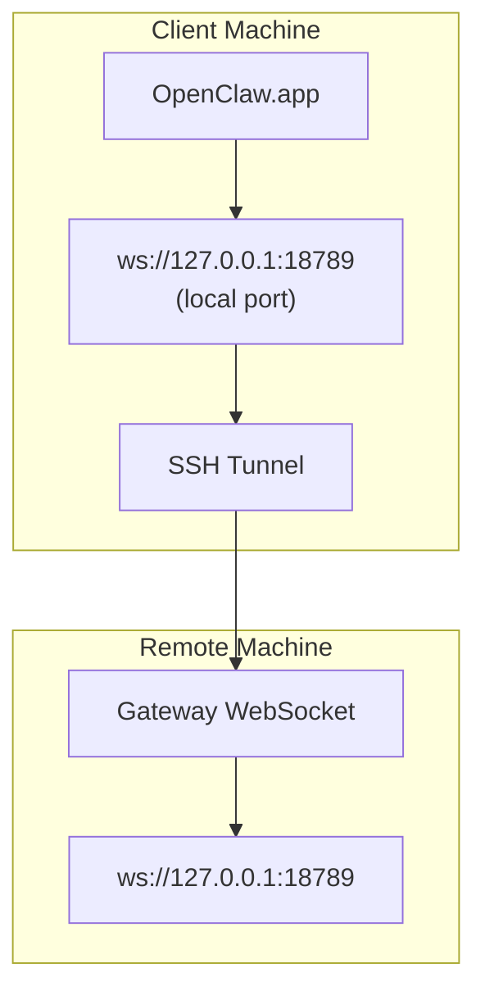

<Note>
此內容現在位於[遠端存取](/zh-TW/gateway/remote#macos-persistent-ssh-tunnel-via-launchagent)。請使用該頁面的目前指南；此頁面保留作為重新導向目標。
</Note>

# 使用遠端閘道執行 OpenClaw.app

OpenClaw.app 透過 SSH 通道連線到遠端閘道：SSH `LocalForward` 會將本機連接埠對應到遠端主機上的閘道 WebSocket 連接埠。

## 設定

1. 新增一個 SSH 設定項目，包含 `LocalForward 18789 127.0.0.1:18789`（完整設定區塊請參閱[遠端存取](/zh-TW/gateway/remote#macos-persistent-ssh-tunnel-via-launchagent)）。
2. 使用 `ssh-copy-id` 將你的 SSH 金鑰複製到遠端主機。
3. 透過 `openclaw config set gateway.remote.token "<your-token>"` 設定 `gateway.remote.token`（或 `gateway.remote.password`）。
4. 啟動通道：`ssh -N remote-gateway &`。
5. 結束並重新開啟 OpenClaw.app。

若要讓通道在重新開機後仍可存續並自動重新連線，請使用[遠端存取](/zh-TW/gateway/remote#macos-persistent-ssh-tunnel-via-launchagent)頁面上的 LaunchAgent 設定，而不是手動執行 `ssh -N`。

## 運作方式

| 元件                                 | 作用                                                          |
| ------------------------------------ | ------------------------------------------------------------- |
| `LocalForward 18789 127.0.0.1:18789` | 將本機連接埠 18789 轉送到遠端連接埠 18789                   |
| `ssh -N`                             | 不執行遠端命令的 SSH（僅用於連接埠轉送）                     |
| `KeepAlive`                          | 若通道當機，會自動重新啟動通道（LaunchAgent）                |
| `RunAtLoad`                          | 在 LaunchAgent 載入時啟動通道（LaunchAgent）                 |

OpenClaw.app 會連線到用戶端上的 `ws://127.0.0.1:18789`。通道會將該連線轉送到執行閘道的遠端主機上的連接埠 18789。

## 相關

- [遠端存取](/zh-TW/gateway/remote)
- [Tailscale](/zh-TW/gateway/tailscale)
