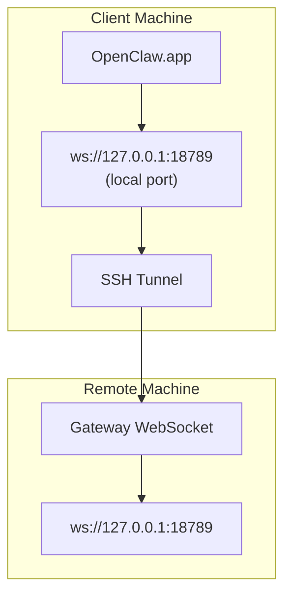

> 此內容已合併至[遠端存取](/zh-TW/gateway/remote#macos-persistent-ssh-tunnel-via-launchagent)。請參閱該頁面的最新指南。

# 使用遠端 Gateway 執行 OpenClaw.app

OpenClaw.app 使用 SSH 通道連線到遠端 Gateway。本指南會說明如何設定。

## 概覽



## 快速設定

### 步驟 1：新增 SSH Config

編輯 `~/.ssh/config` 並新增：

```ssh
Host remote-gateway
    HostName <REMOTE_IP>          # e.g., 172.27.187.184
    User <REMOTE_USER>            # e.g., jefferson
    LocalForward 18789 127.0.0.1:18789
    IdentityFile ~/.ssh/id_rsa
```

將 `<REMOTE_IP>` 和 `<REMOTE_USER>` 替換成你的值。

### 步驟 2：複製 SSH 金鑰

將你的公開金鑰複製到遠端機器（輸入一次密碼）：

```bash
ssh-copy-id -i ~/.ssh/id_rsa <REMOTE_USER>@<REMOTE_IP>
```

### 步驟 3：設定遠端 Gateway 驗證

```bash
openclaw config set gateway.remote.token "<your-token>"
```

如果你的遠端 Gateway 使用密碼驗證，請改用 `gateway.remote.password`。
`OPENCLAW_GATEWAY_TOKEN` 仍可作為 shell 層級的覆寫使用，但耐久的
遠端用戶端設定是 `gateway.remote.token` / `gateway.remote.password`。

### 步驟 4：啟動 SSH 通道

```bash
ssh -N remote-gateway &
```

### 步驟 5：重新啟動 OpenClaw.app

```bash
# Quit OpenClaw.app (⌘Q), then reopen:
open /path/to/OpenClaw.app
```

應用程式現在會透過 SSH 通道連線到遠端 Gateway。

---

## 登入時自動啟動通道

若要在登入時自動啟動 SSH 通道，請建立 Launch Agent。

### 建立 PLIST 檔案

將此內容儲存為 `~/Library/LaunchAgents/ai.openclaw.ssh-tunnel.plist`：

```xml
<?xml version="1.0" encoding="UTF-8"?>
<!DOCTYPE plist PUBLIC "-//Apple//DTD PLIST 1.0//EN" "http://www.apple.com/DTDs/PropertyList-1.0.dtd">
<plist version="1.0">
<dict>
    <key>Label</key>
    <string>ai.openclaw.ssh-tunnel</string>
    <key>ProgramArguments</key>
    <array>
        <string>/usr/bin/ssh</string>
        <string>-N</string>
        <string>remote-gateway</string>
    </array>
    <key>KeepAlive</key>
    <true/>
    <key>RunAtLoad</key>
    <true/>
</dict>
</plist>
```

### 載入 Launch Agent

```bash
launchctl bootstrap gui/$UID ~/Library/LaunchAgents/ai.openclaw.ssh-tunnel.plist
```

通道現在會：

- 在你登入時自動啟動
- 當它當機時重新啟動
- 持續在背景執行

舊版注意事項：如果存在任何殘留的 `com.openclaw.ssh-tunnel` LaunchAgent，請將其移除。

---

## 疑難排解

**檢查通道是否正在執行：**

```bash
ps aux | grep "ssh -N remote-gateway" | grep -v grep
lsof -i :18789
```

**重新啟動通道：**

```bash
launchctl kickstart -k gui/$UID/ai.openclaw.ssh-tunnel
```

**停止通道：**

```bash
launchctl bootout gui/$UID/ai.openclaw.ssh-tunnel
```

---

## 運作方式

| 元件                                 | 功能                                                   |
| ------------------------------------ | ------------------------------------------------------ |
| `LocalForward 18789 127.0.0.1:18789` | 將本機連接埠 18789 轉送到遠端連接埠 18789             |
| `ssh -N`                             | 不執行遠端命令的 SSH（僅進行連接埠轉送）              |
| `KeepAlive`                          | 如果通道當機，會自動重新啟動通道                       |
| `RunAtLoad`                          | 在代理程式載入時啟動通道                               |

OpenClaw.app 會連線到用戶端機器上的 `ws://127.0.0.1:18789`。SSH 通道會將該連線轉送到遠端機器上的連接埠 18789，也就是 Gateway 執行所在的位置。

## 相關內容

- [遠端存取](/zh-TW/gateway/remote)
- [Tailscale](/zh-TW/gateway/tailscale)
