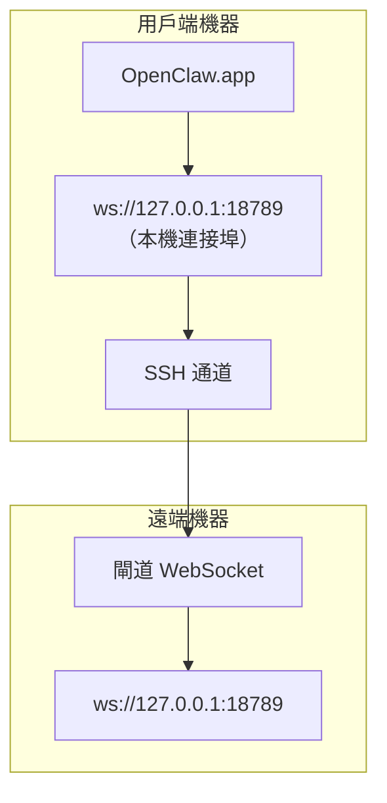

<Note>
此內容現已移至[遠端存取](/zh-TW/gateway/remote#macos-persistent-ssh-tunnel-via-launchagent)。請參閱該頁面以取得最新指南；本頁面保留作為重新導向目標。
</Note>

# 搭配遠端閘道執行 OpenClaw.app

OpenClaw.app 透過 SSH 通道連線至遠端閘道：SSH `LocalForward` 會將本機連接埠對應至遠端主機上的閘道 WebSocket 連接埠。

## 設定

1. 新增包含 `LocalForward 18789 127.0.0.1:18789` 的 SSH 設定項目（完整設定區塊請參閱[遠端存取](/zh-TW/gateway/remote#macos-persistent-ssh-tunnel-via-launchagent)）。
2. 使用 `ssh-copy-id` 將 SSH 金鑰複製到遠端主機。
3. 透過 `openclaw config set gateway.remote.token "<your-token>"` 設定 `gateway.remote.token`（或 `gateway.remote.password`）。
4. 啟動通道：`ssh -N remote-gateway &`。
5. 結束並重新開啟 OpenClaw.app。

若要讓通道在重新啟動後仍可運作並自動重新連線，請使用[遠端存取](/zh-TW/gateway/remote#macos-persistent-ssh-tunnel-via-launchagent)頁面上的 LaunchAgent 設定，而非手動執行 `ssh -N`。

## 運作方式

| 元件                                 | 功能                                                         |
| ------------------------------------ | ------------------------------------------------------------ |
| `LocalForward 18789 127.0.0.1:18789` | 將本機連接埠 18789 轉送至遠端連接埠 18789                    |
| `ssh -N`                             | 不執行遠端命令的 SSH（僅轉送連接埠）                         |
| `KeepAlive`                          | 通道當機時自動重新啟動（LaunchAgent）                         |
| `RunAtLoad`                          | 在 LaunchAgent 載入時啟動通道（LaunchAgent）                  |

OpenClaw.app 會連線至用戶端上的 `ws://127.0.0.1:18789`。通道會將該連線轉送至執行閘道的遠端主機之 18789 連接埠。

## 相關內容

- [遠端存取](/zh-TW/gateway/remote)
- [Tailscale](/zh-TW/gateway/tailscale)
